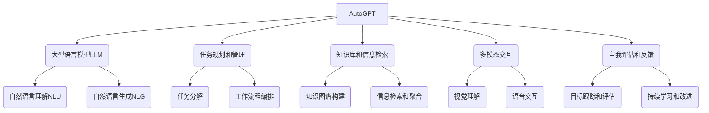

# 【大模型应用开发 动手做AI Agent】AutoGPT实战

## 1. 背景介绍

### 1.1 问题的由来

在当今科技飞速发展的时代,人工智能(AI)已经渗透到我们生活的方方面面。大型语言模型(Large Language Models,LLMs)作为AI的核心技术之一,正在推动着智能系统的革新。然而,构建一个真正智能的AI代理(Agent)仍然是一个巨大的挑战,需要将多种先进技术有机地结合在一起。

随着ChatGPT等大型语言模型的出现,人们开始探索如何将这些模型应用于构建智能代理。AutoGPT就是这种探索的产物,它旨在利用大型语言模型的强大能力,结合其他AI技术,创建一个通用的自主智能代理。

### 1.2 研究现状

目前,已有多个开源项目致力于开发基于大型语言模型的智能代理系统,如AutoGPT、Claude、Anthropic等。这些项目采用不同的方法和技术路线,但都面临着诸如安全性、可控性、鲁棒性等共同挑战。

与此同时,一些科技公司也在内部开发自己的智能代理系统,如谷歌的Bard、Meta的Claude等。这些系统通常采用更为先进和专有的技术,但往往缺乏透明度和开放性。

### 1.3 研究意义

构建一个真正智能的代理系统,能够极大地提高人类的工作效率和生活质量。智能代理可以帮助我们完成各种复杂的任务,从日常事务到专业领域的工作。它们还可以作为个人助理,提供定制化的服务和支持。

此外,智能代理的研究也将推动人工智能技术的发展,特别是在自主性、reasoning、多模态交互等方面。这些技术的进步将为构建通用人工智能(Artificial General Intelligence,AGI)系统奠定基础。

### 1.4 本文结构

本文将全面介绍AutoGPT这一智能代理系统的设计理念、核心技术和实现细节。我们将从背景知识入手,阐述AutoGPT的创建动机和研究意义。接下来,将详细探讨AutoGPT的核心概念和算法原理,包括其采用的技术路线和创新之处。

然后,我们将深入剖析AutoGPT的数学模型和公式推导过程,并通过案例分析加深读者的理解。在此基础上,我们将提供一个完整的项目实践案例,包括代码实现、运行结果等,帮助读者亲自动手构建一个AutoGPT智能代理。

此外,本文还将介绍AutoGPT的实际应用场景,探讨其未来的发展前景和面临的挑战,并为读者推荐相关的学习资源、开发工具和论文等。最后,我们将总结全文的核心内容,并对AutoGPT的未来发展提出展望和建议。

## 2. 核心概念与联系

AutoGPT是一个综合了多种先进AI技术的智能代理系统。它的核心是一个大型语言模型(LLM),用于自然语言理解(NLU)和自然语言生成(NLG)。

在此基础上,AutoGPT引入了任务规划和管理模块,负责将复杂任务分解为多个子任务,并对它们进行有序编排和执行。这个模块采用了启发式搜索、规划算法等技术,以高效地完成任务。

为了支持智能决策,AutoGPT还集成了知识库和信息检索功能。它可以构建知识图谱,并从互联网等多种来源获取相关信息,为任务执行提供所需的背景知识和数据支持。

此外,AutoGPT还支持多模态交互,包括视觉理解和语音交互等。这使得它能够处理图像、视频等非结构化数据,并通过自然语音与用户进行交互。

最后,AutoGPT还具备自我评估和反馈能力。它可以跟踪和评估自身的目标完成情况,并通过持续学习和改进,不断提高自身的能力和性能。

通过有机结合上述核心模块,AutoGPT成为一个全面的智能代理系统,能够自主地规划、执行和评估复杂任务,并与人类进行自然的多模态交互。

## 3. 核心算法原理 & 具体操作步骤

### 3.1 算法原理概述

AutoGPT的核心算法基于一种称为"思考-规划-行动-观察"(Think-Plan-Act-Observe,TPAO)的循环过程。在这个过程中,AutoGPT会首先思考和理解给定的任务,然后规划出完成该任务所需的一系列子任务和步骤。接下来,它会执行这些步骤,并观察执行的结果。基于观察到的结果,AutoGPT会对自己的思考、规划和行动进行评估和调整,从而形成一个不断迭代和改进的闭环过程。

在TPAO循环的每个阶段,AutoGPT都会利用其核心模块的不同功能。例如,在"思考"阶段,它会调用大型语言模型进行自然语言理解和推理;在"规划"阶段,它会使用任务规划和管理模块对复杂任务进行分解和编排;在"行动"阶段,它会执行实际的操作,如信息检索、多模态交互等;而在"观察"阶段,它会评估执行结果,并通过自我评估和反馈模块进行持续学习和改进。

### 3.2 算法步骤详解

1. **思考(Think)**: 在这个阶段,AutoGPT会首先对给定的任务进行理解和分析。它会利用大型语言模型的自然语言理解能力,从任务描述中提取关键信息、上下文和约束条件。同时,它也会结合知识库中的背景知识,对任务的内涵和目标进行更深入的推理和思考。

2. **规划(Plan)**: 基于对任务的理解,AutoGPT会进入规划阶段,制定出完成任务所需的一系列子任务和步骤。这个过程会利用任务规划和管理模块中的各种算法和启发式方法,如层次分解、批量规划、工作流编排等。规划的结果是一个有序的子任务序列,每个子任务都会被分配适当的资源和执行条件。

3. **行动(Act)**: 在规划完成后,AutoGPT会进入行动阶段,开始执行规划好的子任务序列。在这个阶段,它会调用多个核心模块的功能,如知识库查询、信息检索、多模态交互等。每个子任务的执行结果都会被记录下来,为后续的观察和评估提供依据。

4. **观察(Observe)**: 在完成所有子任务的执行后,AutoGPT会进入观察阶段,评估整个任务的完成情况。它会将实际执行的结果与最初的任务目标进行对比,检查是否存在偏差或错误。同时,它也会分析每个子任务的执行质量,识别出可以改进的地方。

5. **反馈和调整(Feedback and Adjust)**: 基于观察阶段的评估结果,AutoGPT会对自身的思考、规划和行动进行反馈和调整。如果发现存在错误或偏差,它会重新进入TPAO循环,对相关模块进行优化和改进。例如,它可能需要更新知识库、优化规划算法、改进语言模型等。通过不断的反馈和调整,AutoGPT能够持续学习和提高自身的能力。

6. **任务完成(Task Completion)**: 当观察到任务目标已经被满足,且没有需要改进的地方时,AutoGPT就会将当前的TPAO循环视为完成,并输出最终的执行结果。

这个TPAO循环会一直持续运行,直到任务被成功完成或者达到某个终止条件(如资源耗尽、时间超限等)。通过这种迭代式的思考-规划-行动-观察过程,AutoGPT能够逐步完成复杂的任务,并不断优化和提高自身的能力。

### 3.3 算法优缺点

**优点**:

1. **通用性强**: TPAO算法能够应用于各种不同类型的任务,从简单的问答到复杂的决策和规划,展现出了强大的通用能力。

2. **自适应性好**: 通过持续的观察、评估和反馈,TPAO算法能够根据实际情况动态调整自身的思考、规划和行动策略,具有很好的自适应性。

3. **模块化设计**: TPAO算法将不同的功能模块(如语言模型、规划模块、知识库等)进行了很好的解耦,有利于各模块的独立开发和优化。

4. **可解释性强**: TPAO算法的执行过程是透明的,每个阶段的输入、输出和决策都是可解释的,有助于用户理解和信任系统。

**缺点**:

1. **计算开销大**: TPAO算法需要在每个循环中多次调用各种模块,计算开销相对较大,对硬件资源的要求较高。

2. **误差累积**: 由于TPAO是一个迭代式过程,每个阶段的误差都可能会累积并传递到下一阶段,影响最终结果的准确性。

3. **知识库依赖**: TPAO算法对知识库的质量和覆盖面有较高的依赖性,知识库的缺陷可能会导致规划和决策的失误。

4. **长期目标规划**: 对于需要长期规划和持续执行的任务,TPAO算法可能会面临状态空间爆炸的问题,难以高效地进行规划和决策。

### 3.4 算法应用领域

TPAO算法及其在AutoGPT中的实现,展现了广阔的应用前景,可以应用于以下领域:

1. **智能助理**: AutoGPT可以作为一种通用的智能助理,帮助用户完成各种日常任务,如信息查询、事件安排、内容创作等。

2. **决策支持系统**: AutoGPT的规划和决策能力,使其可以应用于复杂的决策支持场景,如商业智能、风险管理、资源优化等。

3. **自动化流程**: AutoGPT能够自动化各种重复性的流程和任务,如数据处理、文档生成、测试自动化等,提高工作效率。

4. **教育和培训**: AutoGPT可以作为一种智能教学助手,根据学习者的需求提供个性化的学习资源和指导。

5. **科研辅助**: AutoGPT的知识整合和推理能力,使其可以应用于科研领域,如文献检索、实验设计、数据分析等。

6. **创意辅助**: AutoGPT可以为创意工作者(如作家、设计师、艺术家等)提供灵感和建议,促进创意的产生和发展。

7. **智能系统开发**: AutoGPT本身就是一种智能系统,其核心技术和架构可以为开发其他智能系统提供借鉴和基础。

总的来说,TPAO算法赋予了AutoGPT强大的通用能力,使其能够应用于广泛的领域,为人类的工作和生活带来巨大的便利和助力。

## 4. 数学模型和公式 & 详细讲解 & 举例说明

### 4.1 数学模型构建

在AutoGPT的核心算法中,数学模型和公式主要应用于以下几个方面:

1. **任务分解和规划**:
   - 将复杂任务建模为有向无环图(DAG),节点表示子任务,边表示依赖关系。
   - 使用图理论和组合优化算法(如CPLEX)对DAG进行拓扑排序和资源分配。

2. **语义理解和知识表示**:
   - 使用向量空间模型(VSM)将自然语言表示为向量,用于语义相似