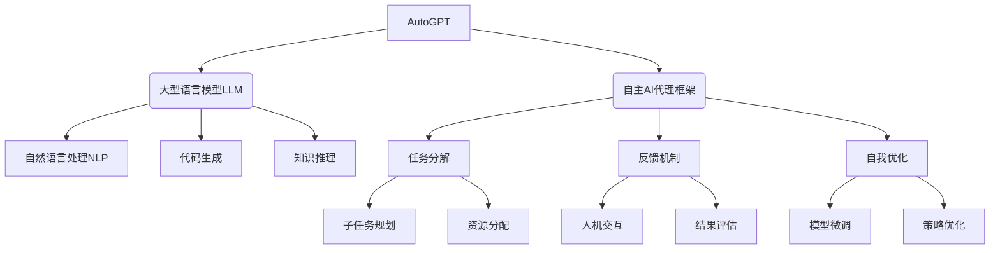

以下是《【大模型应用开发 动手做AI Agent】AutoGPT简介》的正文部分：

# 【大模型应用开发 动手做AI Agent】AutoGPT简介

## 1. 背景介绍

### 1.1 问题的由来

在当今的数字时代,人工智能(AI)技术的飞速发展正在重塑着我们的生活和工作方式。随着大型语言模型(LLM)的出现,AI系统的能力得到了前所未有的提升,可以执行各种复杂的任务,从自然语言处理到代码生成。然而,将这些强大的AI模型应用于实际场景并非易事,需要专业的知识和技能来设计、开发和部署AI系统。

AutoGPT应运而生,旨在降低AI系统开发的门槛,让更多人能够亲身体验和利用AI的强大功能。作为一个开源的AI代理框架,AutoGPT提供了一种简单且高效的方式来构建自主的AI代理,能够根据用户的需求自动完成各种任务。

### 1.2 研究现状

目前,AI系统的开发主要依赖于大型科技公司和研究机构,他们拥有丰富的资源和专业人才。但对于普通用户和小型企业来说,开发AI系统的成本和门槛往往过高。虽然一些开源AI框架已经问世,但它们通常需要专业的编程技能和深入的AI知识,难以满足普通用户的需求。

AutoGPT的出现为AI系统的民主化做出了重要贡献。它提供了一个易于使用的框架,用户只需提供一些基本的指令和数据,就可以构建出功能强大的AI代理。AutoGPT还具有自主学习和自我优化的能力,可以根据用户的反馈不断改进自身,提高任务完成的质量和效率。

### 1.3 研究意义

AutoGPT的出现具有重要的理论和实践意义:

- 理论层面:AutoGPT探索了如何将大型语言模型与自主AI代理相结合,为AI系统的自主性和通用性提供了新的思路和方法。它还为AI系统的可解释性和可控性提出了新的解决方案,有助于提高AI系统的透明度和可信度。

- 实践层面:AutoGPT为普通用户和小型企业提供了一种低成本、高效的AI系统开发方式,促进了AI技术的民主化和普及化。它还可以应用于各种领域,如自动化办公、客户服务、教育培训等,提高生产效率和服务质量。

### 1.4 本文结构

本文将全面介绍AutoGPT的核心概念、算法原理、数学模型、实现细节和实际应用。文章结构如下:

- 第2部分介绍AutoGPT的核心概念和架构,阐述其与传统AI系统的区别和创新之处。
- 第3部分详细解释AutoGPT的核心算法原理和具体操作步骤,包括任务分解、模型选择、反馈机制等。
- 第4部分构建AutoGPT的数学模型,推导关键公式,并通过案例分析加深理解。
- 第5部分提供AutoGPT的代码实现细节,包括开发环境搭建、核心模块解读和运行结果展示。
- 第6部分探讨AutoGPT在各个领域的实际应用场景,并展望其未来发展方向。
- 第7部分推荐相关的学习资源、开发工具和论文,为读者提供进一步学习和研究的途径。
- 第8部分总结AutoGPT的研究成果,分析其面临的挑战,并对未来的发展趋势进行展望。
- 第9部分是附录,回答一些常见的问题,帮助读者更好地理解和使用AutoGPT。

## 2. 核心概念与联系

AutoGPT是一个创新的AI系统框架,它将大型语言模型(LLM)与自主AI代理相结合,实现了强大的任务处理能力和自主学习能力。

1. **大型语言模型(LLM)**:AutoGPT利用了LLM在自然语言处理、代码生成和知识推理等方面的卓越表现。LLM可以理解和生成人类语言,执行复杂的推理任务,为AutoGPT提供了强大的基础能力。

2. **自主AI代理框架**:AutoGPT的核心是一个自主AI代理框架,它能够自主地分解任务、规划子任务、分配资源、与用户交互、评估结果并自我优化。这种自主性使得AutoGPT可以根据用户的需求,自动完成各种复杂的任务,而无需人工干预。

3. **任务分解**:AutoGPT能够将复杂的任务分解为多个可管理的子任务,并对子任务进行规划和资源分配,确保任务的高效完成。

4. **反馈机制**:AutoGPT具有与用户交互的能力,可以获取用户的反馈并对结果进行评估。基于反馈,AutoGPT可以调整策略,不断优化自身的性能。

5. **自我优化**:AutoGPT拥有自我优化的能力,可以通过模型微调和策略优化来提高任务处理的质量和效率,实现持续学习和改进。

AutoGPT将LLM的强大能力与自主AI代理框架相结合,构建了一个创新的AI系统,可以自主完成各种复杂任务,并通过持续学习不断优化自身,为AI系统的发展开辟了新的道路。

## 3. 核心算法原理 & 具体操作步骤  

### 3.1 算法原理概述

AutoGPT的核心算法原理可以概括为以下三个主要步骤:

1. **任务分解**:AutoGPT首先将用户提出的复杂任务分解为多个可管理的子任务。这个过程利用了LLM的自然语言理解能力,将任务描述解析为一系列具体的操作步骤。

2. **子任务执行**:对于每个子任务,AutoGPT会选择合适的LLM模型来执行。根据子任务的性质,可能需要进行自然语言处理、代码生成或知识推理等操作。子任务的执行结果会被记录下来,作为下一步的输入。

3. **结果评估与优化**:在完成所有子任务后,AutoGPT会将最终结果呈现给用户,并获取用户的反馈。根据反馈,AutoGPT可以对LLM模型和执行策略进行优化,以提高未来任务的完成质量。

这种分而治之的方法使得AutoGPT能够高效地处理复杂任务,同时通过持续学习不断提升自身的能力。

### 3.2 算法步骤详解

1. **任务分解**
   - 输入:用户提出的任务描述
   - 步骤:
     1) 使用LLM对任务描述进行自然语言理解
     2) 将任务拆分为一系列具体的操作步骤
     3) 对每个操作步骤进行优先级排序和资源分配
   - 输出:一系列有序的子任务列表

2. **子任务执行**
   - 输入:子任务列表
   - 步骤:
     1) 遍历子任务列表
     2) 根据子任务的性质,选择合适的LLM模型
     3) 使用选定的LLM模型执行子任务
     4) 记录子任务的执行结果
   - 输出:所有子任务的执行结果

3. **结果评估与优化**
   - 输入:所有子任务的执行结果、用户反馈
   - 步骤:
     1) 将子任务结果整合为最终输出
     2) 呈现最终输出,获取用户反馈
     3) 根据反馈,优化LLM模型和执行策略
        - 模型优化:对LLM进行微调,提高特定任务的性能
        - 策略优化:调整任务分解、模型选择等策略
   - 输出:优化后的LLM模型和执行策略

通过不断迭代这个过程,AutoGPT可以逐步提高任务处理的质量和效率,实现自主学习和自我优化。

### 3.3 算法优缺点

**优点**:

1. **高效处理复杂任务**:AutoGPT能够将复杂任务分解为多个可管理的子任务,并行执行这些子任务,提高了任务处理的效率。

2. **利用大型语言模型的强大能力**:AutoGPT充分利用了LLM在自然语言处理、代码生成和知识推理等方面的卓越表现,为复杂任务的处理提供了强大的基础能力。

3. **自主学习和自我优化**:AutoGPT具有自主学习和自我优化的能力,可以根据用户反馈不断提高任务处理的质量和效率,实现持续改进。

4. **可扩展性强**:AutoGPT的模块化设计使得它可以轻松集成新的LLM模型和功能模块,具有很强的可扩展性。

**缺点**:

1. **依赖大型语言模型的质量**:AutoGPT的性能在很大程度上依赖于所使用的LLM模型的质量。如果LLM模型存在偏差或错误,AutoGPT的输出也会受到影响。

2. **任务分解的复杂性**:对于一些非常复杂的任务,准确地将其分解为可执行的子任务并非易事,可能需要人工干预或指导。

3. **资源消耗较高**:运行大型语言模型和执行复杂任务需要消耗大量的计算资源,对硬件配置和基础设施有较高的要求。

4. **安全性和可控性挑战**:作为一个自主AI系统,AutoGPT的行为可能难以完全预测和控制,存在潜在的安全和伦理风险。

### 3.4 算法应用领域

AutoGPT作为一种通用的AI系统框架,可以应用于各种领域,包括但不限于:

1. **自动化办公**:AutoGPT可以用于自动化各种办公任务,如文档编写、数据分析、会议记录等,提高工作效率。

2. **客户服务**:AutoGPT可以作为智能客服系统,理解用户的问题并提供解决方案,提升客户体验。

3. **教育培训**:AutoGPT可以用于自适应教学、课程规划、考试评分等教育领域的应用,提高教学质量。

4. **创意设计**:AutoGPT可以辅助创意设计过程,如广告文案生成、产品设计等,激发创意灵感。

5. **科研助手**:AutoGPT可以用于文献检索、数据分析、实验设计等科研任务,提高科研效率。

6. **个人助理**:AutoGPT可以作为智能个人助理,协助日常生活中的各种任务,如行程安排、信息查询等。

7. **内容创作**:AutoGPT可以用于自动生成各种形式的内容,如新闻报道、小说故事、社交媒体帖子等。

8. **代码开发**:AutoGPT可以辅助代码编写、代码审查、文档生成等软件开发任务,提高开发效率。

总的来说,AutoGPT的应用前景广阔,有望在各个领域发挥重要作用,提高生产力和创新能力。

## 4. 数学模型和公式 & 详细讲解 & 举例说明

### 4.1 数学模型构建

为了量化描述AutoGPT的核心算法,我们构建了一个基于马尔可夫决策过程(MDP)的数学模型。在这个模型中,AutoGPT的任务处理过程被视为一系列状态和行动的序列。

我们定义MDP为一个五元组 $(S, A, P, R, \gamma)$,其中:

- $S$ 是有限的状态集合,表示任务处理过程中可能出现的所有状态。
- $A$ 是有限的行动集合,表示AutoGPT可以执行的所有操作。
- $P(s'|s,a)$ 是状态转移概率,表示在状态 $s$ 下执行行动 $