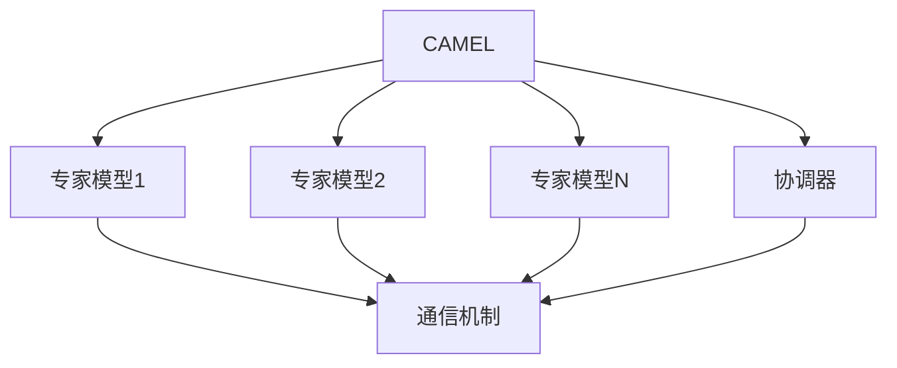

以下是标题为《【大模型应用开发 动手做AI Agent】CAMEL实战》的技术博客文章正文部分：

# 【大模型应用开发 动手做AI Agent】CAMEL实战

## 1. 背景介绍

### 1.1 问题的由来

在当今的人工智能时代，大型语言模型已经成为推动自然语言处理和人工智能发展的核心驱动力。随着计算能力的不断提升和数据量的快速增长，训练出更大更强大的语言模型成为可能。然而,这些大型语言模型通常需要消耗大量的计算资源,并且存在一些潜在的安全和隐私风险。因此,如何高效利用大型语言模型的强大能力,同时降低计算资源消耗和风险,成为了一个亟待解决的问题。

### 1.2 研究现状

为了解决上述问题,研究人员提出了一种新的大型语言模型部署方法,即CAMEL(Communication-Augmented Machine Learning)。CAMEL通过将大型语言模型分解为多个较小的专家模型,并使用一个协调器(coordinator)来协调这些专家模型之间的交互和通信,从而实现了高效的大型语言模型部署。

CAMEL的核心思想是将一个复杂的任务分解为多个较简单的子任务,由不同的专家模型来处理。这些专家模型通过协调器进行交互和通信,共同完成整个任务。与传统的单一大型语言模型相比,CAMEL具有以下优势:

1. 计算资源利用率更高,因为每个专家模型都相对较小,所需的计算资源较少。
2. 具有更好的可解释性和可控性,因为每个专家模型负责处理特定的子任务,更容易理解和调整。
3. 具有更好的隐私保护和安全性,因为敏感数据可以分散在不同的专家模型中,降低了数据泄露的风险。
4. 更容易扩展和升级,可以通过添加或替换专家模型来扩展系统的功能。

### 1.3 研究意义

CAMEL作为一种新型的大型语言模型部署方法,具有重要的理论和实践意义。从理论上讲,CAMEL为我们提供了一种新的思路来设计和构建大型语言模型系统,有助于我们更好地理解和利用这些复杂系统的潜力。从实践上讲,CAMEL可以帮助我们更高效地部署和利用大型语言模型,降低计算资源消耗和风险,从而推动自然语言处理和人工智能技术在各个领域的应用。

### 1.4 本文结构

本文将详细介绍CAMEL的核心概念、算法原理、数学模型、项目实践、应用场景等内容。文章结构如下:

1. 背景介绍
2. 核心概念与联系
3. 核心算法原理与具体操作步骤
4. 数学模型和公式详细讲解与举例说明
5. 项目实践:代码实例和详细解释说明
6. 实际应用场景
7. 工具和资源推荐
8. 总结:未来发展趋势与挑战
9. 附录:常见问题与解答

## 2. 核心概念与联系

CAMEL的核心概念包括专家模型(Expert Model)、协调器(Coordinator)和通信机制(Communication Mechanism)。

1. **专家模型(Expert Model)**:专家模型是CAMEL系统中的基本构建块,每个专家模型都是一个相对较小的语言模型,专门负责处理特定的子任务。例如,一个专家模型可能专门用于文本摘要,另一个专家模型可能专门用于问答系统。通过将复杂的任务分解为多个较简单的子任务,并由不同的专家模型来处理,可以提高系统的计算效率和可解释性。

2. **协调器(Coordinator)**:协调器是CAMEL系统中的核心组件,负责协调和管理各个专家模型之间的交互和通信。协调器接收输入任务,将其分解为多个子任务,并将这些子任务分配给相应的专家模型。同时,协调器还需要整合各个专家模型的输出结果,形成最终的任务输出。协调器的设计和实现对于CAMEL系统的整体性能和效率至关重要。

3. **通信机制(Communication Mechanism)**:通信机制是CAMEL系统中专家模型和协调器之间进行交互和通信的方式。通信机制需要确保不同组件之间的信息传递是高效、准确和安全的。常见的通信机制包括消息队列、远程过程调用(RPC)等。选择合适的通信机制对于CAMEL系统的性能和可扩展性也非常重要。

这三个核心概念相互关联、相互依赖,共同构成了CAMEL系统的基础架构。专家模型负责处理具体的子任务,协调器负责管理和协调各个专家模型,而通信机制则确保了它们之间的高效通信。只有这三个核心概念协同工作,CAMEL系统才能发挥出最大的潜力。

## 3. 核心算法原理与具体操作步骤

### 3.1 算法原理概述

CAMEL的核心算法原理可以概括为以下几个关键步骤:

1. **任务分解(Task Decomposition)**: 将输入的复杂任务分解为多个较简单的子任务。这个过程由协调器完成,需要根据任务的性质和专家模型的能力进行合理的分解。

2. **子任务分配(Sub-task Allocation)**: 将分解后的子任务分配给相应的专家模型。协调器需要根据每个专家模型的能力和当前的工作负载进行合理的分配,以确保整体系统的效率。

3. **专家模型处理(Expert Model Processing)**: 各个专家模型并行处理分配给它们的子任务,并将处理结果返回给协调器。

4. **结果整合(Result Integration)**: 协调器收集并整合来自各个专家模型的处理结果,形成最终的任务输出。

5. **反馈与优化(Feedback and Optimization)**: 根据任务输出的质量和系统的运行状况,对协调器的任务分解和分配策略、专家模型的能力等进行反馈和优化,以提高整体系统的性能。

这个过程是一个循环的过程,可以不断地通过反馈和优化来提高CAMEL系统的性能和效率。

### 3.2 算法步骤详解

下面我们将详细介绍CAMEL算法的具体步骤:

1. **任务分解(Task Decomposition)**

   - 协调器接收输入任务,并根据任务的性质和专家模型的能力进行合理的分解。
   - 分解过程可以采用基于规则的方法、基于机器学习的方法或者两者结合的方法。
   - 分解后的子任务应该尽可能独立、简单,并且能够被现有的专家模型有效处理。

2. **子任务分配(Sub-task Allocation)**

   - 协调器根据每个专家模型的能力、当前工作负载等因素,将子任务合理地分配给相应的专家模型。
   - 分配策略可以采用贪心算法、启发式算法或者基于机器学习的算法。
   - 分配过程需要考虑负载均衡、专家模型之间的依赖关系等因素,以确保整体系统的高效运行。

3. **专家模型处理(Expert Model Processing)**

   - 各个专家模型并行处理分配给它们的子任务,并将处理结果返回给协调器。
   - 专家模型可以采用不同的机器学习模型和算法,如transformer模型、CNN模型等。
   - 专家模型可以根据需要访问外部数据源或知识库,以提高处理质量。

4. **结果整合(Result Integration)**

   - 协调器收集并整合来自各个专家模型的处理结果。
   - 整合过程可以采用基于规则的方法、基于机器学习的方法或者两者结合的方法。
   - 整合后的结果应该是一个完整、一致的任务输出。

5. **反馈与优化(Feedback and Optimization)**

   - 根据任务输出的质量和系统的运行状况,对协调器的任务分解和分配策略、专家模型的能力等进行反馈和优化。
   - 优化过程可以采用强化学习、元学习或者其他机器学习方法。
   - 优化目标是提高整体系统的性能和效率,包括准确性、响应时间、资源利用率等指标。

这个过程是一个循环的过程,可以不断地通过反馈和优化来提高CAMEL系统的性能和效率。

### 3.3 算法优缺点

CAMEL算法相比于传统的单一大型语言模型,具有以下优缺点:

**优点**:

1. **高效利用计算资源**: 由于将任务分解为多个子任务,每个专家模型相对较小,因此可以更高效地利用计算资源。

2. **良好的可解释性和可控性**: 每个专家模型负责处理特定的子任务,更容易理解和调整,提高了系统的可解释性和可控性。

3. **更好的隐私保护和安全性**: 敏感数据可以分散在不同的专家模型中,降低了数据泄露的风险。

4. **易于扩展和升级**: 可以通过添加或替换专家模型来扩展系统的功能,具有良好的扩展性。

5. **提高了系统的鲁棒性**: 由于任务被分解为多个子任务,单个专家模型出现故障不会导致整个系统瘫痪。

**缺点**:

1. **增加了系统复杂性**: 需要设计和实现协调器、通信机制等额外的组件,增加了系统的复杂性。

2. **潜在的通信开销**: 专家模型之间的通信可能会带来一定的开销,影响系统的整体效率。

3. **任务分解和结果整合的挑战**: 合理地分解任务和整合结果是一个具有挑战性的问题,需要精心设计。

4. **专家模型之间的依赖关系**: 某些情况下,专家模型之间可能存在依赖关系,增加了系统的复杂性。

5. **训练和优化的挑战**: 训练和优化协调器、专家模型以及它们之间的交互是一个具有挑战性的问题。

总的来说,CAMEL算法通过将复杂任务分解为多个子任务,并由多个专家模型协同处理,可以提高计算效率和系统的可解释性、可控性和安全性。但同时也增加了系统的复杂性,需要精心设计和优化。

### 3.4 算法应用领域

CAMEL算法可以应用于各种需要处理大型语言模型的场景,包括但不限于:

1. **自然语言处理(NLP)**: CAMEL可以用于构建高效的自然语言处理系统,如机器翻译、文本摘要、问答系统等。

2. **对话系统**: CAMEL可以用于构建具有多个功能的对话系统,如客服机器人、个人助理等。

3. **信息检索**: CAMEL可以用于构建高效的信息检索系统,如搜索引擎、知识图谱等。

4. **内容生成**: CAMEL可以用于构建内容生成系统,如新闻写作、故事创作、广告文案生成等。

5. **多模态任务**: CAMEL可以用于处理多模态任务,如图像描述、视频理解等。

6. **个性化推荐**: CAMEL可以用于构建个性化推荐系统,如电影推荐、音乐推荐等。

7. **金融领域**: CAMEL可以应用于金融领域的各种任务,如风险评估、欺诈检测、投资决策等。

8. **医疗健康**: CAMEL可以应用于医疗健康领域,如病症诊断、治疗方案推荐、药物开发等。

总的来说,CAMEL算法为高效利用大型语言模型的能力提供了一种新的解决方案,可以在各种领域发挥重要作用。

## 4. 数学模型和公式详细讲解与举例说明

### 4.1 数学模型构建

在CAMEL系统中,我们需要构建数学模型来描述和优化任务分解、子任务分配、结果整合等过程。下面我们将介绍一些常用的数学