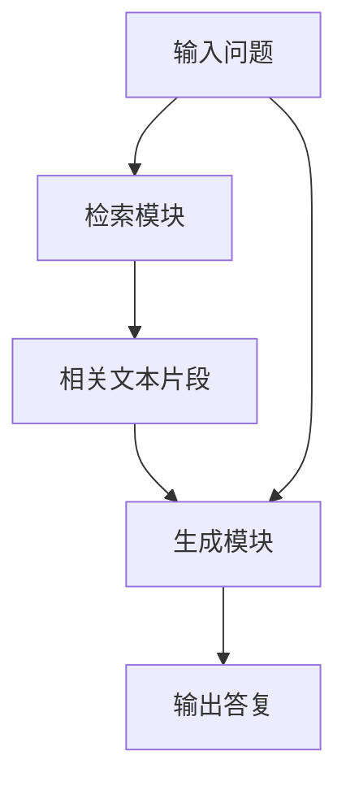

# 【大模型应用开发 动手做AI Agent】RAG和Agent

## 1. 背景介绍

### 1.1 问题的由来

在当今信息爆炸的时代,海量的非结构化数据如何高效获取和利用,成为了一个亟待解决的问题。传统的信息检索方式已经难以满足人们对知识获取的需求,因此,基于大规模语料库的开放域问答系统(Open-Domain Question Answering, ODQA)应运而生。

ODQA系统旨在从大规模语料库中检索相关信息,并生成针对自然语言问题的准确答复。然而,构建高质量的ODQA系统面临着诸多挑战,例如:

1. **海量语料库**:如何高效地从庞大的语料库中快速检索相关信息?
2. **多样化问题**:如何处理各种类型的开放域问题,包括事实型问题、推理型问题等?
3. **上下文理解**:如何准确理解问题的上下文和语义,从而生成恰当的答复?

为了应对这些挑战,研究人员提出了一种新型的ODQA架构,即Retrieval-Augmented Generation (RAG)模型。

### 1.2 研究现状

RAG模型结合了两种主要技术:检索(Retrieval)和生成(Generation)。它首先利用检索模块从语料库中查找与问题相关的文本片段,然后将这些文本片段与原始问题一起输入到生成模块,生成最终的答复。

目前,RAG模型已经在多个公开的ODQA基准测试中取得了令人瞩目的成绩,展现出了其强大的问答能力。不过,RAG模型也存在一些局限性,例如:

1. **检索效率**:如何在海量语料库中快速准确地检索相关文本片段?
2. **生成质量**:如何保证生成模块能够基于检索到的文本片段生成高质量的答复?
3. **模型可解释性**:RAG模型的内部工作机制如何?如何提高其可解释性?

为了进一步提升RAG模型的性能和可解释性,研究人员正在探索各种优化方法,例如改进检索策略、引入注意力机制、融合外部知识库等。

### 1.3 研究意义

RAG模型的研究对于推进开放域问答系统的发展具有重要意义:

1. **提高问答质量**:RAG模型能够充分利用大规模语料库中的知识,从而提高开放域问答的准确性和全面性。
2. **拓展应用场景**:高质量的开放域问答系统可以广泛应用于各个领域,如智能助手、知识问答、信息检索等。
3. **促进人机交互**:开放域问答系统为人类与机器之间的自然语言交互提供了一种高效的方式。
4. **推动AI技术发展**:RAG模型的研究涉及多个AI领域,如自然语言处理、信息检索、知识表示等,有助于推动这些领域的技术进步。

### 1.4 本文结构

本文将全面介绍RAG模型及其在开放域问答系统中的应用。文章主要内容包括:

1. RAG模型的核心概念和原理
2. RAG模型的核心算法及其实现细节
3. 数学模型和公式推导
4. 实际代码实现和案例分析
5. RAG模型在实际应用场景中的应用
6. 相关工具和学习资源推荐
7. RAG模型的未来发展趋势和面临的挑战

通过本文的学习,读者将全面掌握RAG模型的理论基础和实践应用,为开发高质量的开放域问答系统奠定坚实的基础。

## 2. 核心概念与联系

RAG (Retrieval-Augmented Generation) 模型是一种新型的开放域问答系统架构,它将检索(Retrieval)和生成(Generation)两个模块有机结合,充分利用了大规模语料库中的知识。

RAG模型的核心思想是:首先利用检索模块从语料库中查找与问题相关的文本片段,然后将这些文本片段与原始问题一起输入到生成模块,由生成模块综合这些信息生成最终的答复。

RAG模型的工作流程如下所示:

其中,检索模块和生成模块是RAG模型的两个核心组件:

1. **检索模块(Retrieval Module)**:负责从大规模语料库中快速准确地检索与问题相关的文本片段。常见的检索方法包括基于TF-IDF的检索、基于语义相似度的检索等。

2. **生成模块(Generation Module)**:负责综合问题和检索到的文本片段,生成最终的答复。生成模块通常采用基于Transformer的语言模型,如GPT、BART等。

检索模块和生成模块的有机结合,使RAG模型能够充分利用语料库中的知识,同时保持了生成模块的泛化能力,从而提高了开放域问答的质量和效率。

除了核心的检索和生成模块,RAG模型还涉及一些其他重要概念,如:

- **语料库(Corpus)**: RAG模型所依赖的大规模非结构化文本数据集,通常包含百万甚至更多的文档。
- **检索策略(Retrieval Strategy)**: 指定如何从语料库中检索相关文本片段的方法,如基于TF-IDF的检索、基于语义相似度的检索等。
- **生成策略(Generation Strategy)**: 指定如何将检索到的文本片段与原始问题输入到生成模块,生成最终答复的方法。
- **模型优化(Model Optimization)**: 针对RAG模型的各个组件进行优化,以提高模型的性能和效率,如改进检索策略、引入注意力机制、融合外部知识库等。

RAG模型的核心概念和组件之间存在着紧密的联系,它们共同构建了一个高效、准确的开放域问答系统。在后续章节中,我们将详细介绍RAG模型的算法原理、数学模型、实现细节和实际应用。

## 3. 核心算法原理 & 具体操作步骤

### 3.1 算法原理概述

RAG模型的核心算法原理可以概括为三个主要步骤:

1. **检索(Retrieval)**: 从大规模语料库中检索与输入问题相关的文本片段。
2. **编码(Encoding)**: 将输入问题和检索到的文本片段编码为机器可理解的表示形式。
3. **生成(Generation)**: 基于编码后的表示,生成针对输入问题的最终答复。

这三个步骤分别对应于RAG模型的三个核心组件:检索模块、编码器和生成模块。下面我们将详细介绍每个步骤的具体原理和实现方法。

### 3.2 算法步骤详解

#### 3.2.1 检索(Retrieval)

检索步骤的目标是从大规模语料库中快速准确地检索与输入问题相关的文本片段。常见的检索方法包括:

1. **基于TF-IDF的检索**:利用TF-IDF算法计算每个文档与输入问题的相关性得分,选取得分最高的前K个文档作为相关文本片段。

2. **基于语义相似度的检索**:利用预训练的语言模型(如BERT)计算输入问题与每个文档的语义相似度,选取相似度最高的前K个文档作为相关文本片段。

3. **基于密集向量索引的检索**:将语料库中的所有文档编码为密集向量,构建向量索引。在检索时,将输入问题也编码为密集向量,然后在向量索引中搜索最相似的前K个向量对应的文档作为相关文本片段。

无论采用何种检索方法,检索模块的输出都是一组与输入问题相关的文本片段,这些文本片段将与原始问题一起输入到后续的编码和生成步骤。

#### 3.2.2 编码(Encoding)

编码步骤的目标是将输入问题和检索到的文本片段转换为机器可理解的表示形式,以便后续的生成模块可以基于这些表示生成最终的答复。

常见的编码方法包括:

1. **基于Transformer的编码**:利用预训练的Transformer模型(如BERT、RoBERTa等)对输入问题和文本片段进行编码,得到对应的隐藏状态表示。

2. **基于RNN的编码**:利用循环神经网络(RNN)对输入问题和文本片段进行编码,得到对应的隐藏状态序列。

3. **基于CNN的编码**:利用卷积神经网络(CNN)对输入问题和文本片段进行编码,得到对应的特征映射表示。

无论采用何种编码方法,编码器的输出都是一组向量表示,这些向量表示捕获了输入问题和相关文本片段的语义信息,将被输入到后续的生成模块。

#### 3.2.3 生成(Generation)

生成步骤的目标是基于编码器输出的向量表示,生成针对输入问题的最终答复。

常见的生成方法包括:

1. **基于Transformer的生成**:利用预训练的Transformer语言模型(如GPT、BART等)作为生成模块,将编码器输出的向量表示作为输入,通过自回归(Auto-Regressive)方式生成答复。

2. **基于RNN的生成**:利用循环神经网络(RNN)作为生成模块,将编码器输出的向量表示作为初始隐藏状态,通过序列生成方式生成答复。

3. **基于指针网络的生成**:在生成过程中,允许模型从检索到的文本片段中直接复制相关的单词或短语,作为答复的一部分。这种方法可以提高生成答复的准确性和一致性。

生成模块的输出就是针对输入问题的最终答复,它综合了输入问题本身的信息和检索到的相关文本片段的知识。

### 3.3 算法优缺点

RAG模型作为一种新型的开放域问答系统架构,具有以下优点:

1. **利用大规模语料库知识**:通过检索模块,RAG模型可以充分利用语料库中的海量知识,从而提高问答的准确性和全面性。

2. **泛化能力强**:生成模块基于预训练的语言模型,具有较强的泛化能力,可以生成多样化的答复。

3. **模块化设计**:RAG模型采用模块化设计,检索模块和生成模块可以相对独立地进行优化和替换。

4. **可解释性较好**:通过分析检索到的相关文本片段,可以较好地解释RAG模型生成答复的依据和过程。

同时,RAG模型也存在一些缺点和局限性:

1. **检索效率**:在海量语料库中快速准确地检索相关文本片段是一个挑战。

2. **生成质量**:生成模块的质量直接影响最终答复的质量,如何保证生成质量是一个需要解决的问题。

3. **模型复杂度**:RAG模型涉及多个组件,如何有效地训练和优化整个模型是一个挑战。

4. **知识一致性**:检索到的文本片段之间可能存在矛盾或不一致的知识,如何处理这种情况也是一个需要解决的问题。

### 3.4 算法应用领域

RAG模型作为一种通用的开放域问答系统架构,可以广泛应用于各个领域,包括但不限于:

1. **智能助手**:RAG模型可以用于构建智能助手系统,为用户提供自然语言问答服务。

2. **知识问答**:RAG模型可以应用于各种知识问答场景,如维基百科问答、医疗问答、法律问答等。

3. **信息检索**:RAG模型可以用于信息检索任务,通过问答的形式帮助用户快速获取所需信息。

4. **对话系统**:RAG模型可以与对话系统相结合,提供更加智能和富有洞察力的对话交互体验。

5. **教育领域**:RAG模型可以应用于智能教育系统,为学生提供个性化的问答辅导和知识补充。

6. **企业应用**:RAG模型可以用于企业内部的知识管理和问答系统,提高员工的工作效率和知识共享水平。

总的来说,RAG模型为开发各种开放域问答系统提供了一种