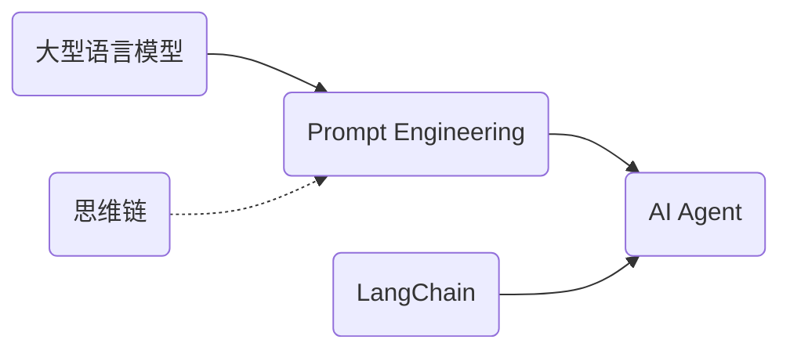

# 【大模型应用开发 动手做AI Agent】创建线程

作者：禅与计算机程序设计艺术 / Zen and the Art of Computer Programming

关键词：大模型、AI Agent、应用开发、ChatGPT、Prompt Engineering、LangChain

## 1. 背景介绍
### 1.1 问题的由来
近年来，随着人工智能技术的飞速发展，大型语言模型(Large Language Model, LLM)如ChatGPT、GPT-4等的出现引发了业界的广泛关注。这些大模型展现出了惊人的自然语言理解和生成能力，为人机交互和智能应用开发开辟了全新的可能性。然而，如何将这些强大的大模型转化为实际可用的智能助手(AI Agent)，仍面临着诸多挑战。

### 1.2 研究现状 
目前，业界已经开始积极探索利用大模型构建AI Agent的方法。一些先驱性的工作，如Anthropic的Constitutional AI[1]，OpenAI的ChatGPT插件生态[2]等，为大模型应用开发提供了宝贵的经验。但总的来说，这一领域仍处于起步阶段，缺乏成熟的开发框架和最佳实践。开发者在构建AI Agent时，往往需要大量的试错和探索。

### 1.3 研究意义
大模型驱动的AI Agent代表了人工智能技术发展的重要方向，有望在智能客服、个人助理、知识管理等领域发挥重要作用，为人们的工作和生活带来极大便利。系统研究大模型应用开发的方法和实践，总结可复用的模式和工具，将极大降低AI Agent的开发门槛，加速其在各行各业的应用落地，推动人工智能产业的发展。

### 1.4 本文结构
本文将系统介绍利用大模型开发AI Agent的关键技术和实践。第2节介绍相关的核心概念；第3节重点讲解Prompt Engineering的原理和方法；第4节介绍相关的数学模型；第5节以一个具体的项目为例，演示AI Agent的开发过程；第6节讨论AI Agent的应用场景；第7节推荐相关的工具和资源；第8节总结全文并展望未来。

## 2. 核心概念与联系

在利用大模型开发AI Agent的过程中，我们需要了解以下几个核心概念：

- 大型语言模型(LLM)：以Transformer为基础架构，在海量文本语料上训练的语言模型，如GPT-3、GPT-4、PaLM等。它们具有强大的自然语言理解和生成能力，是构建AI Agent的核心。  

- Prompt Engineering：一种利用Prompt(提示)来引导LLM执行特定任务的技术。通过精心设计Prompt，我们可以让LLM按照我们的意图生成所需的内容。

- AI Agent：由LLM驱动，能够执行特定任务的智能助手。它们可以通过对话界面或API等方式为用户提供服务。典型的AI Agent如ChatGPT、Anthropic Claude等。

- LangChain：一个用于构建LLM应用的开发框架。它提供了一系列工具和组件，帮助开发者更轻松地利用LLM构建AI Agent[3]。

- 思维链(Chain of Thought)：一种Prompt Engineering技术，通过引导LLM逐步推理来解决复杂问题，可以显著提升LLM在推理任务上的表现[4]。

这些概念之间的关系如下图所示：



## 3. 核心算法原理 & 具体操作步骤
### 3.1 算法原理概述
利用大模型构建AI Agent的核心是Prompt Engineering。给定一个任务，我们需要设计合适的Prompt，引导大模型生成符合要求的内容。一个典型的Prompt Engineering流程如下：

1. 明确任务目标，分析所需信息
2. 选择合适的大模型
3. 设计Prompt模板，包括指令、背景知识、输入信息、期望输出格式等
4. 在样例数据上测试和优化Prompt
5. 将优化后的Prompt应用到实际任务中

### 3.2 算法步骤详解

下面我们详细讲解每个步骤。

步骤1：明确任务目标，分析所需信息。这一步需要我们深入分析具体任务，梳理输入输出，确定Prompt中需要包含的关键信息。以一个智能客服AI Agent为例，我们需要分析可能的用户问题类型，整理知识库，明确回复的语气和格式要求等。

步骤2：选择合适的大模型。不同的大模型在不同任务上的表现有所差异，我们需要根据任务类型和资源限制，选择合适的模型。如对于涉及事实性知识的任务，我们可以选择在海量网页上训练的模型如GPT-3；对于创意性任务，可以选择GPT-4这样的大模型。

步骤3：设计Prompt模板。这是Prompt Engineering的关键步骤。一个好的Prompt需要包含以下元素：

- 明确的指令，说明任务要求
- 必要的背景知识，为模型提供上下文信息
- 输入信息的占位符，用于填充实际输入
- 期望的输出格式，如生成一段话、列表、表格等

以智能客服为例，我们可以设计如下的Prompt模板：

```
背景：你是一位智能客服助理，负责解答用户关于我们产品的问题。
知识库摘要：[知识库摘要]
用户问题：[用户输入]
请根据背景和知识库，以专业、友好的语气回答用户的问题。如果无法回答，请委婉地说明并提供进一步咨询的渠道。
```

步骤4：在样例数据上测试和优化Prompt。设计好初始的Prompt后，我们需要在一些样例数据上进行测试。通过分析模型的输出，我们可以发现Prompt的不足之处，并进行迭代优化。常见的优化方法包括：

- 调整指令的表述，使其更加明确
- 补充背景知识，为模型提供更丰富的上下文
- 优化输入信息的格式，如将文本改为表格等结构化形式
- 细化输出格式的要求，如要求按照一定的模板生成

步骤5：将优化后的Prompt应用到实际任务中。经过反复测试和优化，我们得到了一个较为成熟的Prompt。接下来就可以将其应用到实际的任务中，接入真实用户的输入，生成所需的输出。

### 3.3 算法优缺点

Prompt Engineering的优点在于：

- 无需对大模型进行再训练，即可应用于新任务
- 通过优化Prompt，可以显著提升模型在特定任务上的表现
- 设计Prompt的成本远低于训练专用模型

但它也有一些局限性：

- 对于复杂的任务，设计优质的Prompt需要大量的尝试和经验
- Prompt难以覆盖所有可能的情况，在遇到超出Prompt覆盖范围的输入时，模型的表现可能不稳定
- 过于依赖Prompt可能限制模型的泛化能力

### 3.4 算法应用领域

Prompt Engineering可以应用于大模型的各个领域，包括但不限于：

- 智能客服、个人助理等对话应用
- 信息抽取、文本分类等NLP任务 
- 代码生成、Bug修复等编程辅助
- 创意写作、广告文案生成等内容创作
- 问答、数学推理等知识密集型任务

总之，只要是大模型能够胜任的任务，都可以通过Prompt Engineering来实现和优化。

## 4. 数学模型和公式 & 详细讲解 & 举例说明
### 4.1 数学模型构建
大型语言模型的核心是Transformer架构[5]。Transformer通过自注意力机制(Self-Attention)实现了对长程依赖的建模。下面我们通过数学公式来详细说明Transformer的计算过程。

Transformer的输入是一个token序列$\mathbf{x} = (x_1, \ldots, x_n)$，其中$x_i \in \mathbb{R}^d$是第$i$个token的嵌入向量，$d$是嵌入维度。Transformer的计算可以分为以下几个步骤：

1. 位置编码(Positional Encoding)：
$$
\mathbf{z}_i = \mathbf{x}_i + \mathbf{p}_i
$$
其中$\mathbf{p}_i \in \mathbb{R}^d$是位置编码向量，用于表示token的位置信息。

2. 自注意力计算：
$$
\mathbf{q}_i = \mathbf{W}_q\mathbf{z}_i, \quad \mathbf{k}_i = \mathbf{W}_k\mathbf{z}_i, \quad \mathbf{v}_i = \mathbf{W}_v\mathbf{z}_i \\
\alpha_{ij} = \frac{\exp(\mathbf{q}_i^\top\mathbf{k}_j / \sqrt{d})}{\sum_{j=1}^n \exp(\mathbf{q}_i^\top\mathbf{k}_j / \sqrt{d})} \\
\mathbf{h}_i = \sum_{j=1}^n \alpha_{ij} \mathbf{v}_j
$$
其中$\mathbf{W}_q, \mathbf{W}_k, \mathbf{W}_v \in \mathbb{R}^{d \times d}$是可学习的参数矩阵，$\alpha_{ij}$是第$i$个token对第$j$个token的注意力权重。

3. 前馈网络(Feed-Forward Network)：
$$
\mathbf{y}_i = \mathrm{FFN}(\mathbf{h}_i) = \mathbf{W}_2(\max(0, \mathbf{W}_1\mathbf{h}_i + \mathbf{b}_1)) + \mathbf{b}_2
$$
其中$\mathbf{W}_1 \in \mathbb{R}^{d_{\mathrm{ff}} \times d}, \mathbf{W}_2 \in \mathbb{R}^{d \times d_{\mathrm{ff}}}, \mathbf{b}_1 \in \mathbb{R}^{d_{\mathrm{ff}}}, \mathbf{b}_2 \in \mathbb{R}^d$是可学习的参数，$d_{\mathrm{ff}}$是前馈网络的隐藏层维度。

以上步骤可以堆叠多层，形成完整的Transformer模型。在实际应用中，我们通常使用预训练好的大型Transformer模型，如GPT-3、GPT-4等。

### 4.2 公式推导过程

下面我们详细推导自注意力的计算公式。

首先，我们定义三个映射矩阵$\mathbf{W}_q, \mathbf{W}_k, \mathbf{W}_v \in \mathbb{R}^{d \times d}$，将输入向量$\mathbf{z}_i$映射为查询向量$\mathbf{q}_i$、键向量$\mathbf{k}_i$和值向量$\mathbf{v}_i$：

$$
\mathbf{q}_i = \mathbf{W}_q\mathbf{z}_i, \quad \mathbf{k}_i = \mathbf{W}_k\mathbf{z}_i, \quad \mathbf{v}_i = \mathbf{W}_v\mathbf{z}_i
$$

然后，我们计算第$i$个token对第$j$个token的注意力权重$\alpha_{ij}$。具体地，我们先计算查询向量$\mathbf{q}_i$和键向量$\mathbf{k}_j$的点积，然后除以$\sqrt{d}$进行缩放，再通过Softmax函数归一化：

$$
\alpha_{ij} = \frac{\exp(\mathbf{q}_i^\top\mathbf{k}_j / \sqrt{d})}{\sum_{j=1}^n \exp(\mathbf{q}_i^\top\mathbf{k}_j / \sqrt{d})}
$$

最后，我们将注意力权重$\alpha_{ij}$与值向量$\mathbf{v}_j$加权求和，得到第$i$个token的输出表示$\mathbf{h}_i$：

$$
\mathbf{h}_i = \sum_{j=1}^n \alpha_{ij} \mathbf{v}_j
$$

直观地理解，自注意力机制可以让每个token根据与其他token的相关性来聚合信息。注意力权重$\alpha_{ij}$衡量了第$i$个token对第$j$个token的关注程度，权重越大，说明两个token之间的关联越强。

### 4.3 案例分析与讲解

下面我们以一个简单的例子来说明自注意力的计算过程。

假设我们有一个由4个