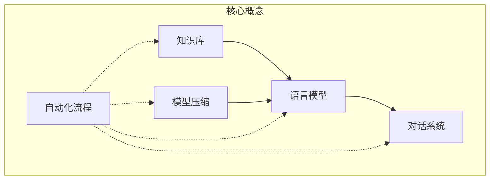

以下是题为《【大模型应用开发 动手做AI Agent】流程的自动化与资源的优化》的技术博客正文：

# 【大模型应用开发 动手做AI Agent】流程的自动化与资源的优化

## 1. 背景介绍

### 1.1 问题的由来

随着人工智能技术的快速发展,大型语言模型(Large Language Model, LLM)在自然语言处理、对话系统等领域展现出了令人惊叹的能力。然而,将这些大模型应用到实际场景中仍面临诸多挑战,例如模型部署、资源优化、流程自动化等。本文将探讨如何高效地将大模型应用于实际项目中,重点关注流程自动化和资源优化两个方面。

### 1.2 研究现状

目前,业界已经提出了一些解决方案,如模型压缩、知识蒸馏、量化等技术,旨在减小模型尺寸,降低计算和存储开销。但这些技术往往需要大量的人工调参,效果并不理想。此外,将大模型应用到实际项目中的流程仍然高度依赖人工操作,缺乏自动化和标准化。

### 1.3 研究意义

本文提出的自动化流程和资源优化策略,旨在降低大模型应用开发的门槛,提高开发效率。通过标准化流程,可以减少人工操作,降低出错率。而资源优化则可以有效降低计算和存储开销,使大模型应用在资源受限的环境中也能高效运行。

### 1.4 本文结构

本文首先介绍大模型应用开发中的核心概念,阐述它们之间的联系。接下来详细讲解核心算法原理和数学模型,并给出实际应用场景。然后通过代码示例讲解具体实现细节。最后总结未来发展趋势,并对常见问题给出解答。

## 2. 核心概念与联系

在大模型应用开发中,有几个核心概念需要理解:

1. **语言模型(Language Model, LM)**: 用于捕捉语言的统计规律,能够生成自然、流畅的文本。常见的LM包括BERT、GPT等。

2. **知识库(Knowledge Base, KB)**: 存储结构化知识的数据库,为LM提供外部知识源。

3. **对话系统(Dialogue System)**: 基于LM和KB构建的人机交互系统,能够与用户进行自然语言对话。

4. **模型压缩(Model Compression)**: 通过知识蒸馏、剪枝、量化等技术,将大型LM压缩为小型模型,降低计算和存储开销。

5. **自动化流程(Automated Pipeline)**: 将模型训练、优化、部署等步骤自动化,减少人工操作。

这些概念相互关联、环环相扣。LM为对话系统提供自然语言生成能力,KB为LM提供知识支持,模型压缩技术使大模型能够高效部署,而自动化流程则贯穿整个开发过程。只有将这些概念有机结合,才能构建出高效、可靠的大模型应用系统。



## 3. 核心算法原理 & 具体操作步骤

### 3.1 算法原理概述

大模型应用开发的核心算法主要包括以下几个方面:

1. **语言模型训练**: 基于大量文本数据,使用自监督学习方法(如Masked Language Modeling)训练语言模型,捕捉语言的统计规律。

2. **知识融合**: 将结构化知识库与语言模型相融合,使模型能够利用外部知识源进行推理和生成。

3. **模型压缩**: 通过知识蒸馏、剪枝、量化等技术,将大型语言模型压缩为小型模型,降低计算和存储开销。

4. **自然语言理解**: 使用注意力机制、transformer等技术,提高模型对自然语言的理解能力。

5. **响应生成**: 基于语言模型和知识库,生成与上下文相关、知识丰富的自然语言响应。

这些算法相互配合,共同实现了高效、智能的大模型应用系统。

### 3.2 算法步骤详解

以下是核心算法的具体操作步骤:

1. **语言模型训练**:
    - 收集大量高质量文本数据
    - 使用Masked Language Modeling等自监督学习方法训练语言模型
    - 调整超参数,优化模型性能

2. **知识融合**:
    - 构建结构化知识库
    - 使用知识注入、知识蒸馏等技术,将知识库与语言模型融合
    - 引入注意力机制,提高模型对知识的利用能力

3. **模型压缩**:
    - 使用知识蒸馏技术,将大模型的知识迁移到小模型
    - 对模型进行剪枝,移除冗余参数
    - 使用量化技术,降低模型精度,减小模型尺寸

4. **自然语言理解**:
    - 使用transformer编码器捕捉输入的上下文信息
    - 引入注意力机制,捕捉长距离依赖关系
    - 使用预训练语言模型提取语义表示

5. **响应生成**:
    - 使用transformer解码器生成自然语言响应
    - 融合知识库信息,生成知识丰富的响应
    - 使用beam search、top-k/top-p采样等策略,提高生成质量

### 3.3 算法优缺点

上述算法的优点包括:

- 融合了语言模型、知识库、注意力机制等先进技术,性能出色
- 通过模型压缩,可以在资源受限环境中高效部署
- 自动化流程减少了人工操作,提高了开发效率

但也存在一些缺点:

- 需要大量高质量数据进行预训练,数据获取成本高
- 模型训练和压缩过程计算开销大
- 知识融合和响应生成算法较为复杂,需要大量调参

### 3.4 算法应用领域

该算法可广泛应用于以下领域:

- 智能对话系统
- 问答系统
- 文本生成与摘要
- 知识图谱构建
- 信息检索与推荐
- 等等

## 4. 数学模型和公式 & 详细讲解 & 举例说明

### 4.1 数学模型构建

大模型应用开发中的核心数学模型是transformer,它由编码器(encoder)和解码器(decoder)组成。

编码器将输入序列映射为上下文表示:

$$H=Encoder(X)$$

其中$X$是输入序列,$H$是上下文表示。

解码器根据上下文表示和前缀生成输出序列:

$$Y=Decoder(H, Y_{<t})$$

其中$Y_{<t}$是输出序列的前缀。

编码器和解码器都使用了自注意力(self-attention)机制来捕捉长距离依赖关系:

$$Attention(Q, K, V) = softmax(\frac{QK^T}{\sqrt{d_k}})V$$

其中$Q$、$K$、$V$分别是查询(Query)、键(Key)和值(Value)。

### 4.2 公式推导过程

我们来推导一下transformer的自注意力机制是如何工作的。

首先,我们将输入序列$X$映射为$Q$、$K$、$V$:

$$\begin{aligned}
Q &= XW_Q \\
K &= XW_K \\
V &= XW_V
\end{aligned}$$

其中$W_Q$、$W_K$、$W_V$是可学习的权重矩阵。

然后,我们计算$Q$和$K$的点积,并除以$\sqrt{d_k}$进行缩放:

$$e_{ij} = \frac{(q_iK_j^T)}{\sqrt{d_k}}$$

其中$q_i$和$K_j$分别是$Q$和$K$的第$i$和第$j$行。

接着,我们对$e_{ij}$进行softmax操作,得到注意力权重:

$$a_{ij} = \frac{exp(e_{ij})}{\sum_k exp(e_{ik})}$$

最后,我们使用注意力权重对$V$进行加权求和,得到注意力输出:

$$Attention(Q, K, V) = \sum_j a_{ij}V_j$$

通过这种方式,transformer可以自动学习输入序列中不同位置之间的依赖关系。

### 4.3 案例分析与讲解

让我们用一个简单的例子来说明transformer的工作原理。

假设我们有一个输入序列"The dog chased the cat",我们希望生成一个简单的问答对话。

首先,编码器将输入序列映射为上下文表示$H$。在这个过程中,自注意力机制会捕捉到"dog"与"chased"、"cat"与"chased"之间的依赖关系。

然后,解码器根据$H$和前缀"What did"生成输出序列"the dog chase"。在生成每个单词时,解码器都会利用编码器的上下文表示$H$和自注意力机制来捕捉上下文信息。

最终,我们得到的问答对话是:"What did the dog chase? The dog chased the cat."

通过这个例子,我们可以看到transformer是如何利用自注意力机制来建模长距离依赖关系的。这种机制使得transformer能够高效地处理序列数据,是大模型应用开发的核心技术。

### 4.4 常见问题解答

**Q: 为什么要使用$\sqrt{d_k}$进行缩放?**

A: 这是为了防止点积的值过大或过小。当$d_k$较大时,点积的值会变得非常大,导致softmax函数的梯度接近0,难以训练。而当$d_k$较小时,点积的值又会变得非常小,导致梯度不稳定。使用$\sqrt{d_k}$进行缩放可以有效解决这个问题。

**Q: 自注意力机制是如何捕捉长距离依赖关系的?**

A: 在计算注意力权重时,每个位置都会与其他所有位置进行交互,从而可以捕捉到长距离的依赖关系。与RNN不同,自注意力机制不存在路径遗忘的问题,能够更好地建模长序列。

**Q: 知识融合是如何实现的?**

A: 常见的知识融合方法包括知识注入和知识蒸馏。知识注入是将知识库信息直接注入到模型中,而知识蒸馏则是将大模型的知识迁移到小模型中。这两种方法都可以提高模型的知识利用能力。

## 5. 项目实践:代码实例和详细解释说明

### 5.1 开发环境搭建

在开始实践之前,我们需要准备以下开发环境:

- Python 3.6+
- PyTorch 1.6+
- Transformers库
- NVIDIA GPU (可选)

我们可以使用conda或pip安装所需的Python包:

```bash
conda create -n lm python=3.8
conda activate lm
pip install torch transformers
```

如果有NVIDIA GPU,请确保正确安装CUDA和cuDNN。

### 5.2 源代码详细实现

以下是一个使用Transformers库实现的简单对话系统示例:

```python
from transformers import AutoModelForCausalLM, AutoTokenizer

# 加载预训练模型和分词器
model = AutoModelForCausalLM.from_pretrained("microsoft/DialoGPT-medium")
tokenizer = AutoTokenizer.from_pretrained("microsoft/DialoGPT-medium")

# 对话循环
while True:
    user_input = input("Human: ")
    if user_input.lower() == "quit":
        break

    # 对用户输入进行编码
    input_ids = tokenizer.encode(user_input + tokenizer.eos_token, return_tensors="pt")

    # 生成响应
    output = model.generate(input_ids, max_length=1000, do_sample=True, top_p=0.95, top_k=0)
    response = tokenizer.decode(output[0], skip_special_tokens=True)

    print(f"Assistant: {response}")
```

这段代码加载了微软的DialoGPT对话模型,并实现了一个简单的对话循环。

具体来说:

1. 我们使用`AutoModelForCausalLM`和`AutoTokenizer`从Transformers库中加载预训练模型和分词器。

2. 在对话循环中,我们获取用户输入,并使用分词器对其进行编码,得到输