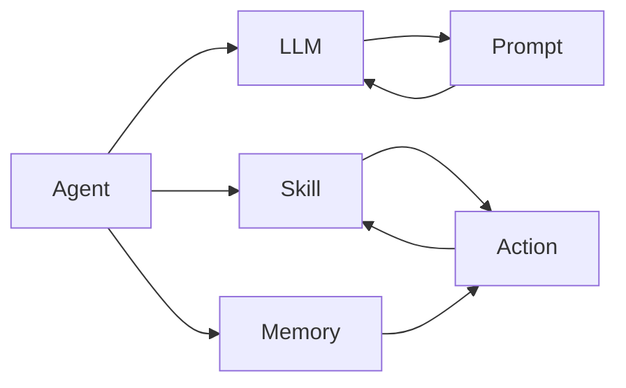
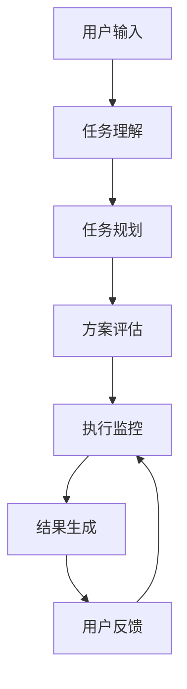

# 【大模型应用开发 动手做AI Agent】运行助手

作者：禅与计算机程序设计艺术 / Zen and the Art of Computer Programming

## 1. 背景介绍
### 1.1  问题的由来
随着人工智能技术的飞速发展，大规模预训练语言模型(Large Language Models, LLMs)展现出了惊人的能力，可以完成从对话、问答到写作、编程等多种复杂任务。如何将这些强大的基础模型转化为实际应用，开发出智能助手、聊天机器人等 AI Agent，成为了业界关注的热点。

### 1.2  研究现状 
目前业界已经涌现出了一批基于大模型的 AI Agent 应用，如微软的 Copilot 编程助手、Anthropic 的 Claude 聊天助手等。这些应用大多采用 Prompt 工程的方式，通过精心设计输入文本，引导大模型生成所需的输出。但对于普通开发者来说，如何掌握 Prompt 工程技巧、搭建可用的 Agent 应用还有一定门槛。

### 1.3  研究意义
本文将介绍一种易用的大模型 Agent 开发框架，帮助开发者快速构建基于 LLMs 的应用程序。通过该框架，可以方便地定义 Agent 的任务目标、输入输出接口、对话管理逻辑等，大大降低了 AI 应用开发的复杂度。这对于推动 LLMs 技术的普及应用具有重要意义。

### 1.4  本文结构
本文将分为以下几个部分：首先介绍 Agent 开发框架的核心概念和组件；然后详细讲解框架的工作原理和关键算法；接着通过一个具体的代码实例，演示如何使用该框架开发一个智能助手应用；最后总结全文，并展望 Agent 开发技术的未来趋势和挑战。

## 2. 核心概念与联系

Agent 开发框架的核心概念包括以下几点：

- **Agent**：即智能代理，是一个可以接收用户输入、执行特定任务并产生输出的程序。它通常由一个大语言模型和任务特定的接口组成。
- **LLM**：大规模语言模型，如 GPT-3、PaLM 等，是 Agent 的核心组件，负责自然语言理解和生成。
- **Prompt**：输入给语言模型的文本，由任务描述、输入数据等组成。通过精心设计 Prompt 可以有效引导模型执行任务。
- **Skill**：Agent 具备的一项特定能力，如信息检索、数据分析、任务规划等。一个 Agent 可以包含多个 Skill。
- **Action**：Agent 执行任务的一个原子步骤，包括接口调用、消息响应等。Action 的组合形成了 Agent 的任务执行流程。
- **Memory**：Agent 的长短期记忆，用于存储对话历史、任务状态等上下文信息，帮助 Agent 进行连贯的交互。

这些概念之间的关系如下图所示：



可以看到，Agent 由 LLM、Skill、Memory 三个主要组件构成。LLM 负责语言理解和生成，通过 Prompt 引导执行任务；Skill 定义了 Agent 的能力，由一系列 Action 步骤组成；Memory 为 Agent 提供了必要的上下文信息。

## 3. 核心算法原理 & 具体操作步骤
### 3.1 算法原理概述
Agent 框架的核心是语言模型的任务规划与执行算法。该算法的主要思想是：将复杂任务拆解为多个原子 Action，通过对 Action 序列的搜索规划，找到最优的任务完成路径。同时，在执行过程中，根据实时反馈动态调整 Action 选择，实现自适应任务执行。

### 3.2 算法步骤详解
具体算法可以分为以下几个步骤：

1. **任务理解**：根据用户输入的任务描述，结合 Prompt 模板，生成任务理解的自然语言表示，明确任务目标和约束条件。
2. **任务规划**：将任务目标拆解为多个子目标，对每个子目标搜索可行的 Action 序列，得到一系列备选的任务执行方案。
3. **方案评估**：对每个备选方案进行评分，评估其完成任务目标的效果、执行的难度、所需的时间成本等，选择出最优方案。
4. **执行监控**：根据选定方案，执行每个 Action 步骤。同时监控执行状态，根据中间结果和反馈信息，动态调整后续 Action 的选择。
5. **结果生成**：任务执行完成后，对结果进行总结和呈现，以自然语言的形式输出给用户，完成人机交互闭环。

算法流程可用下图表示：



### 3.3 算法优缺点
该算法的主要优点包括：
- 端到端的任务执行能力，可以处理开放域的复杂任务
- 基于规划搜索和动态调整，能够自适应地完成任务，鲁棒性强
- 结合自然语言交互，使用门槛低，适合普通用户

同时也存在一些局限性：
- 依赖大规模语言模型，需要较大的计算资源
- 任务拆解和 Action 选择的质量对性能影响大，需要精心设计
- 对于一些需要长期多轮交互的任务，算法的可扩展性有待进一步研究

### 3.4 算法应用领域
该 Agent 开发框架可以广泛应用于以下领域：
- 智能客服/销售助手
- 虚拟教育助手
- 个人生产力助理
- 智能信息检索与问答系统
- 自动编程助手
- 智能家居/车载助手

## 4. 数学模型和公式 & 详细讲解 & 举例说明
### 4.1  数学模型构建
我们可以用数学语言对上述 Agent 执行框架进行建模。定义 Agent 任务为一个五元组：
$$Task=\{G,S,A,R,F\}$$
其中：
- $G$：任务目标(Goal)，表示要达成的最终状态
- $S$：当前状态(State)，是一个状态特征的集合，$S=\{s_1,s_2,...,s_n\}$
- $A$：可执行的 Action 集合，$A=\{a_1,a_2,...,a_m\}$  
- $R$：奖励函数(Reward)，$R:S\times A \rightarrow \mathbb{R}$，表示在某状态下执行某个动作可以获得的收益
- $F$：状态转移函数(Transition Function)，$F:S\times A \rightarrow S$，表示执行某动作后状态的变化

Agent 的任务规划问题可以定义为在 $Task$ 约束下，寻找一个最优的动作序列 $\pi^*$，使得累积奖励最大化：

$$\pi^*=arg\max_{\pi} \mathbb{E}[\sum_{t=0}^{T} \gamma^t r_t|s_0,\pi]$$

其中，$\gamma \in [0,1]$ 是衰减因子，$t$ 是时间步，$\pi$ 是一个从状态到动作的映射。

### 4.2  公式推导过程
为了求解最优策略 $\pi^*$，我们可以引入价值函数 $V^{\pi}(s)$ 和动作价值函数 $Q^{\pi}(s,a)$：

$$V^{\pi}(s)=\mathbb{E}[\sum_{t=0}^{T} \gamma^t r_t|s_0=s,\pi]$$

$$Q^{\pi}(s,a)=\mathbb{E}[\sum_{t=0}^{T} \gamma^t r_t|s_0=s,a_0=a,\pi]$$

然后利用贝尔曼最优性方程，可以得到最优价值函数 $V^*(s)$ 和 $Q^*(s,a)$：

$$V^*(s)=\max_{a \in A} Q^*(s,a)$$

$$Q^*(s,a)=R(s,a)+\gamma \sum_{s' \in S} P(s'|s,a)V^*(s')$$

其中，$P(s'|s,a)$ 表示在状态 $s$ 下执行动作 $a$ 后转移到状态 $s'$ 的概率。

最终，最优策略可以通过贪心选择最大 $Q$ 值的动作得到：

$$\pi^*(s)=arg\max_{a \in A} Q^*(s,a)$$

### 4.3  案例分析与讲解
下面我们以一个简单的任务为例，说明如何应用上述模型进行 Agent 开发。

假设要开发一个智能助手，帮助用户完成一个"订购外卖"的任务。我们可以定义任务的状态空间 $S$ 如下：
- $s_1$：未选餐厅
- $s_2$：已选餐厅，未选菜品
- $s_3$：已选菜品，未确认订单
- $s_4$：已确认订单，未支付
- $s_5$：已支付，订单完成

可执行的 Action 集合 $A$ 包括：
- $a_1$：询问用户偏好的餐厅类型
- $a_2$：根据用户偏好推荐餐厅
- $a_3$：询问用户偏好的菜品类型
- $a_4$：根据用户偏好推荐菜品
- $a_5$：生成订单详情并询问用户确认
- $a_6$：引导用户完成支付

奖励函数 $R$ 可以根据用户反馈设置，比如：
- 在 $s_5$ 状态下，若用户对订单满意，则 $r_t=1$，否则 $r_t=-1$
- 其他状态下，若 Action 执行成功，则 $r_t=0.1$，否则 $r_t=-0.1$

状态转移函数 $F$ 可以根据先验知识或数据统计得到。

有了以上定义，我们就可以通过价值迭代或策略梯度等算法，求解最优策略 $\pi^*$，得到一个自动完成订餐任务的 Agent。

### 4.4  常见问题解答
Q: 对于复杂任务，状态空间会非常大，如何处理？
A: 可以考虑采用基于函数逼近的表示方法，将状态映射到低维特征空间，降低状态表示的复杂度。例如使用深度神经网络学习状态的嵌入式表示。

Q: 如何设计奖励函数以平衡任务完成的质量和效率？
A: 可以将奖励函数分解为多个子目标，对应质量、效率等不同维度，再加权求和。权重可以根据任务的侧重点进行调节。另外，对任务完成所需的时间步数施加惩罚，也有助于提升执行效率。

Q: 对于需要多模态交互的任务，如何融合不同信息源？
A: 可以将文本、图像、语音等不同模态的输入，通过各自的编码器网络，映射到一个公共的特征空间。之后在这个公共特征空间上应用注意力机制，自适应地聚合不同模态的信息，形成统一的状态表示。

## 5. 项目实践：代码实例和详细解释说明
下面我们通过一个简单的代码实例，演示如何使用 Agent 框架开发一个智能助手应用。

### 5.1  开发环境搭建
首先需要安装必要的依赖库，包括：
- openai：用于调用 GPT-3 接口
- langchain：提供了多种 LLM 应用组件
- gradio：用于快速构建 Web UI 界面

可以通过以下命令安装：

```bash
pip install openai langchain gradio
```

### 5.2  源代码详细实现
下面是一个简单的 Agent 应用的示例代码：

```python
import os
from langchain.llms import OpenAI
from langchain.agents import Tool, initialize_agent
from langchain.chains.conversation.memory import ConversationBufferMemory

# 设置 OpenAI API Key
os.environ["OPENAI_API_KEY"] = "your_api_key"

# 初始化语言模型
llm = OpenAI(temperature=0.9) 

# 定义 Agent 可用的工具
tools = [
    Tool(