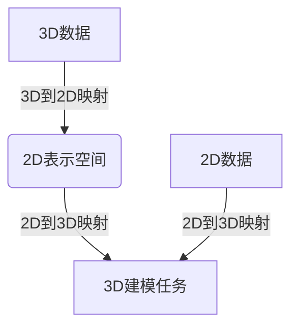

好的,我明白了您的要求。以下是根据您提供的大纲和要求,为主题"一切皆是映射:3D建模与深度学习技术的融合"撰写的技术博客文章正文部分:

# 一切皆是映射:3D建模与深度学习技术的融合

## 1. 背景介绍

### 1.1 问题的由来

在过去的几十年里,三维(3D)建模技术取得了长足的进步,并广泛应用于多个领域,如计算机动画、视觉特效、虚拟现实、增强现实等。传统的3D建模流程通常依赖于专业的3D建模软件和艺术家的手工操作,这种方式费时费力,而且需要专业的训练和经验。随着人工智能和深度学习技术的兴起,研究人员开始探索如何利用这些新兴技术来简化和自动化3D建模过程。

### 1.2 研究现状  

目前,结合深度学习的3D建模技术主要集中在以下几个方面:

1. **3D形状重建**: 利用2D图像或3D点云数据,通过深度学习模型重建出3D物体的完整形状。
2. **3D物体生成**: 直接从随机噪声或低维潜在空间中生成新的3D物体模型。
3. **3D场景理解**: 将2D图像或3D点云数据映射到3D场景表示,用于场景理解和增强现实等应用。
4. **3D运动捕捉**: 从2D图像或视频序列中估计人体或物体的3D姿态和运动轨迹。

这些研究方向都取得了一定的进展,但仍然面临诸多挑战,如数据质量、模型泛化能力、计算效率等。

### 1.3 研究意义

将3D建模与深度学习技术相结合,可以带来以下潜在好处:

1. **自动化和高效**: 减少人工干预,提高建模效率。
2. **数据驱动**: 利用大量数据训练模型,捕捉复杂的3D形状和结构。
3. **泛化能力**: 深度学习模型具有更强的泛化能力,可以生成新颖和多样化的3D内容。
4. **多模态融合**: 融合多种数据模态(如2D图像、3D点云、语义信息等),提高建模质量。

这些优势使得深度学习驱动的3D建模技术有望在多个领域产生深远的影响。

### 1.4 本文结构

本文将首先介绍3D建模与深度学习技术融合的核心概念和联系,然后详细阐述核心算法原理、数学模型和公式推导,并通过实际项目实践展示代码实现细节。随后,我们将探讨该技术在各个领域的应用场景,并推荐相关的工具和学习资源。最后,我们总结该领域的发展趋势和面临的挑战,并对未来研究方向进行展望。

## 2. 核心概念与联系

将3D建模与深度学习技术相结合,核心思想是将3D数据(如3D模型、点云等)映射到某种表示空间,并利用深度神经网络在该空间中学习相应的映射函数。根据映射的方向,可以分为以下两种范式:

1. **3D到2D映射**: 将3D数据映射到2D表示空间(如图像、特征等),用于3D物体识别、3D重建等任务。
2. **2D到3D映射**: 将2D数据(如图像、语义信息等)映射到3D表示空间,用于3D物体生成、3D场景理解等任务。

这两种范式相辅相成,共同推动了3D建模与深度学习技术的融合发展。下面是一个简化的流程图,展示了这两种范式的核心思路:

其中,3D到2D映射主要用于从3D数据中提取有用的2D表示,而2D到3D映射则是根据这些2D表示生成所需的3D内容。通过端到端的训练,神经网络可以自动学习两个映射之间的复杂关系,实现高质量的3D建模。

值得注意的是,这两种范式并非完全独立,它们之间存在一些交叉和融合。例如,一些方法会先将2D数据映射到3D表示,然后再映射回2D空间,形成一个循环的映射过程。另外,一些技术(如体数据融合、多视图一致性等)也同时涉及了3D到2D和2D到3D的映射。

总的来说,3D建模与深度学习技术的融合,提供了一种新颖和有前景的范式,有望推动3D内容创作和3D理解能力的发展。

## 3. 核心算法原理与具体操作步骤  

### 3.1 算法原理概述

将3D建模与深度学习技术相结合的核心算法原理,可以概括为"编码-解码"范式。该范式由两个主要组件组成:

1. **编码器(Encoder)**: 将输入数据(如3D点云、2D图像等)映射到一个潜在的特征空间,获得其紧凑的内部表示。
2. **解码器(Decoder)**: 从潜在特征空间中重建出所需的输出(如3D模型、2D图像等)。

编码器和解码器通常都是基于深度神经网络实现的。在训练过程中,整个编码-解码管道被视为一个端到端的映射函数,通过最小化重建损失来优化网络参数。

具体来说,该算法范式可以分为以下几个关键步骤:

1. **数据预处理**: 对输入数据(如3D点云、2D图像等)进行必要的预处理,如归一化、数据增强等。
2. **特征编码**: 将预处理后的输入数据输入编码器网络,获得其潜在特征表示。
3. **特征处理**: 对潜在特征进行必要的处理,如特征融合、特征变换等。
4. **特征解码**: 将处理后的潜在特征输入解码器网络,重建出所需的输出数据。
5. **损失计算**: 计算重建输出与Ground Truth之间的差异,定义合适的损失函数。
6. **模型优化**: 基于计算的损失,通过反向传播算法优化编码器和解码器的网络参数。

该算法范式具有一定的灵活性,可以根据不同的任务需求对编码器、解码器的网络结构以及损失函数进行调整和改进。

### 3.2 算法步骤详解

接下来,我们将详细介绍上述算法范式在3D建模任务中的具体实现步骤。以3D点云到3D网格重建任务为例:

1. **数据预处理**:
   - 对输入3D点云进行归一化处理,将点云数据映射到[-1,1]的立方体空间中。
   - 对点云进行随机旋转、平移等数据增强,增加训练数据的多样性。

2. **特征编码**:
   - 使用PointNet++等3D点云编码网络,将输入点云编码为高维特征向量。
   - 特征编码器通常包括多层3D卷积、最大池化等操作,逐步提取更抽象的特征表示。

3. **特征处理**:
   - 对编码得到的特征向量进行适当处理,如特征归一化、特征变换等。
   - 可以在此阶段融合其他模态的特征信息,如视图特征、语义特征等。

4. **特征解码**:
   - 使用3D卷积解码网络或基于折纸理论的解码网络,将处理后的特征逐步解码为3D体素网格表示。
   - 解码过程通常包括上采样、3D卷积等操作,逐步恢复出3D物体的完整结构。

5. **损失计算**:
   - 将解码得到的3D体素网格与Ground Truth网格进行对比,计算两者之间的差异。
   - 常用的损失函数包括交叉熵损失、Chamfer距离、Earth Mover's距离等。

6. **模型优化**:
   - 基于计算得到的损失,使用随机梯度下降等优化算法,反向传播更新编码器和解码器网络的参数。
   - 通过多次迭代训练,模型可以逐步学习到高质量的3D点云到3D网格的映射函数。

需要注意的是,上述步骤只是一个典型的实现范例,具体的网络结构、损失函数等细节可能因任务而有所不同。此外,一些方法还会引入额外的正则项、辅助损失等,以进一步提高模型的性能和泛化能力。

### 3.3 算法优缺点

上述基于编码-解码范式的3D建模算法具有以下优缺点:

**优点**:

1. **端到端训练**:编码器和解码器可以通过端到端的方式进行联合训练,实现直接的数据映射。
2. **特征学习**:深度神经网络能够自动从数据中学习出有效的特征表示,无需人工设计特征。
3. **多模态融合**:该范式支持在潜在特征空间中融合多种模态的信息,如3D数据、2D图像、语义信息等。
4. **泛化能力**:通过在大规模数据集上训练,模型可以获得较强的泛化能力,生成新颖和多样化的3D内容。

**缺点**:

1. **数据饥渴**:训练高质量的3D建模模型通常需要大量的3D数据,而获取这些数据的成本较高。
2. **黑盒操作**:神经网络的内部运作过程通常是一个黑盒,缺乏可解释性,难以理解模型是如何学习映射函数的。
3. **模型偏差**:由于训练数据的偏差和局限性,模型可能在某些特殊情况下表现不佳。
4. **计算资源需求高**:训练和推理过程通常需要大量的计算资源,如GPU加速等。

### 3.4 算法应用领域

基于编码-解码范式的3D建模算法可以应用于多个领域,包括但不限于:

1. **3D物体重建**:从2D图像、3D点云等数据中重建出完整的3D物体模型。
2. **3D物体生成**:直接从随机噪声或低维潜在空间生成新的3D物体模型。
3. **3D场景理解**:将2D图像或3D点云数据映射到3D场景表示,用于场景理解、增强现实等应用。
4. **3D运动捕捉**:从2D图像或视频序列中估计人体或物体的3D姿态和运动轨迹。
5. **3D模型压缩与传输**:将3D模型编码为紧凑的潜在表示,以实现高效的存储和传输。
6. **3D模型编辑与变形**:在潜在空间中对3D模型进行编辑和变形操作。

总的来说,该算法范式为3D建模和理解任务提供了一种通用且高效的解决方案,具有广阔的应用前景。

## 4. 数学模型和公式及详细讲解与举例说明

在将3D建模与深度学习技术相结合的过程中,涉及了多种数学模型和公式,下面我们将详细介绍其中的几个核心部分。

### 4.1 数学模型构建

#### 4.1.1 3D点云编码

3D点云是表示3D物体形状的一种常用方式,每个点云由一组无序的三维点 $\{(x_i, y_i, z_i)\}_{i=1}^N$ 组成,其中 $N$ 为点的个数。为了将点云输入到神经网络中进行处理,我们需要构建一种适当的数学表示。

最常用的点云编码方法是基于PointNet++网络提出的采样和分组操作。具体来说,对于一个给定的三维点 $(x_q, y_q, z_q)$,我们首先在其周围的球形区域内采样一组临近点,然后将这些点的相对坐标和特征向量拼接,得到如下表示:

$$
f_{q} = \gamma\left(\left\{\left(x_{i}-x_{q}, y_{i}-y_{q}, z_{i}-z_{q}, f_{i}\right)\right\}, x_{q}, y_{q}, z_{q}\right)
$$

其中 $\gamma$ 表示某种对称函数(如最大池化),用于从局部点集