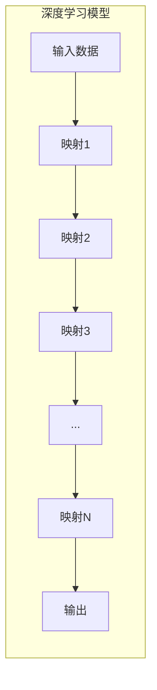

以下是根据您的要求撰写的技术博客文章正文内容:

# 一切皆是映射：AI人工智能原理与应用实战简介

## 1. 背景介绍

### 1.1 问题的由来

在当今的数字时代,数据的爆炸式增长已成为一个不争的事实。无论是社交媒体平台、在线购物网站还是物联网设备,它们都在不断产生海量的结构化和非结构化数据。然而,如何高效地从这些庞大的数据中提取有价值的信息并加以利用,成为了当前人工智能(AI)领域亟待解决的核心问题。

### 1.2 研究现状  

传统的机器学习算法虽然在特定领域取得了一些成功,但它们通常需要大量的人工特征工程,且难以从原始数据中自动学习出高层次的抽象特征表示。为了突破这一瓶颈,深度学习(Deep Learning)应运而生,它通过构建深层神经网络模型,使机器能够自主地从原始数据中学习特征表示,从而在计算机视觉、自然语言处理等领域取得了突破性的进展。

### 1.3 研究意义

深度学习的核心思想是通过多层非线性变换来学习数据的层次化特征表示,从而实现端到端的自动化特征提取和模式识别。这种思路不仅能够极大地减轻人工特征工程的负担,而且能够从海量数据中发掘出更加深刻和抽象的特征模式,为人工智能系统的性能提升带来了革命性的突破。

### 1.4 本文结构

本文将全面介绍深度学习的核心原理、关键算法以及在计算机视觉、自然语言处理等领域的应用实践。我们将从数学模型的构建、公式推导到代码实现进行深入探讨,并分享实际应用场景和未来发展趋势,旨在为读者提供一个全面而系统的深度学习知识框架。

## 2. 核心概念与联系

深度学习的核心概念是通过构建深层神经网络模型来自动学习数据的层次化特征表示。这个过程可以抽象地看作是一系列非线性映射的组合,将原始输入数据(如图像像素、文本等)逐层映射为更加抽象的特征表示,最终得到对应的输出(如图像分类标签、文本语义等)。



每一层的映射函数通常由大量的参数(如神经网络的权重和偏置)来定义,这些参数需要通过有监督或无监督的方式从训练数据中学习得到。学习的目标是使得最终的输出能够很好地拟合训练数据,并具备很强的泛化能力,从而在新的测试数据上也能取得良好的性能表现。

深度学习模型的关键优势在于其强大的表示学习能力。通过层层映射,模型能够自动从原始数据中提取出多层次、高度抽象的特征表示,这些特征往往更加鲁棒、判别性更强,从而能够极大地提升模型的性能和泛化能力。

## 3. 核心算法原理与具体操作步骤

### 3.1 算法原理概述

深度学习算法的核心原理可以概括为以下三个关键步骤:

1. **前向传播(Forward Propagation)**: 输入数据经过一系列非线性映射函数的变换,逐层传递到输出层,得到相应的输出结果。这个过程可以用数学公式表示为:

$$\begin{aligned}
\mathbf{h}^{(0)} &= \mathbf{x} \\
\mathbf{h}^{(l+1)} &= \sigma\left(\mathbf{W}^{(l)}\mathbf{h}^{(l)} + \mathbf{b}^{(l)}\right), \quad l=0,1,\ldots,L-1\\
\mathbf{y} &= \mathbf{h}^{(L)}
\end{aligned}$$

其中$\mathbf{x}$为输入数据,$\mathbf{y}$为最终输出,$\mathbf{h}^{(l)}$为第$l$层的隐藏表示,$\mathbf{W}^{(l)}$和$\mathbf{b}^{(l)}$分别为第$l$层的权重和偏置参数,$\sigma(\cdot)$为非线性激活函数。

2. **反向传播(Backpropagation)**: 根据输出结果与期望目标之间的差异(损失函数),计算每一层参数对最终损失的梯度,并通过链式法则自底向上层层传播,得到每一层参数的梯度。

3. **参数更新(Parameter Update)**: 利用优化算法(如梯度下降)根据计算得到的梯度,不断迭代地更新网络中的参数,使得损失函数的值不断减小,从而达到模型性能的持续提升。

这个过程可以用数学公式表示为:

$$\mathbf{W}^{(l)} \leftarrow \mathbf{W}^{(l)} - \eta \frac{\partial J}{\partial \mathbf{W}^{(l)}}$$
$$\mathbf{b}^{(l)} \leftarrow \mathbf{b}^{(l)} - \eta \frac{\partial J}{\partial \mathbf{b}^{(l)}}$$

其中$J$为损失函数,$\eta$为学习率(步长)。

通过不断重复上述三个步骤,模型的参数就能够不断优化,从而使得模型在训练数据上的性能不断提高,并具备更强的泛化能力。

### 3.2 算法步骤详解

深度学习算法的具体操作步骤可以分为以下几个环节:

1. **数据预处理**: 根据具体任务对原始数据进行必要的预处理,如归一化、编码等,以满足模型的输入要求。

2. **模型构建**: 根据任务的特点选择合适的网络结构(如卷积神经网络、循环神经网络等),并初始化网络参数。

3. **模型训练**:
    - 前向传播计算输出
    - 计算输出与标签之间的损失
    - 反向传播计算每层参数梯度  
    - 根据梯度更新网络参数
    - 重复上述步骤直至达到收敛

4. **模型评估**: 在保留的测试集上评估模型的泛化性能。

5. **模型微调**(可选): 根据评估结果对模型进行必要的调整和优化,如修改超参数、增加正则化等。

6. **模型部署**: 将训练好的模型集成到实际的应用系统中。

需要注意的是,上述步骤并非一次性完成,而是一个循环迭代的过程。通过不断地训练、评估和调整,模型的性能才能不断提升,从而满足实际应用的需求。

### 3.3 算法优缺点

**优点**:

- 强大的表示学习能力,能够自动从原始数据中学习出多层次抽象特征
- 端到端的训练方式,减轻了人工特征工程的负担
- 可以处理多种类型的数据,如图像、文本、语音等
- 具有很强的泛化能力,能够有效应对未见过的新数据

**缺点**:

- 训练过程计算量大,对硬件资源要求较高
- 需要大量的标注数据作为监督信息
- 模型可解释性较差,内部工作机理有"黑箱"性质  
- 存在过拟合风险,需要合理的正则化策略

### 3.4 算法应用领域

深度学习算法由于其强大的表示学习能力,已经在诸多领域取得了卓越的应用成果,主要包括但不限于:

- **计算机视觉**: 图像分类、目标检测、语义分割、人脸识别等
- **自然语言处理**: 机器翻译、文本生成、情感分析、问答系统等
- **语音识别**: 自动语音识别、语音合成、说话人识别等
- **推荐系统**: 个性化推荐、内容推荐等
- **金融**: 金融风险预测、欺诈检测等
- **医疗健康**: 医学影像分析、疾病诊断、药物设计等
- **其他**: 机器人控制、无人驾驶、天文探索等

## 4. 数学模型和公式详细讲解与举例说明

### 4.1 数学模型构建

深度学习模型通常由多个层级组成,每一层对应一个非线性映射函数。我们以一个简单的全连接神经网络为例,来构建其数学模型。

假设输入为$\mathbf{x} \in \mathbb{R}^{d_x}$,输出为$\mathbf{y} \in \mathbb{R}^{d_y}$,那么一个两层的全连接神经网络可以表示为:

$$\begin{aligned}
\mathbf{h} &= \sigma_1\left(\mathbf{W}^{(1)}\mathbf{x} + \mathbf{b}^{(1)}\right) \\
\mathbf{y} &= \sigma_2\left(\mathbf{W}^{(2)}\mathbf{h} + \mathbf{b}^{(2)}\right)
\end{aligned}$$

其中:

- $\mathbf{W}^{(1)} \in \mathbb{R}^{d_h \times d_x}$和$\mathbf{b}^{(1)} \in \mathbb{R}^{d_h}$分别为第一层的权重矩阵和偏置向量
- $\mathbf{W}^{(2)} \in \mathbb{R}^{d_y \times d_h}$和$\mathbf{b}^{(2)} \in \mathbb{R}^{d_y}$分别为第二层的权重矩阵和偏置向量  
- $\sigma_1(\cdot)$和$\sigma_2(\cdot)$为非线性激活函数,如ReLU、Sigmoid等
- $\mathbf{h} \in \mathbb{R}^{d_h}$为隐藏层的输出,也称为隐藏表示

该模型的参数集合为$\Theta = \{\mathbf{W}^{(1)}, \mathbf{b}^{(1)}, \mathbf{W}^{(2)}, \mathbf{b}^{(2)}\}$,需要通过训练数据来学习得到。

### 4.2 公式推导过程

在训练过程中,我们需要最小化一个损失函数$J(\Theta)$,使得模型的输出$\mathbf{y}$能够很好地拟合训练数据的标签$\mathbf{t}$。常用的损失函数有均方误差损失:

$$J(\Theta) = \frac{1}{2}\sum_i \|\mathbf{y}_i - \mathbf{t}_i\|_2^2$$

其中$i$为训练样本的索引。为了最小化损失函数,我们需要计算每个参数对损失函数的梯度,然后通过梯度下降法进行参数更新。

以$\mathbf{W}^{(2)}$为例,根据链式法则,我们有:

$$\frac{\partial J}{\partial \mathbf{W}^{(2)}} = \sum_i \frac{\partial J}{\partial \mathbf{y}_i} \frac{\partial \mathbf{y}_i}{\partial \mathbf{W}^{(2)}}$$

其中:

$$\frac{\partial J}{\partial \mathbf{y}_i} = \mathbf{y}_i - \mathbf{t}_i$$
$$\frac{\partial \mathbf{y}_i}{\partial \mathbf{W}^{(2)}} = \sigma_2'(\mathbf{z}_i^{(2)}) \otimes \mathbf{h}_i^T$$

这里$\sigma_2'(\cdot)$为激活函数的导数,$\mathbf{z}_i^{(2)} = \mathbf{W}^{(2)}\mathbf{h}_i + \mathbf{b}^{(2)}$为第二层的加权输入,$\otimes$为张量积运算。

通过类似的推导过程,我们可以得到其他参数的梯度表达式。有了这些梯度信息,我们就可以使用梯度下降法或其变体算法(如Adam、RMSProp等)来不断迭代地更新模型参数,从而最小化损失函数,提高模型在训练数据上的性能表现。

### 4.3 案例分析与讲解

为了更好地理解深度学习模型的工作原理,我们来分析一个图像分类的实例。假设我们有一个三层的卷积神经网络,用于对手写数字图像进行分类。

```mermaid
graph