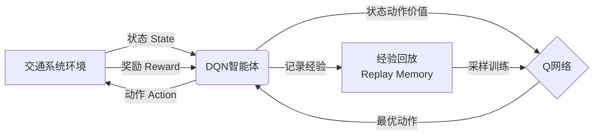

# 一切皆是映射：DQN在交通规划中的应用：智能交通的挑战与机遇

关键词：深度强化学习、DQN算法、智能交通、交通规划、Mermaid流程图

## 1. 背景介绍

### 1.1 问题的由来

随着城市化进程的不断加快,交通拥堵、事故频发等问题日益突出,严重影响着人们的日常出行和生活质量。传统的交通管理和规划方式已经难以适应快速发展的交通需求。因此,如何利用人工智能技术来优化交通系统,实现智能化的交通管理和规划,成为了当前亟待解决的重要课题。

### 1.2 研究现状

近年来,深度强化学习(Deep Reinforcement Learning, DRL)在众多领域取得了显著成果,尤其是DQN(Deep Q-Network)算法,以其强大的非线性逼近能力和自适应学习能力,在游戏、机器人等领域表现突出。交通领域的研究者们也开始将DQN引入到交通规划中,希望通过模仿人类的决策过程,让智能体学会根据交通状态自主地调整信号配时、诱导交通流等,从而实现动态实时的交通优化控制。

### 1.3 研究意义

将DQN应用于交通规划,对缓解城市交通压力、提升通行效率、保障出行安全等方面具有重要意义:

1. 提高交通系统的智能化水平,实现信号灯的实时动态优化,缩短通行延误;
2. 挖掘数据价值,利用海量的交通大数据训练DQN模型,学习最优决策;  
3. 增强交通管控的灵活性,根据路况动态引导交通流,缓解拥堵;
4. 辅助交通管理部门科学制定规划策略,提升管理效率和服务质量。

### 1.4 本文结构

本文将重点介绍将DQN算法应用于交通规划的相关理论和实践。第2部分阐述DQN的核心概念;第3部分详细讲解DQN的算法原理;第4部分建立DQN在交通领域的数学模型;第5部分通过代码实例演示DQN的具体实现;第6部分探讨DQN在智慧交通中的应用场景;第7部分推荐相关工具和学习资源;第8部分总结全文,展望未来的研究方向。

## 2. 核心概念与联系

DQN源自于传统的Q-Learning算法,其核心思想是:通过不断与环境互动,根据观测到的状态选择动作,获得反馈奖励,并利用神经网络逼近最优Q值函数,进而得到最优策略。将这一思路应用到交通规划中,则是让智能体学习如何根据道路状态(如车流量、排队长度、延误时间等)来动态调整信号配时、交通诱导等措施,优化整个交通系统的运行效率。

DQN涉及到的核心概念包括:

- 状态(State):描述当前交通系统的特征,如交通流量、速度、排队长度等。
- 动作(Action):交通规划中可采取的控制措施,如信号配时、交通诱导等。
- 奖励(Reward):对采取动作后系统性能的评价,如通行效率提升、延误时间减少等。
- 策略(Policy):将状态映射到动作的函数,即在某状态下应该采取何种动作。
- Q值(Q-value):衡量在某状态下采取某动作的长期累积奖励期望。
- 经验回放(Experience Replay):将历史的(state, action, reward, next state)数据存储下来,供模型训练使用。
- 探索与利用(Exploration and Exploitation):探索是尝试新动作,利用是选择当前最优动作,两者需平衡。

这些概念环环相扣,共同构建起了DQN的理论框架,下面将通过一个流程图来直观展示其工作流程:

智能体通过与交通环境不断互动,根据观测到的状态选择动作,获得环境反馈的奖励,将历史经验存入回放池,并从中采样数据对Q网络进行训练,使其逼近最优Q函数,进而得到最优控制策略,形成一个闭环学习过程。

## 3. 核心算法原理 & 具体操作步骤

### 3.1 算法原理概述

DQN本质上是一种值函数逼近的方法,即用深度神经网络去近似表示最优状态-动作值函数 $Q^*(s,a)$。通过最小化损失函数,使得神经网络输出的Q值接近最优Q值,从而获得最优策略。

### 3.2 算法步骤详解

DQN算法的主要步骤如下:

1. 初始化Q网络参数 $\theta$,目标Q网络参数 $\theta^-$
2. 初始化经验回放池 $D$
3. for episode = 1 to M do:
   1. 初始化状态 $s_1$
   2. for t = 1 to T do:
      1. 根据 $\epsilon$-greedy策略选择动作 $a_t$
      2. 执行动作 $a_t$ ,观测奖励 $r_t$ 和下一状态 $s_{t+1}$
      3. 将$(s_t,a_t,r_t,s_{t+1})$存入 $D$ 
      4. 从 $D$ 中随机采样一个批次的转移数据
      5. 计算目标Q值:
         $$y_i=\begin{cases}
         r_i & \text{if episode terminates at step }i+1\\
         r_i+\gamma \max_{a'}Q(s_{i+1},a';\theta^-) & \text{otherwise}
         \end{cases}$$
      6. 最小化损失函数:
         $$L(\theta)=\mathbb{E}_{(s,a,r,s')\sim D}[(y-Q(s,a;\theta))^2]$$
      7. 每隔C步,将 $\theta^-$ 更新为 $\theta$
      8. $s_t \leftarrow s_{t+1}$
   3. end for
4. end for

### 3.3 算法优缺点

DQN算法的主要优点有:
- 端到端的学习方式,输入状态输出动作,不需要人工设计特征
- 通过深度神经网络逼近Q函数,可处理高维连续状态空间
- 引入经验回放和目标网络,缓解了数据相关性和训练不稳定性问题

但它也存在一些局限:
- 离散动作空间,不适用于连续动作
- 采样效率不高,需要大量的数据和训练时间
- 对超参数敏感,调参需要经验

### 3.4 算法应用领域

DQN算法除了在交通领域有广泛应用外,还在以下领域取得了不错的效果:
- 游戏:DQN在Atari游戏中达到了超人类的水平
- 机器人:用于机器人的运动规划和控制
- 推荐系统:根据用户反馈动态调整推荐策略
- 通信:在无线通信中实现智能的资源分配和调度

## 4. 数学模型和公式 & 详细讲解 & 举例说明

### 4.1 数学模型构建

我们考虑一个标准的交通信号控制场景,在一个十字路口有8个车道,每个车道有3个可选的信号灯状态:红灯、绿灯、黄灯。状态空间 $\mathcal{S}$ 包含各车道的排队长度、平均速度等信息,动作空间 $\mathcal{A}$ 为所有可能的信号灯配置,奖励函数 $\mathcal{R}$ 考虑通行效率、排队长度、停车次数等指标。

MDP的元组表示为:
$$\mathcal{M}=(\mathcal{S},\mathcal{A},\mathcal{P},\mathcal{R},\gamma)$$

其中, $\mathcal{P}$ 为状态转移概率矩阵, $\gamma$ 为折扣因子。

我们的目标是找到一个最优策略 $\pi^*$,使得长期累积奖励最大化:

$$\pi^*=\arg\max_{\pi}\mathbb{E}\left[\sum_{t=0}^{\infty}\gamma^t r_t\mid \pi\right]$$

Q函数定义为在策略 $\pi$ 下,状态-动作对 $(s,a)$ 的长期价值:

$$Q^{\pi}(s,a)=\mathbb{E}\left[\sum_{k=0}^{\infty}\gamma^k r_{t+k}\mid s_t=s,a_t=a,\pi\right]$$

最优Q函数满足Bellman最优方程:

$$Q^*(s,a)=\mathbb{E}_{s'\sim P}\left[r+\gamma \max_{a'} Q^*(s',a')\mid s,a\right]$$

我们用一个深度神经网络 $Q(s,a;\theta)$ 来近似表示 $Q^*(s,a)$,其中 $\theta$ 为网络参数。

### 4.2 公式推导过程

将Bellman最优方程转化为期望形式:

$$\begin{aligned}
Q^*(s,a)&=\mathbb{E}_{s'\sim P}\left[r+\gamma \max_{a'} Q^*(s',a')\mid s,a\right]\\
&=\sum_{s'\in \mathcal{S}}P(s'|s,a)\left[R(s,a,s')+\gamma \max_{a'} Q^*(s',a')\right]
\end{aligned}$$

定义目标Q值 $y$ 为:

$$y=r+\gamma \max_{a'}Q(s',a';\theta^-)$$

其中 $\theta^-$ 为目标网络参数,每隔一段时间从在线网络 $\theta$ 复制过来,用于计算目标Q值。

定义损失函数为:

$$L(\theta)=\mathbb{E}_{(s,a,r,s')\sim D}\left[\left(y-Q(s,a;\theta)\right)^2\right]$$

即最小化目标Q值与当前Q值的均方差。

根据梯度下降法,参数 $\theta$ 的更新公式为:

$$\theta \leftarrow \theta - \alpha \nabla_{\theta}L(\theta)$$

其中 $\alpha$ 为学习率。

### 4.3 案例分析与讲解

我们以一个简单的交通十字路口为例,假设有4个车道,每个车道有2个信号灯状态:红灯和绿灯。状态为各车道的排队长度,动作为4种可能的信号灯配置:

- 动作0:南北通行,东西停止
- 动作1:东西通行,南北停止
- 动作2:南北左转,东西停止
- 动作3:东西左转,南北停止

奖励函数考虑各车道的平均通行时间和排队长度:

$$r=-\sum_{i=1}^{4}(w_1\cdot t_i+w_2\cdot q_i)$$

其中 $t_i$ 和 $q_i$ 分别为第 $i$ 个车道的平均通行时间和排队长度, $w_1$ 和 $w_2$ 为权重系数。

我们用一个2层的全连接神经网络来近似Q函数,输入为状态,输出为各动作的Q值。网络结构如下:

设置折扣因子 $\gamma=0.99$,学习率 $\alpha=0.001$,经验回放池大小为10000,批次大小为32,目标网络更新频率为100步。

在训练过程中,智能体与环境互动,根据 $\epsilon$-greedy策略选择动作,并将转移数据存入回放池。每个训练步骤从回放池中随机采样一个批次的数据,计算目标Q值和损失函数,并用梯度下降法更新在线网络参数。每隔100步,将目标网络参数更新为在线网络参数。

经过10000个episode的训练,智能体学会了根据各车道排队长度动态调整信号灯配置,使得整个路口的通行效率得到了显著提升。

### 4.4 常见问题解答

**Q: DQN能否处理连续动作空间?**

A: 传统DQN只能处理离散动作空间,对于连续动作空间可以考虑使用Actor-Critic等其他算法,如DDPG、SAC等。