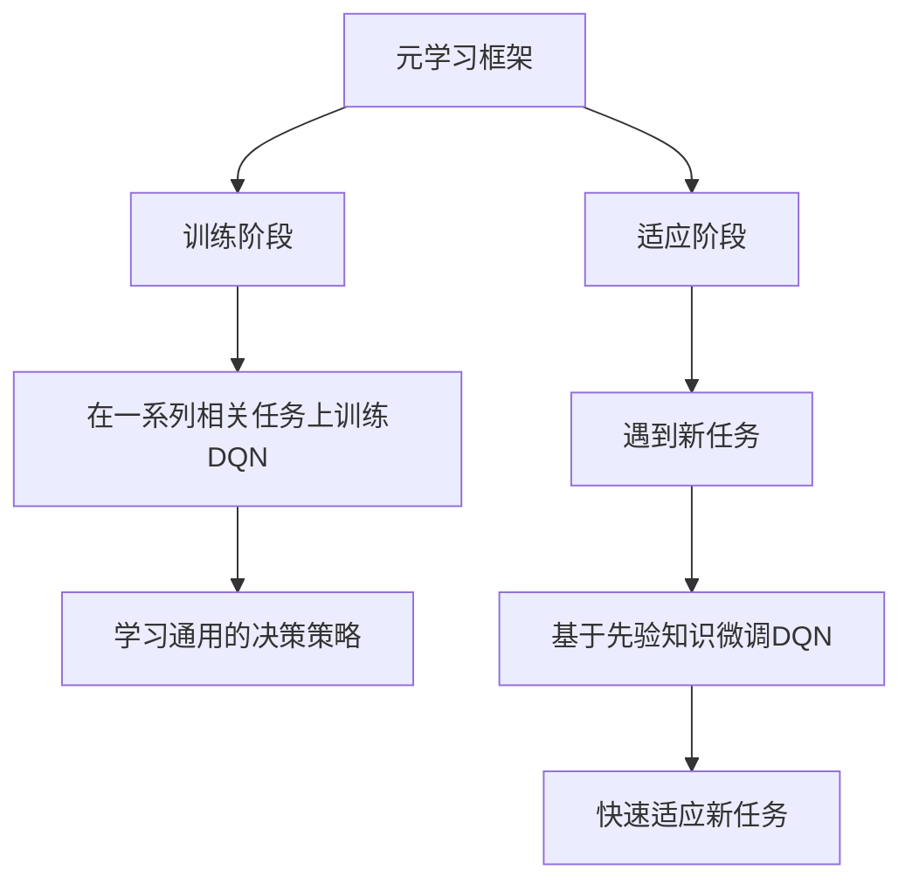

# 一切皆是映射：DQN的元学习应用：如何快速适应新任务

## 1. 背景介绍

### 1.1 问题的由来

在当今快节奏的科技发展中，智能系统需要能够快速适应新的环境和任务。传统的机器学习方法通常需要大量的数据和计算资源来训练模型,并且每次遇到新任务时都需要从头开始训练,这种方式效率低下且成本高昂。因此,如何设计一种通用的学习框架,使智能系统能够基于以前的经验快速适应新任务,成为了人工智能领域的一个重要挑战。

### 1.2 研究现状

为解决这一挑战,元学习(Meta-Learning)应运而生。元学习旨在从一系列相关任务中学习元知识,使得智能系统能够在遇到新任务时快速适应。近年来,元学习在计算机视觉、自然语言处理、强化学习等多个领域取得了令人瞩目的进展。其中,将深度强化学习与元学习相结合的方法备受关注。

### 1.3 研究意义

本文探讨了如何将深度Q网络(DQN)与元学习相结合,以实现快速适应新任务的能力。这种方法不仅可以显著减少训练新任务所需的数据和计算资源,而且能够在不同领域中广泛应用,为解决复杂的决策和控制问题提供了新的思路。

### 1.4 本文结构

本文首先介绍元学习和DQN的基本概念,然后详细阐述将二者相结合的核心算法原理和数学模型。接下来,我们将通过实际案例和代码实现,展示该方法在不同场景下的应用。最后,我们讨论了该方法的优缺点、未来发展趋势和面临的挑战。

## 2. 核心概念与联系

元学习(Meta-Learning)是一种机器学习的范式,旨在从一系列相关任务中学习元知识,使得智能系统能够在遇到新任务时快速适应。元学习可以看作是学习如何学习的过程。

深度Q网络(Deep Q-Network, DQN)是一种结合深度学习和强化学习的算法,它使用神经网络来近似Q函数,从而在复杂的环境中进行决策。DQN在许多领域取得了卓越的表现,如视频游戏、机器人控制等。

将元学习与DQN相结合,我们可以构建一种通用的学习框架,使得智能系统能够基于以前的经验快速适应新的决策任务。这种方法的核心思想是:通过在一系列相关任务上训练DQN,使其学习到一种通用的决策策略,然后在遇到新任务时,只需要进行少量的微调就可以快速适应。

这种方法的优势在于:

1. 减少了训练新任务所需的数据和计算资源,提高了效率。
2. 具有很强的泛化能力,可以应用于不同领域的决策和控制问题。
3. 利用了以前任务的经验,避免了从头开始训练的低效率。

## 3. 核心算法原理 & 具体操作步骤

### 3.1 算法原理概述

该算法分为两个阶段:训练阶段和适应阶段。

在训练阶段,我们在一系列相关任务上训练DQN,使其学习到一种通用的决策策略。这种通用策略能够捕捉不同任务之间的共性,为后续快速适应新任务奠定基础。

在适应阶段,当遇到新的任务时,我们基于之前学习到的通用策略,对DQN进行少量的微调,使其快速适应新任务的特征。这种方式避免了从头开始训练的低效率,大大减少了所需的数据和计算资源。

### 3.2 算法步骤详解

1. **任务采样**: 从任务分布$p(\mathcal{T})$中采样一系列相关任务$\{\mathcal{T}_i\}_{i=1}^N$,用于训练阶段。

2. **元训练循环**:
    a. 从当前任务$\mathcal{T}_i$中采样一批数据$\mathcal{D}_i^{tr}$,用于内循环更新。
    b. 计算损失函数$\mathcal{L}_i(\phi, \theta)$,其中$\phi$是DQN的参数,$\theta$是优化器的参数。
    c. 使用优化算法(如Adam)对$\phi$进行内循环更新:$\phi' = \phi - \alpha \nabla_{\phi}\mathcal{L}_i(\phi, \theta)$。
    d. 从$\mathcal{T}_i$中采样另一批数据$\mathcal{D}_i^{val}$,计算验证损失$\mathcal{L}_i^{val}(\phi')$。
    e. 使用元优化器(如LSTM)对$\theta$进行外循环更新:$\theta \leftarrow \theta - \beta \nabla_{\theta}\sum_i \mathcal{L}_i^{val}(\phi')$。

3. **适应阶段**:
    a. 对于新任务$\mathcal{T}_{new}$,从中采样少量数据$\mathcal{D}_{new}$。
    b. 使用经过元训练的DQN参数$\phi$和优化器参数$\theta$,在$\mathcal{D}_{new}$上进行少量步骤的微调:$\phi_{new} = \phi - \alpha \nabla_{\phi}\mathcal{L}_{new}(\phi, \theta)$。
    c. 使用微调后的DQN $\phi_{new}$解决新任务$\mathcal{T}_{new}$。

### 3.3 算法优缺点

**优点**:

1. **高效**:避免了从头开始训练的低效率,大大减少了所需的数据和计算资源。
2. **泛化能力强**:通过在多个相关任务上训练,学习到了通用的决策策略,具有很强的泛化能力。
3. **灵活性高**:可以应用于不同领域的决策和控制问题,如机器人控制、游戏AI、推荐系统等。

**缺点**:

1. **任务相关性**:该算法的性能依赖于训练任务与新任务之间的相关性。如果新任务与训练任务差异过大,可能难以取得良好的效果。
2. **超参数选择**:元学习算法涉及多个超参数,如内外循环步长、优化器选择等,需要进行大量的实验调优。
3. **计算开销**:虽然比从头训练节省了计算资源,但元学习算法本身的计算开销仍然较高。

### 3.4 算法应用领域

该算法可以应用于多个领域的决策和控制问题,包括但不限于:

- **机器人控制**: 使机器人能够快速适应新的环境和任务。
- **游戏AI**: 开发通用的游戏AI代理,能够快速学会新游戏的规则和策略。
- **推荐系统**: 根据用户的历史偏好快速生成个性化推荐。
- **对话系统**: 使对话代理能够快速适应新的对话场景和主题。
- **计算机视觉**: 快速适应新的视觉任务,如目标检测、语义分割等。

## 4. 数学模型和公式 & 详细讲解 & 举例说明

### 4.1 数学模型构建

我们将DQN与元学习相结合的数学模型可以表示为:

$$J(\theta) = \sum_{\mathcal{T}_i \sim p(\mathcal{T})} \mathbb{E}_{\mathcal{D}_i^{tr}, \mathcal{D}_i^{val}} \left[ \mathcal{L}_i^{val}\left(\phi_i' - \alpha \nabla_{\phi} \mathcal{L}_i^{tr}(\phi_i, \theta)\right) \right]$$

其中:

- $\theta$是元优化器的参数,需要被优化。
- $p(\mathcal{T})$是任务分布,从中采样训练任务$\{\mathcal{T}_i\}$。
- $\mathcal{D}_i^{tr}$和$\mathcal{D}_i^{val}$分别是任务$\mathcal{T}_i$的训练数据和验证数据。
- $\phi_i$是DQN在任务$\mathcal{T}_i$上的参数。
- $\mathcal{L}_i^{tr}(\phi_i, \theta)$是任务$\mathcal{T}_i$上的训练损失函数。
- $\mathcal{L}_i^{val}(\phi_i')$是任务$\mathcal{T}_i$上的验证损失函数,其中$\phi_i' = \phi_i - \alpha \nabla_{\phi} \mathcal{L}_i^{tr}(\phi_i, \theta)$是经过一步内循环更新后的DQN参数。

该目标函数的本质是:在一系列相关任务上,最小化DQN在验证集上的损失,从而学习到一种通用的决策策略。通过优化$\theta$,我们可以获得一个强大的元优化器,使DQN能够快速适应新任务。

### 4.2 公式推导过程

我们将DQN与元学习相结合的核心思想是:通过在一系列相关任务上训练DQN,使其学习到一种通用的决策策略,然后在遇到新任务时,只需要进行少量的微调就可以快速适应。

为了实现这一目标,我们需要构建一个合适的目标函数,使DQN在训练时不仅要在当前任务上表现良好,同时也要具有良好的泛化能力,以便快速适应新任务。

我们的出发点是:在每个任务$\mathcal{T}_i$上,我们先使用训练数据$\mathcal{D}_i^{tr}$对DQN参数$\phi_i$进行一步内循环更新,得到$\phi_i'$:

$$\phi_i' = \phi_i - \alpha \nabla_{\phi} \mathcal{L}_i^{tr}(\phi_i, \theta)$$

其中$\alpha$是内循环的步长,$\mathcal{L}_i^{tr}(\phi_i, \theta)$是任务$\mathcal{T}_i$上的训练损失函数,它不仅依赖于DQN参数$\phi_i$,也依赖于元优化器参数$\theta$。

接下来,我们希望在验证数据$\mathcal{D}_i^{val}$上,更新后的DQN参数$\phi_i'$能够取得较小的损失$\mathcal{L}_i^{val}(\phi_i')$。因此,我们可以构建如下目标函数:

$$J(\theta) = \sum_{\mathcal{T}_i \sim p(\mathcal{T})} \mathbb{E}_{\mathcal{D}_i^{tr}, \mathcal{D}_i^{val}} \left[ \mathcal{L}_i^{val}\left(\phi_i' - \alpha \nabla_{\phi} \mathcal{L}_i^{tr}(\phi_i, \theta)\right) \right]$$

通过最小化这个目标函数,我们可以获得一个强大的元优化器参数$\theta$,使得在每个任务上,DQN不仅能够在训练数据上取得良好表现,同时也具有很强的泛化能力,在验证数据上的损失也很小。

这种方式实现了我们的核心目标:在一系列相关任务上训练DQN,使其学习到一种通用的决策策略,从而在遇到新任务时,只需要进行少量的微调就可以快速适应。

### 4.3 案例分析与讲解

为了更好地理解该算法的原理和应用,我们以机器人控制任务为例进行案例分析。

假设我们需要训练一个机器人代理,使其能够在不同的环境中导航和完成特定的任务。每个环境都有自己的障碍物分布和目标位置,因此可以看作是一个独立的任务。我们的目标是:通过在多个相关环境中训练,使机器人代理学习到一种通用的导航策略,从而在遇到新环境时能够快速适应。

我们将DQN与元学习相结合的算法应用于这一问题,具体步骤如下:

1. **任务采样**: 从环境分布$p(\mathcal{E})$中采样一系列相关环境$\{\mathcal{E}_i\}_{i=1}^N$,每个环境$\mathcal{E}_i$对应一个独立的导航任务$\math