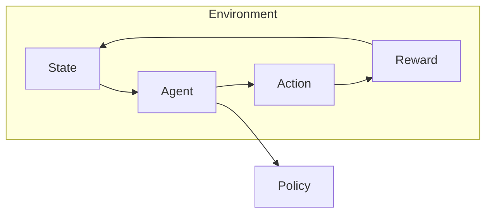
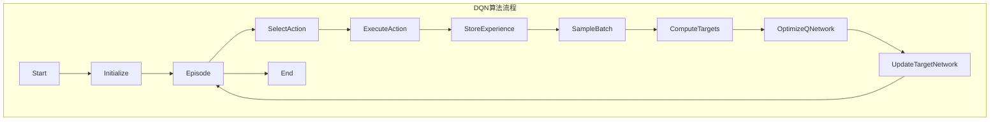

# 一切皆是映射：DQN算法的行业标准化：走向商业化应用

## 1. 背景介绍

### 1.1 问题的由来

在当今快节奏的商业环境中，企业面临着越来越多的复杂决策问题。传统的规则驱动系统和人工决策往往效率低下、成本高昂且容易出错。因此，企业迫切需要一种能够自主学习并做出明智决策的智能系统来提高效率、降低成本并提高决策质量。

深度强化学习(Deep Reinforcement Learning, DRL)作为人工智能的一个分支,近年来引起了广泛关注。它结合了深度学习的强大表示学习能力和强化学习的决策优化框架,为解决序列决策问题提供了一种全新的范式。其中,深度Q网络(Deep Q-Network, DQN)作为DRL的经典算法之一,展现出了令人惊艳的性能,在多个领域取得了突破性进展。

### 1.2 研究现状

自2013年DQN算法问世以来,学术界和工业界对其进行了广泛的研究和应用探索。DQN已经在视频游戏、机器人控制、资源调度等领域取得了卓越的成绩。然而,现有的DQN算法研究大多集中在算法本身的改进和特定场景的应用上,缺乏对DQN算法在不同行业中的标准化实践和商业化应用的深入探讨。

### 1.3 研究意义

标准化DQN算法并将其商业化应用到不同行业,将为企业带来以下重要意义:

1. **提高决策效率**:DQN算法能够自主学习并做出优化决策,大幅提高决策效率。
2. **降低决策成本**:相比于人工决策,DQN算法能够自动化决策过程,降低人力和时间成本。
3. **提高决策质量**:DQN算法能够从海量数据中学习,做出更准确、更一致的决策。
4. **实现智能自动化**:将DQN算法应用到不同场景,实现决策过程的智能自动化。

### 1.4 本文结构

本文将全面探讨DQN算法的行业标准化和商业化应用。首先介绍DQN算法的核心概念和原理,然后详细阐述算法的数学模型和实现细节。接下来,我们将通过实际案例分析DQN算法在不同行业的应用场景,并总结其未来发展趋势和面临的挑战。最后,我们将推荐相关的学习资源、开发工具和研究论文,为读者提供全方位的指导。

## 2. 核心概念与联系

在深入探讨DQN算法之前,我们需要先了解一些基本概念和相关理论。

### 2.1 强化学习

强化学习(Reinforcement Learning, RL)是机器学习的一个重要分支,它研究如何基于环境反馈来学习一个最优策略,以maximise长期累积奖励。强化学习的核心思想是通过试错学习,让智能体(Agent)与环境(Environment)进行交互,根据获得的奖励信号调整策略,最终学习到一个最优策略。



如上图所示,强化学习的基本元素包括:

- **状态(State)**: 描述当前环境的状态
- **动作(Action)**: 智能体在当前状态下可执行的操作
- **奖励(Reward)**: 环境对智能体当前动作的反馈,指导智能体朝着正确方向学习
- **策略(Policy)**: 智能体在各个状态下选择动作的策略,是强化学习需要学习的目标

强化学习的目标是找到一个最优策略,使得在该策略指导下,智能体能够获得最大的长期累积奖励。

### 2.2 Q-Learning

Q-Learning是强化学习中的一种经典算法,它通过学习一个行为价值函数(Action-Value Function)来近似最优策略。行为价值函数$Q(s,a)$表示在状态$s$下执行动作$a$,之后能获得的最大期望累积奖励。

$$Q(s,a) = \mathbb{E}\left[ \sum_{t=0}^{\infty} \gamma^t r_{t+1} \mid s_t=s, a_t=a \right]$$

其中,$\gamma$是折扣因子,用于平衡即时奖励和长期奖励的权重。Q-Learning通过不断更新$Q(s,a)$,最终收敛到最优行为价值函数$Q^*(s,a)$,从而得到最优策略$\pi^*(s) = \arg\max_a Q^*(s,a)$。

### 2.3 深度神经网络

深度神经网络(Deep Neural Network, DNN)是一种强大的机器学习模型,能够从原始数据中自动学习出有用的特征表示。DNN通过多层非线性变换,将低层次的特征映射到更高层次、更抽象的特征空间,从而捕捉数据的内在结构和模式。

```mermaid
graph LR
    subgraph DNN
        Input-->Layer1
        Layer1-->Layer2
        Layer2-->...
        ...-->LayerN
        LayerN-->Output
    end
```

DNN的关键优势在于其强大的表示学习能力,能够自动从原始数据中提取出有意义的特征,而不需要人工设计特征。这使得DNN在计算机视觉、自然语言处理等领域取得了巨大成功。

### 2.4 深度Q网络

深度Q网络(Deep Q-Network, DQN)是将深度神经网络引入到Q-Learning中,用于近似行为价值函数$Q(s,a)$。DQN的核心思想是使用一个深度神经网络$Q(s,a;\theta)$来拟合真实的$Q(s,a)$函数,其中$\theta$是网络的参数。

在DQN中,我们首先初始化一个随机的$Q(s,a;\theta)$网络,然后通过与环境交互获取一系列的$(s_t,a_t,r_t,s_{t+1})$样本,并使用这些样本对$Q$网络进行训练,使得$Q(s_t,a_t;\theta)$逼近$r_t + \gamma \max_{a'}Q(s_{t+1},a';\theta)$。经过不断迭代,网络参数$\theta$将收敛,从而得到一个近似最优的$Q^*(s,a;\theta)$函数。

DQN算法的关键创新在于将深度学习的强大表示学习能力引入到强化学习中,使得智能体能够直接从原始状态数据(如像素级视频帧)中学习出有意义的特征表示,从而大大提高了学习效率和决策质量。

## 3. 核心算法原理 & 具体操作步骤  

### 3.1 算法原理概述

DQN算法的核心思路是使用一个深度神经网络$Q(s,a;\theta)$来近似真实的行为价值函数$Q^*(s,a)$,并通过与环境交互不断优化网络参数$\theta$,使得$Q(s,a;\theta)$逼近$Q^*(s,a)$。

算法的主要流程如下:

1. 初始化一个随机的$Q(s,a;\theta)$网络和经验回放池$D$
2. 对于每一个episode:
    a) 初始化环境状态$s_0$
    b) 对于每个时间步$t$:
        - 根据$\epsilon$-贪婪策略从$Q(s_t,a;\theta)$中选择动作$a_t$
        - 执行动作$a_t$,获得奖励$r_t$和新状态$s_{t+1}$
        - 将$(s_t,a_t,r_t,s_{t+1})$存入经验回放池$D$
        - 从$D$中采样一个批次的样本$(s_j,a_j,r_j,s_{j+1})$
        - 计算目标值$y_j = r_j + \gamma \max_{a'} Q(s_{j+1},a';\theta^-)$
        - 优化$Q(s_j,a_j;\theta)$使其逼近$y_j$
    c) 更新$\theta^-$为$\theta$的固定百分比

其中,$\theta^-$是目标网络参数,用于计算目标值$y_j$,以稳定训练过程。$\epsilon$-贪婪策略用于在探索(选择目前看起来最优的动作)和利用(选择具有最高估计价值的动作)之间寻求平衡。经验回放池$D$用于存储过去的经验,打破相关性,提高数据利用效率。

通过不断优化$Q(s,a;\theta)$网络,使其输出值$Q(s,a;\theta)$逼近真实的$Q^*(s,a)$,我们最终得到一个近似最优的行为价值函数,从而可以导出最优策略$\pi^*(s) = \arg\max_a Q^*(s,a)$。



### 3.2 算法步骤详解

1. **初始化**

   - 初始化一个随机的$Q(s,a;\theta)$网络,其中$\theta$是网络的可训练参数
   - 初始化一个目标网络$Q(s,a;\theta^-)$,参数$\theta^-$复制自$\theta$
   - 初始化一个空的经验回放池$D$

2. **选择动作**

   - 根据当前状态$s_t$,从$Q(s_t,a;\theta)$中选择一个动作$a_t$
   - 使用$\epsilon$-贪婪策略在探索和利用之间寻求平衡
   - 探索:以$\epsilon$的概率随机选择一个动作
   - 利用:以$1-\epsilon$的概率选择$Q(s_t,a;\theta)$值最大的动作

3. **执行动作并存储经验**

   - 在环境中执行选择的动作$a_t$
   - 获得执行该动作后的奖励$r_t$和新状态$s_{t+1}$
   - 将$(s_t,a_t,r_t,s_{t+1})$这个经验样本存入经验回放池$D$

4. **采样批次数据**

   - 从经验回放池$D$中随机采样一个批次的经验样本$(s_j,a_j,r_j,s_{j+1})$

5. **计算目标值**

   - 对于每个样本$(s_j,a_j,r_j,s_{j+1})$,计算其目标值$y_j$:
   
   $$y_j = r_j + \gamma \max_{a'} Q(s_{j+1},a';\theta^-)$$
   
   其中,$\gamma$是折扣因子,$Q(s_{j+1},a';\theta^-)$是目标网络对新状态$s_{j+1}$下各个动作$a'$的估计值,我们取其最大值作为目标值的一部分。

6. **优化Q网络**

   - 使用均方误差损失函数:
   
   $$L(\theta) = \mathbb{E}_{(s,a,r,s')\sim D}\left[ \left(y - Q(s,a;\theta)\right)^2\right]$$
   
   - 通过梯度下降算法,优化$Q(s,a;\theta)$网络的参数$\theta$,使得$Q(s_j,a_j;\theta)$的输出值逼近目标值$y_j$

7. **更新目标网络**

   - 每隔一定步数,使用$Q$网络的参数$\theta$更新目标网络的参数$\theta^-$
   - $\theta^- \leftarrow \tau\theta + (1-\tau)\theta^-$
   - 其中$\tau$是目标网络更新率,一般取较小的值(如0.001)以保持目标网络的稳定性

8. **循环迭代**

   - 重复上述2-7步骤,进行多个episode的训练
   - 算法将不断优化$Q(s,a;\theta)$网络,使其输出值$Q(s,a;\theta)$逼近真实的$Q^*(s,a)$
   - 最终得到一个近似最优的行为价值函数$Q^*(s,a;\theta)$

通过上述迭代过程,DQN算法能够从原始状态数据中自动学习出有意义的特征表示,并优化出一个近似最优的行为价值函数$Q^*(s,a;\theta)$,从而导出最优策略$\pi^*(s) = \arg\max_a Q^*(s,a;\theta)$。

### 