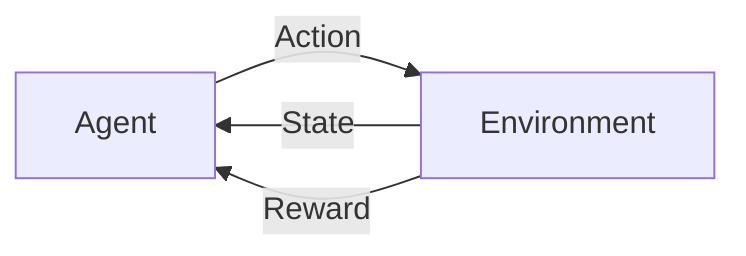

# 一切皆是映射：使用DQN解决实时决策问题：系统响应与优化

关键词：深度强化学习, DQN算法, 实时决策, 系统响应优化, 马尔可夫决策过程

## 1. 背景介绍

### 1.1  问题的由来

在许多实际应用场景中,我们经常面临需要实时做出最优决策的问题。比如无人驾驶汽车需要根据道路状况和障碍物实时决策如何操控方向盘和油门刹车;智能推荐系统需要根据用户的历史行为实时决策推荐什么商品;自动化运维系统需要根据系统负载情况实时决策如何调度资源等。这些问题的共同特点是需要在动态变化的环境中实时做出最佳决策,以优化某个长期回报。

### 1.2  研究现状

传统的解决实时决策问题的方法主要有基于规则的专家系统和运筹优化等。但它们很难应对现实世界中复杂多变的环境。近年来,深度强化学习在围棋、雅达利游戏、机器人控制等领域取得了突破性进展,为解决实时决策问题提供了新的思路。尤其是Deep Q Network (DQN)算法,通过深度神经网络拟合最优决策函数,可以直接根据高维环境状态做出最优决策,为实时决策系统的研究和应用带来了新的曙光。

### 1.3  研究意义

研究使用DQN解决实时决策问题,对于提升自动驾驶、智能推荐、资源调度等系统的性能具有重要意义。一方面,DQN可以从环境反馈中持续学习,不断优化决策策略,使系统能够适应复杂多变的真实世界。另一方面,DQN可以实现端到端的决策优化,无需人工设计规则和特征,大大降低了系统开发和维护成本。因此,深入研究DQN在实时决策领域的应用,对于推动人工智能产业发展,实现更多场景的智能化具有重要价值。

### 1.4  本文结构

本文将围绕使用DQN解决实时决策问题展开深入探讨。第2部分介绍相关的核心概念。第3部分详细讲解DQN的算法原理和实现步骤。第4部分给出DQN的数学模型和公式推导。第5部分通过代码实例和详细解读,演示如何使用DQN构建实时决策系统。第6部分分析DQN在实际应用中的典型场景。第7部分推荐相关的学习资源和开发工具。第8部分总结全文,展望DQN在实时决策领域的发展趋势和挑战。

## 2. 核心概念与联系

在探讨使用DQN解决实时决策问题之前,我们先来了解几个核心概念:

- 智能体(Agent):自主进行决策和行动的主体,如无人车、推荐系统等。
- 环境(Environment):智能体所处的外部环境,提供观测信息和反馈奖励。  
- 状态(State):环境在某一时刻的完整描述,是智能体观测到的信息。
- 行动(Action):智能体根据策略对环境做出的决策,如转向、加速等。
- 策略(Policy):智能体的决策函数,根据状态映射到行动的概率分布。
- 奖励(Reward):环境对智能体行动的即时反馈,衡量该行动的好坏。 
- 回报(Return):从当前时刻开始到未来的累积奖励,衡量长期收益。
- 值函数(Value Function):某种策略下状态(或状态-行动对)的期望回报。

这些概念环环相扣,揭示了实时决策问题的本质:如何根据观测到的状态,选择最优行动,最大化长期累积奖励。这可以用马尔可夫决策过程(MDP)来形式化描述:

在MDP框架下,实时决策问题转化为学习一个最优策略$\pi^*$,使得从任意状态$s$开始,执行该策略能获得最大期望回报:

$$\pi^*(s) = \arg\max_\pi Q^\pi(s,a)$$

其中$Q^\pi(s,a)$是在状态$s$下采取行动$a$,并继续执行策略$\pi$能获得的期望回报:

$$Q^\pi(s,a) = \mathbb{E}[R_t|s_t=s,a_t=a,\pi]$$

因此,学习最优策略的关键是准确估计最优Q函数$Q^*(s,a)$。DQN算法就是使用深度神经网络来逼近$Q^*(s,a)$,从而得到最优决策。

## 3. 核心算法原理 & 具体操作步骤

### 3.1 算法原理概述

DQN的核心思想是使用深度神经网络$Q(s,a;\theta)$来逼近最优Q函数$Q^*(s,a)$,其中$\theta$是网络参数。通过最小化TD误差,DQN可以从智能体与环境的交互数据中学习到最优Q网络,进而得到最优决策策略。

DQN主要包括以下几个关键技术:

- 经验回放(Experience Replay):将智能体的交互经验$(s_t, a_t, r_t, s_{t+1})$存入回放缓冲区,之后从中随机采样训练数据,打破了数据的相关性。

- 目标网络(Target Network):每隔一定步数将当前Q网络的参数复制给目标网络,用于计算TD目标,提高训练稳定性。

- $\epsilon$-贪心探索($\epsilon$-Greedy Exploration):在训练初期以$\epsilon$的概率随机选择行动,以1-$\epsilon$的概率采取Q值最大的行动,保证探索和利用的平衡。

- 奖励折扣(Reward Discounting):对未来的奖励进行$\gamma$折扣,平衡短期和长期回报。

- 优化算法(Optimization):使用梯度下降等优化算法最小化TD误差,更新Q网络参数。

### 3.2 算法步骤详解

下面我们详细讲解DQN算法的具体实现步骤。

1. 初始化Q网络$Q(s,a;\theta)$和目标网络$\hat{Q}(s,a;\theta^-)$,回放缓冲区$\mathcal{D}$。

2. for episode = 1 to M do
    
    1. 初始化环境状态$s_0$
    
    2. for t = 1 to T do
        1. 以$\epsilon$的概率随机选择行动$a_t$,否则选择$a_t=\arg\max_aQ(s_t,a;\theta)$
        2. 执行行动$a_t$,观测奖励$r_t$和下一状态$s_{t+1}$
        3. 将$(s_t,a_t,r_t,s_{t+1})$存入$\mathcal{D}$
        4. 从$\mathcal{D}$中随机采样一个批次的转移数据$(s_j,a_j,r_j,s_{j+1})$
        5. 计算TD目标$y_j$:
            - 若$s_{j+1}$是终止状态,则$y_j=r_j$
            - 否则$y_j=r_j+\gamma\max_{a'}\hat{Q}(s_{j+1},a';\theta^-)$
        6. 最小化TD误差:$\mathcal{L}(\theta)=\frac{1}{N}\sum_j(y_j-Q(s_j,a_j;\theta))^2$
        7. 每隔C步将Q网络参数复制给目标网络:$\theta^-\leftarrow\theta$
    3. end for
    
3. end for

其中$\epsilon$随训练进行不断衰减,M为训练的总episode数,T为每个episode的最大步数,N为批次大小,C为目标网络更新频率。

### 3.3 算法优缺点

DQN算法的主要优点有:

- 端到端学习最优策略,不需要人工设计状态特征。
- 通过深度神经网络拟合Q函数,可以处理高维连续状态空间。
- 引入经验回放和目标网络,提高了训练的稳定性和样本效率。

但DQN也存在一些局限性:

- 训练不够稳定,对超参数敏感。
- 难以应用于连续行动空间。
- 使用$\epsilon$-贪心探索,难以在探索和利用之间平衡。
- 需要大量的环境交互数据和训练时间。

后续的一些算法如Double DQN、Dueling DQN、Prioritized Replay等,在一定程度上缓解了这些问题。

### 3.4 算法应用领域

DQN算法在许多领域得到了成功应用,例如:

- 游戏AI:DQN在Atari游戏、围棋、星际争霸等游戏中达到了超人水平。
- 机器人控制:DQN可以学习机械臂、四足机器人等的运动控制策略。 
- 自动驾驶:DQN可以根据摄像头输入实时决策无人车的转向和速度控制。
- 推荐系统:DQN可以根据用户画像和上下文实时优化推荐策略。
- 资源管理:DQN可以根据系统状态实时调度计算存储等资源。

总之,只要问题能够建模为MDP,DQN就可以学习解决实时决策问题,可以说DQN是一把"万能钥匙"。

## 4. 数学模型和公式 & 详细讲解 & 举例说明

### 4.1 数学模型构建

我们使用MDP来对实时决策问题建模。一个MDP由一个六元组$\mathcal{M}=\langle\mathcal{S},\mathcal{A},\mathcal{P},\mathcal{R},\gamma \rangle$定义,其中:

- $\mathcal{S}$是有限状态集
- $\mathcal{A}$是有限行动集  
- $\mathcal{P}$是状态转移概率矩阵,$\mathcal{P}_{ss'}^a=\mathbb{P}[S_{t+1}=s'|S_t=s,A_t=a]$
- $\mathcal{R}$是奖励函数,$\mathcal{R}_s^a=\mathbb{E}[R_{t+1}|S_t=s,A_t=a]$
- $\gamma\in[0,1]$是折扣因子

MDP的解是一个策略$\pi(a|s)=\mathbb{P}[A_t=a|S_t=s]$,表示在状态s下选择行动a的概率。我们的目标是寻找一个最优策略$\pi^*$,使得从任意状态开始执行该策略,获得的期望累积奖励最大化:

$$\pi^* = \arg\max_\pi V^\pi(s), \forall s\in\mathcal{S}$$

其中$V^\pi(s)$是状态值函数,表示从状态s开始执行策略$\pi$,获得的期望回报:

$$V^\pi(s) = \mathbb{E}[\sum_{k=0}^\infty \gamma^k R_{t+k+1}|S_t=s,\pi]$$

而$Q^\pi(s,a)$是行动值函数,表示在状态s下选择行动a,并继续执行策略$\pi$,获得的期望回报:

$$Q^\pi(s,a) = \mathbb{E}[\sum_{k=0}^\infty \gamma^k R_{t+k+1}|S_t=s,A_t=a,\pi]$$

根据Bellman最优性原理,最优状态值函数$V^*(s)$和最优行动值函数$Q^*(s,a)$满足如下关系:

$$V^*(s) = \max_a Q^*(s,a)$$
$$Q^*(s,a) = \mathcal{R}_s^a + \gamma\sum_{s'\in\mathcal{S}} \mathcal{P}_{ss'}^a V^*(s')$$

因此,学习最优策略等价于学习最优Q函数。若我们知道最优Q函数,则最优策略可以直接得到:

$$\pi^*(a|s) = \arg\max_a Q^*(s,a)$$

### 4.2 公式推导过程

DQN算法的核心是使用深度神经网络$Q(s,a;\theta)$来逼近最优Q函数$Q^*(s,a)$。我们定义TD误差为:

$$\mathcal{L}(\theta) = \mathbb{E}_{(s,a,r,s')\sim\mathcal{D}}[(r+\gamma\max_{a'}Q(s',a';\theta^-) - Q(s,a;\theta))^2]$$

其中$(s,a,r,s')\sim\mathcal{D}$表示从经验回放缓冲区$\math