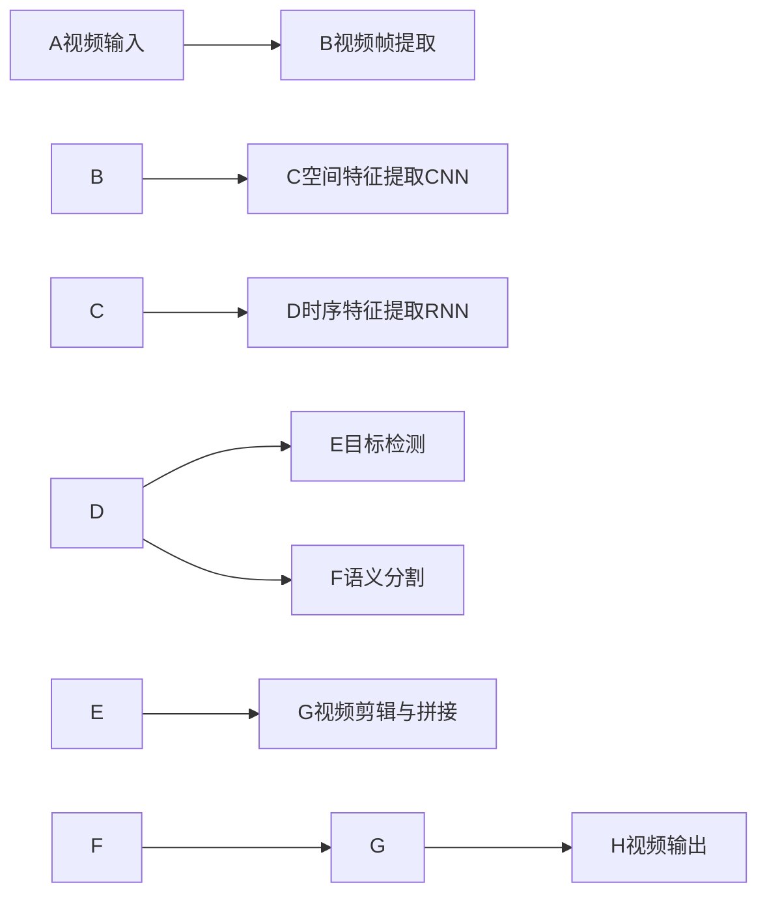

# 一切皆是映射：使用神经网络自动化视频编辑

关键词：神经网络、视频编辑、自动化、深度学习、计算机视觉、图像分割、目标检测、语义分割

## 1. 背景介绍
### 1.1  问题的由来
随着短视频平台的兴起，视频内容创作需求激增。传统的视频编辑方式耗时耗力，难以满足海量视频制作的需求。如何利用人工智能技术实现视频编辑自动化，成为了一个亟待解决的问题。
### 1.2  研究现状  
目前，利用深度学习技术进行视频编辑自动化的研究已经取得了一定进展。主要集中在视频场景理解、视频目标检测与跟踪、视频语义分割等方面。但现有方法仍然存在精度不高、泛化能力差等问题，距离实用化还有一定差距。
### 1.3  研究意义
视频编辑自动化可以大幅提高视频制作效率，降低人力成本，推动短视频行业发展。同时对于视频监控、自动驾驶等领域也有重要应用价值。因此，探索利用神经网络实现视频编辑自动化具有重要的理论意义和实践价值。
### 1.4  本文结构
本文将首先介绍视频编辑自动化涉及的核心概念，然后重点阐述基于神经网络的视频编辑自动化算法原理，并给出具体实现步骤。接着通过数学模型推导和案例分析加深理解。最后，介绍算法在实际项目中的应用，并总结全文，展望未来发展方向。

## 2. 核心概念与联系
视频编辑自动化涉及计算机视觉、深度学习等多个领域的核心概念：

- 计算机视觉：研究如何使计算机具备类似人眼的视觉能力，从图像或视频中提取信息，理解其内容。是视频编辑自动化的理论基础。
- 深度学习：通过构建多层神经网络，从海量数据中学习层次化的特征表示，是当前计算机视觉的主流方法。
- 卷积神经网络（CNN）：一种专门用于处理网格拓扑结构数据（如图像）的神经网络。通过局部连接和权值共享，能有效提取图像特征。
- 循环神经网络（RNN）：一种适合处理序列数据的神经网络。通过在网络中引入循环连接，保留历史信息的记忆，能够建模视频中的时序特征。  
- 图像分类：对输入图像进行类别预测。是视频场景理解的基础。
- 目标检测：在图像中定位并识别出感兴趣的目标物体。用于视频中的人物、物体定位。
- 语义分割：对图像中的每个像素进行类别标注。可用于视频前景背景分离。
- 目标跟踪：在视频序列中持续定位被跟踪目标。是实现视频剪辑、拼接等功能的关键。

这些概念环环相扣，共同构成了视频编辑自动化的技术基础。在实际应用中，往往需要将它们有机结合，形成完整的解决方案。

## 3. 核心算法原理 & 具体操作步骤 
### 3.1 算法原理概述
本文采用的视频编辑自动化算法，是将CNN和RNN相结合的端到端神经网络框架。其主要思路是：

1. 利用CNN提取视频帧的空间特征
2. 利用RNN对空间特征序列进行时序建模  
3. 在特征图上进行目标检测、语义分割等处理
4. 根据处理结果，对视频进行自动剪辑、拼接，生成新的视频

算法流程如下图所示：

### 3.2 算法步骤详解

1. 视频帧提取：将输入视频解码，按固定间隔提取关键帧，形成帧序列。

2. 空间特征提取：使用预训练的CNN模型，如ResNet、Inception等，对每一帧提取空间特征。提取到的特征一般是向量或特征图的形式。

3. 时序特征提取：将每帧的空间特征构成特征序列，输入到RNN中进行时序建模。常用的RNN变体有LSTM、GRU等。RNN能够捕捉视频中的时间依赖关系和动态信息。

4. 目标检测：在RNN输出的特征基础上，通过回归器预测视频中人物、物体的边界框位置，并判断其所属类别。常见的算法有Faster R-CNN、YOLO、SSD等。

5. 语义分割：对RNN输出的特征图进行像素级分类，预测每个像素所属的语义类别。一般采用FCN、U-Net等全卷积网络结构。语义分割可以实现视频的前景背景分离。

6. 视频剪辑与拼接：根据目标检测和语义分割的结果，自动提取视频中的关键片段，并按照一定规则进行剪辑与拼接，生成新的视频。

7. 输出结果：将生成的新视频进行编码，输出最终结果。

### 3.3 算法优缺点

优点：
- 端到端的处理方式，直接从原始视频生成编辑结果，避免了复杂的人工操作。  
- 利用深度学习技术，具有强大的特征提取和语义理解能力，能处理复杂场景。
- 通过引入RNN，能够建模视频的时序特征，捕捉动态信息。

缺点：
- 对训练数据的依赖性强，需要大量高质量的标注数据，获取成本高。
- 计算复杂度高，对硬件要求高，训练和推理都比较耗时。  
- 模型泛化能力有限，在新场景下的适应性有待提高。
  
### 3.4 算法应用领域

- 自动视频摘要：从长视频中自动提取精华片段，生成预览或简介。
- 视频特效：自动抠像、背景替换、画面风格化等特效处理。
- 视频监控分析：自动检测视频中的异常行为和特定事件。
- 自动驾驶：对车载视频进行实时理解，辅助决策和控制。

## 4. 数学模型和公式 & 详细讲解 & 举例说明
### 4.1 数学模型构建
设输入视频为$\mathcal{V}$，由$n$个帧组成，每帧大小为$h\times w$。则$\mathcal{V}$可表示为：

$$\mathcal{V}=\left\{I_1,\dots,I_n \right\}, I_i \in \mathbb{R}^{h\times w\times 3}$$

CNN提取的空间特征序列为$\left\{f_1,\dots,f_n \right\}$，其中$f_i \in \mathbb{R}^{d}$为第$i$帧的$d$维特征向量。

将特征序列输入RNN，令$x_i=f_i$，则RNN的前向传播过程为：

$$h_i=\sigma\left(W_{ih}x_i+b_{ih}+W_{hh}h_{i-1}+b_{hh}\right)$$

其中$h_i \in \mathbb{R}^{m}$是第$i$个时间步的隐藏状态，$m$为隐藏单元数。$W_{ih},W_{hh}$分别是输入到隐藏层和隐藏层到隐藏层的权重矩阵，$b_{ih},b_{hh}$为对应的偏置项。$\sigma$为激活函数，通常选择tanh或ReLU。

对于目标检测任务，需要在$h_i$的基础上预测边界框位置$\left(x_i,y_i,w_i,h_i\right)$和类别概率$\mathbf{p}_i$。采用线性回归器和softmax分类器：

$$\begin{aligned}
\left(x_i,y_i,w_i,h_i\right)&=W_{loc}h_i+b_{loc}\\
\mathbf{p}_i&=\mathrm{softmax}\left(W_{cls}h_i+b_{cls}\right)
\end{aligned}$$

对于语义分割任务，需要将$h_i$解码为与输入尺寸相同的特征图$S_i \in \mathbb{R}^{h\times w\times c}$，$c$为语义类别数。采用FCN进行上采样：

$$S_i=\mathrm{FCN}\left(h_i\right)$$

最后，根据预测结果对视频进行剪辑拼接，得到输出视频$\mathcal{V}'$。

### 4.2 公式推导过程
以目标检测任务的损失函数为例，推导训练过程中的反向传播公式。

目标检测的损失函数一般由两部分组成：位置损失$L_{loc}$和分类损失$L_{cls}$。

位置损失采用Smooth L1函数：

$$L_{loc}=\sum_{i=1}^{n}\sum_{j=1}^{k}\mathrm{Smooth}_{L1}\left(l_i^j-\hat{l}_i^j\right)$$

其中$l_i^j=\left(x_i^j,y_i^j,w_i^j,h_i^j\right)$是第$i$帧中第$j$个预测框的位置参数，$\hat{l}_i^j$是对应的真实标注框位置。$\mathrm{Smooth}_{L1}$函数定义为：

$$\mathrm{Smooth}_{L1}(x)=\begin{cases}
0.5x^2& \text{if }|x|<1\\
|x|-0.5& \text{otherwise}
\end{cases}$$

分类损失采用交叉熵函数：

$$L_{cls}=-\sum_{i=1}^{n}\sum_{j=1}^{k}\log p\left(c_i^j|\mathbf{p}_i^j\right)$$

其中$c_i^j$是第$i$帧中第$j$个预测框的真实类别标签，$p\left(c_i^j|\mathbf{p}_i^j\right)$是模型预测的概率。

总的损失为两部分之和：

$$L=L_{loc}+\lambda L_{cls}$$

$\lambda$为平衡系数，控制两种损失的权重。

在反向传播时，需要计算损失函数对各个参数的梯度。以$W_{loc}$为例，采用链式法则：

$$\frac{\partial L}{\partial W_{loc}}=\sum_{i=1}^{n}\frac{\partial L_{loc}}{\partial l_i}\frac{\partial l_i}{\partial W_{loc}}$$

其中$\frac{\partial L_{loc}}{\partial l_i}$根据Smooth L1函数的定义进行计算，$\frac{\partial l_i}{\partial W_{loc}}=h_i^T$。

类似地，可以推导出其他参数的梯度公式，利用梯度下降法进行优化，不断更新模型参数，最小化损失函数。

### 4.3 案例分析与讲解

以一段体育赛事视频的自动剪辑为例，说明算法的应用过程。

输入一段5分钟的足球比赛视频，目标是自动生成一个1分钟的精彩剪辑。

首先，对视频进行预处理，提取关键帧，送入CNN提取空间特征。然后用RNN对特征序列进行时序建模。

接着，在RNN的输出上进行目标检测和语义分割。目标检测识别出视频中的球员、足球等目标，并标注出它们的位置。语义分割将画面分割为场地、观众、广告牌等不同语义区域。

根据检测和分割结果，设计剪辑规则。例如，可以提取出包含关键事件（如进球、射门、角球等）的片段，以及特写球员表情、动作的镜头。再考虑画面的语义信息，尽量选取场地区域占主体、背景干净的片段。

最后，将提取出的精彩片段按照时间顺序拼接，并添加转场效果，生成最终的1分钟剪辑视频。

通过这个案例，可以看出，算法需要在不同层次提取视频的语义信息，并根据语义设计剪辑逻辑。这需要模型具备对视频内容的深层理解能力。

### 4.4 常见问题解答

问：视频编辑自动化的核心难点是什么？

答：主要难点在于视频语义理解。与图像不同，视频具有时序性，包含更加复杂的语义内容。要实