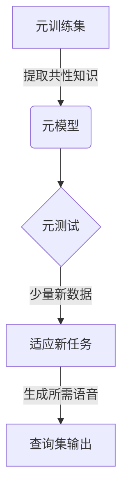

以下是对《一切皆是映射：基于元学习改进语音合成系统》这一主题的技术博客文章正文。

# 一切皆是映射：基于元学习改进语音合成系统

## 1. 背景介绍

### 1.1 问题的由来

语音合成技术已经存在了几十年,但生成自然流畅的语音仍然是一个巨大的挑战。传统的统计参数语音合成方法虽然可以生成相对平滑的语音,但往往缺乏自然感和多样性。近年来,随着深度学习技术的发展,基于神经网络的端到端语音合成模型取得了长足进步,能够生成更加自然流畅的语音。然而,这些模型通常需要大量高质量的训练数据,并且难以泛化到看不见的领域。

### 1.2 研究现状  

为了解决上述问题,研究人员提出了元学习(Meta-Learning)的概念,旨在开发能够快速适应新领域的通用模型。元学习算法通过在多个相关任务上训练,学习提取任务之间的共性知识,从而加快在新任务上的适应过程。最近,元学习已成功应用于计算机视觉、自然语言处理等多个领域,取得了令人鼓舞的成果。

### 1.3 研究意义

将元学习思想引入语音合成领域,有望开发出能够快速适应不同声音、语言、说话风格的通用语音合成模型。这不仅能极大减少标注语音数据的工作量,还能生成多样化、个性化的语音输出,满足不同场景的需求。本文将介绍如何将元学习应用于语音合成任务,并分享相关算法细节和实践经验。

### 1.4 本文结构  

本文首先介绍元学习在语音合成中的应用场景和挑战,然后阐述核心算法原理,包括模型结构、损失函数设计和训练策略等。接下来,我们将深入探讨算法的数学模型,并通过实例讲解公式推导过程。在此基础上,我们将分享基于PyTorch的代码实现细节,并展示实际运行结果。最后,我们将总结该技术的应用前景,并对未来的发展方向进行展望。

## 2. 核心概念与联系

元学习(Meta-Learning)旨在开发能够快速适应新任务的通用模型。在语音合成领域,我们希望训练出一个元模型(Meta-Model),使其能够通过少量新数据快速生成所需风格的语音。这个过程可以概括为两个阶段:

1. **元训练(Meta-Training)**: 在这个阶段,模型在多个不同的语音数据集(元训练集)上训练,学习提取任务之间的共性知识。

2. **元测试(Meta-Testing)**: 给定一个新的语音数据集(元测试集),模型需要基于少量新数据(支持集)快速适应,并在剩余数据(查询集)上生成所需风格的语音。

这个过程类似于人类学习新知识的方式。我们通过大量实例积累了语音模式的一般知识,当遇到新的说话风格时,只需少量示例就能快速适应。元学习算法的关键在于,如何在元训练阶段学习一个有效的初始化模型,使其能够在元测试阶段快速适应新任务。

## 3. 核心算法原理 & 具体操作步骤  

### 3.1 算法原理概述

我们采用基于模型微调(Model-Agnostic Meta-Learning, MAML)的元学习算法,它是一种广泛使用的元学习框架。MAML的核心思想是:在元训练阶段,通过一种特殊的优化方式,学习一个有效的模型初始化,使得该模型在元测试阶段只需少量梯度更新步骤,就能快速适应新任务。

具体来说,在每个元训练迭代中,我们从元训练集中采样一批任务。对于每个任务,我们将模型分成两部分:一部分用于快速适应(内循环),另一部分用于预测(外循环)。我们先在支持集上通过梯度下降对内循环模型进行几步更新,得到适应后的模型。然后,将适应后的模型在查询集上进行评估,并根据评估损失对外循环模型的参数进行更新。通过这种优化方式,外循环模型将学习到一个能够快速适应新任务的有效初始化。

在元测试阶段,我们从新的语音数据集中采样支持集和查询集。首先,将预先训练的元模型在支持集上进行几步梯度更新,得到适应后的模型。然后,使用适应后的模型在查询集上生成所需风格的语音。

### 3.2 算法步骤详解

1. **采样任务批次**:从元训练集中随机采样一批任务,每个任务包含一个支持集和一个查询集。

2. **内循环适应**:对于每个任务,将模型分为适应模型(内循环)和预测模型(外循环)两部分。在支持集上,通过梯度下降对适应模型进行 $K$ 步参数更新,得到适应后的模型 $\phi'$:

$$\phi' = \phi - \alpha \nabla_{\phi} \mathcal{L}_\text{support}(\phi)$$

其中 $\alpha$ 为内循环学习率, $\mathcal{L}_\text{support}$ 为支持集上的损失函数。

3. **外循环更新**:使用适应后的模型 $\phi'$ 在查询集上进行预测,计算查询集损失 $\mathcal{L}_\text{query}(\phi')$。对所有任务的查询集损失求平均,得到元批损失 $\mathcal{L}_\text{meta}$。通过对 $\mathcal{L}_\text{meta}$ 进行反向传播,更新预测模型的参数 $\phi$:

$$\phi \leftarrow \phi - \beta \nabla_\phi \mathcal{L}_\text{meta}(\phi)$$

其中 $\beta$ 为外循环学习率。

4. **重复训练**:重复步骤1-3,直到模型收敛。

在元测试阶段,我们首先从新的语音数据集中采样支持集和查询集。然后,将预训练的元模型在支持集上进行 $K$ 步梯度更新,得到适应后的模型。最后,使用适应后的模型在查询集上进行语音合成。

### 3.3 算法优缺点

**优点**:

- 能够快速适应新的语音数据,减少了标注工作量。
- 生成的语音具有多样性,可以适应不同场景需求。
- 通过在多个任务上训练,模型学习到了通用的语音模式知识。

**缺点**:

- 需要大量计算资源进行元训练。
- 元测试阶段的适应过程可能不够稳定。
- 难以处理过于分散的语音数据分布。

### 3.4 算法应用领域

基于元学习的语音合成技术可以应用于以下场景:

- 个性化语音助手:快速生成符合用户口音和说话风格的语音输出。
- 多语种语音合成:使用少量新语言数据即可生成多种语言的语音。
- 语音转换:将一种声音转换为其他声音。
- 有限数据语音合成:针对小语料数据集,生成高质量语音输出。

## 4. 数学模型和公式 & 详细讲解 & 举例说明

### 4.1 数学模型构建

我们将语音合成建模为一个序列到序列(Seq2Seq)的生成任务。给定一个文本序列 $\mathbf{x} = (x_1, x_2, \dots, x_T)$,目标是生成一个对应的语音序列 $\mathbf{y} = (y_1, y_2, \dots, y_{T'})$。

我们采用基于注意力(Attention)的Seq2Seq模型,使用编码器(Encoder)将文本序列编码为上下文向量序列 $\mathbf{c} = (c_1, c_2, \dots, c_T)$,再使用解码器(Decoder)逐步生成语音序列。具体来说,在每个时间步 $t$,解码器根据上一步输出 $y_{t-1}$、编码器上下文向量 $c_t$ 以及当前隐状态 $s_t$,计算出生成下一个音素的概率分布:

$$P(y_t | y_{<t}, \mathbf{x}) = \text{Decoder}(y_{t-1}, s_t, c_t)$$

通过最大化生成序列的条件对数似然,我们可以得到模型的训练目标函数:

$$\mathcal{L}(\theta) = -\sum_{\mathbf{x}, \mathbf{y}} \log P_\theta(\mathbf{y} | \mathbf{x})$$

其中 $\theta$ 为模型参数。

在元学习框架下,我们将整个Seq2Seq模型分为适应模型(内循环)和预测模型(外循环)两部分。适应模型包含编码器和解码器的部分参数,在元训练阶段通过支持集进行少量步骤的梯度更新,以快速适应新任务。预测模型包含剩余参数,在外循环中通过查询集损失进行更新,以学习一个有效的模型初始化。

### 4.2 公式推导过程

我们将在元训练阶段,对适应模型(内循环)和预测模型(外循环)分别进行参数更新。具体推导过程如下:

1. **内循环更新(适应模型)**:

对于每个任务的支持集 $\mathcal{D}_\text{support}$,我们将适应模型的参数 $\phi$ 在支持集损失 $\mathcal{L}_\text{support}$ 上进行 $K$ 步梯度更新:

$$\phi'_0 = \phi$$
$$\phi'_k = \phi'_{k-1} - \alpha \nabla_{\phi'_{k-1}} \mathcal{L}_\text{support}(\phi'_{k-1}), \quad k=1,2,\dots,K$$

其中 $\alpha$ 为内循环学习率。经过 $K$ 步更新后,我们得到适应后的模型参数 $\phi'_K$。

2. **外循环更新(预测模型)**:

我们使用适应后的模型参数 $\phi'_K$ 在查询集 $\mathcal{D}_\text{query}$ 上进行预测,计算查询集损失:

$$\mathcal{L}_\text{query}(\phi'_K) = -\sum_{(\mathbf{x}, \mathbf{y}) \in \mathcal{D}_\text{query}} \log P_{\phi'_K}(\mathbf{y} | \mathbf{x})$$

对于一个任务批次中的所有任务,我们计算平均查询集损失作为元批损失:

$$\mathcal{L}_\text{meta}(\phi) = \sum_{\mathcal{T}_i \sim p(\mathcal{T})} \mathcal{L}_\text{query}(\phi'_K(\phi, \mathcal{T}_i))$$

其中 $\mathcal{T}_i$ 表示第 $i$ 个任务,包含支持集和查询集。

最后,我们对元批损失 $\mathcal{L}_\text{meta}$ 进行反向传播,更新预测模型参数 $\phi$:

$$\phi \leftarrow \phi - \beta \nabla_\phi \mathcal{L}_\text{meta}(\phi)$$

其中 $\beta$ 为外循环学习率。通过这种优化方式,预测模型将学习到一个能够快速适应新任务的有效初始化。

### 4.3 案例分析与讲解

为了更好地理解上述算法,我们将通过一个具体案例进行讲解。假设我们的元训练集包含三种不同声音(男声、女声和儿童声)的语音数据,每种声音包含一个支持集和一个查询集。

在某次元训练迭代中,我们从这三个任务中随机采样一个任务批次,假设采样到的是男声任务。我们首先将预测模型的参数 $\phi$ 复制到适应模型,得到 $\phi'_0 = \phi$。然后,在男声支持集上,对适应模型进行 $K=5$ 步梯度更新:

$$\phi'_1 = \phi'_0 - \alpha \nabla_{\phi'_0} \mathcal{L}_\text{support}^{\text{male}}(\phi'_0)$$
$$\phi'_2 = \phi'_1 - \alpha \nabla_