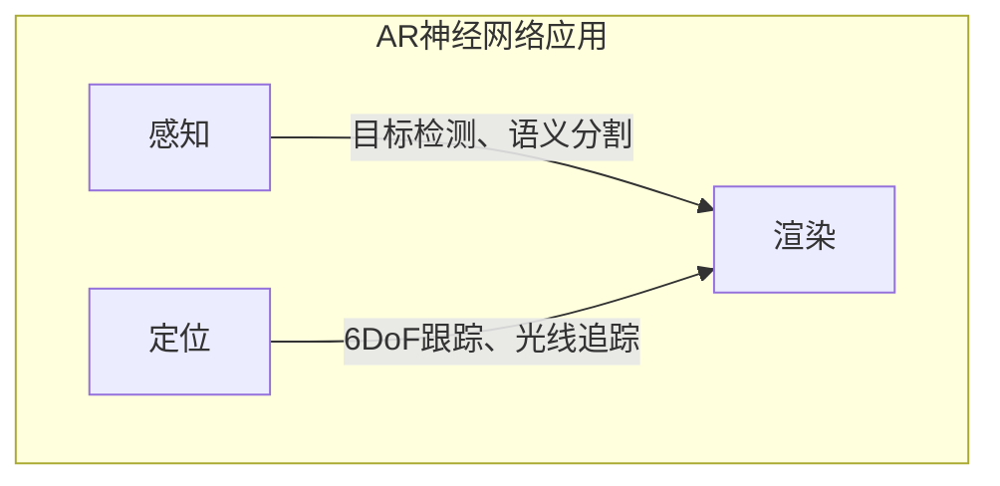

以下是题为《一切皆是映射：增强现实(AR)中的神经网络应用》的技术博客文章正文内容：

# 一切皆是映射：增强现实(AR)中的神经网络应用

## 1. 背景介绍

### 1.1 问题的由来

在当今时代，现实世界与数字世界之间的界限正在逐渐模糊。增强现实(Augmented Reality, AR)技术应运而生，旨在将数字信息与现实环境无缝融合，为用户带来身临其境的沉浸式体验。然而,要实现高质量的AR体验,需要准确地将虚拟元素映射到现实世界中,这对计算机视觉和深度学习算法提出了巨大挑战。

### 1.2 研究现状 

传统的计算机视觉算法往往依赖于手工设计的特征提取器和分类器,难以应对复杂多变的现实场景。而近年来,凭借强大的模式识别和非线性拟合能力,神经网络在计算机视觉领域取得了令人瞩目的成就,推动了AR技术的飞速发展。

### 1.3 研究意义

神经网络在AR中的应用不仅能够提高目标检测、语义分割等关键任务的精度,还可以实现高质量的6DoF(六自由度)位置跟踪、光线追踪等高级功能,为用户带来无缝沉浸的AR体验。本文将深入探讨神经网络在AR中的核心理论和实践应用,为读者提供全面的技术视角。

### 1.4 本文结构

本文首先介绍AR中神经网络应用的背景和现状,接着深入剖析核心概念、算法原理和数学模型,并通过实例项目、应用场景和工具资源推荐,为读者提供实践指导。最后,本文总结了未来发展趋势和面临的挑战,期望能为读者带来启发和思考。

## 2. 核心概念与联系

增强现实(AR)技术的核心目标是将虚拟元素与现实世界融合,为此需要解决以下三个关键问题:

1. **感知(Perception)**:准确感知和理解周围环境,包括目标检测、语义分割等。
2. **定位(Localization)**:精确定位摄像机和物体在三维空间中的位置和姿态。 
3. **渲染(Rendering)**:基于感知和定位结果,将虚拟元素自然地渲染到现实场景中。

神经网络在上述三个方面均有广泛应用,成为AR技术不可或缺的核心支撑。



接下来,我们将逐一深入探讨神经网络在感知、定位和渲染领域的具体应用。

## 3. 核心算法原理 & 具体操作步骤

### 3.1 算法原理概述

神经网络在AR领域的应用主要基于两大核心算法:卷积神经网络(Convolutional Neural Networks, CNNs)和递归神经网络(Recurrent Neural Networks, RNNs)。

- **卷积神经网络(CNNs)**:擅长处理网格状数据(如图像),能够自动学习视觉特征,常用于目标检测、语义分割等计算机视觉任务。
- **递归神经网络(RNNs)**:擅长处理序列数据,能够建模时序信息,常用于6DoF位置跟踪、光线追踪等任务。

此外,生成对抗网络(Generative Adversarial Networks, GANs)、变分自编码器(Variational Autoencoders, VAEs)等新兴模型也逐渐在AR领域展现应用潜力。

### 3.2 算法步骤详解

以目标检测任务为例,我们可以使用基于CNN的目标检测算法(如Faster R-CNN、YOLO等)在AR场景中识别感兴趣的目标。算法步骤如下:

1. **数据预处理**:将输入图像调整大小,进行归一化等预处理操作。
2. **特征提取**:输入图像经过CNN的卷积层和池化层,提取出多尺度特征图。
3. **建议区域生成**:在特征图上滑动窗口或使用先验锚框,生成多个建议区域。
4. **区域特征提取**:对每个建议区域提取对应的特征向量。
5. **分类和回归**:将每个区域的特征向量输入全连接层,进行目标分类和边界框回归。
6. **非极大值抑制**:去除重叠的冗余检测框,输出最终检测结果。

上述步骤可通过端到端训练的方式,使CNN自动学习最优的特征表示和分类回归模型。

### 3.3 算法优缺点

基于深度学习的AR算法具有以下优缺点:

**优点**:
- 强大的特征学习能力,无需手工设计特征提取器。
- 端到端训练,能够自动优化整个系统的性能。
- 通用性强,可应用于多种AR任务(检测、分割、跟踪等)。

**缺点**:  
- 需要大量标注数据进行训练,获取数据成本较高。
- 模型训练和推理过程计算量大,对硬件要求较高。
- 存在"黑盒"问题,模型内部机理较难解释。

### 3.4 算法应用领域

神经网络在AR领域的应用主要包括以下几个方面:

1. **目标检测与语义分割**:检测和识别AR场景中的目标,为渲染虚拟元素奠定基础。
2. **6DoF位置跟踪**:精确估计摄像机在三维空间中的位姿,实现虚实对齐。
3. **光线追踪**:基于神经网络的差分渲染,提高光线追踪的效率和质量。
4. **虚拟试衣间**:通过语义分割和人体姿态估计,实现虚拟试衣等沉浸式体验。
5. **导航和路径规划**:结合深度学习和SLAM技术,实现AR导航和机器人路径规划。

## 4. 数学模型和公式 & 详细讲解 & 举例说明  

### 4.1 数学模型构建

神经网络本质上是一种数学模型,通过非线性变换对输入数据进行建模和预测。以卷积神经网络为例,其数学模型可表示为:

$$
y = f(W * x + b)
$$

其中:
- $x$为输入数据(如图像)
- $W$为卷积核权重
- $b$为偏置项
- $*$为卷积操作
- $f$为非线性激活函数(如ReLU)

通过训练,CNN可以学习到最优的权重$W$和偏置$b$,使得输出$y$能够很好地拟合训练数据。

### 4.2 公式推导过程

我们以反向传播算法为例,推导CNN模型的训练过程。

假设损失函数为$L(y, \hat{y})$,其中$y$为真实标签,$\hat{y}$为模型预测输出。根据链式法则,损失函数对权重$W$的梯度为:

$$
\frac{\partial L}{\partial W} = \frac{\partial L}{\partial \hat{y}} \cdot \frac{\partial \hat{y}}{\partial W}
$$

其中:

$$
\frac{\partial \hat{y}}{\partial W} = f'(W*x+b) * x
$$

通过计算梯度,我们可以使用优化算法(如SGD)迭代更新权重$W$,最小化损失函数$L$,从而获得最优模型。

### 4.3 案例分析与讲解

以6DoF位置跟踪任务为例,我们可以使用基于RNN的模型(如LSTM)估计摄像机在三维空间中的位姿。

假设输入为一系列图像帧$\{I_1, I_2, \cdots, I_t\}$,我们的目标是估计当前时刻$t$的相机位姿$P_t$。LSTM模型可以表示为:

$$
h_t = \text{LSTM}(h_{t-1}, f_\theta(I_t))
$$
$$
P_t = g_\phi(h_t)
$$

其中:
- $f_\theta$为CNN编码器,提取图像特征
- $h_t$为LSTM隐状态,编码历史信息
- $g_\phi$为全连接层,输出位姿估计

通过训练,LSTM可以学习到图像序列与位姿变化之间的映射关系,实现精确的6DoF跟踪。

### 4.4 常见问题解答

**Q:** 神经网络模型如何处理不同分辨率的输入图像?

**A:** 通常采用数据增广(Data Augmentation)的方式,对输入图像进行随机缩放、裁剪等变换,使模型具有一定的尺度不变性。此外,使用多尺度特征金字塔(Feature Pyramid)等技术也可以提高模型对不同分辨率输入的适应能力。

**Q:** 如何提高神经网络在AR场景中的鲁棒性?

**A:** 可以采取以下策略:
1) 增加训练数据的多样性,包括不同光照、遮挡、背景等情况。
2) 使用数据合成技术(如域渲染、风格迁移等)生成大量合成数据。
3) 引入注意力机制、上下文建模等技术,提高模型对复杂场景的适应能力。

## 5. 项目实践:代码实例和详细解释说明

### 5.1 开发环境搭建

我们将使用PyTorch作为深度学习框架,并基于开源库MMDetection实现目标检测任务。具体环境配置如下:

1. 安装PyTorch及相关依赖库
2. 克隆MMDetection代码库:`git clone https://github.com/open-mmlab/mmdetection.git`
3. 安装MMDetection:`cd mmdetection && pip install -e .`  
4. 下载COCO数据集并进行预处理

### 5.2 源代码详细实现

我们以Faster R-CNN为例,实现AR场景中的目标检测。核心代码位于`mmdetection/models/detectors/faster_rcnn.py`。

```python
import torch.nn as nn
import mmcv

from ..registry import DETECTORS
from .single_stage import SingleStageDetector

@DETECTORS.register_module
class FasterRCNN(SingleStageDetector):

    def __init__(self,
                 backbone,
                 rpn_head,
                 bbox_roi_extractor,
                 bbox_head,
                 train_cfg,
                 test_cfg,
                 neck=None,
                 shared_head=None,
                 pretrained=None):
        super(FasterRCNN, self).__init__(backbone, neck, shared_head, rpn_head, bbox_roi_extractor, bbox_head, train_cfg, test_cfg, pretrained)
        
    # 前向传播过程
    def forward_train(self, ...):
        ...

    def forward_test(self, ...):
        ...
        
    # 网络权重初始化    
    def init_weights(self, ...):
        ...
        
    # 训练器和测试器
    def train_step(self, ...):
        ...
        
    def val_step(self, ...):
        ...
```

上述代码展示了Faster R-CNN的核心组件,包括骨干网络(backbone)、区域建议网络(RPN)、ROIPooling层、预测头(head)等。通过配置文件可以方便地定制模型结构和超参数。

### 5.3 代码解读与分析  

我们对`forward_train`函数进行详细分析:

```python
def forward_train(self,
                  img,
                  img_metas,
                  gt_bboxes,
                  gt_labels,
                  gt_bboxes_ignore=None,
                  gt_masks=None,
                  proposals=None,
                  **kwargs):
    # 提取图像特征
    x = self.extract_feat(img)
    
    # RPN生成建议框
    proposal_list = self.rpn_head.forward_train(x, img_metas, gt_bboxes)
    
    # ROIPooling提取区域特征
    rois = bbox2roi([proposal.bbox for proposal in proposal_list])
    roi_feats = self.bbox_roi_extractor(x[:self.bbox_roi_extractor.num_inputs], rois)
    
    # 预测目标类别和边界框
    cls_score, bbox_pred = self.bbox_head(roi_feats)
    
    # 计算损失并反向传播
    losses = self.bbox_head.loss(cls_score, bbox_pred, ...)
    return losses
```

上述代码实现了Faster R-CNN的前向传播和损失计算过程。首先提取图像特征,然后通过RPN生成建议框,接着使用ROIPooling提取区域特征,最后通过预测头输出目标类别和边界框。在训练阶段,会