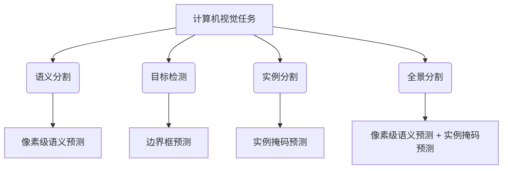
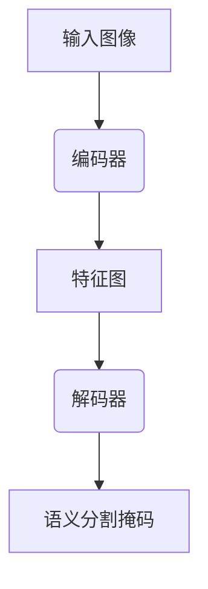
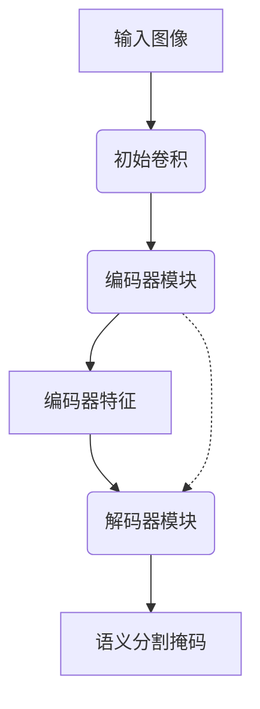
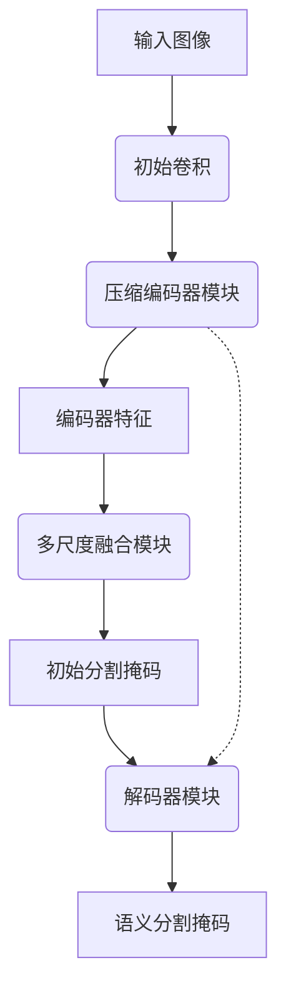

这是一个很有趣且极具挑战性的话题。让我们一起深入探讨实时语义分割和神经网络的最新进展。

# 一切皆是映射：实时语义分割与神经网络的进展

## 1. 背景介绍

### 1.1 问题的由来

在计算机视觉领域,语义分割是一项基础且极具挑战性的任务。它旨在将图像中的每个像素与一个预定义的类别相关联,从而实现对图像内容的精细理解。传统的语义分割方法主要基于手工设计的特征提取和分类器,但这种方法往往缺乏泛化能力,且难以处理复杂场景。

随着深度学习的兴起,基于卷积神经网络(CNN)的语义分割方法取得了巨大进展。然而,大多数现有方法都是在离线设置下进行训练和测试的,这使得它们难以满足实时应用的需求,如自动驾驶、增强现实(AR)等。实时语义分割面临着如何在保证精度的同时,实现高效的计算和低延迟的挑战。

### 1.2 研究现状  

近年来,研究人员致力于设计高效、轻量级的神经网络模型,以满足实时语义分割的需求。一些突破性工作包括:

- ENet [1]: 一种高效、紧凑的编码器-解码器架构,能够在低功耗设备上实现实时语义分割。
- ERFNet [2]: 利用残差因子单元和高效率编码器-解码器架构,在保持高精度的同时,大幅降低了计算复杂度。
- ICNet [3]: 通过多尺度融合和压缩编码器模块,实现了高效、准确的实时语义分割。

然而,这些方法在精度和效率之间仍存在折衷。另一方面,一些最新工作探索了利用神经架构搜索(NAS)自动设计高效神经网络的可能性,但这通常需要大量的计算资源。

### 1.3 研究意义

实时语义分割在许多实际应用中扮演着关键角色,如自动驾驶、增强现实、机器人导航等。通过实时理解复杂场景中的对象及其语义,可以大大提高这些系统的感知能力和决策质量。此外,实时语义分割也可应用于视频分析、人机交互等领域。

因此,设计高效且精确的实时语义分割算法,对于推动人工智能系统向实际应用的转化至关重要。本文将系统地回顾和分析这一领域的最新进展,并探讨未来的发展方向和挑战。

### 1.4 本文结构

本文首先介绍实时语义分割的背景和研究现状(第1节)。接下来,我们将详细阐述实时语义分割的核心概念和与其他任务的联系(第2节)。第3节将重点讨论实时语义分割的核心算法原理及具体操作步骤。第4节将介绍相关的数学模型和公式,并通过案例分析进行详细说明。

在第5节中,我们将提供一个实际项目的代码实例,并对其进行全面的解释和分析。第6节将探讨实时语义分割在各种实际应用场景中的作用。第7节将为读者推荐一些有用的工具和学习资源。

最后,第8节将总结本文的主要内容,并对实时语义分割的未来发展趋势和挑战进行展望。附录(第9节)将解答一些常见问题,以加深读者的理解。

## 2. 核心概念与联系

实时语义分割是一项将图像像素与语义类别相关联的密集预测任务。它与其他一些计算机视觉任务密切相关,如目标检测、实例分割和全景分割(Panoptic Segmentation)。

语义分割旨在对图像中的每个像素进行语义类别预测,而目标检测则是预测对象的边界框。实例分割在语义分割的基础上,进一步区分同一类别的不同实例。全景分割是语义分割和实例分割的综合,需要同时预测像素级语义和实例掩码。

实时语义分割不仅需要高精度的预测结果,而且还需要满足实时性的要求。这就需要在模型精度和计算效率之间寻求平衡。为此,研究人员提出了多种轻量级网络架构和加速策略,以实现实时语义分割。

## 3. 核心算法原理与具体操作步骤

### 3.1 算法原理概述

实时语义分割算法通常采用编码器-解码器架构,其中编码器用于提取图像特征,解码器则将特征映射回像素空间,生成语义分割掩码。

为了实现实时性能,这些算法通常采用以下策略:

1. **轻量级网络设计**: 使用深度可分离卷积、紧凑编码器等策略,大幅减少模型参数和计算量。
2. **多尺度特征融合**: 融合不同尺度的特征,捕获语义和细节信息,提高精度。
3. **上下文模块**: 引入注意力机制或空间金字塔池化,增强模型对长程依赖和全局上下文的建模能力。
4. **高效推理**: 采用模型剪枝、量化、并行计算等技术,加速推理过程。

下面将详细介绍几种典型的实时语义分割算法。

### 3.2 算法步骤详解

#### 3.2.1 ENet: 高效编码器-解码器网络

ENet [1] 是一种轻量级的编码器-解码器网络,专门设计用于实时语义分割任务。它的主要创新点包括:

1. **高效编码器模块**: 使用深度可分离卷积和投影卷积,大幅减少参数和计算量。
2. **编码器-解码器架构**: 编码器通过最大池化下采样特征图,解码器则通过上采样和反卷积进行上采样,最终生成与输入图像分辨率相同的分割掩码。
3. **编码器-解码器连接**: 通过残差连接将编码器特征直接传递给解码器,融合多尺度信息。

ENet的具体步骤如下:

1. 输入图像经过初始卷积层提取初始特征。
2. 编码器模块使用深度可分离卷积和投影卷积提取特征,并通过最大池化进行下采样。
3. 解码器模块通过上采样和反卷积逐层恢复特征分辨率,同时融合编码器的残差特征。
4. 最终输出与输入图像分辨率相同的语义分割掩码。

#### 3.2.2 ERFNet: 残差因子网络

ERFNet [2] 是另一种高效的实时语义分割网络,它的主要创新点在于:

1. **残差因子单元**: 使用1x1卷积和非对称卷积核,大幅减少参数和计算量。
2. **解码器模块**: 采用高效的解码器架构,通过反卷积和上采样恢复特征分辨率。
3. **特征融合**: 在解码器中融合不同尺度的特征,提高精度。

ERFNet的具体步骤如下:

1. 输入图像经过初始卷积层提取初始特征。
2. 编码器模块使用残差因子单元提取特征,并通过最大池化进行下采样。
3. 解码器模块通过反卷积和上采样逐层恢复特征分辨率,并融合编码器的不同尺度特征。
4. 最终输出与输入图像分辨率相同的语义分割掩码。

#### 3.2.3 ICNet: 压缩编码器与多尺度融合

ICNet [3] 则采用了一种新颖的压缩编码器架构和多尺度融合策略,主要创新点包括:

1. **压缩编码器**: 通过特征压缩和内存高效卷积,大幅减少内存占用和计算量。
2. **多尺度融合**: 融合多个尺度的特征,捕获语义和细节信息。
3. **级联特征融合**: 在解码器中逐层融合不同尺度的特征,提高精度。

ICNet的具体步骤如下:

1. 输入图像经过初始卷积层提取初始特征。
2. 压缩编码器模块使用特征压缩和内存高效卷积提取特征,并通过最大池化进行下采样。
3. 多尺度融合模块融合不同尺度的特征,生成初始分割掩码。
4. 解码器模块通过级联特征融合逐层融合不同尺度的特征,并上采样恢复分辨率。
5. 最终输出与输入图像分辨率相同的语义分割掩码。

上述算法通过轻量级网络设计、多尺度特征融合和高效推理策略,实现了实时语义分割。它们在保持较高精度的同时,大幅降低了计算复杂度和内存占用,满足了实时应用的需求。

### 3.3 算法优缺点

实时语义分割算法的主要优点包括:

1. **高效计算**: 通过轻量级网络设计和高效推理策略,大幅降低了计算复杂度和内存占用,实现了实时性能。
2. **多尺度特征融合**: 融合不同尺度的特征,捕获语义和细节信息,提高了分割精度。
3. **上下文建模**: 引入注意力机制或空间金字塔池化,增强了对长程依赖和全局上下文的建模能力。

然而,这些算法也存在一些缺点和局限性:

1. **精度与效率权衡**: 为了实现实时性能,通常需要牺牲一定的分割精度。
2. **对小目标和细节的处理**: 由于计算资源有限,这些算法可能难以很好地捕获小目标和细节信息。
3. **泛化能力**: 在复杂场景或遭遇分布偏移时,泛化能力可能会受到影响。

### 3.4 算法应用领域

实时语义分割算法在许多实际应用中扮演着关键角色,包括但不限于:

1. **自动驾驶**: 实时理解道路场景,检测行人、车辆、障碍物等,为决策和规划提供支持。
2. **增强现实(AR)**: 实时分割和识别场景中的物体,为增强现实应用提供语义理解能力。
3. **机器人导航**: 实时分割和识别环境中的障碍物、地面等,为机器人导航提供视觉感知能力。
4. **视频分析**: 实时分析视频流中的物体和场景,用于视频监控、人机交互等应用。
5. **医疗图像分析**: 实时分割医学影像中的器官、肿瘤等,为临床诊断和手术规划提供支持。

随着实时语义分割算法的不断发展,它们在更多领域将发挥重要作用,推动人工智能系统向实际应用的转化。

## 4. 数学模型和公式详细讲解与举例说明

实时语义分割算法通常基于卷积神经网络(CNN)和编码器-解码