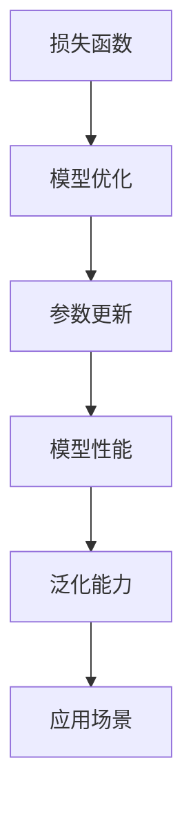

以下是技术博客文章《一切皆是映射：损失函数的种类和选择策略》的正文内容:

# 一切皆是映射：损失函数的种类和选择策略

## 1. 背景介绍

### 1.1 问题的由来

在机器学习和深度学习领域中,损失函数(Loss Function)扮演着至关重要的角色。它用于衡量模型预测值与真实值之间的差距,并作为优化算法的驱动力,指导模型参数的更新方向和幅度。选择合适的损失函数对于构建高性能模型至关重要,因为不同的损失函数适用于不同的问题场景和数据分布。

### 1.2 研究现状  

目前,已有大量的研究致力于探索和设计新颖的损失函数,以更好地适应各种机器学习任务。例如,交叉熵损失函数广泛应用于分类问题,均方误差损失函数常用于回归问题。此外,还有一些特殊的损失函数,如Huber损失函数、Focal Loss等,旨在解决特定的挑战,如类别不平衡或梯度消失等。

### 1.3 研究意义

深入理解损失函数的种类、工作原理和选择策略,对于提高模型性能和泛化能力至关重要。合理选择损失函数可以加速模型收敛,提高预测精度,并且有助于解决一些特殊的挑战,如噪声数据、类别不平衡等。此外,设计新颖的损失函数也是机器学习领域的一个重要研究方向,可以推动算法和模型的创新发展。

### 1.4 本文结构

本文将全面探讨损失函数的种类和选择策略。首先,我们将介绍损失函数的核心概念和作用。接下来,详细阐述常见的损失函数种类,包括回归损失函数和分类损失函数,并分析它们的优缺点和适用场景。然后,我们将重点讨论如何根据问题特征和数据分布合理选择损失函数,并提供一些实用的选择策略。最后,我们将展望损失函数的未来发展趋势和挑战。

## 2. 核心概念与联系

在深入探讨损失函数的种类和选择策略之前,我们需要先了解一些核心概念和它们之间的联系。

1. **损失函数(Loss Function)**: 损失函数是一个评估模型预测值与真实值之间差距的函数,通常用于监督学习任务中。它的作用是量化模型的预测误差,并将其转化为一个可优化的标量值。

2. **模型优化(Model Optimization)**: 模型优化的目标是最小化损失函数的值,从而使模型的预测结果尽可能接近真实值。常见的优化算法包括梯度下降、随机梯度下降等。

3. **参数更新(Parameter Update)**: 在优化过程中,模型参数会根据损失函数的梯度信息进行更新,以减小损失值。参数更新的方式和步长对模型收敛速度和性能有重要影响。

4. **模型性能(Model Performance)**: 模型性能通常用一些评估指标来衡量,如准确率、精确率、召回率等。选择合适的损失函数可以提高模型在特定任务上的性能表现。

5. **泛化能力(Generalization Ability)**: 泛化能力指模型在未见过的新数据上的表现。良好的泛化能力意味着模型具有更强的适应性和鲁棒性。合理选择损失函数可以提高模型的泛化能力。

6. **应用场景(Application Scenario)**: 不同的应用场景对模型性能和泛化能力有不同的要求,因此需要根据具体场景选择合适的损失函数。

综上所述,损失函数是连接模型优化、参数更新、模型性能、泛化能力和应用场景的关键环节。选择合适的损失函数对于构建高性能、泛化能力强的机器学习模型至关重要。

## 3. 核心算法原理 & 具体操作步骤

### 3.1 算法原理概述

损失函数的核心原理是将模型预测值与真实值之间的差距映射为一个标量值,并通过优化算法最小化这个标量值,从而使模型预测结果逐渐接近真实值。

在监督学习任务中,我们通常有一个包含输入特征 $X$ 和对应标签 $Y$ 的训练数据集 $\mathcal{D} = \{(x_i, y_i)\}_{i=1}^N$。我们的目标是找到一个模型 $f_\theta$,其中 $\theta$ 表示模型参数,使得对于任意输入 $x$,模型预测值 $\hat{y} = f_\theta(x)$ 尽可能接近真实标签 $y$。

为了量化模型预测值与真实值之间的差距,我们定义一个损失函数 $\mathcal{L}$,它将模型预测值 $\hat{y}$ 和真实标签 $y$ 作为输入,输出一个标量值,表示预测误差的大小。具体来说,损失函数可以表示为:

$$\mathcal{L}(y, \hat{y}) = \mathcal{L}(y, f_\theta(x))$$

我们的目标是找到一组最优参数 $\theta^*$,使得在整个训练数据集上的总损失最小化:

$$\theta^* = \arg\min_\theta \frac{1}{N} \sum_{i=1}^N \mathcal{L}(y_i, f_\theta(x_i))$$

这个优化问题通常使用梯度下降法或其变体算法来求解。具体操作步骤如下:

1. 初始化模型参数 $\theta$。
2. 对于每个训练样本 $(x_i, y_i)$,计算模型预测值 $\hat{y}_i = f_\theta(x_i)$ 和损失值 $\mathcal{L}(y_i, \hat{y}_i)$。
3. 计算损失函数关于模型参数的梯度 $\nabla_\theta \mathcal{L}(y_i, f_\theta(x_i))$。
4. 根据梯度信息更新模型参数 $\theta$,例如使用梯度下降法:$\theta \leftarrow \theta - \eta \nabla_\theta \mathcal{L}(y_i, f_\theta(x_i))$,其中 $\eta$ 是学习率。
5. 重复步骤2-4,直到模型收敛或达到最大迭代次数。

通过上述优化过程,我们可以找到一组最优参数 $\theta^*$,使得模型在训练数据集上的总损失最小化。这个过程也被称为"经验风险最小化"(Empirical Risk Minimization, ERM)。

### 3.2 算法步骤详解

我们将详细解释损失函数优化算法的具体步骤,以及每一步骤的作用和注意事项。

1. **初始化模型参数**

在开始优化之前,我们需要为模型参数 $\theta$ 赋予一个初始值。通常,我们会使用一些随机初始化策略,如Xavier初始化或He初始化,以避免梯度消失或梯度爆炸的问题。初始化的好坏会直接影响模型的收敛速度和最终性能。

2. **计算模型预测值和损失值**

对于每个训练样本 $(x_i, y_i)$,我们将输入特征 $x_i$ 传入模型 $f_\theta$,得到模型预测值 $\hat{y}_i = f_\theta(x_i)$。然后,我们将预测值 $\hat{y}_i$ 和真实标签 $y_i$ 代入损失函数 $\mathcal{L}$,计算出对应的损失值 $\mathcal{L}(y_i, \hat{y}_i)$。

不同的损失函数对应不同的计算方式,我们将在后续章节详细介绍各种损失函数的具体形式和计算方法。

3. **计算损失函数梯度**

为了更新模型参数,我们需要计算损失函数关于模型参数的梯度 $\nabla_\theta \mathcal{L}(y_i, f_\theta(x_i))$。这个梯度信息将指导参数更新的方向和幅度。

在深度学习中,我们通常使用反向传播算法(Backpropagation)来高效计算梯度。反向传播算法利用链式法则,从输出层开始逐层计算每个参数的梯度,并将梯度信息传递回网络的前层。

4. **更新模型参数**

获得梯度信息后,我们可以使用优化算法更新模型参数。最常见的优化算法是梯度下降法(Gradient Descent),其更新规则为:

$$\theta \leftarrow \theta - \eta \nabla_\theta \mathcal{L}(y_i, f_\theta(x_i))$$

其中 $\eta$ 是学习率(Learning Rate),它控制了参数更新的步长。选择合适的学习率对于模型收敛和性能至关重要。过大的学习率可能导致模型无法收敛,而过小的学习率则会使模型收敛缓慢。

除了普通的梯度下降法,还有一些变体算法,如随机梯度下降(Stochastic Gradient Descent, SGD)、动量梯度下降(Momentum)、AdaGrad、RMSProp、Adam等,它们在不同场景下表现出不同的优势。

5. **重复迭代**

我们需要重复步骤2-4,不断更新模型参数,直到模型收敛或达到最大迭代次数。在每次迭代中,我们可以使用整个训练数据集(批量梯度下降)、一个小批量数据(小批量梯度下降)或单个样本(随机梯度下降)来计算梯度和更新参数。

通常,我们会在验证集上监控模型的性能,一旦性能不再提升或开始下降,就可以停止训练,以避免过拟合。

### 3.3 算法优缺点

损失函数优化算法具有以下优点:

1. **简单直观**: 损失函数优化算法的思想非常直观,即最小化模型预测值与真实值之间的差距。这种思路易于理解和实现。

2. **广泛适用性**: 损失函数优化算法可以应用于各种监督学习任务,包括回归、分类、排序等,只需要选择合适的损失函数。

3. **可解释性**: 通过分析损失函数的形式和梯度信息,我们可以更好地理解模型的行为和决策过程,从而提高模型的可解释性。

4. **高效性**: 现代优化算法(如SGD、Adam等)和自动微分技术使得损失函数优化过程高效且易于实现。

然而,损失函数优化算法也存在一些缺点和局限性:

1. **敏感性**: 算法的性能和收敛速度对损失函数的选择、初始化策略和超参数设置(如学习率)非常敏感,需要进行大量的调参工作。

2. **局部最优陷阱**: 由于损失函数通常是非凸的,优化算法可能陷入局部最优解,无法找到全局最优解。

3. **数据质量依赖**: 算法的性能严重依赖于训练数据的质量和数量。如果训练数据存在噪声、偏差或不足,模型的性能将受到影响。

4. **计算资源需求**: 对于大规模数据集和复杂模型,损失函数优化过程可能需要大量的计算资源(如GPU)和时间。

5. **泛化能力挑战**: 即使在训练集上达到了很小的损失值,模型也可能在测试集上表现不佳,存在过拟合的风险。

### 3.4 算法应用领域

损失函数优化算法广泛应用于各种机器学习和深度学习任务,包括但不限于:

1. **回归问题**: 预测连续值输出,如房价预测、销量预测等。常用损失函数包括均方误差(MSE)、平均绝对误差(MAE)等。

2. **分类问题**: 将输入数据划分为离散类别,如图像分类、文本分类等。常用损失函数包括交叉熵损失、Focal Loss等。

3. **排序问题**: 根据某些标准对数据进行排序,如推荐系统、信息检索等。常用损失函数包括平均精确率损失(APN Loss)、列表wise损失等。

4. **生成式模型**: