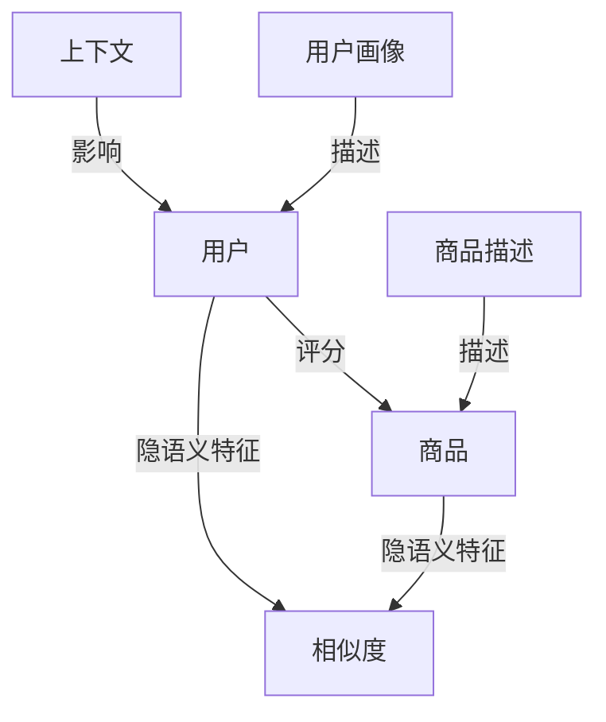
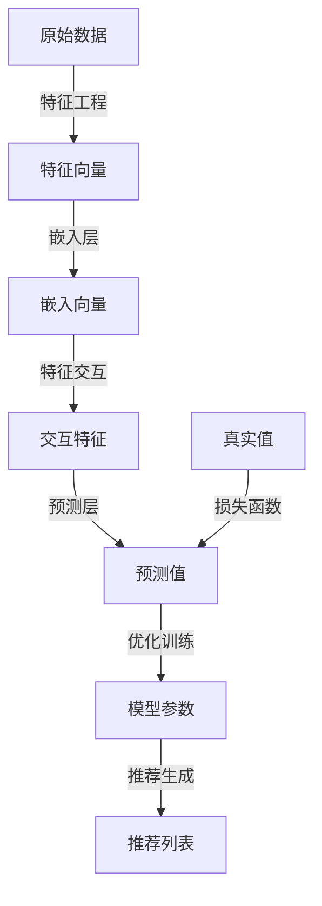

以下是标题为《一切皆是映射：深度学习在推荐系统中的应用》的技术博客文章正文内容：

# 一切皆是映射：深度学习在推荐系统中的应用

## 1. 背景介绍

### 1.1 问题的由来

在当今信息时代,我们每天都会遇到大量的信息和选择。无论是在网上浏览商品、观看视频,还是选择餐馆就餐,我们都希望能够获得个性化的推荐,从海量信息中快速找到自己感兴趣的内容。这就催生了推荐系统的需求。

传统的推荐系统主要依赖于协同过滤(Collaborative Filtering)等算法,通过分析用户的历史行为数据(如浏览记录、购买记录等)来预测用户的兴趣偏好。然而,这些方法存在一些局限性:

1. 冷启动问题:对于新用户或新商品,由于缺乏足够的历史数据,难以给出准确的推荐。
2. 数据稀疏性:用户对商品的反馈数据往往是极度稀疏的,导致推荐效果不佳。
3. 无法挖掘深层次特征:传统方法主要基于用户的显式反馈(如评分),难以挖掘用户和商品的深层次语义特征。

### 1.2 研究现状

为了解决上述问题,近年来深度学习技术在推荐系统领域得到了广泛应用。深度学习模型能够自动从原始数据(如用户画像、商品描述等)中挖掘出高阶特征表示,并捕捉用户和商品之间的复杂关系,从而提高推荐的准确性和多样性。

目前,基于深度学习的推荐系统主要有以下几种模型:

1. **基于嵌入的模型**(Embedding-based Model)
2. **基于卷积神经网络的模型**(CNN-based Model)
3. **基于循环神经网络的模型**(RNN-based Model)
4. **基于注意力机制的模型**(Attention-based Model)
5. **基于对比学习的模型**(Contrastive Learning-based Model)

这些模型在不同的场景下表现各有优劣,但都能在一定程度上提升推荐系统的性能。

### 1.3 研究意义

推荐系统在电子商务、在线视频、社交网络等领域发挥着越来越重要的作用。高质量的个性化推荐不仅能够提高用户体验,还能为企业带来可观的经济效益。因此,研究如何利用深度学习技术构建高效的推荐系统,具有重要的理论意义和应用价值。

本文将系统地介绍深度学习在推荐系统中的应用,包括核心概念、关键算法、数学模型、实际案例等,旨在为读者提供全面的理解。

### 1.4 本文结构

本文的其余部分安排如下:

- 第2部分介绍推荐系统中的核心概念及其相互关系。
- 第3部分详细阐述基于深度学习的推荐算法原理及具体操作步骤。
- 第4部分构建数学模型并推导公式,辅以案例分析加深理解。
- 第5部分通过实践项目展示代码实现细节。
- 第6部分探讨深度学习推荐系统在实际场景中的应用。
- 第7部分推荐相关工具和学习资源。
- 第8部分总结研究成果,并展望未来发展趋势和面临的挑战。
- 第9部分列举常见问题并给出解答。

## 2. 核心概念与联系

在深入探讨深度学习在推荐系统中的应用之前,我们先介绍一些核心概念:

1. **用户**(User)和**商品**(Item):推荐系统的主体对象。
2. **用户画像**(User Profile)和**商品描述**(Item Description):描述用户和商品的特征信息。
3. **隐语义特征**(Latent Semantic Feature):用户和商品的深层次语义特征,通常由模型自动学习得到。
4. **相似度**(Similarity):衡量用户与商品、商品与商品之间相似程度的指标。
5. **评分**(Rating):用户对商品的显式反馈,如打分、点赞等。
6. **上下文**(Context):影响用户偏好的环境因素,如时间、地点等。

这些概念之间存在着密切的联系,如下图所示:

推荐系统的目标是基于用户画像、商品描述、历史评分等信息,捕捉用户和商品的隐语义特征,计算相似度,并在特定上下文下为用户推荐合适的商品。

深度学习模型能够自动从原始数据中挖掘隐语义特征,并学习用户和商品之间的复杂映射关系,从而提高推荐的准确性。

## 3. 核心算法原理 & 具体操作步骤

### 3.1 算法原理概述

基于深度学习的推荐算法通常包括以下几个关键步骤:

1. **数据预处理**:对用户画像、商品描述等原始数据进行清洗和特征工程,将其转化为模型可以接受的向量形式。
2. **嵌入层**:将高维稀疏的原始特征映射到低维连续的嵌入空间,得到用户和商品的嵌入向量表示。
3. **特征交互**:使用神经网络模型捕捉用户和商品嵌入向量之间的高阶交互关系。
4. **预测层**:根据用户和商品的交互特征,预测用户对该商品的兴趣程度(如评分)。
5. **优化训练**:使用监督学习方法(如回归、分类等)优化模型参数,最小化预测值与真实值之间的差异。
6. **推荐生成**:利用训练好的模型,为目标用户生成个性化的商品推荐列表。

这一过程可以用下图概括:

不同的深度学习模型在特征交互和预测层的具体实现上有所区别,我们将在下一节详细介绍。

### 3.2 算法步骤详解

#### 3.2.1 数据预处理

数据预处理是推荐系统算法的基础,通常包括以下步骤:

1. **数据清洗**:处理缺失值、异常值、重复数据等问题。
2. **特征构建**:根据业务需求,从原始数据中提取有用的特征,如用户年龄、商品类别等。
3. **特征编码**:将类别型特征(如城市名称)转换为数值型向量表示。
4. **归一化**:对数值型特征进行标准化或归一化处理,防止数值差异过大导致训练不稳定。

以电子商务场景为例,用户画像可能包括年龄、性别、居住地等特征,商品描述可能包括标题、文本介绍、图像等特征。这些特征需要进行适当的预处理,才能输入到深度学习模型中。

#### 3.2.2 嵌入层

嵌入层的作用是将高维稀疏的原始特征映射到低维连续的嵌入空间,得到用户和商品的嵌入向量表示。

以用户ID为例,假设我们有100万用户,可以使用一个100万维的一热编码向量来表示每个用户。但这种表示方式高维稀疏,计算效率低下且难以捕捉用户之间的相似性。

嵌入层通过查找权重矩阵,将每个用户ID映射到一个低维密集向量(如64维),这个向量能够更好地编码用户的隐语义特征。同理,我们也可以为商品ID、类别等特征构建嵌入向量。

嵌入向量不是手动设计的,而是由模型在训练过程中自动学习得到,能够最大化预测目标(如评分)的准确性。

#### 3.2.3 特征交互

得到用户和商品的嵌入向量后,我们需要捕捉它们之间的交互关系。常用的交互方式有:

1. **元素级交互**(Element-wise Interaction):对应元素相乘或相加。
2. **外积**(Outer Product):计算两个向量的张量积。
3. **多层感知机**(Multi-Layer Perceptron, MLP):使用全连接网络学习高阶交互特征。
4. **注意力机制**(Attention Mechanism):自适应地分配不同特征的权重。

以MLP为例,我们可以将用户嵌入向量和商品嵌入向量拼接,然后通过一个或多个全连接层捕捉它们的非线性交互关系:

$$h = \phi(W_1^T[e_u, e_i] + b_1)$$

其中$e_u$和$e_i$分别表示用户和商品的嵌入向量,$W_1$和$b_1$是第一个全连接层的权重和偏置,$\phi$是激活函数(如ReLU)。

通过堆叠多个全连接层,模型可以自动学习用户和商品之间的高阶交互特征,而不需要人工设计特征交叉项。

#### 3.2.4 预测层

预测层的作用是根据用户和商品的交互特征,预测用户对该商品的兴趣程度。

对于评分预测任务,我们可以使用回归模型,将交互特征$h$输入到一个全连接层,得到预测评分$\hat{y}$:

$$\hat{y} = W_2^Th + b_2$$

其中$W_2$和$b_2$是全连接层的权重和偏置。

对于排序或分类任务(如点击率预测),我们可以使用分类模型,将交互特征$h$输入到一个Softmax层,得到每个商品被点击的概率分布。

在训练阶段,我们使用监督学习方法(如均方误差、交叉熵损失等)优化模型参数,使预测值$\hat{y}$尽可能接近真实值$y$。在推理阶段,我们利用训练好的模型为目标用户生成个性化的商品推荐列表。

### 3.3 算法优缺点

基于深度学习的推荐算法具有以下优点:

1. **自动特征提取**:能够从原始数据中自动挖掘出有效的隐语义特征,而不需要人工设计特征。
2. **建模灵活性**:可以使用各种神经网络结构(如MLP、CNN、RNN等)来捕捉用户和商品之间的复杂关系。
3. **端到端训练**:整个模型可以端到端地进行训练,无需分阶段处理。
4. **泛化能力强**:通过预训练和迁移学习,模型可以在不同领域之间迁移知识,提高泛化性能。

但这些算法也存在一些缺点:

1. **数据饥渴**:训练深度神经网络需要大量的数据,否则容易过拟合。
2. **冷启动问题**:对于全新的用户或商品,由于缺乏历史数据,推荐效果可能不佳。
3. **可解释性差**:神经网络模型通常是一个黑盒,其内部工作机制难以解释。
4. **计算复杂度高**:深度模型的训练和推理过程计算量较大,需要强大的硬件支持。

### 3.4 算法应用领域

基于深度学习的推荐算法已经在多个领域得到了成功应用,包括但不限于:

1. **电子商务**:为用户推荐感兴趣的商品,提高购买转化率。
2. **在线视频**:推荐个性化的视频内容,增加用户粘性。
3. **新闻资讯**:根据用户兴趣推荐相关新闻和文章。
4. **社交网络**:推荐潜在好友、感兴趣的主题和内容。
5. **广告推荐**:向目标用户推荐相关广告,提高