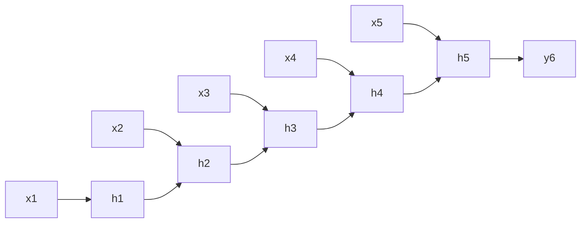

# 一切皆是映射：深度学习在灾害预防与响应中的应用

关键词：深度学习、灾害预防、灾害响应、映射、数学模型、卷积神经网络、时间序列预测、遥感影像分析

## 1. 背景介绍
### 1.1 问题的由来
随着全球气候变化加剧,自然灾害发生的频率和强度都在不断增加。地震、台风、洪水等灾害给人类社会带来了巨大的生命和财产损失。如何有效地预防和应对各类自然灾害,已经成为全人类面临的重大课题。
### 1.2 研究现状
传统的灾害预防和响应主要依赖于物理模型和统计方法,但其预测精度和实时性都难以满足实际需求。近年来,随着人工智能尤其是深度学习技术的飞速发展,将其应用于灾害预防和响应领域已成为学术界和工业界的研究热点。一系列研究表明,深度学习能够从海量的历史数据中自动学习到灾害发生的内在规律,从而大幅提升灾害预测和识别的精度。
### 1.3 研究意义 
深入研究深度学习在灾害预防与响应中的应用,对于提升我国乃至全球的防灾减灾能力具有重要意义。一方面,灾害预警的提前量和准确率的提高,可以为灾害发生地区的人员疏散和财产转移争取宝贵的时间。另一方面,灾情的快速评估与响应,有助于第一时间开展救援工作,最大限度减少灾害损失。
### 1.4 本文结构
本文将重点探讨深度学习中的核心概念——映射在灾害预防与响应领域的应用。第2节介绍映射的定义及其与深度学习的关系;第3节重点阐述几种常见的深度学习模型及其工作原理;第4节建立相关的数学模型并给出详细的公式推导;第5节通过代码实例演示如何利用深度学习进行灾害预测和灾情分析;第6节总结深度学习在灾害预防与响应中的典型应用场景;第7节推荐相关的学习资源和开发工具;第8节对未来的发展趋势和面临的挑战进行展望。

## 2. 核心概念与联系
在数学中,映射指从一个集合到另一个集合的对应关系。深度学习的本质就是学习一系列复杂的映射函数,将输入数据转化为输出结果。以图像分类任务为例,卷积神经网络实际上就是学习一个从图像空间到类别标签空间的映射。再如,循环神经网络常用于时间序列预测,本质上是学习一个从历史观测值到未来数值的映射。
在灾害预防与响应领域,我们往往需要建立从各类观测数据(如气象参数、地震波形、卫星影像等)到灾害发生概率、灾情分布图等结果的映射。传统方法通常是根据专家经验人工设计特征并建立简单的线性或非线性模型,难以刻画复杂的非线性关系。而深度学习通过多层神经网络逐层抽象,能够自动学习到高层次的特征表示,刻画输入到输出之间的复杂映射关系,因而在多个任务上取得了远超传统方法的效果。

## 3. 核心算法原理 & 具体操作步骤
### 3.1 算法原理概述
主流的深度学习算法可分为三大类:前馈神经网络、卷积神经网络和循环神经网络。前馈神经网络是最基本的一类网络,主要用于结构化数据的回归和分类任务。卷积神经网络引入了局部连接和权值共享,擅长处理网格化数据如图像。循环神经网络通过引入循环连接,擅长处理序列数据。
### 3.2 算法步骤详解
以用卷积神经网络进行遥感影像灾情分析为例,其主要步骤如下:

1. 数据准备:收集灾前和灾后的遥感影像,并进行配准、裁剪等预处理,将其划分为训练集和测试集。
2. 网络构建:设计卷积神经网络的结构,如卷积层数、特征图数目、池化方式、激活函数等。
3. 模型训练:利用训练集数据对网络进行训练,通过反向传播算法不断更新网络权重,使其输出与真实标签尽可能接近。
4. 模型评估:利用测试集数据对训练好的模型进行评估,计算各项性能指标如精度、召回率等。
5. 模型应用:利用训练好的模型对新的遥感影像进行推理,得到灾情分布图。

### 3.3 算法优缺点
卷积神经网络的优点在于:
1. 通过逐层卷积和池化操作,能够自动提取影像的多尺度、高层次特征。
2. 通过局部连接和权值共享,大大减少了网络参数数量,使得模型更易于训练。
3. 对图像的平移、旋转等形变具有一定的不变性,泛化能力强。

其缺点主要在于:
1. 网络结构和超参数的选择需要较多经验,容易出现欠拟合或过拟合。
2. 对训练样本的数量和质量要求较高,样本不足或有偏会影响模型性能。
3. 模型的可解释性较差,难以给出直观的物理解释。

### 3.4 算法应用领域
卷积神经网络除了用于遥感影像的灾情分析,还可用于灾害发生的预测。例如,可以将历史的气象参数、地形数据等组织为多通道图像,输入到卷积神经网络中训练,预测未来一段时间内的灾害发生概率。卷积神经网络还被广泛应用于灾害现场的无人机图像分析、灾民的人脸识别与追踪等任务中。

## 4. 数学模型和公式 & 详细讲解 & 举例说明
### 4.1 数学模型构建
对于灾害预测任务,我们考虑建立一个时间序列预测模型。设 $x_t \in \mathbb{R}^n$ 表示 $t$ 时刻的 $n$ 维观测值向量,$y_t \in \mathbb{R}$ 表示 $t$ 时刻的灾害发生概率。我们希望学习一个映射函数 $f$,使得
$$y_t = f(x_{t-m}, \ldots, x_{t-1}) + \epsilon_t$$
其中 $m$ 为考虑的历史观测长度,$\epsilon_t$ 为随机噪声。

传统的时间序列模型如 ARMA、ARIMA 等,主要通过人工设计一些统计特征如自相关系数,建立线性模型如
$$y_t = \sum_{i=1}^{m} \alpha_i x_{t-i} + \epsilon_t$$
其中 $\alpha_i$ 为待学习的系数。这类模型形式简单,但难以刻画复杂的非线性关系。

而循环神经网络可以建模任意长度的时间序列,学习输入序列到输出值之间的复杂映射。以最简单的 Elman 网络为例,设隐藏层节点数为 $d$,则
$$h_t = \sigma(W_{hx} x_t + W_{hh} h_{t-1} + b_h)$$
$$y_t = W_{yh} h_t + b_y$$
其中 $\sigma$ 为激活函数,$W_{hx}, W_{hh}, W_{yh}$ 分别为输入到隐藏层、隐藏层到隐藏层、隐藏层到输出层的权重矩阵,$b_h, b_y$ 为偏置项。可见,循环神经网络实际上是在学习一个关于历史观测值 $x_{t-m}, \ldots, x_{t-1}$ 的高维非线性映射。

### 4.2 公式推导过程
接下来我们推导循环神经网络的前向计算和反向传播公式。考虑时间步 $t$,隐藏层和输出层的计算公式为
$$h_t = \sigma(W_{hx} x_t + W_{hh} h_{t-1} + b_h)$$
$$y_t = W_{yh} h_t + b_y$$
定义 $t$ 时刻的损失函数为
$$L_t = \frac{1}{2}(y_t - \hat{y}_t)^2$$
其中 $\hat{y}_t$ 为真实值。则网络的总损失为
$$L = \sum_{t=1}^{T} L_t$$
根据反向传播算法,我们需要计算损失函数对各参数的梯度。以 $W_{yh}$ 为例,
$$\frac{\partial L}{\partial W_{yh}} = \sum_{t=1}^{T} \frac{\partial L_t}{\partial W_{yh}} = \sum_{t=1}^{T} \frac{\partial L_t}{\partial y_t} \frac{\partial y_t}{\partial W_{yh}} = \sum_{t=1}^{T} (y_t - \hat{y}_t) h_t^T$$
类似地,可以推导出其他参数的梯度公式。值得注意的是,由于隐藏层的状态 $h_t$ 依赖于前一时刻的状态 $h_{t-1}$,因此梯度的计算需要考虑时间维度上的依赖关系,这也是反向传播算法的核心思想。

### 4.3 案例分析与讲解
下面我们以一个简单的例子直观地理解循环神经网络的工作原理。考虑用历史的降雨量数据预测未来某一时刻的洪水发生概率。假设我们有连续10天的降雨量观测值,每个时间步的输入 $x_t$ 就是一个标量。我们希望建立一个循环神经网络,根据过去5天的降雨量预测第6天是否会发生洪水。

我们可以构建一个具有3个隐藏节点的Elman网络。在每个时间步,网络读入当前的降雨量 $x_t$,并结合上一时刻的隐藏层状态 $h_{t-1}$,计算当前时刻的隐藏层状态 $h_t$。在最后一个时间步,我们将隐藏层状态 $h_5$ 通过全连接层映射为洪水发生的概率 $y_6$。整个过程可以用下面的图示表示:

在训练阶段,我们将连续5天的降雨量数据和第6天的洪水发生情况作为一个样本,输入到网络中进行端到端的训练。通过最小化预测概率与真实情况的交叉熵损失,网络可以自动学习到降雨量历史观测值与洪水发生之间的复杂关系。在预测阶段,给定新的5天降雨量观测序列,就可以用训练好的模型预测第6天的洪水发生概率。

可见,循环神经网络通过引入隐藏层的循环连接,巧妙地建模了时间序列数据中的长期依赖关系,是灾害时间序列预测的利器。当然,针对不同的任务,我们还可以设计更加复杂的网络结构,如双向RNN、长短期记忆网络(LSTM)等,以进一步提升性能。

### 4.4 常见问题解答

**Q: 相比传统的时间序列模型,循环神经网络有哪些优势?**

A: 循环神经网络通过引入循环连接和非线性激活函数,能够刻画非常复杂的非线性关系,而传统的线性模型如ARMA难以做到这一点。此外,RNN能够建模任意长度的序列,具有更大的灵活性。

**Q: 在训练RNN时,经常出现梯度消失或梯度爆炸的问题,应该如何解决?**

A: 这是由于RNN在反向传播误差时,需要连乘多个时间步上的梯度,导致数值不稳定。常见的改进方法包括:使用LSTM或GRU等门控机制的网络结构;梯度裁剪;合理初始化参数;使用更好的优化算法如Adam等。

**Q: 对于灾害预测任务,如何选择RNN的输入特征和历史观测长度?**

A: 输入特征的选择需要结合专业知识,考虑各类观测数据与灾害之间的物理