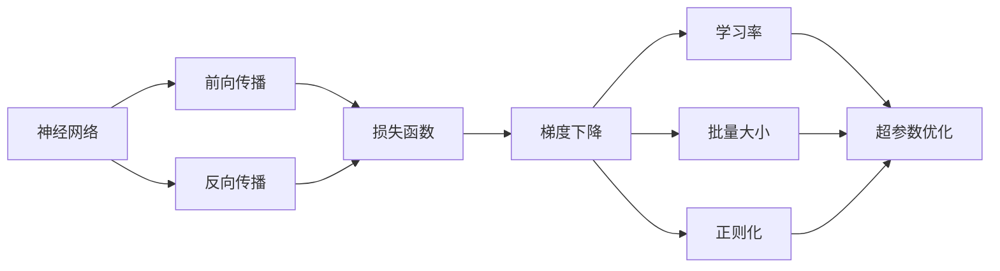

# 一切皆是映射：深度神经网络的调优与优化策略

关键词：深度学习, 神经网络, 调参, 优化, 梯度下降, 正则化, 超参数搜索, 迁移学习

## 1. 背景介绍
### 1.1  问题的由来
深度神经网络(Deep Neural Networks, DNNs)是当前人工智能领域最为热门和有前景的技术之一。它模仿人脑的信息处理机制,通过多层非线性变换对输入数据进行特征提取和表示学习,在图像识别、语音识别、自然语言处理等诸多领域取得了突破性进展。然而,训练一个性能优异的深度神经网络并非易事,其性能很大程度上依赖于模型结构设计和超参数选择等因素。如何高效地调优和优化深度神经网络,是一个亟需解决的关键问题。

### 1.2  研究现状
近年来,学术界和工业界在深度神经网络的调优与优化方面做了大量研究。一方面,研究人员提出了各种新颖的网络结构,如ResNet[1]、DenseNet[2]等,极大地提升了模型性能。另一方面,也有大量工作致力于神经网络训练过程的优化,如改进的梯度下降算法[3]、正则化技术[4]、自动化超参数搜索[5]等。尽管取得了可喜的进展,但调优神经网络仍然是一个具有挑战性的任务,尚无统一高效的解决方案。

### 1.3  研究意义
深入研究深度神经网络的调优与优化策略,对于推动深度学习技术的发展和应用具有重要意义:

1. 提高模型性能。得到性能更优的模型,可以在实际任务中取得更好的效果。 
2. 加速模型训练和推理。高效的训练和推理可以节省计算资源,让深度学习更经济实用。
3. 降低对人工调参的依赖。减轻算法工程师的工作负担,让更多人受益于深度学习技术。
4. 理论价值。深入理解神经网络的优化机制,可以指导算法的设计和改进。

### 1.4  本文结构
本文将全面探讨深度神经网络调优与优化的各个方面。第2节介绍相关的核心概念。第3节重点讲解优化算法的原理和实现细节。第4节从数学角度对优化建模并推导重要公式。第5节给出代码实例。第6节讨论调优和优化技术在实际场景中的应用。第7节推荐相关工具和资源。第8节总结全文并展望未来。第9节的附录解答常见问题。

## 2. 核心概念与联系
在讨论深度神经网络的调优和优化之前,我们先来了解一些核心概念:

- 神经网络:一种模仿生物神经系统结构和功能的数学模型,由大量的人工神经元互联而成。
- 深度学习:一类通过多层神经网络对数据进行表示学习的机器学习方法。
- 前向传播:信息从输入层经隐藏层传递到输出层的过程,用于预测。  
- 反向传播:从输出层开始,将误差信号逐层反向传播到输入层,并据此更新网络参数的过程。
- 损失函数:衡量神经网络输出与真实值之间差异的函数,如均方误差、交叉熵等。
- 梯度下降:一种通过迭代地沿损失函数梯度反方向更新参数以最小化损失的优化算法。 
- 学习率:梯度下降算法中控制每次参数更新幅度的超参数。
- 批量大小:每次参数更新时用于计算梯度的样本数量。
- 正则化:一类通过在损失函数中引入惩罚项来限制模型复杂度、防止过拟合的技术。
- 超参数优化:选择模型超参数(如学习率、批量大小等)以最大化性能的过程。

这些概念环环相扣,共同构成了深度神经网络调优与优化的基础。损失函数定义了优化目标,梯度下降是主要的优化算法,超参数优化则是为了找到最佳的训练配置。下图展示了这些概念之间的联系:

理解这些概念的内涵和联系,是进行神经网络调优和优化的基础。在后续章节中,我们将更加深入地探讨其中的细节。

## 3. 核心算法原理 & 具体操作步骤
### 3.1  算法原理概述
深度神经网络的核心优化算法是梯度下降及其变体。梯度下降的基本思想是:每次迭代时,按照损失函数梯度的反方向更新模型参数,使得损失函数的值不断减小,直到收敛到一个局部最小值。设 $\theta$ 表示模型参数向量,$J(\theta)$ 表示损失函数,则梯度下降算法可以表示为:

$$
\theta_{t+1} = \theta_t - \eta \nabla J(\theta_t)
$$

其中 $\eta$ 是学习率, $\nabla J(\theta_t)$ 是损失函数在 $\theta_t$ 处的梯度。

常见的梯度下降算法变体包括:
- 随机梯度下降(SGD):每次更新只使用一个样本来计算梯度。
- 小批量梯度下降(Mini-batch GD):每次使用一个小批量的样本来计算梯度。是目前使用最广泛的版本。
- 动量法(Momentum):在梯度下降过程中引入动量项,减少震荡,加速收敛。
- 自适应学习率算法:如AdaGrad[6]、RMSProp[7]、Adam[8]等,可以自适应地调整每个参数的学习率。

除了梯度下降,另一类重要的优化技术是正则化。常用的正则化方法有:
- L1 正则化:在损失函数中加入参数绝对值之和。
- L2 正则化:在损失函数中加入参数平方和的一半。也称权重衰减。
- Dropout[9]:在训练过程中,以一定概率随机"关闭"部分神经元。

正则化可以限制模型复杂度,降低过拟合风险,提高泛化能力。

### 3.2  算法步骤详解
下面我们以小批量梯度下降算法为例,详细说明神经网络优化的步骤:

1. 初始化模型参数 $\theta$,设置学习率 $\eta$,批量大小 $m$,最大迭代次数 $T$。
2. 将训练集划分为若干个 $m$ 大小的批量。 
3. for t = 1 to T do:
   1. 随机选择一个批量 $\{(x^{(1)}, y^{(1)}), \cdots, (x^{(m)}, y^{(m)})\}$。
   2. 对该批量中的每个样本,执行前向传播,计算输出。
   3. 计算损失函数 $J(\theta)=\frac{1}{m}\sum_{i=1}^m L(f(x^{(i)};\theta), y^{(i)})$。其中 $L$ 是样本层面的损失函数。
   4. 通过反向传播计算损失函数关于各参数的梯度 $\nabla J(\theta)$。
   5. 更新参数: $\theta \leftarrow \theta - \eta \nabla J(\theta)$。
4. 输出学习到的模型参数 $\theta$。

在实际操作中,我们通常会在第3步中加入正则化项,即 $J(\theta)=\frac{1}{m}\sum_{i=1}^m L(f(x^{(i)};\theta), y^{(i)}) + \lambda R(\theta)$,其中 $R(\theta)$ 是正则化项, $\lambda$ 是正则化系数,控制正则化的强度。

### 3.3  算法优缺点
小批量梯度下降算法的主要优点是:
1. 通过并行计算,可以充分利用硬件加速,加快训练速度。
2. 引入随机性,有助于跳出局部最优,收敛到更好的解。
3. 对大规模数据集的处理更加高效。

其缺点包括:
1. 对超参数(学习率、批量大小等)比较敏感,需要仔细调节。
2. 可能收敛到局部最优而非全局最优。
3. 对噪声和离群点比较敏感。

针对这些缺点,前面提到的各种梯度下降算法变体和正则化技术可以在一定程度上加以改进。

### 3.4  算法应用领域
梯度下降及其变体是目前深度神经网络优化中最主流的算法,几乎在所有的深度学习框架(如TensorFlow、PyTorch)中都有实现。它们被广泛应用于计算机视觉、语音识别、自然语言处理等领域,支撑了绝大多数深度学习模型的训练过程。一些经典的案例包括:
- 使用SGD训练AlexNet[10]进行ImageNet图像分类。
- 使用Adam优化BERT[11]模型以进行自然语言理解任务。
- 使用Momentum加速训练语音识别的CTC模型[12]。

## 4. 数学模型和公式 & 详细讲解 & 举例说明
### 4.1  数学模型构建
为了便于数学建模,我们首先引入一些记号。设训练集为 $\{(x^{(1)}, y^{(1)}), \cdots, (x^{(N)}, y^{(N)})\}$,其中 $x^{(i)} \in \mathbb{R}^d$ 为第 $i$ 个样本的特征向量, $y^{(i)} \in \mathbb{R}$ 为其对应的标签或目标值。神经网络可以表示为一个映射函数 $f(x; \theta): \mathbb{R}^d \rightarrow \mathbb{R}$,其中 $\theta$ 为网络参数。我们的优化目标是最小化经验风险,即平均的样本损失:

$$
\min_\theta J(\theta) = \frac{1}{N} \sum_{i=1}^N L(f(x^{(i)}; \theta), y^{(i)}) + \lambda R(\theta)
$$

其中 $L$ 是样本层面的损失函数,衡量单个样本的预测值与真实值之间的差异。常用的损失函数包括:
- 均方误差(MSE): $L(f(x), y) = (f(x) - y)^2$
- 交叉熵: $L(f(x), y) = -y \log f(x) - (1-y) \log (1-f(x))$
- 铰链损失: $L(f(x), y) = \max(0, 1-y f(x))$

$R(\theta)$ 是正则化项,常见的形式有:
- L1正则化: $R(\theta) = \sum_i |\theta_i|$
- L2正则化: $R(\theta) = \sum_i \theta_i^2$

$\lambda$ 是正则化系数,控制正则化强度。

### 4.2  公式推导过程
下面我们推导小批量梯度下降算法的数学公式。设批量大小为 $m$,学习率为 $\eta$,则第 $t$ 次迭代的参数更新公式为:

$$
\theta_{t+1} = \theta_t - \eta \nabla J_t(\theta_t)
$$

其中 $J_t$ 是第 $t$ 个批量的损失函数:

$$
J_t(\theta) = \frac{1}{m} \sum_{i=1}^m L(f(x^{(i)}; \theta), y^{(i)}) + \lambda R(\theta)
$$

根据链式法则,损失函数关于参数 $\theta_j$ 的梯度为:

$$
\frac{\partial J_t}{\partial \theta_j} = \frac{1}{m} \sum_{i=1}^m \frac{\partial L(f(x^{(i)}; \theta), y^{(i)})}{\partial f(x^{(i)}; \theta)} \frac{\partial f(x^{(i)}; \theta)}{\partial \theta_j} + \lambda \frac{\partial R(\theta)}{\partial \theta_j}
$$

其中 $\frac{\partial L}{\partial f}$ 是损失函数关于网络输出的梯度, $\frac{\partial f}{\partial \theta_j}$ 是网络输出关于参数 $\theta