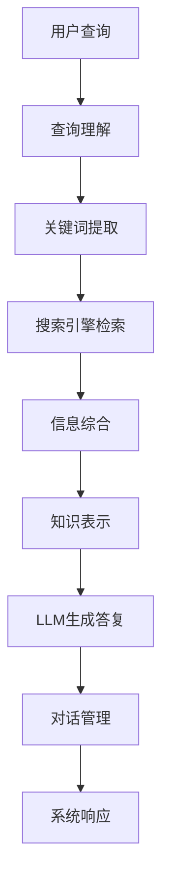

# 上手第一个Agent：Google Search + LLM

## 1. 背景介绍

### 1.1 问题的由来

在当今信息时代,海量的数据和知识源源不断地产生,如何高效地获取所需信息并加以利用,成为了一个亟待解决的问题。传统的搜索引擎虽然可以快速检索网络上的信息,但往往需要用户反复查询和筛选才能获取所需的答案。而人工智能技术的发展为解决这一问题提供了新的思路。

### 1.2 研究现状

近年来,大语言模型(Large Language Model,LLM)在自然语言处理领域取得了长足进展,展现出了惊人的语言理解和生成能力。与此同时,搜索引擎技术也在不断演进,可以高效地检索网络上的信息。将这两种技术相结合,就可以构建一种新型的智能系统,即智能代理(Agent),它能够根据用户的自然语言查询,主动搜索并综合相关信息,最终生成准确的答复。

### 1.3 研究意义

智能代理系统的出现将极大地提高信息获取的效率,为用户节省大量时间和精力。它不仅可以应用于日常生活中的各种查询场景,还可以在专业领域发挥重要作用,如医疗诊断、法律咨询等。此外,智能代理系统的研究也将推动人工智能、信息检索等多个领域的发展。

### 1.4 本文结构

本文将首先介绍智能代理系统的核心概念和工作原理,然后详细阐述其中的关键算法和数学模型。接下来,我们将通过一个实际项目案例,展示如何开发和部署一个基于Google Search和LLM的智能代理系统。最后,我们将探讨该系统的应用场景、发展趋势和面临的挑战。

## 2. 核心概念与联系

智能代理系统是一种集成了多种技术的复杂系统,其核心概念包括:

1. **搜索引擎**: 用于高效地检索网络上的信息资源。
2. **大语言模型(LLM)**: 一种经过大规模语料训练的深度学习模型,能够理解和生成自然语言。
3. **知识库**: 存储系统获取的结构化知识,为LLM提供补充信息。
4. **对话管理**: 控制系统与用户的交互流程,确保对话的连贯性和上下文理解。
5. **查询理解**: 分析用户的自然语言查询,提取关键信息和查询意图。
6. **信息综合**: 将来自多个来源的相关信息进行整合和加工,生成最终的答复。

这些核心概念相互关联,共同构建了一个完整的智能代理系统。其中,搜索引擎和LLM是系统的两大支柱,前者负责信息检索,后者负责语言理解和生成。知识库为LLM提供补充知识,对话管理确保交互流程的合理性,而查询理解和信息综合则是连接搜索引擎和LLM的桥梁。

## 3. 核心算法原理 & 具体操作步骤

### 3.1 算法原理概述

智能代理系统的核心算法可以概括为以下几个步骤:

1. **查询理解**: 利用自然语言处理技术对用户查询进行分析,提取关键词、查询意图等信息。
2. **搜索引擎检索**: 根据提取的关键词,通过搜索引擎检索相关的网页和信息资源。
3. **信息综合**: 将搜索结果和知识库中的相关信息进行综合,形成一个结构化的知识表示。
4. **LLM生成答复**: 将结构化知识输入LLM,由LLM生成自然语言形式的答复。
5. **对话管理**: 根据当前的对话上下文,控制系统的响应和后续交互流程。

该算法的关键在于搜索引擎和LLM的有机结合,前者负责获取相关信息,后者负责生成自然语言答复。同时,查询理解、信息综合和对话管理等步骤也是不可或缺的,它们确保了系统的准确性和交互质量。

### 3.2 算法步骤详解

1. **查询理解**

   - 将用户的自然语言查询转换为计算机可以理解的形式
   - 常用技术包括:词法分析、句法分析、命名实体识别、意图分类等
   - 输出:关键词、查询意图等

2. **搜索引擎检索**

   - 利用提取的关键词,通过搜索引擎(如Google Search)检索相关网页和信息资源
   - 可以使用搜索引擎API或网页抓取技术获取搜索结果
   - 输出:相关网页和文本内容

3. **信息综合**

   - 将搜索结果和知识库中的相关信息进行综合,形成一个结构化的知识表示
   - 常用技术包括:信息抽取、知识图谱构建、知识融合等
   - 输出:结构化的知识表示,如知识三元组、知识图谱等

4. **LLM生成答复**

   - 将结构化的知识表示输入LLM(如GPT-3)
   - LLM根据输入的知识,生成自然语言形式的答复
   - 输出:自然语言答复

5. **对话管理**

   - 根据当前的对话上下文,控制系统的响应和后续交互流程
   - 常用技术包括:对话状态跟踪、上下文理解、策略学习等
   - 输出:系统的响应行为(如继续对话、结束对话等)

### 3.3 算法优缺点

**优点**:

- 充分利用了搜索引擎和LLM的优势,实现了信息检索和自然语言生成的有机结合
- 可以根据用户的自然语言查询,主动获取相关信息并生成准确的答复
- 具有较强的通用性,可以应用于多种查询场景

**缺点**:

- 算法流程较为复杂,需要多个模块协同工作
- 依赖于搜索引擎和LLM的性能,如果这两个组件存在缺陷,将直接影响整体效果
- 对于一些特殊领域或需要深度推理的查询,可能难以获取足够的信息和知识

### 3.4 算法应用领域

该算法可以应用于多种场景,包括但不限于:

- 日常生活查询: 天气、交通、餐馆等
- 学习辅助: 课程知识查询、作业解答等
- 客户服务: 产品咨询、故障排查等
- 医疗健康: 症状查询、就医指导等
- 法律咨询: 法律问题解答、案例分析等
- 新闻资讯: 时事热点解读、深度报道等

总的来说,只要是需要获取特定信息并以自然语言形式呈现的场景,都可以考虑应用该算法。

## 4. 数学模型和公式 & 详细讲解 & 举例说明

在智能代理系统中,数学模型和公式主要应用于查询理解、信息综合和LLM等模块。下面我们将详细介绍其中的一些核心模型和公式。

### 4.1 数学模型构建

#### 4.1.1 查询理解模型

查询理解模型的目标是将用户的自然语言查询转换为计算机可以理解的形式,常用的模型包括:

1. **序列标注模型**

   将查询理解任务建模为序列标注问题,利用条件随机场(CRF)或BiLSTM-CRF等模型进行命名实体识别和词性标注。

   $$P(y|x) = \frac{e^{s(x,y)}}{\sum_{y'\in Y(x)}e^{s(x,y')}}$$

   其中,$ P(y|x) $表示给定输入序列$ x $的条件下,输出序列$ y $的条件概率;$ s(x,y) $表示特征函数;$ Y(x) $表示所有可能的输出序列集合。

2. **意图分类模型**

   将查询意图分类建模为文本分类问题,利用支持向量机(SVM)、逻辑回归或深度学习模型(如TextCNN、BERT等)进行分类。

   $$f(x) = W^Tx + b$$

   其中,$ f(x) $表示分类器的输出;$ W $和$ b $分别表示权重和偏置参数;$ x $表示输入特征向量。

#### 4.1.2 信息综合模型

信息综合模型的目标是将来自多个来源的相关信息进行整合和加工,常用的模型包括:

1. **知识图谱构建模型**

   利用知识抽取技术从文本中提取三元组知识,并构建知识图谱。

   $$P(r|s,o) = \frac{e^{f_r(s,o)}}{\sum_{r'\in R}e^{f_{r'}(s,o)}}$$

   其中,$ P(r|s,o) $表示给定主语实体$ s $和宾语实体$ o $的条件下,关系$ r $的条件概率;$ f_r(s,o) $表示特征函数;$ R $表示所有可能的关系集合。

2. **知识融合模型**

   将来自不同来源的知识进行融合,消除冲突和噪声,形成一致的知识表示。

   $$\mathbf{h}^{(t)} = \text{Aggregate}\left(\left\{\mathbf{m}^{(t-1)}_i, \forall i\in\mathcal{N}(v)\right\}\right)$$
   $$\mathbf{m}^{(t)}_v = \text{Update}\left(\mathbf{m}^{(t-1)}_v, \mathbf{h}^{(t)}\right)$$

   其中,$ \mathbf{h}^{(t)} $表示节点$ v $在时间步$ t $的邻居信息聚合;$ \mathbf{m}^{(t)}_v $表示节点$ v $在时间步$ t $的状态更新;$ \text{Aggregate} $和$ \text{Update} $分别表示聚合函数和更新函数。

#### 4.1.3 LLM模型

LLM模型的目标是根据输入的结构化知识,生成自然语言形式的答复,常用的模型包括:

1. **Transformer模型**

   利用Self-Attention机制捕捉输入序列中的长距离依赖关系,生成目标序列。

   $$\text{Attention}(Q, K, V) = \text{softmax}\left(\frac{QK^T}{\sqrt{d_k}}\right)V$$

   其中,$ Q $、$ K $和$ V $分别表示查询(Query)、键(Key)和值(Value)向量;$ d_k $表示缩放因子。

2. **GPT模型**

   基于Transformer的语言模型,通过自回归方式生成文本序列。

   $$P(x) = \prod_{t=1}^TP(x_t|x_{<t})$$

   其中,$ P(x) $表示生成序列$ x $的概率;$ x_t $表示序列的第$ t $个token;$ x_{<t} $表示序列前$ t-1 $个token。

### 4.2 公式推导过程

以知识图谱构建模型为例,我们将推导关系抽取模型的公式。

已知:
- 输入是一个三元组$ (s,r,o) $,其中$ s $表示主语实体,$ r $表示关系,$ o $表示宾语实体
- 目标是最大化$ P(r|s,o) $,即给定$ s $和$ o $的条件下,关系$ r $的条件概率

根据贝叶斯公式,我们有:

$$P(r|s,o) = \frac{P(s,o|r)P(r)}{P(s,o)}$$

由于$ P(s,o) $对于所有关系$ r $是相同的,因此可以忽略。同时,假设主语实体$ s $和宾语实体$ o $在给定关系$ r $的条件下是条件独立的,即$ P(s,o|r) = P(s|r)P(o|r) $,则:

$$P(r|s,o) \propto P(s|r)P(o|r)P(r)$$

进一步引入特征函数$ f_r(s,o) $,使用对数线性模型:

$$\begin{align}
P(r|s,o) &\propto \exp\left(\log P