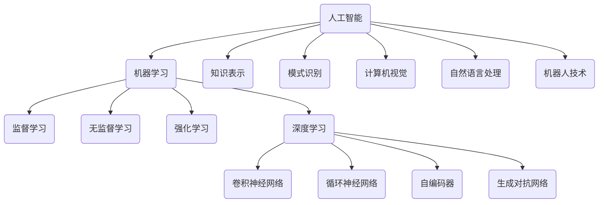

好的,我会严格遵循约束条件,以"人工智能(Artificial Intelligence) - 原理与代码实例讲解"为主题,写一篇专业的技术博客文章。

# 人工智能(Artificial Intelligence) - 原理与代码实例讲解

## 1. 背景介绍

### 1.1 问题的由来

人工智能(Artificial Intelligence,AI)是当代最具颠覆性和革命性的技术之一。自20世纪50年代AI概念被正式提出以来,经过数十年的发展,AI已经渗透到我们生活的方方面面,并在诸多领域展现出了巨大的应用潜力。

然而,AI的发展之路并非一帆风顺。在早期阶段,AI遭遇了著名的"AI寒冬",主要是由于当时的硬件计算能力有限、算法不够先进、数据匮乏等原因,使得AI的发展遇到了严重的瓶颈。直到近年来,随着大数据、强大算力、深度学习等技术的兴起,AI才重新走上了高速发展的轨道。

### 1.2 研究现状  

当前,AI已经取得了令人瞩目的进展,尤其是在计算机视觉、自然语言处理、决策系统等领域。以计算机视觉为例,基于深度学习的目标检测、图像分类等技术使得机器拥有了类似于人类的视觉能力。而在自然语言处理领域,语音识别、机器翻译、对话系统等技术也有了长足的进步。

与此同时,AI也面临着一些挑战和局限性。例如,当前的AI系统大多属于"狭义AI",只能解决特定的任务,缺乏通用智能。另外,AI系统的可解释性、鲁棒性、公平性等问题也亟待解决。

### 1.3 研究意义

AI技术的发展对于推动社会进步、提高生活质量、促进经济发展等方面具有重要意义。AI可以帮助人类解决一些复杂的问题,提高工作效率,降低成本。同时,AI也将给就业市场带来深远影响,可能会导致一些岗位被取代,但也会催生新的就业机会。

因此,深入研究AI的原理和实践是非常必要的。只有充分理解AI的工作机制,掌握相关算法和技术,才能更好地利用AI的力量,推动其在各个领域的应用,并规避潜在的风险。

### 1.4 本文结构

本文将全面介绍AI的核心概念、算法原理、数学模型、实际应用等内容。首先阐述AI的基本概念和发展历程,然后深入探讨核心算法的工作原理和具体实现步骤。接下来,通过数学模型和公式,解释算法背后的理论基础。之后,我们将通过实际的代码示例,展示如何将这些算法付诸实践。最后,介绍AI在不同领域的应用场景,并对未来的发展趋势和挑战进行展望。

## 2. 核心概念与联系

人工智能是一个庞大而复杂的领域,涉及多个核心概念和技术。这些概念相互关联、互为支撑,共同构建了AI的理论和实践体系。下面我们将介绍一些最核心的概念。

### 2.1 机器学习

机器学习(Machine Learning)是AI的核心部分,旨在使计算机能够从数据中自动学习和建模,从而获得新的知识或技能,并用于决策或预测。机器学习包括监督学习、无监督学习、强化学习等范式。

### 2.2 深度学习

深度学习(Deep Learning)是机器学习的一个子领域,它基于具有多层非线性变换单元的人工神经网络,通过模型优化算法学习数据特征表示,从而解决复杂的任务。常见的深度学习模型有卷积神经网络、循环神经网络、自编码器、生成对抗网络等。

### 2.3 知识表示

知识表示(Knowledge Representation)是AI的另一个重要分支,旨在研究如何在计算机系统中表示和推理人类知识。常见的知识表示方法包括逻辑、语义网络、框架、本体论等。

### 2.4 模式识别

模式识别(Pattern Recognition)是AI的基础,旨在从数据中发现有意义的模式或规律,并对输入数据进行分类或预测。它与机器学习密切相关,但更侧重于理论和算法方面。

### 2.5 计算机视觉

计算机视觉(Computer Vision)是AI的一个重要应用领域,旨在使计算机能够获取、处理、分析和理解数字图像或视频。它广泛应用于目标检测、图像分类、视频跟踪等任务。

### 2.6 自然语言处理

自然语言处理(Natural Language Processing)是另一个重要的AI应用领域,旨在使计算机能够理解和生成人类语言。它包括语音识别、机器翻译、文本挖掘、对话系统等技术。

### 2.7 机器人技术

机器人技术(Robotics)是AI的一个重要应用方向,旨在设计和构建能够感知环境、规划行动、执行任务的智能机器人系统。它融合了多个AI技术,如计算机视觉、自然语言处理、决策规划等。

上述概念相互关联、互为支撑,共同构建了AI的理论和实践体系。例如,深度学习为计算机视觉和自然语言处理提供了强大的模型和算法支持;而模式识别、知识表示等则为机器学习奠定了基础。只有全面把握这些核心概念及其内在联系,才能真正理解AI的本质。

## 3. 核心算法原理与具体操作步骤

在上一节中,我们介绍了AI的核心概念。这些概念背后都有一系列算法作为理论支撑。本节将重点探讨一些核心算法的工作原理和具体实现步骤。

### 3.1 算法原理概述

在深入具体算法之前,我们先简要概述一下算法的一般原理。大多数AI算法都可以归纳为以下几个步骤:

1. **数据预处理**: 对原始数据进行清洗、标准化、特征提取等预处理,以满足算法的输入要求。
2. **模型构建**: 根据算法原理,构建适当的模型结构,初始化模型参数。
3. **模型训练**: 使用训练数据,通过优化算法(如梯度下降)调整模型参数,使模型在训练数据上达到最优性能。
4. **模型评估**: 在保留的测试数据上评估模型的泛化性能,检验模型是否过拟合。
5. **模型调优**: 根据评估结果,通过调整超参数、特征工程等方式优化模型。
6. **模型应用**: 将训练好的模型应用于实际任务,获取预测或决策结果。

这是大多数AI算法的通用流程,但具体算法在细节上会有所差异。下面我们将介绍几种核心算法的具体原理和实现步骤。

### 3.2 算法步骤详解

#### 3.2.1 线性回归

线性回归是最基础的监督学习算法之一,旨在学习输入特征与目标值之间的线性关系。其基本原理是最小化预测值与真实值之间的均方误差,通过梯度下降等优化算法不断调整模型参数,直至找到最优解。

线性回归的实现步骤如下:

1. 导入所需的库,如NumPy、Pandas等。
2. 加载并预处理数据集,包括填充缺失值、标准化特征等。
3. 将数据集拆分为训练集和测试集。
4. 初始化线性回归模型,设置模型超参数(如正则化强度)。
5. 在训练集上训练模型,使用梯度下降等优化算法最小化损失函数。
6. 在测试集上评估模型的性能,计算均方根误差等指标。
7. 可视化模型的预测结果与真实值的对比情况。
8. 根据评估结果,对模型进行调优,如特征选择、正则化等。
9. 将训练好的模型应用于实际任务,进行预测或决策。

线性回归虽然简单,但对于理解机器学习的基本思想和流程非常有帮助。它也是许多更复杂算法的基础和起点。

#### 3.2.2 逻辑回归

逻辑回归是一种广泛应用于分类任务的算法。它的原理是学习一个逻辑函数(如Sigmoid函数),将输入特征映射到0到1之间的概率值,从而实现二分类。对于多分类任务,可以使用One-vs-Rest或Softmax等策略。

逻辑回归的实现步骤与线性回归类似,主要区别在于:

1. 使用交叉熵损失函数代替均方误差。
2. 在输出层使用Sigmoid或Softmax激活函数。
3. 评估指标使用准确率、精确率、召回率等。

#### 3.2.3 决策树

决策树是一种基于树形结构的监督学习算法,可用于分类和回归任务。它的工作原理是根据特征的信息增益或基尼指数,递归地将数据划分为较小的子集,直至满足某个停止条件。

决策树的实现步骤如下:

1. 导入所需的库,如Scikit-learn等。
2. 加载并预处理数据集。
3. 将数据集拆分为训练集和测试集。
4. 初始化决策树模型,设置超参数(如最大深度、最小样本数等)。
5. 在训练集上训练模型,构建决策树。
6. 在测试集上评估模型的性能,计算准确率等指标。
7. 可视化决策树的结构,分析每个节点的特征重要性。
8. 根据评估结果,对模型进行调优,如剪枝、特征选择等。
9. 将训练好的决策树应用于实际任务,进行分类或回归预测。

决策树具有可解释性强、训练速度快等优点,但也容易过拟合。因此,通常需要与其他技术(如集成学习)结合使用,以提高性能和鲁棒性。

#### 3.2.4 支持向量机

支持向量机(Support Vector Machine,SVM)是一种常用的监督学习算法,适用于分类和回归任务。它的基本思想是在高维空间中寻找一个超平面,将不同类别的样本分开,同时使得该超平面与最近的数据点之间的距离最大化。

SVM的实现步骤如下:

1. 导入所需的库,如Scikit-learn等。
2. 加载并预处理数据集。
3. 将数据集拆分为训练集和测试集。
4. 初始化SVM模型,设置核函数(如线性核、RBF核等)和超参数(如正则化强度)。
5. 在训练集上训练模型,求解最优超平面。
6. 在测试集上评估模型的性能,计算准确率等指标。
7. 可视化SVM的决策边界,分析支持向量的分布情况。
8. 根据评估结果,对模型进行调优,如选择合适的核函数、调整超参数等。
9. 将训练好的SVM应用于实际任务,进行分类或回归预测。

SVM的优点是可以有效处理高维数据,并且具有良好的泛化能力。但对于大规模数据集,它的训练速度会变慢。此外,SVM对于异常值也比较敏感。

以上只是介绍了几种常见的机器学习算法,实际上还有很多其他重要算法,如k-近邻、朴素贝叶斯、随机森林、梯度提升树等。每种算法都有其适用场景和特点,需要根据具体任务选择合适的算法。

### 3.3 算法优缺点

每种算法都有其优缺点,没有放之四海而皆准的完美算法。我们需要根据具体任务的