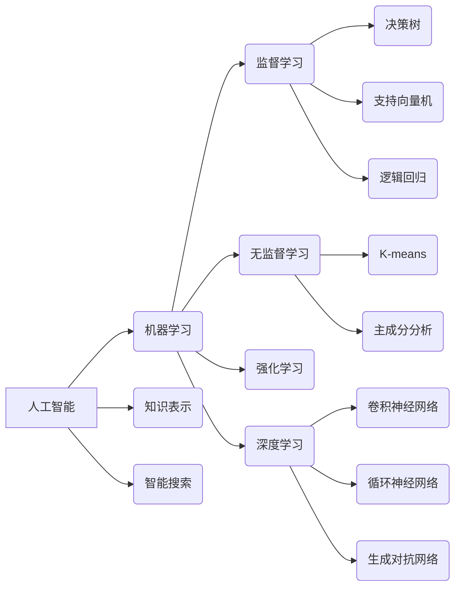

# 人工智能原理与代码实例讲解

## 1. 背景介绍
### 1.1  问题的由来
人工智能(Artificial Intelligence,AI)作为计算机科学的一个分支,旨在研究如何让机器模拟人类的智能行为,如学习、推理、思考和规划等。自1956年达特茅斯会议首次提出"人工智能"的概念以来,AI经历了从早期的符号主义、专家系统到机器学习、深度学习等不同的发展阶段。如今,AI已成为推动科技革命和产业变革的重要力量,在语音识别、图像识别、自然语言处理、智能决策等领域取得了广泛应用。然而,对于普通开发者而言,AI的原理和实现仍然是一个富有挑战性的课题。

### 1.2 研究现状  
目前,AI的研究主要集中在机器学习和深度学习两大方向。机器学习通过从数据中自动分析获得规律,并利用规律对未知数据进行预测。代表算法包括决策树、支持向量机、贝叶斯分类等。深度学习是机器学习的一个新的研究方向,通过构建模拟人脑神经网络结构的多层感知机,利用大规模数据训练,让机器学习更复杂的模式。代表的架构包括卷积神经网络(CNN)、循环神经网络(RNN)、生成对抗网络(GAN)等。谷歌DeepMind的AlphaGo、OpenAI的GPT-3语言模型都是深度学习的典型应用。

### 1.3 研究意义
本文旨在通过浅显易懂的语言,结合具体的代码实例,深入剖析人工智能的核心原理,揭示其内在机制,帮助读者系统地掌握AI算法的实现。这对于广大开发者学习和应用AI技术,跟进前沿动态,具有重要的指导意义。同时,本文也对AI未来的发展趋势和面临的挑战进行了展望,给从业者以启示。

### 1.4 本文结构
本文共分为9个章节,主要内容如下:
第1章介绍了人工智能的研究背景和意义;
第2章阐述了人工智能涉及的核心概念;  
第3章讲解了人工智能的核心算法原理与步骤;
第4章建立了算法的数学模型并给出公式推导;
第5章通过代码实例演示了算法的具体实现; 
第6章分析了算法的实际应用场景;
第7章推荐了AI相关的学习资源和开发工具;
第8章总结了全文,并对AI的未来发展进行了展望;
第9章的附录,解答了一些常见问题。

## 2. 核心概念与联系

在人工智能的发展历程中,涌现出了一系列核心概念,它们相互关联,共同构成了AI的理论基础。下面我们对其中的几个关键概念进行梳理:

- 机器学习:使计算机系统具有自动学习和改进性能的能力,无需进行明确编程。常见的任务包括分类、回归、聚类、降维等。
- 深度学习:通过模拟大脑神经元连接,构建多层神经网络,利用海量数据和高性能计算进行训练,让机器可以识别图像、理解语言。
- 神经网络:由大量的节点(或称神经元)组成,通过调整节点之间的连接权重,建立输入与输出的映射关系。常见的有前馈神经网络、卷积神经网络等。
- 监督学习:通过标注数据训练模型,使其可以对新数据做出正确预测。代表算法有决策树、支持向量机、逻辑回归等。
- 无监督学习:从无标注数据中发现隐藏的模式和结构。常用于降维、聚类等任务。代表算法有K-means、主成分分析(PCA)等。 
- 强化学习:通过环境中的奖励信号来指导软件智能体形成最优策略。应用于如国际象棋、自动驾驶等领域。
- 迁移学习:将一个问题上学习到的模型应用到另一个相似的问题上。可以减少所需的训练数据,加快学习进度。

这些概念之间并非孤立,而是相互交叉影响。例如,深度学习是机器学习的一个分支,其核心是神经网络结构。同时,深度学习可以用于监督、无监督、迁移等不同学习范式。强化学习虽然有别于传统的监督学习,但其优化目标也可以用神经网络来表示。因此,准确把握这些概念之间的联系,对于理解人工智能的整体架构至关重要。

## 3. 核心算法原理 & 具体操作步骤

### 3.1 算法原理概述

人工智能的核心是让机器通过数据学习,形成对世界的认知。这其中,最具代表性的是机器学习算法。机器学习的基本原理是:通过训练数据集,构建一个能够刻画数据内在规律的数学模型,然后利用该模型对新的未知数据进行预测。根据训练数据是否有标注,可以分为监督学习、无监督学习等不同的学习范式。

以监督学习为例,假设我们有一个历史销售数据,包含了产品的各种属性(如价格、尺寸等)和最终的销量。我们可以将其划分为训练集和测试集,训练集用于构建预测销量的回归模型,测试集用于评估模型的泛化性能。通过最小化模型在训练集上的预测误差,我们得到一个拟合数据的模型函数。将该函数应用于测试集,就可以预测新产品的销量了。

### 3.2 算法步骤详解

下面以逻辑回归这一简单但广泛使用的分类算法为例,说明机器学习的基本步骤:

输入:训练集 $\{(x_1,y_1),\ldots,(x_N,y_N)\}$,其中 $x_i$ 为特征向量, $y_i\in\{0,1\}$ 为二元标签。

1) 选择模型函数:假设数据服从参数为 $\theta$ 的逻辑斯谛分布,则有
$$
P(y=1|x;\theta)=\frac{1}{1+e^{-\theta^T x}}
$$
2) 定义损失函数:采用对数似然函数作为损失函数,则有  
$$
J(\theta)=-\frac{1}{N}\sum_{i=1}^N \left[y_i\log(h_\theta(x_i))+(1-y_i)\log(1-h_\theta(x_i))\right]
$$
3) 优化模型参数:使用梯度下降法最小化损失函数,迭代更新 $\theta$
$$
\theta_j:=\theta_j-\alpha\frac{\partial}{\partial \theta_j}J(\theta) 
$$
4) 进行预测:利用学习到的 $\theta$ 对新样本 $x$ 进行预测
$$
y=\begin{cases}
1, & \text{如果 }h_\theta(x)\geq 0.5 \\
0, & \text{otherwise}
\end{cases}
$$

可见,机器学习的关键在于模型的选择、损失函数的设计和优化算法的实现。不同的算法在这三个方面有所差异,但基本流程是一致的。

### 3.3 算法优缺点

逻辑回归的优点是:
- 模型简单,可解释性强,易于实现;
- 训练速度快,适用于大规模数据;
- 可以输出概率预测,便于评估不确定性。

缺点包括:
- 只能处理两类问题,对非线性数据拟合效果差;
- 对特征的尺度敏感,需要进行特征归一化;
- 容易受到异常点的影响,鲁棒性不够好。

### 3.4 算法应用领域

逻辑回归在工业界有着广泛的应用,一些典型的场景包括:
- 金融领域:评估用户的信用风险,预测贷款违约概率;
- 医疗领域:根据症状预测患者是否患病,辅助诊断决策;
- 营销领域:预测用户是否会对广告进行点击,估计购买意向;
- 互联网领域:对新闻、邮件进行分类,识别垃圾信息等。

## 4. 数学模型和公式 & 详细讲解 & 举例说明

### 4.1 数学模型构建

逻辑回归虽然名字带有"回归",但实际上是一种分类方法。它的核心思想是:假设数据服从伯努利分布,通过逻辑斯谛函数将自变量映射到 0~1 之间,得到样本属于某一类别的概率。形式化地,假设
$$y|x;\theta \sim \text{Bernoulli}(\phi),\quad\text{其中}\quad \phi=\frac{1}{1+e^{-\theta^T x}}$$

这里 $\phi$ 就是样本 $x$ 属于正类的概率。$\theta$ 是待估计的参数向量,表示各个特征的权重系数。$\theta^T x$ 是 $\theta$ 和 $x$ 的内积,可以看作是对 $x$ 的加权求和。函数 $\frac{1}{1+e^{-z}}$ 就是逻辑斯谛函数,它可以将实数域映射到 (0,1) 区间,并且具有很好的数学性质,如单调可微等。

### 4.2 公式推导过程

为了估计参数 $\theta$,需要定义一个目标函数来衡量模型的好坏。一般采用极大似然估计,即求解
$$\hat{\theta}=\arg\max_{\theta} \prod_{i=1}^N p(y_i|x_i;\theta)$$

取对数后,得到对数似然函数
$$\begin{aligned}
L(\theta)&=\log \prod_{i=1}^N p(y_i|x_i;\theta) \\
&=\sum_{i=1}^N \log p(y_i|x_i;\theta) \\
&=\sum_{i=1}^N \left[y_i\log(\phi_i)+(1-y_i)\log(1-\phi_i)\right] \\
&=\sum_{i=1}^N \left[y_i\log(\frac{1}{1+e^{-\theta^T x_i}})+(1-y_i)\log(\frac{e^{-\theta^T x_i}}{1+e^{-\theta^T x_i}})\right]
\end{aligned}$$

求解上式的极大值,就得到了 $\theta$ 的估计。这可以通过梯度上升法或牛顿法等优化算法来实现。以梯度上升为例,迭代公式为
$$\theta_j:=\theta_j+\alpha\frac{\partial}{\partial \theta_j}L(\theta)$$

其中 $\alpha$ 是步长,控制每次更新的幅度。$\frac{\partial}{\partial \theta_j}L(\theta)$ 是对数似然函数对 $\theta_j$ 的偏导数,经过推导可得
$$\frac{\partial}{\partial \theta_j}L(\theta)=\sum_{i=1}^N (y_i-\phi_i)x_i^{(j)}$$

将其代入迭代公式,不断更新 $\theta$,直到收敛为止。

### 4.3 案例分析与讲解

下面我们以一个简单的二维数据为例,直观展示逻辑回归的分类效果。假设有 10 个样本,每个样本包含两个特征 $x_1$ 和 $x_2$,以及 0/1 标签 $y$,如下表所示:

| $x_1$ | $x_2$ | $y$ |
|-------|-------|-----|
| 1.0   | 2.0   | 0   |
| 2.0   | 1.5   | 0   |
| 2.5   | 2.2   | 1   |
| 3.2   | 4.5   | 1   |
| 2.8   | 1.8   | 0   |
| 4.0   | 3.2   | 1   |
| 5.2   | 3.0   | 1   |
| 1.2   | 0.8   | 0   |
| 3.8   | 5.0   