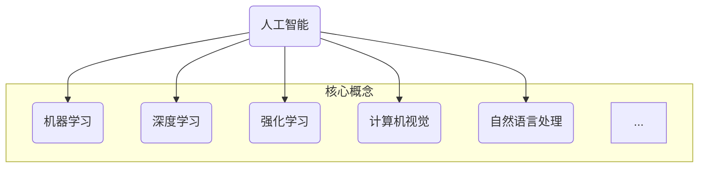
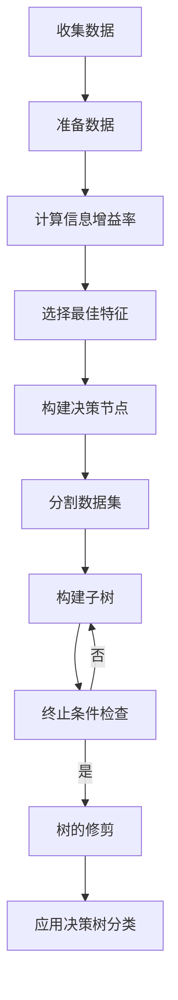

好的,我明白了您的要求。以下是根据您提供的标题和大纲撰写的技术博客文章正文内容:

# 人工智能基础原理与代码实战案例讲解

## 1. 背景介绍

### 1.1 问题的由来

人工智能(Artificial Intelligence,AI)是当代科技发展的前沿领域,其核心是赋予机器智能,使其能够像人一样思考、学习和行动。随着大数据、云计算、物联网等新兴技术的飞速发展,人工智能已经渗透到了方方面面,正在重塑着我们的生产生活方式。

然而,人工智能的发展之路并非一帆风顺。早期的人工智能系统大多基于规则和逻辑推理,存在知识库有限、缺乏学习能力等弊端,难以处理复杂的实际问题。直到20世纪90年代,机器学习和神经网络等新理论和技术的兴起,为人工智能发展注入了新的动力。

### 1.2 研究现状  

近年来,以深度学习(Deep Learning)为代表的人工智能新理论和新算法层出不穷,在计算机视觉、自然语言处理、决策控制等领域取得了突破性进展。诸如卷积神经网络(CNN)、循环神经网络(RNN)、生成对抗网络(GAN)等模型和算法,展现出了强大的数据处理和模式识别能力。

与此同时,人工智能硬件加速器、开源框架等基础设施也在快速发展,为人工智能应用的工业化部署提供了坚实支撑。谷歌的TPU、英伟达的GPU、开源框架TensorFlow/PyTorch等,都是人工智能发展的重要推动力量。

### 1.3 研究意义

人工智能技术的创新和应用,将为人类社会带来深远的影响。智能机器将逐步替代人类从事重复性劳动,提高生产效率;智能系统将辅助人类进行科学决策,提高管理水平;智能助手将全方位服务于人类生活,提升生活品质......人工智能无疑将成为推动社会进步的重要力量。

同时,人工智能的发展也带来了一系列新的挑战和问题,如算法偏差、数据隐私、技术不确定性、就业影响等,需要我们高度重视并积极应对。只有充分认识到人工智能的重要性,把握其发展趋势,掌握核心理论和关键技术,我们才能最大限度发挥其价值,规避潜在风险。

### 1.4 本文结构

本文将系统介绍人工智能的基础理论、核心算法、数学模型,并结合实战案例对关键技术进行讲解,帮助读者全面掌握人工智能的本质。文章主要包括以下几个部分:

- 核心概念与联系
- 核心算法原理与具体操作步骤 
- 数学模型和公式详细讲解与案例分析
- 项目实践:代码实例和详细解释
- 实际应用场景分析
- 工具和学习资源推荐
- 总结人工智能发展趋势与面临的挑战

接下来,我们将逐一深入探讨上述内容。

## 2. 核心概念与联系

人工智能是一个交叉学科,涉及计算机科学、数学、统计学、心理学等多个领域的理论和方法。要全面掌握人工智能,必须对其核心概念有深入的理解。



- **机器学习(Machine Learning)**是人工智能的核心,赋予了机器自动学习和建模的能力。常见的机器学习算法有监督学习、非监督学习、半监督学习等。
- **深度学习(Deep Learning)**是机器学习的一个新兴热点方向,通过构建深层神经网络模型来模拟人脑学习过程,在语音识别、图像分类等领域表现优异。
- **强化学习(Reinforcement Learning)**是机器学习的另一重要分支,通过与环境的交互来学习策略,在决策控制、智能规划等领域有广泛应用。
- **计算机视觉(Computer Vision)**是人工智能的一个重要应用方向,通过图像处理和模式识别技术,赋予机器视觉能力。
- **自然语言处理(Natural Language Processing)**致力于使机器能够理解和生成人类语言,是人机交互的关键技术。

这些概念相互关联、相互渗透,共同构建了人工智能的理论体系和技术框架。我们需要全面把握它们,才能真正掌握人工智能的精髓。

## 3. 核心算法原理与具体操作步骤

人工智能算法是其核心和基石,决定着智能系统的性能表现。下面我们将介绍几种典型的人工智能算法原理和操作步骤。

### 3.1 算法原理概述

- **决策树(Decision Tree)算法**:通过对训练数据的递归分区,构建一个树状决策模型,用于分类或回归任务。
- **支持向量机(Support Vector Machine,SVM)算法**:通过构建最优分类超平面,将不同类别的样本分开,具有很好的泛化能力。
- **贝叶斯(Bayes)算法**:基于贝叶斯定理,计算后验概率最大的假设,常用于分类和预测问题。
- **K-近邻(K-Nearest Neighbor,KNN)算法**:通过计算测试样本与训练样本的距离,找到K个最近邻,根据它们的类别进行预测。
- **人工神经网络(Artificial Neural Network,ANN)算法**:模拟生物神经网络结构,通过训练调整网络权重,用于模式识别、数据挖掘等任务。

### 3.2 算法步骤详解

以决策树算法为例,我们详细解释其工作原理和具体步骤:

1. **收集数据**:获取用于训练的数据集
2. **准备数据**:对数据进行预处理,如去除缺失值、标准化等
3. **构建决策树**:
    - 计算各个特征的信息增益率
    - 选择增益率最高的特征作为决策节点
    - 根据该特征的值将数据集分割
    - 对每个子集重复上述过程,构建子树
    - 直到满足终止条件(如所有实例属于同一类别)
4. **树的修剪**:去除过拟合的子树或节点
5. **应用决策树进行分类**:对新的测试数据,根据决策树模型进行类别预测



### 3.3 算法优缺点

- **优点**:
    - 模型可解释性强,便于理解
    - 可处理数值型和类别型数据
    - 对缺失数据不敏感
    - 可自动进行特征选择
    - 训练速度快,计算代价低
- **缺点**:  
    - 对于有些数据集可能过度拟合
    - 对于有些数据集可能欠拟合
    - 树结构复杂时可解释性降低
    - 在高维空间数据上可能效果不佳

### 3.4 算法应用领域

决策树算法因其简单高效而被广泛应用于各个领域,如:

- 金融领域:信用风险评估、欺诈检测
- 医疗领域:疾病诊断、药物反应预测 
- 制造业:故障诊断、产品缺陷检测
- 营销领域:客户分类、购买行为预测
- 其他:垃圾邮件过滤、图像分类等

## 4. 数学模型和公式详细讲解与举例说明

人工智能算法往往建立在严谨的数学理论基础之上,我们有必要深入学习和掌握其背后的数学模型和公式。

### 4.1 数学模型构建

以线性回归模型为例,我们来看如何构建其数学表达式:

已知数据集 $D=\{(x_1,y_1),(x_2,y_2),...,(x_n,y_n)\}$,其中 $x_i$ 为输入特征向量, $y_i$ 为标量输出。我们的目标是找到最佳拟合线性方程:

$$y=\theta_0 + \theta_1x_1 + ... + \theta_nx_n$$

使得预测值 $\hat{y}_i$ 与真实值 $y_i$ 的差异最小。

引入损失函数(如均方误差):

$$J(\theta)=\frac{1}{2m}\sum_{i=1}^m(\hat{y}_i-y_i)^2$$

则线性回归问题可以转化为损失函数的最小化问题:

$$\min_\theta J(\theta)$$

### 4.2 公式推导过程

接下来,我们推导求解上述优化问题的梯度下降算法:

$$\theta_j := \theta_j - \alpha\frac{\partial}{\partial\theta_j}J(\theta)$$

对 $\theta_j$ 进行偏导数:

$$\begin{aligned}
\frac{\partial}{\partial\theta_j}J(\theta)&=\frac{1}{m}\sum_{i=1}^m(\hat{y}_i-y_i)\frac{\partial}{\partial\theta_j}(\hat{y}_i-y_i)\\
&=\frac{1}{m}\sum_{i=1}^m(\hat{y}_i-y_i)\frac{\partial}{\partial\theta_j}(\theta_0+\theta_1x_1+...+\theta_nx_n-y_i)\\
&=\frac{1}{m}\sum_{i=1}^m(\hat{y}_i-y_i)x_{ij}
\end{aligned}$$

其中 $\alpha$ 为学习率,是一个超参数,需要人为设置。

综上所述,梯度下降算法的具体迭代步骤为:

$$\begin{aligned}
&\text{repeat until convergence:} \\
&\theta_0 := \theta_0 - \alpha\frac{1}{m}\sum_{i=1}^m(\hat{y}_i-y_i) \\
&\theta_j := \theta_j - \alpha\frac{1}{m}\sum_{i=1}^m(\hat{y}_i-y_i)x_{ij} &\text{(for every j)}
\end{aligned}$$

### 4.3 案例分析与讲解

现在我们用一个实际案例来解释和演示上述线性回归模型:

假设我们有一个数据集,包含不同房屋的面积(平方米)和价格(万元),我们的目标是根据面积来预测房屋价格。这是一个典型的线性回归问题。

首先,我们可视化数据分布:

```python
import matplotlib.pyplot as plt

areas = [100, 120, 85, 95, 110]
prices = [50, 65, 38, 42, 61]

plt.scatter(areas, prices)
plt.xlabel('Area (sq.mt)')
plt.ylabel('Price (10k yuan)')
plt.show()
```


我们可以看到,面积和价格之间存在一定的线性关系。接下来,我们使用梯度下降算法训练线性回归模型:

```python
import numpy as np

def gradient_descent(areas, prices):
    m = len(areas)
    theta0 = 0
    theta1 = 0
    iterations = 1000
    alpha = 0.01
    
    for i in range(iterations):
        y_pred = theta0 + theta1*np.array(areas)
        theta0 -= alpha * (1/m) * sum(y_pred - prices)
        theta1 -= alpha * (1/m) * sum((y_pred - prices) * areas)
        
    return theta0, theta1

theta0, theta1 = gradient_descent(areas, prices)
print(f'y = {theta0} + {theta1}x')
```

输出结果:
```
y = 5.63 + 0.54x
```

这就是我们训练得到的线性回归方程,可以用于预测新房屋的价格。比如一套120平米的房屋,预测价格为:

$$\hat{y} = 5.63 + 0.54 \times 120 = 70.43\text{万元}$$

通过这个例子,相信您已经对线性回归模型和梯度