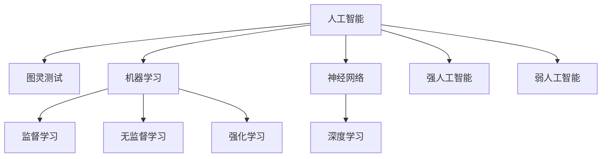

# 人工智能术语的首次提出

关键词：人工智能、图灵测试、机器学习、神经网络、深度学习、强人工智能、弱人工智能

## 1. 背景介绍
### 1.1  问题的由来
人工智能(Artificial Intelligence, AI)作为一门前沿交叉学科,其发展历程可以追溯到20世纪50年代。随着计算机科学和技术的不断进步,人工智能逐渐成为学术界和工业界关注的热点。人工智能旨在研究如何让机器模拟人类的智能行为,例如学习、推理、思考和解决问题等。然而,人工智能领域涉及的概念和术语纷繁复杂,有必要梳理人工智能术语的发展脉络,探究其首次提出的时间和背景。

### 1.2  研究现状
目前,国内外学者对人工智能术语的研究主要集中在以下几个方面:

(1)人工智能的定义和内涵。学者们从不同角度对人工智能的概念进行了界定,但尚未形成统一的认识。

(2)人工智能的发展历程。学者们梳理了人工智能的发展脉络,总结了不同历史阶段的主要成就和特点。 

(3)人工智能的分支领域。学者们对机器学习、知识表示、自然语言处理等人工智能的分支领域进行了深入研究。

(4)人工智能的应用场景。学者们探讨了人工智能在智能制造、自动驾驶、医疗诊断等领域的应用前景。

### 1.3  研究意义
梳理人工智能术语的首次提出对于人工智能的发展具有重要意义:

(1)有助于理清人工智能的发展脉络,把握人工智能技术的演进规律。

(2)有助于厘清人工智能领域的基本概念,加深对人工智能内涵的理解。

(3)有助于展望人工智能未来的发展方向,把握人工智能技术的前沿动态。

### 1.4  本文结构
本文将围绕人工智能术语的首次提出,展开以下论述:

第2部分,梳理人工智能的核心概念,分析其内在联系;

第3部分,介绍图灵测试的提出背景、内容要点和意义;

第4部分,总结人工智能术语提出的时间脉络;

第5部分,展望人工智能技术的未来发展趋势和面临的挑战。

## 2. 核心概念与联系
人工智能涉及一系列核心概念,它们相互关联、有机统一。下面梳理人工智能的几个核心概念:

(1)智能(Intelligence):智能是人工智能的本质特征。智能是主体根据环境信息,采取最优化行为以实现特定目标的能力。智能行为的关键是学习、推理、问题解决和知识表示。

(2)图灵测试(Turing Test):图灵测试由英国数学家图灵于1950年提出,旨在判定机器是否具有智能。在图灵测试中,人类评审与被评估的机器进行自然语言对话,通过问答互动判断机器是否表现出智能。

(3)机器学习(Machine Learning):机器学习是实现人工智能的重要途径。机器学习让计算机系统通过数据训练构建模型,根据样本数据优化模型参数,进而对新数据做出预测。常见的机器学习范式包括监督学习、无监督学习、强化学习等。

(4)神经网络(Neural Network):神经网络是一种模拟人脑神经元连接的计算模型。神经网络由大量的节点(神经元)和连接构成,通过调整连接的权重,改变网络的计算行为。神经网络是深度学习的基础。

(5)深度学习(Deep Learning):深度学习是一种多层神经网络模型。通过构建具有多个隐藏层的神经网络,深度学习能够学习数据的层次化特征表示,在语音识别、图像识别等领域取得了重大突破。

(6)强人工智能(Strong AI)和弱人工智能(Weak AI):强人工智能是指具有与人类相当的智能,能够胜任一般智力要求的各种任务;弱人工智能是指在特定领域表现出色的智能系统,但缺乏通用智能。

## 3. 图灵测试的提出
### 3.1 图灵测试的背景
英国数学家艾伦·图灵(Alan Turing)是人工智能的先驱。1950年,图灵在《计算机械与智能》一文中提出了著名的"图灵测试"。图灵测试开启了人工智能的发展进程,成为人工智能领域的奠基之作。

### 3.2 图灵测试的内容
图灵测试的基本思想是:如果一台机器能够与人类进行无法区分的对话,那么这台机器就可以被认为是智能的。图灵测试的具体过程如下:

(1)人类评审与被评估的机器分别位于不同的房间,通过终端进行文字交流;

(2)人类评审可以就任意话题与机器进行对话;

(3)经过一段时间的问答,人类评审根据对话的内容判断交流对象是人还是机器;

(4)如果人类评审无法确定对话对象是人还是机器,即被评估的机器表现出了人类智能,那么这台机器就通过了图灵测试。

### 3.3 图灵测试的意义
图灵测试虽然存在一定局限性,但具有里程碑式的意义:

(1)图灵测试开创了用行为表现评估机器智能的先河,为人工智能的发展指明了方向;

(2)图灵测试激发了人们对人工智能的研究兴趣,推动了人工智能领域的理论探索和技术创新;

(3)图灵测试引发了关于机器智能本质的哲学思考,深化了人们对人工智能内涵的认识。

## 4. 人工智能术语提出的时间脉络
人工智能术语的提出经历了一个漫长的过程,下面梳理几个重要术语的首次提出时间:

(1)1950年,图灵提出"图灵测试"概念,标志着人工智能研究的开端;

(2)1956年,达特茅斯学会首次使用"人工智能"(Artificial Intelligence)的概念;

(3)1959年,亚瑟·塞缪尔(Arthur Samuel)提出"机器学习"(Machine Learning)的概念;

(4)1986年,鲁梅尔哈特(Rumelhart)等人提出"反向传播算法"(Backpropagation),奠定了训练多层神经网络的基础;

(5)2006年,杰弗里·辛顿(Geoffrey Hinton)等人提出"深度信念网络"(Deep Belief Network),开创了深度学习的先河。

## 5. 未来发展趋势与挑战
展望未来,人工智能技术仍将不断突破,在更广泛的领域发挥作用。人工智能的发展趋势主要体现在以下几个方面:

(1)算法模型的不断优化,特别是深度学习算法的进一步发展;

(2)计算架构的持续升级,例如neuromorphic芯片、类脑计算系统等;

(3)数据资源的不断丰富,人工智能对大数据和云计算的依赖日益加深;

(4)人机协同的不断加强,人工智能将与人类形成更紧密的合作关系;

(5)行业应用的不断拓展,人工智能将渗透到社会生活的方方面面。

同时,人工智能的发展也面临诸多挑战:

(1)通用人工智能的实现仍然任重道远,现有人工智能系统缺乏常识推理能力;

(2)人工智能的可解释性有待加强,神经网络模型仍是"黑箱";

(3)人工智能的安全性和伦理问题日益凸显,亟需加强法律法规建设;

(4)人工智能人才的培养供给不足,高水平复合型人才紧缺。

## 6. 结语
人工智能术语的首次提出反映了人工智能技术的发展历程。从图灵测试到深度学习,人工智能领域不断涌现出新的概念和方法。展望未来,人工智能将继续引领科技创新,也将面临更多挑战。我们要立足当前,着眼长远,不断推动人工智能技术的进步,造福人类社会发展。

## 7. 参考文献
[1] Turing A M. Computing machinery and intelligence[J]. Mind, 1950: 433-460.

[2] Samuel A L. Some studies in machine learning using the game of checkers[J]. IBM Journal of research and development, 1959, 3(3): 210-229.

[3] Rumelhart D E, Hinton G E, Williams R J. Learning representations by back-propagating errors[J]. Nature, 1986, 323(6088): 533-536.

[4] Hinton G E, Osindero S, Teh Y W. A fast learning algorithm for deep belief nets[J]. Neural computation, 2006, 18(7): 1527-1554.

[5] 张钹. 人工智能:未来已来[M]. 北京:中信出版社, 2019.