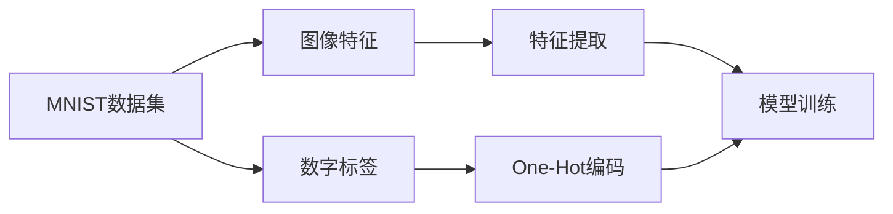

# 从零开始大模型开发与微调：MNIST数据集的特征和标签介绍

关键词：MNIST数据集, 大模型开发, 特征提取, 标签处理, 深度学习, 计算机视觉

## 1. 背景介绍
### 1.1 问题的由来
随着人工智能技术的飞速发展,深度学习模型在计算机视觉、自然语言处理等领域取得了令人瞩目的成就。而这些成就的取得,离不开高质量的数据集的支撑。在深度学习模型的训练过程中,数据集扮演着至关重要的角色。其中,MNIST手写数字识别数据集作为一个经典的数据集,被广泛应用于深度学习模型的入门学习和算法测试中。

### 1.2 研究现状
目前,基于MNIST数据集的研究工作层出不穷。许多经典的深度学习模型,如卷积神经网络(CNN)、循环神经网络(RNN)等,都曾在MNIST数据集上进行过训练和测试。一些新颖的算法思想,如对抗生成网络(GAN)、迁移学习等,也通过在MNIST数据集上的实验验证了其有效性。此外,MNIST数据集还被用于模型压缩、模型可解释性等研究方向。

### 1.3 研究意义
深入理解和分析MNIST数据集的特征和标签,对于初学者入门深度学习和计算机视觉具有重要意义。通过对MNIST数据集的探索,可以帮助我们建立对图像数据的直观认识,了解图像特征提取和标签处理的基本方法,为进一步学习和应用深度学习打下坚实的基础。同时,对MNIST数据集的研究也为改进现有模型、设计新的算法提供了思路和启发。

### 1.4 本文结构
本文将从以下几个方面对MNIST数据集进行深入探讨：
- 首先,介绍MNIST数据集的基本概念和数据集的来源与构成。
- 然后,重点分析MNIST数据集的图像特征,包括图像的尺寸、灰度值分布等,并给出特征可视化的示例。  
- 接着,讨论MNIST数据集的标签处理方法,介绍One-Hot编码的原理和实现。
- 之后,通过实际的代码实践,演示如何加载MNIST数据集,并对图像特征和标签进行预处理。
- 最后,总结MNIST数据集在深度学习领域的应用现状和未来的发展趋势,为后续的研究工作提供参考。

## 2. 核心概念与联系

在探讨MNIST数据集之前,我们先来了解几个核心概念：

- **MNIST数据集**：MNIST(Modified National Institute of Standards and Technology)是一个手写数字识别数据集,由美国国家标准与技术研究所(NIST)收集整理。它包含了60,000张训练图像和10,000张测试图像,每张图像都是28x28像素的灰度图,图像内容为0~9的手写数字。

- **特征提取**：特征提取是指从原始数据中提取出能够表征数据本质属性的特征表示。在图像识别任务中,特征提取就是要从图像的像素值中提取出对识别任务有判别力的特征,如边缘、纹理、形状等。

- **标签**：标签是指每个数据样本所对应的真实类别。在监督学习任务中,标签信息对于模型的训练至关重要。MNIST数据集中的每张图像都对应着一个0~9的数字标签。

- **One-Hot编码**：One-Hot编码是一种对分类标签进行编码的方式。它将标签转换为一个长度等于类别数的二进制向量,向量中只有对应类别的位置为1,其余位置为0。这种编码方式便于神经网络的训练。

下图展示了MNIST数据集、特征提取和标签之间的关系：



从上图可以看出,MNIST数据集包含图像特征和对应的数字标签。我们通过特征提取的方法获取图像的判别特征,并将标签进行One-Hot编码,最终输入到深度学习模型中进行训练。

## 3. 核心算法原理 & 具体操作步骤
### 3.1 算法原理概述
对于MNIST手写数字识别任务,我们通常采用卷积神经网络(CNN)进行特征提取和分类。CNN通过卷积层和池化层逐步提取图像的局部特征,并通过全连接层对特征进行分类。其基本原理如下：

- **卷积层**：通过卷积操作,提取图像的局部特征。卷积核在图像上滑动,对局部区域进行加权求和,得到特征图。

- **池化层**：通过下采样操作,降低特征图的空间维度,同时保留最显著的特征。常见的池化操作有最大池化和平均池化。

- **激活函数**：在卷积层和全连接层之后,通过非线性激活函数(如ReLU)引入非线性因素,增强网络的表达能力。

- **全连接层**：将提取到的特征展平,并通过全连接的方式进行分类预测。

- **Softmax层**：将全连接层的输出转换为概率分布,表示每个类别的置信度。

### 3.2 算法步骤详解
下面我们详细介绍使用CNN进行MNIST手写数字识别的步骤：

1. **数据加载与预处理**
   - 加载MNIST数据集,将图像数据和标签分别存储。
   - 对图像数据进行归一化处理,将像素值缩放到[0,1]范围内。
   - 将标签进行One-Hot编码。

2. **构建CNN模型**
   - 定义卷积层,指定卷积核大小、步长和填充方式。
   - 定义池化层,指定池化窗口大小和步长。
   - 定义全连接层,指定神经元数量。
   - 定义Softmax层,用于输出分类概率。

3. **模型训练**
   - 将预处理后的数据输入到CNN模型中。
   - 定义损失函数(如交叉熵损失)和优化算法(如Adam)。
   - 迭代进行前向传播和反向传播,更新模型参数。

4. **模型评估**
   - 在测试集上评估模型的性能,计算准确率等指标。
   - 可视化模型在测试集上的预测结果。

5. **模型微调与优化**
   - 调整模型的超参数,如学习率、批次大小等,以获得更好的性能。
   - 尝试不同的网络结构和激活函数,探索模型的改进空间。

### 3.3 算法优缺点
CNN在MNIST手写数字识别任务上表现出色,具有以下优点：
- 能够自动提取图像的局部特征,无需手工设计特征。
- 通过卷积和池化操作,具有平移不变性和局部感受野的特性。
- 相比全连接网络,参数量更少,训练效率更高。

但CNN也存在一些局限性：
- 对于大尺寸、高分辨率的图像,计算量较大。
- 对于旋转、缩放等变化,鲁棒性不够强。
- 解释性较差,难以直观理解模型的决策过程。

### 3.4 算法应用领域
CNN不仅适用于手写数字识别,还广泛应用于以下领域：
- 人脸识别
- 物体检测与分割
- 图像风格迁移
- 医学图像分析
- 遥感图像分类

## 4. 数学模型和公式 & 详细讲解 & 举例说明
### 4.1 数学模型构建
为了对CNN的原理有更深入的理解,我们需要了解其背后的数学模型。以下是CNN中几个关键步骤的数学表达：

1. **卷积操作**
设输入特征图为$X$,卷积核为$W$,卷积结果为$Y$,则卷积操作可表示为：

$$Y(i,j) = \sum_{m}\sum_{n}X(i+m,j+n)W(m,n)$$

其中,$i,j$表示输出特征图的位置索引,$m,n$表示卷积核的位置索引。

2. **池化操作**
设输入特征图为$X$,池化窗口大小为$k \times k$,池化结果为$Y$,则最大池化操作可表示为：

$$Y(i,j) = \max_{0 \leq m,n < k}X(i \times k+m,j \times k+n)$$

其中,$i,j$表示输出特征图的位置索引,$m,n$表示池化窗口内的位置索引。

3. **激活函数**
常用的激活函数有Sigmoid、Tanh和ReLU。以ReLU为例,其数学表达式为：

$$\text{ReLU}(x) = \max(0,x)$$

即将输入值$x$中的负值部分置为0,正值部分保持不变。

4. **Softmax函数**
Softmax函数将输入值转换为概率分布。设输入向量为$\mathbf{z}=[z_1,z_2,\ldots,z_K]^T$,则Softmax函数的输出为：

$$\text{Softmax}(z_i) = \frac{e^{z_i}}{\sum_{j=1}^{K}e^{z_j}}$$

其中,$z_i$表示第$i$个类别的输入值,$K$表示类别总数。

### 4.2 公式推导过程
以下我们以交叉熵损失函数的推导为例,说明CNN中的公式推导过程。

设真实标签为$\mathbf{y}=[y_1,y_2,\ldots,y_K]^T$,预测概率为$\mathbf{\hat{y}}=[\hat{y}_1,\hat{y}_2,\ldots,\hat{y}_K]^T$,则交叉熵损失函数定义为：

$$L(\mathbf{y},\mathbf{\hat{y}}) = -\sum_{i=1}^{K}y_i \log \hat{y}_i$$

将Softmax函数的定义代入,可得：

$$L(\mathbf{y},\mathbf{\hat{y}}) = -\sum_{i=1}^{K}y_i \log \frac{e^{z_i}}{\sum_{j=1}^{K}e^{z_j}}$$

化简可得：

$$L(\mathbf{y},\mathbf{\hat{y}}) = -\sum_{i=1}^{K}y_i (z_i - \log \sum_{j=1}^{K}e^{z_j})$$

进一步,对$z_i$求导,可得交叉熵损失函数对输入$z_i$的梯度：

$$\frac{\partial L}{\partial z_i} = \hat{y}_i - y_i$$

即预测概率与真实标签之差。

### 4.3 案例分析与讲解
下面我们以一个具体的例子来说明CNN在MNIST手写数字识别中的应用。

假设我们已经训练好了一个简单的CNN模型,其结构如下：
- 卷积层1：16个3x3的卷积核,步长为1,ReLU激活函数
- 最大池化层1：2x2的池化窗口,步长为2
- 卷积层2：32个3x3的卷积核,步长为1,ReLU激活函数
- 最大池化层2：2x2的池化窗口,步长为2
- 全连接层：128个神经元,ReLU激活函数
- Softmax层：10个神经元,对应0~9十个数字类别

现在,我们输入一张手写数字"7"的图像进行预测。图像经过两次卷积和池化后,提取出了128维的特征向量。最后,通过Softmax层输出每个数字类别的概率：

```
[0.01, 0.02, 0.03, 0.01, 0.01, 0.01, 0.01, 0.85, 0.03, 0.02]
```

可以看出,模型以85%的概率预测该图像为数字"7",与实际标签一致。这说明CNN模型成功学习到了手写数字的特征表示,并能够进行正确的分类。

### 4.4 常见问题解答
1. **问**：CNN中的卷积核大小如何选择？
   **答**：卷积核大小通常选择奇数,如3x3、5x5等。较小的卷积核可以减少参数量,较大的卷积核可以捕捉更大范围的特征。需要根据具体任务和数据集进行调整。

2. **问**：池化操作的作用是什么？
   **答**：池化操作可