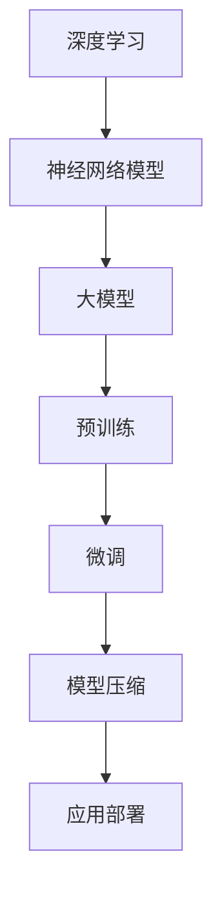

好的，我会按照您的要求，以"从零开始大模型开发与微调：基于深度学习的模型训练"为主题，撰写一篇专业、深入且结构完整的技术博客文章。

# 从零开始大模型开发与微调：基于深度学习的模型训练

## 1. 背景介绍

### 1.1 问题的由来

在当前的人工智能领域中,大型神经网络模型在自然语言处理、计算机视觉、语音识别等各个领域展现出了卓越的性能。随着数据量的不断增长和计算能力的提升,训练大规模深度学习模型成为了可能。然而,从零开始训练这些大型模型需要耗费大量的计算资源,并且需要具备相当丰富的经验和专业知识。

此外,针对特定任务对预训练模型进行微调(fine-tuning)也成为了一种常见的做法。但是如何高效地进行大模型的从头训练和微调,并充分利用现有的计算资源,仍然是一个值得探讨的重要课题。

### 1.2 研究现状

目前,已经有多个科技公司和研究机构在大模型训练方面取得了重要进展。例如:

- OpenAI的GPT系列模型
- Google的BERT和T5模型
- DeepMind的AlphaFold模型
- 百度的ERNIE系列模型
- ...

这些模型在各自的领域取得了卓越的性能,但它们的训练过程往往需要大量的计算资源和专业知识。同时,也有一些开源的大模型训练框架和工具涌现出来,如TensorFlow、PyTorch、Hugging Face Transformers等,为大模型训练提供了便利。

### 1.3 研究意义 

能够高效地从零开始训练大型神经网络模型,并根据特定任务对模型进行微调,对于推动人工智能技术的发展至关重要。具体来说,本研究的意义包括:

1. **提高模型性能**:通过从头训练,可以针对特定任务和数据集,训练出性能更优的定制化模型。
2. **降低计算成本**:优化训练流程,提高资源利用效率,降低训练所需的计算资源消耗。
3. **促进知识共享**:探索大模型训练的最佳实践,并开源相关代码和工具,促进知识共享和技术普及。
4. **拓展应用场景**:定制化的大型模型可以为更多领域提供强大的人工智能能力,拓展应用场景。

### 1.4 本文结构

本文将从以下几个方面深入探讨大模型的开发与微调:

1. 核心概念与联系
2. 核心算法原理与具体操作步骤
3. 数学模型和公式详细推导
4. 项目实践:代码实例和详细解释
5. 实际应用场景
6. 工具和资源推荐
7. 总结:未来发展趋势与挑战
8. 附录:常见问题与解答

## 2. 核心概念与联系

在深入讨论大模型开发与微调之前,我们需要了解一些核心概念及它们之间的联系。

### 2.1 深度学习

深度学习(Deep Learning)是机器学习的一个子领域,它基于具有多层非线性变换单元的人工神经网络,通过模式分析和表示学习来解决问题。深度学习模型能够自动从数据中学习特征表示,并在许多领域展现出卓越的性能,如计算机视觉、自然语言处理、语音识别等。

### 2.2 神经网络模型

神经网络模型是深度学习的核心,它由多层神经元组成,每一层对上一层的输出进行非线性变换。常见的神经网络模型包括:

- 前馈神经网络(Feedforward Neural Network)
- 卷积神经网络(Convolutional Neural Network, CNN)
- 循环神经网络(Recurrent Neural Network, RNN)
- 长短期记忆网络(Long Short-Term Memory, LSTM)
- 门控循环单元(Gated Recurrent Unit, GRU)
- transformer模型

其中,transformer模型由于其并行计算能力和长期依赖捕捉能力,在自然语言处理等领域表现出色,成为了大模型的主要架构。

### 2.3 大模型

所谓大模型(Large Model),是指具有数十亿甚至上百亿参数的大型神经网络模型。这些模型通常在大规模数据集上进行预训练,获得通用的表示能力,然后可以通过微调(fine-tuning)来适应特定的下游任务。

大模型的优势在于其强大的表示能力和泛化性能,但同时也面临着训练计算资源需求巨大、微调效率低下等挑战。

### 2.4 预训练与微调

预训练(Pre-training)是指在大规模无标注数据上训练模型,使其学习通用的表示能力。常见的预训练方法包括:

- 自监督预训练(Self-Supervised Pre-training)
- 有监督预训练(Supervised Pre-training)
- 半监督预训练(Semi-Supervised Pre-training)

微调(Fine-tuning)则是指在预训练模型的基础上,使用特定任务的标注数据,对模型进行进一步的训练和调整,使其适应该任务。微调通常只需要训练模型的部分层,因此计算成本较低,但如何高效地进行微调仍然是一个挑战。

### 2.5 模型压缩

由于大模型通常包含数十亿甚至上百亿参数,因此它们在部署和inference时会消耗大量的计算资源和存储空间。为了解决这个问题,需要采用模型压缩技术,如:

- 量化(Quantization)
- 知识蒸馏(Knowledge Distillation)
- 剪枝(Pruning)
- 低秩分解(Low-Rank Decomposition)

通过模型压缩,可以在保持模型性能的同时,大幅减小模型的存储和计算开销。

### 2.6 核心概念关系

上述核心概念之间存在着密切的关联,如下图所示:

深度学习是大模型开发的理论基础,神经网络模型则是其核心架构。大模型通过预训练获得通用表示能力,再通过微调适应特定任务。为了高效部署大模型,需要进行模型压缩。

## 3. 核心算法原理与具体操作步骤

### 3.1 算法原理概述

大模型的训练过程主要包括以下几个核心步骤:

1. **数据预处理**:对原始数据进行清洗、标注、切分等预处理,以满足模型的输入要求。
2. **模型架构设计**:根据任务需求和数据特征,设计合适的神经网络模型架构,如transformer、CNN等。
3. **预训练**:在大规模无标注数据上训练模型,使其学习通用的表示能力。常用的预训练方法包括自监督预训练、有监督预训练等。
4. **微调**:在预训练模型的基础上,使用特定任务的标注数据,对模型进行进一步的训练和调整,使其适应该任务。
5. **模型评估**:使用验证集或测试集对模型进行评估,了解其在特定任务上的性能表现。
6. **模型优化**:根据评估结果,通过调整超参数、架构等方式对模型进行优化,提高其性能。
7. **模型压缩(可选)**:对训练好的大模型进行压缩,以减小其存储和计算开销,便于部署。

在整个过程中,还需要注意以下几个关键点:

- **大规模计算资源**:训练大模型通常需要大量的计算资源,如GPU集群、TPU等。
- **分布式训练**:为了加速训练过程,需要采用分布式训练技术,如数据并行、模型并行等。
- **优化器选择**:合理选择优化算法(如Adam、AdamW等)和学习率调度策略,对模型收敛性能至关重要。
- **正则化**:采用正则化技术(如dropout、权重衰减等)可以有效缓解过拟合问题。

### 3.2 算法步骤详解

接下来,我们将详细介绍大模型训练的具体步骤。

#### 3.2.1 数据预处理

数据预处理是模型训练的重要前提,主要包括以下几个步骤:

1. **数据采集**:从各种来源(如网络、数据库等)采集原始数据。
2. **数据清洗**:去除数据中的噪声、错误、重复等无效信息。
3. **数据标注**:对于有监督学习任务,需要对数据进行人工标注或自动标注。
4. **数据切分**:将数据划分为训练集、验证集和测试集。
5. **数据增强**:通过一些变换(如旋转、缩放等)生成更多的训练数据,提高模型的泛化能力。
6. **数据格式化**:将预处理后的数据转换为模型可接受的格式,如文本tokenization等。

#### 3.2.2 模型架构设计

模型架构的设计对于大模型的性能至关重要,需要根据任务需求和数据特征进行合理选择。常见的大模型架构包括:

1. **Transformer**:自注意力机制和编码器-解码器结构,广泛应用于自然语言处理任务。
2. **Vision Transformer(ViT)**:将Transformer应用于计算机视觉任务,直接对图像进行处理。
3. **BERT**:基于Transformer的双向编码器,在多项NLP任务上表现出色。
4. **GPT**:基于Transformer的单向解码器,擅长生成式任务,如文本生成。
5. **ResNet**:残差神经网络,在计算机视觉领域有着广泛的应用。
6. **EfficientNet**:设计精巧的卷积神经网络,在参数量和计算量方面更加高效。

除了选择合适的基础架构外,还需要根据具体任务对模型进行定制化设计,如添加特定的注意力机制、损失函数等。

#### 3.2.3 预训练

预训练是大模型训练的关键环节,目的是使模型学习通用的表示能力。常见的预训练方法包括:

1. **自监督预训练**:利用无标注数据进行预训练,常见方法有BERT的Masked Language Model、GPT的自回归语言模型等。
2. **有监督预训练**:使用带标注的数据进行预训练,如ImageNet数据集上的图像分类预训练。
3. **半监督预训练**:结合有标注和无标注数据进行联合预训练。

预训练过程中,需要注意以下几点:

- **大规模数据**:预训练通常需要大量的数据,以确保模型能够学习到丰富的知识。
- **长期训练**:预训练过程往往需要数周甚至数月的时间,以充分利用数据。
- **合理采样**:对于不均衡的数据集,需要采取合理的采样策略,避免模型偏向于某些类别。
- **正则化**:采用正则化技术(如dropout、权重衰减等)可以提高模型的泛化能力。

#### 3.2.4 微调

微调是在预训练模型的基础上,使用特定任务的标注数据进行进一步训练,以使模型适应该任务。微调过程中需要注意以下几点:

1. **学习率设置**:通常需要使用较小的学习率,以避免破坏预训练模型中已经学习到的有用知识。
2. **层级微调**:可以只微调模型的部分层(如输出层),或者对全部层进行微调。前者计算开销较小,但后者往往能获得更好的性能。
3. **训练数据量**:微调通常只需要较少的标注数据,但数据量仍然会影响模型的性能。
4. **早停策略**:为了避免过拟合,可以采用早停(Early Stopping)策略,在模型性能不再提升时停止训练。

#### 3.2.5 模型评估

在训练过程中,需要定期使用验证集对模型进行评估,了解其在特定任务上的性能表现。常见的评估指标包括:

- **分类任务**:准确率(Accuracy)、精确率(Precision)、召回率(Recall)、F1分数等。
- **回归任务**:均方根误差(RMSE)、平均绝对误差