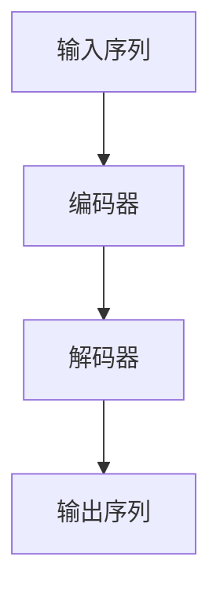

# 从零开始大模型开发与微调：拼音汉字模型的训练

## 1. 背景介绍

### 1.1 问题的由来

随着自然语言处理(NLP)技术的快速发展,基于深度学习的语言模型在各种应用场景中展现出了令人惊叹的能力。然而,由于汉语的特殊性,传统的基于词向量的模型在处理汉语时存在一定局限性。汉语是一种表意文字,没有明确的词界分隔,这给词语的识别和分词带来了挑战。同时,汉语的多音字、同音异形词等特点也增加了语义理解的难度。因此,开发一种能够有效处理汉语的语言模型变得尤为重要。

### 1.2 研究现状

近年来,随着大规模语料库的出现和计算能力的提升,基于自注意力机制的Transformer模型在NLP领域取得了突破性的进展。谷歌推出的BERT(Bidirectional Encoder Representations from Transformers)模型通过预训练和微调的方式,在多项NLP任务中取得了state-of-the-art的表现。然而,由于BERT模型是基于英文语料训练的,在处理汉语时存在一定局限性。

为了更好地适应汉语的特点,一些研究人员尝试在BERT模型的基础上进行改进,例如引入拼音信息、增加字位置编码等方式。同时,也有一些研究人员从头开始训练面向汉语的语言模型,例如哈工大推出的BERT-wwm模型、百度推出的ERNIE模型等。这些模型在一定程度上提高了对汉语的处理能力,但仍然存在一些不足之处。

### 1.3 研究意义

开发一种能够高效处理汉语的语言模型,对于推动汉语NLP技术的发展具有重要意义。一方面,它可以提高现有NLP系统在汉语场景下的性能,为众多应用领域带来实际收益。另一方面,通过研究汉语的特殊性,也有助于加深对自然语言本质的理解,促进NLP理论的发展。

本文旨在从零开始训练一个面向汉语的大型语言模型,专门针对汉语的拼音和字形特征进行建模。通过引入拼音信息和增强字位置编码,期望能够更好地捕捉汉语的语义和结构信息。同时,本文也将探讨如何在有限的计算资源下高效地训练大型模型,以及如何对预训练模型进行微调以适应特定的下游任务。

### 1.4 本文结构

本文的结构安排如下:

1. 背景介绍:阐述研究问题的由来、现状和意义。
2. 核心概念与联系:介绍本文所涉及的核心概念,如Transformer、自注意力机制、预训练与微调等,并说明它们之间的联系。
3. 核心算法原理与具体操作步骤:详细阐述本文所采用的算法原理,包括模型架构、输入表示、训练策略等,并给出具体的操作步骤。
4. 数学模型和公式详细讲解与举例说明:推导本文所使用的数学模型和公式,并通过具体案例进行讲解和分析。
5. 项目实践:代码实例和详细解释说明:提供完整的代码实现,并对关键部分进行解读和分析,展示实际运行结果。
6. 实际应用场景:探讨本文所提出模型在实际应用中的场景,如机器翻译、问答系统等,并对未来的应用前景进行展望。
7. 工具和资源推荐:推荐一些有助于学习和开发的工具、资源和相关论文。
8. 总结:未来发展趋势与挑战:总结本文的研究成果,并对未来的发展趋势和面临的挑战进行展望。
9. 附录:常见问题与解答:列出一些常见问题并给出解答。

## 2. 核心概念与联系

在深入探讨本文的核心算法之前,有必要先介绍一些相关的核心概念,以帮助读者更好地理解后续内容。本节将重点介绍Transformer模型、自注意力机制、预训练与微调等概念,并说明它们之间的联系。

### 2.1 Transformer模型

Transformer是一种全新的基于自注意力机制的序列到序列(Seq2Seq)模型,由谷歌的Vaswani等人在2017年提出。它完全摒弃了传统序列模型中的循环神经网络(RNN)和卷积神经网络(CNN)结构,而是完全依赖注意力机制来捕捉输入和输出之间的长程依赖关系。

Transformer模型的核心组件包括编码器(Encoder)和解码器(Decoder)两部分。编码器的主要任务是将输入序列映射为一系列连续的向量表示,而解码器则根据编码器的输出和自身的状态生成目标序列。两者之间通过注意力机制进行信息交互。

### 2.2 自注意力机制

自注意力机制是Transformer模型的核心,它允许模型在计算每个位置的表示时,直接关注整个输入序列中的所有位置。具体来说,自注意力机制通过计算查询(Query)、键(Key)和值(Value)之间的相似性分数,从而捕捉输入序列中不同位置之间的依赖关系。

相比传统的RNN和CNN,自注意力机制具有并行计算的优势,可以有效解决长期依赖问题,同时也避免了梯度消失或爆炸的风险。此外,自注意力机制还能够自动学习输入序列中不同位置之间的重要性权重,从而更好地捕捉全局信息。

### 2.3 预训练与微调

预训练(Pre-training)和微调(Fine-tuning)是当前主流的迁移学习范式,广泛应用于NLP任务中。预训练阶段的目标是在大规模无监督语料库上训练一个通用的语言模型,捕捉自然语言的一般性规律和知识。而微调阶段则是在特定的下游任务上,基于预训练模型的参数继续训练,使模型适应具体的任务需求。

这种预训练加微调的范式可以极大地提高模型的泛化能力和性能表现。一方面,预训练阶段可以充分利用大规模语料,学习丰富的语言知识;另一方面,微调阶段则可以将这些知识迁移到特定任务中,同时结合任务数据进行进一步优化。

### 2.4 概念联系

上述三个核心概念之间存在紧密的联系。Transformer模型提供了一种全新的基于自注意力机制的架构,它为预训练语言模型奠定了基础。而预训练与微调的范式则为Transformer模型的训练和应用提供了有效的方法论支持。

具体来说,我们可以在大规模语料库上预训练一个基于Transformer架构的通用语言模型,利用自注意力机制来捕捉输入序列中的长程依赖关系。然后,针对特定的下游任务,我们可以在预训练模型的基础上进行微调,使模型适应任务需求。这种预训练加微调的范式已经在多项NLP任务中取得了卓越的成绩,成为了当前主流的做法。

本文将在Transformer模型的基础上,针对汉语的特点进行改进和优化,旨在开发一种能够高效处理汉语的大型语言模型。同时,我们也将探讨如何在有限的计算资源下高效地进行预训练,以及如何对预训练模型进行微调以适应不同的下游任务。

## 3. 核心算法原理与具体操作步骤

### 3.1 算法原理概述

本文所提出的算法是在Transformer模型的基础上,针对汉语的特点进行改进和优化。我们的目标是开发一种能够高效处理汉语的大型语言模型,专门针对汉语的拼音和字形特征进行建模。

算法的核心思想包括以下几个方面:

1. **引入拼音信息**:由于汉语存在多音字、同音异形词等特点,单纯依赖字形信息难以准确捕捉语义。因此,我们将拼音信息作为辅助特征引入模型,以提高对语音语义的建模能力。

2. **增强字位置编码**:传统的位置编码方式难以很好地捕捉汉语中字的相对位置信息。我们将设计一种新的位置编码方式,专门针对汉语字的位置关系进行建模。

3. **改进注意力机制**:基于汉语的特点,我们将对原始的自注意力机制进行改进,引入一些特殊的注意力机制,以更好地捕捉汉语的结构和语义信息。

4. **优化训练策略**:针对大型模型的训练,我们将采用一些优化策略,如梯度累积、层级训练等,以提高训练效率,并在有限的计算资源下实现高效的模型训练。

5. **模型微调**:为了适应不同的下游任务,我们将探讨如何对预训练模型进行微调,使其能够更好地适应特定任务的需求。

下面将详细介绍算法的具体原理和操作步骤。

### 3.2 算法步骤详解

#### 3.2.1 模型架构

我们的模型架构基于Transformer的编码器-解码器结构,如下图所示:

编码器的主要任务是将输入序列映射为一系列连续的向量表示,而解码器则根据编码器的输出和自身的状态生成目标序列。两者之间通过自注意力机制进行信息交互。

#### 3.2.2 输入表示

对于每个输入字符,我们将使用以下几种嵌入向量进行表示:

1. **字嵌入(Word Embedding)**:将每个字映射为一个固定长度的向量表示,捕捉字的语义信息。

2. **拼音嵌入(Pinyin Embedding)**:将每个字对应的拼音映射为一个向量表示,作为辅助特征引入模型。

3. **位置嵌入(Position Embedding)**:使用一种新的位置编码方式,专门针对汉语字的相对位置关系进行建模。

4. **其他嵌入(Other Embeddings)**:根据需要,还可以引入其他辅助特征的嵌入向量,如词性、语义角色等。

上述嵌入向量将被concatenate或sum操作合并,作为模型的输入特征。

#### 3.2.3 编码器

编码器由多个相同的层组成,每一层包括两个子层:多头自注意力机制(Multi-Head Attention)和前馈神经网络(Feed-Forward Neural Network)。

1. **多头自注意力机制**:我们将对原始的自注意力机制进行改进,引入一些特殊的注意力机制,以更好地捕捉汉语的结构和语义信息。具体来说,我们将设计以下几种注意力机制:

   - **Local Attention**:专门用于捕捉局部上下文信息,如词内字符之间的关系。
   - **Global Attention**:用于捕捉全局上下文信息,如句子中不同词语之间的关系。
   - **Pinyin Attention**:利用拼音信息,捕捉同音字之间的关系。
   - **Position Attention**:利用改进的位置编码,捕捉字的相对位置关系。

   这些注意力机制将被组合成多头注意力机制,共同作用于输入序列。

2. **前馈神经网络**:该子层由两个全连接层组成,用于对每个位置的表示进行非线性转换,提取更高层次的特征。

编码器的输出将被传递给解码器,用于生成目标序列。

#### 3.2.4 解码器

解码器的结构与编码器类似,也由多个相同的层组成,每一层包括三个子层:

1. **masked多头自注意力机制**:与编码器的自注意力机制类似,但增加了掩码操作,确保每个位置的表示只依赖于该位置之前的输入。

2. **编码器-解码器注意力机制**:将解码器的输出与编码器的输出进行注意力计算,捕捉输入和输出之间的依赖关系。

3. **前馈神经网络**:与编码器中的前馈网络结构相同。

解码器的输出将通过一个线性层和softmax层,生