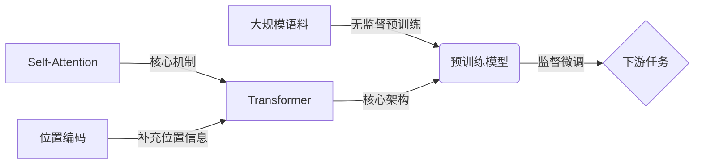

# 从零开始大模型开发与微调：模型的设计

关键词：大模型、自然语言处理、Transformer、微调、预训练、模型架构

## 1. 背景介绍
### 1.1 问题的由来
随着深度学习技术的快速发展,自然语言处理(NLP)领域取得了巨大的进步。传统的NLP方法主要依赖于人工特征工程和浅层神经网络,难以捕捉语言中的深层语义信息。近年来,以Transformer为代表的大规模预训练语言模型(PLM)在多个NLP任务上取得了显著的性能提升,成为当前NLP研究的主流范式。然而,训练一个高质量的大模型需要海量的数据和计算资源,对于许多研究者和企业来说是一个巨大的挑战。因此,如何从零开始高效地开发和微调大模型,成为当前亟需解决的问题。

### 1.2 研究现状
目前,大模型的研究主要集中在两个方面:模型架构的设计和预训练方法的改进。在模型架构方面,以Transformer为基础,研究者提出了一系列改进方案,如增加模型深度和宽度、引入注意力机制变体、优化层归一化等,显著提升了模型的性能。在预训练方法方面,主要探索了不同的预训练任务和目标函数,如掩码语言模型(MLM)、置换语言模型(PLM)、对比学习等,增强了模型学习语言知识的能力。此外,模型压缩和知识蒸馏技术的进步,也为大模型的部署应用提供了新的思路。尽管取得了诸多进展,但从零开始开发大模型仍然面临诸多挑战,如训练效率低、资源消耗大、调优难度高等,亟需系统性的研究。

### 1.3 研究意义 
从零开始开发大模型具有重要的理论和实践意义。首先,大模型蕴含着丰富的语言知识,对其内在机制的研究有助于加深对人类语言认知的理解,推动认知科学和人工智能的发展。其次,高质量的大模型是构建智能对话、机器翻译、信息抽取等应用系统的基础,对于提升NLP系统的性能和用户体验具有重要价值。此外,探索从零开始开发大模型的有效方法,可以降低模型训练的门槛,使更多研究者和企业受益,促进NLP技术的普及应用。

### 1.4 本文结构
本文将系统地介绍从零开始开发大模型的关键技术,重点探讨模型架构的设计。第2部分介绍大模型涉及的核心概念;第3部分详细阐述Transformer的核心算法原理和具体操作步骤;第4部分给出Transformer的数学模型和公式推导过程;第5部分通过代码实例演示如何实现一个基于Transformer的大模型;第6部分讨论大模型的实际应用场景;第7部分推荐相关的学习资源和开发工具;第8部分总结全文,展望大模型的未来发展趋势和挑战;第9部分列举常见问题与解答。

## 2. 核心概念与联系

在开始详细介绍大模型的设计之前,我们有必要先明确一些核心概念:

- **大模型(Large Model)**:参数量达到亿级甚至千亿级的超大规模深度学习模型,通常采用Transformer架构,在大规模语料上进行预训练,可以学习到丰富的语言知识。代表模型有BERT、GPT、T5等。

- **预训练(Pre-training)**:在大规模无标注语料上对模型进行自监督学习,使其学习到通用的语言表示。预训练阶段通常采用语言建模任务,如MLM和CLM。预训练使模型具备了强大的迁移学习能力。

- **微调(Fine-tuning)**:在下游任务的标注数据上对预训练模型进行监督学习,使其适应特定任务。微调阶段通常采用任务特定的损失函数,如交叉熵损失。微调使预训练模型能够快速适应新任务,显著提升性能。

- **Transformer**:一种基于自注意力机制的神经网络架构,摒弃了传统的RNN和CNN,通过Self-Attention捕捉词之间的长距离依赖,并行计算效率高。Transformer已成为大模型的标准架构。

- **自注意力机制(Self-Attention)**:一种将序列中每个位置与其他所有位置建立联系的注意力机制。Self-Attention通过计算Query、Key、Value三个矩阵的乘积,得到每个位置的注意力权重,实现了全局建模。

- **位置编码(Positional Encoding)**:由于Transformer没有RNN的循环结构,缺乏对位置信息的建模能力。位置编码通过在输入嵌入中加入位置向量,为模型引入位置信息。

下图展示了这些核心概念之间的联系:

理解这些核心概念之间的联系,有助于我们更好地掌握大模型的设计原理。接下来,我们将详细介绍Transformer的算法原理和具体实现。

## 3. 核心算法原理 & 具体操作步骤
### 3.1 算法原理概述
Transformer的核心是自注意力机制和前馈神经网络,通过堆叠多个Encoder和Decoder层构成。Encoder负责对输入序列进行特征提取,Decoder负责根据Encoder的输出和之前的预测结果生成目标序列。

在Encoder的每一层中,首先对输入序列进行自注意力计算,捕捉序列内部的长距离依赖关系;然后通过前馈神经网络对特征进行非线性变换,提取高层语义信息。多个Encoder层堆叠,逐步提炼语义表示。

在Decoder的每一层中,也采用了自注意力机制和前馈神经网络,此外还引入了Encoder-Decoder注意力,用于关联Encoder的输出与Decoder的输入。Decoder根据Encoder的语义表示和之前的预测结果,逐步生成目标序列。

自注意力机制是Transformer的核心,通过计算Query、Key、Value三个矩阵的乘积,得到序列中每个位置与其他位置的注意力权重,实现了全局建模。

### 3.2 算法步骤详解

下面我们详细介绍Transformer的算法步骤:

**Encoder:**
1. 输入嵌入:将输入序列中的每个token映射为固定维度的稠密向量。
2. 位置编码:在输入嵌入中加入表示位置信息的向量,引入序列的先后顺序信息。
3. 自注意力计算:
   - 根据输入嵌入计算Query、Key、Value矩阵。
   - 计算Query与Key的点积,得到注意力分数矩阵。
   - 对注意力分数矩阵进行Softmax归一化,得到注意力权重矩阵。
   - 注意力权重矩阵与Value相乘,得到自注意力输出。
4. 残差连接和层归一化:将自注意力输出与输入嵌入相加,并进行层归一化,稳定训练。
5. 前馈神经网络:通过两层全连接网络对特征进行非线性变换,提取高层语义。
6. 残差连接和层归一化:将前馈网络输出与步骤4的输出相加,并进行层归一化。
7. 重复步骤3-6,堆叠多个Encoder层。

**Decoder:**
1. 输出嵌入:将之前的预测结果映射为固定维度的稠密向量。
2. 位置编码:在输出嵌入中加入表示位置信息的向量。
3. 掩码自注意力计算:
   - 根据输出嵌入计算Query、Key、Value矩阵。
   - 计算Query与Key的点积,得到注意力分数矩阵。
   - 对注意力分数矩阵进行掩码操作,屏蔽未来位置的信息。
   - 对掩码后的注意力分数矩阵进行Softmax归一化,得到注意力权重矩阵。
   - 注意力权重矩阵与Value相乘,得到掩码自注意力输出。
4. 残差连接和层归一化:将掩码自注意力输出与输出嵌入相加,并进行层归一化。
5. Encoder-Decoder注意力计算:
   - 根据步骤4的输出计算Query矩阵,Encoder输出作为Key和Value矩阵。
   - 计算Query与Key的点积,得到注意力分数矩阵。
   - 对注意力分数矩阵进行Softmax归一化,得到注意力权重矩阵。
   - 注意力权重矩阵与Value相乘,得到Encoder-Decoder注意力输出。
6. 残差连接和层归一化:将Encoder-Decoder注意力输出与步骤4的输出相加,并进行层归一化。
7. 前馈神经网络:通过两层全连接网络对特征进行非线性变换。
8. 残差连接和层归一化:将前馈网络输出与步骤6的输出相加,并进行层归一化。
9. 重复步骤3-8,堆叠多个Decoder层。
10. 线性层和Softmax:将Decoder最后一层的输出通过线性层和Softmax,得到下一个token的概率分布。

以上就是Transformer的核心算法步骤。通过自注意力机制和前馈网络的交替堆叠,Transformer能够高效地建模序列内部和序列之间的依赖关系,在多个NLP任务上取得了显著的性能提升。

### 3.3 算法优缺点

Transformer相比传统的RNN和CNN具有以下优点:
- 并行计算效率高:自注意力机制摒弃了循环结构,可以充分利用GPU等硬件进行并行计算,大大提高了训练和推理速度。
- 长距离依赖建模能力强:通过自注意力机制,Transformer可以直接建模任意两个位置之间的依赖关系,克服了RNN梯度消失的问题。
- 可扩展性好:Transformer通过增加层数和注意力头数可以轻松扩大模型容量,适合训练大规模语言模型。

同时,Transformer也存在一些局限性:
- 计算复杂度高:自注意力机制需要计算序列中每个位置与其他所有位置的注意力权重,计算复杂度为平方级别,难以处理很长的序列。
- 缺乏位置信息建模:Transformer缺少RNN的循环结构,需要额外引入位置编码来补充位置信息,但位置编码的效果有限。
- 解释性差:Transformer作为黑盒模型,其内部工作机制难以解释,缺乏可解释性。

### 3.4 算法应用领域

得益于其强大的特征提取和语义建模能力,Transformer已成为各类NLP任务的主流架构,广泛应用于以下领域:

- 机器翻译:Transformer是当前机器翻译系统的标准架构,如Google的NMT系统。
- 智能对话:基于Transformer的预训练模型如GPT和DialoGPT,可以生成流畅自然的对话响应。
- 文本分类:BERT等预训练模型通过微调可以轻松适应各类文本分类任务,如情感分析、新闻分类等。
- 信息抽取:Transformer可以有效地建模文本中的实体和关系,用于实体识别、关系抽取等任务。
- 文本摘要:通过Encoder-Decoder架构,Transformer可以从长文本中抽取关键信息,生成简洁的摘要。
- 语义匹配:Transformer可以建模两个文本之间的语义相似度,用于搜索排序、问答匹配等任务。

除了NLP领域,Transformer也被引入到计算机视觉、语音识别、图表示学习等领域,展现出广阔的应用前景。

## 4. 数学模型和公式 & 详细讲解 & 举例说明
### 4.1 数学模型构建

为了更好地理解Transformer的工作原理,我们需要建立其数学模型。以下是Transformer的关键数学概念和符号定义:

- 输入序列:$\mathbf{x}=(x_1,\ldots,x_n)$,其中$x_i \in \mathbb{R}^d$为第$