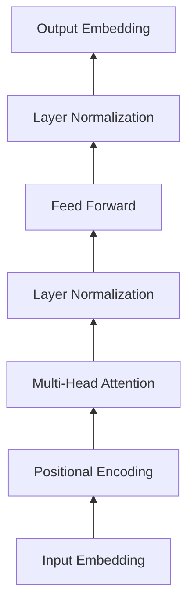

# 从零开始大模型开发与微调：自定义神经网络框架的具体实现

关键词：大模型、神经网络、微调、框架开发、深度学习

## 1. 背景介绍
### 1.1 问题的由来
近年来,随着深度学习的快速发展,大规模预训练语言模型(Large Pre-trained Language Models,PLMs)引起了学术界和工业界的广泛关注。这些大模型在自然语言处理(NLP)的各项任务上取得了突破性的进展,展现出强大的语言理解和生成能力。然而,训练这些大模型需要巨大的计算资源和训练数据,对于许多研究者和开发者来说是一个挑战。如何从零开始开发和微调大模型,并构建自定义的神经网络框架,成为了一个亟待解决的问题。

### 1.2 研究现状
目前,业界主流的大模型如 GPT-3、BERT、RoBERTa 等都是基于 Transformer 架构,并在大规模语料上进行预训练得到的。这些大模型包含数以亿计的参数,展现出强大的语言建模能力。为了方便使用这些大模型,一些开源的深度学习框架如 PyTorch、TensorFlow 提供了预训练模型的实现和微调接口。但是,这些框架提供的是通用的神经网络构建模块,在灵活性和定制化方面还有待提高。一些研究者开始探索从零开始开发定制化的神经网络框架,以更好地满足大模型开发的需求。

### 1.3 研究意义
从零开始开发大模型并构建自定义的神经网络框架,具有重要的研究意义:

1. 有助于深入理解大模型的内部工作原理,掌握核心算法和数学原理。
2. 可以根据具体任务需求,定制化设计神经网络架构和训练策略,提高模型性能。 
3. 有利于优化模型训练和推理的效率,减少计算资源的消耗。
4. 为后续的模型压缩、量化、部署等工作提供基础支撑。

因此,本文将重点介绍如何从零开始开发大模型,并基于 PyTorch 构建自定义的神经网络框架,同时给出详细的代码实现和讲解,为相关研究提供参考。

### 1.4 本文结构
本文将从以下几个方面展开:

1. 介绍大模型开发涉及的核心概念和技术要点。
2. 详细讲解 Transformer 等主流模型的核心算法原理和数学公式。
3. 基于 PyTorch 从零开始实现 Transformer 等主流模型。 
4. 介绍模型微调、推理优化等实用技巧。
5. 总结大模型技术的发展趋势和面临的挑战。

## 2. 核心概念与联系
在开始详细讲解大模型开发的技术细节之前,我们先来了解一下其中涉及的一些核心概念:

- **大模型(Large Model)**: 泛指参数量巨大(通常在亿级以上)的深度神经网络模型,如 GPT-3 包含 1750 亿参数。大模型通过在海量数据上训练,可以学习到丰富的语言知识,具备强大的语言理解和生成能力。

- **预训练(Pre-training)**: 指在大规模无标注语料上对模型进行自监督学习,让模型自己学习语言的统计规律和模式。预训练是大模型的关键,使其能够学习到通用的语言表示。常见的预训练任务有语言模型、掩码语言模型等。

- **微调(Fine-tuning)**: 指在预训练的基础上,使用少量标注数据对模型进行针对性的调优,使其适应特定的下游任务。微调可以大大减少所需的标注数据,是迁移学习的重要方式。

- **Transformer**: 一种基于自注意力机制的神经网络架构,已成为大模型的主流架构。Transformer 通过 Self-Attention 建模序列内和序列间的依赖关系,并行性好,适合处理长文本。

- **自注意力(Self-Attention)**: Transformer 的核心组件,用于计算序列中元素之间的依赖权重。自注意力可以建模任意距离的依赖关系,是 Transformer 的关键创新点。

- **位置编码(Positional Encoding)**: 由于 Transformer 没有显式地建模位置信息,需要通过位置编码将位置信息引入到输入表示中。常见的位置编码有正弦曲线位置编码、可学习的位置编码等。

- **残差连接(Residual Connection)**: 一种在神经网络中广泛使用的技巧,通过将输入直接传递到输出,缓解了深层网络的优化难题。Transformer 中的每一层都用到了残差连接。

- **层归一化(Layer Normalization)**: 一种对神经网络层的激活值进行归一化的方法,可以加速模型收敛,提高训练稳定性。Transformer 中的每一个子层之后都会接一个层归一化。

理解了这些核心概念,我们就可以更好地理解大模型的工作原理。下面将重点介绍 Transformer 的核心算法和数学原理。

## 3. 核心算法原理 & 具体操作步骤
### 3.1 算法原理概述
Transformer 作为大模型的主流架构,其核心是采用自注意力机制来建模序列内和序列间的依赖关系。与传统的 RNN、CNN 等模型相比,Transformer 具有以下优势:

1. 并行计算能力强,计算复杂度与序列长度呈线性关系。
2. 可以建模任意距离的长程依赖关系。
3. 结构简单,易于实现和优化。

Transformer 的整体架构如下图所示:

可以看到,Transformer 主要由输入嵌入层、位置编码、多头自注意力、前馈网络、层归一化等组件组成。下面我们对每个组件的算法原理进行详细讲解。

### 3.2 算法步骤详解
#### 3.2.1 输入嵌入
将离散的词符号转换为连续的向量表示,可以使用预训练的词向量如 word2vec、GloVe 等,也可以随机初始化可学习的嵌入矩阵。

设词表大小为 $V$,词嵌入维度为 $d_{model}$,则嵌入矩阵 $W_e \in \mathbb{R}^{V \times d_{model}}$。对于输入序列中第 $t$ 个位置的词 $x_t$,其嵌入向量为:

$$e(x_t) = W_e x_t$$

其中 $x_t$ 为 one-hot 向量。

#### 3.2.2 位置编码
由于 Transformer 没有显式地建模位置信息,需要将位置信息引入到词嵌入中。常见的位置编码有:

1. 正弦曲线位置编码:

$$
\begin{aligned}
PE_{(pos, 2i)} &= sin(pos / 10000^{2i/d_{model}}) \\
PE_{(pos, 2i+1)} &= cos(pos / 10000^{2i/d_{model}})
\end{aligned}
$$

其中 $pos$ 为位置索引,$i$ 为维度索引。

2. 可学习的位置编码:

$$PE = Embedding(pos)$$

其中 $Embedding$ 为可学习的嵌入矩阵。

将位置编码与词嵌入相加,得到最终的输入表示:

$$h_0 = e(x) + PE$$

#### 3.2.3 多头自注意力
自注意力用于计算序列内元素之间的依赖关系。具体来说,对于查询向量 $q$,通过注意力机制得到一组键值对 $(k_i,v_i)$ 的加权组合,实现了信息的聚合。

$$Attention(q,K,V) = \sum_{i=1}^n \alpha_i v_i$$

其中 $\alpha_i$ 是 $q$ 与 $k_i$ 的注意力权重:

$$\alpha_i = \frac{exp(q \cdot k_i)}{\sum_{j=1}^n exp(q \cdot k_j)}$$

多头自注意力通过引入多组独立的注意力头,增强了模型的表达能力。

$$
\begin{aligned}
MultiHead(Q,K,V) &= Concat(head_1,...,head_h)W^O \\
head_i &= Attention(QW_i^Q, KW_i^K, VW_i^V)
\end{aligned}
$$

其中 $W_i^Q \in \mathbb{R}^{d_{model} \times d_k}, W_i^K \in \mathbb{R}^{d_{model} \times d_k}, W_i^V \in \mathbb{R}^{d_{model} \times d_v}, W^O \in \mathbb{R}^{hd_v \times d_{model}}$ 为可学习的投影矩阵。

#### 3.2.4 前馈网络
前馈网络用于对自注意力的输出进行非线性变换,增强模型的表达能力。

$$FFN(x) = max(0, xW_1 + b_1)W_2 + b_2$$

其中 $W_1 \in \mathbb{R}^{d_{model} \times d_{ff}}, b_1 \in \mathbb{R}^{d_{ff}}, W_2 \in \mathbb{R}^{d_{ff} \times d_{model}}, b_2 \in \mathbb{R}^{d_{model}}$ 为可学习的参数。

#### 3.2.5 层归一化与残差连接
层归一化用于对神经网络层的激活值进行归一化,加速模型收敛。

$$LN(x) = \frac{x-\mu}{\sqrt{\sigma^2+\epsilon}} * \gamma + \beta$$

其中 $\mu,\sigma^2$ 为 batch 维度的均值和方差,$\gamma,\beta$ 为可学习的缩放和偏移参数。

残差连接用于将输入直接传递到输出,缓解深层网络的优化难题。

$$h' = LN(h + Sublayer(h))$$

其中 $Sublayer$ 可以是多头自注意力或前馈网络。

### 3.3 算法优缺点
Transformer 的优点在于:

1. 并行计算能力强,训练速度快。
2. 可以建模长程依赖,对长文本建模效果好。
3. 结构简单,通用性强,可以应用于各种 NLP 任务。

但 Transformer 也存在一些局限性:

1. 计算复杂度与序列长度呈平方关系,难以处理超长文本。
2. 缺乏位置信息的显式建模,在某些任务上表现不够理想。
3. 模型参数量大,训练和推理成本高。

### 3.4 算法应用领域
Transformer 已成为 NLP 领域的主流模型,在各种任务上取得了 SOTA 的表现,如:

- 机器翻译
- 语言模型
- 阅读理解
- 文本分类
- 信息抽取
- 文本生成

此外,Transformer 还被广泛应用于其他领域,如语音识别、图像分类、推荐系统等。

## 4. 数学模型和公式 & 详细讲解 & 举例说明
### 4.1 数学模型构建
Transformer 的数学模型可以用如下公式表示:

$$
\begin{aligned}
h_0 &= e(x) + PE \\
h_l' &= LN(h_{l-1} + MultiHead(h_{l-1}, h_{l-1}, h_{l-1})) \\  
h_l &= LN(h_l' + FFN(h_l')) \\
p(y|x) &= softmax(h_L W_e^T)
\end{aligned}
$$

其中 $h_0$ 为输入嵌入,$h_l$ 为第 $l$ 层的输出,$L$ 为总层数,$p(y|x)$ 为给定输入 $x$ 的输出概率分布。

### 4.2 公式推导过程
下面我们对 Transformer 中的关键公式进行推导。

#### 4.2.1 Scaled Dot-Product Attention
首先看自注意力的计算公式:

$$Attention(Q,K,V) = softmax(\frac{QK^T}{\sqrt{d_k}})V$$

其中 $Q,K,V$ 分别为查询、键、值矩阵,$d_k$ 为查询/键的维度。引入 $\sqrt{d_k}$ 用于缩放点积结果,避免 softmax 的梯度消失问题。

推导如下:

对于查询向量 $q$,其与所有键向量 $k_i$ 的注