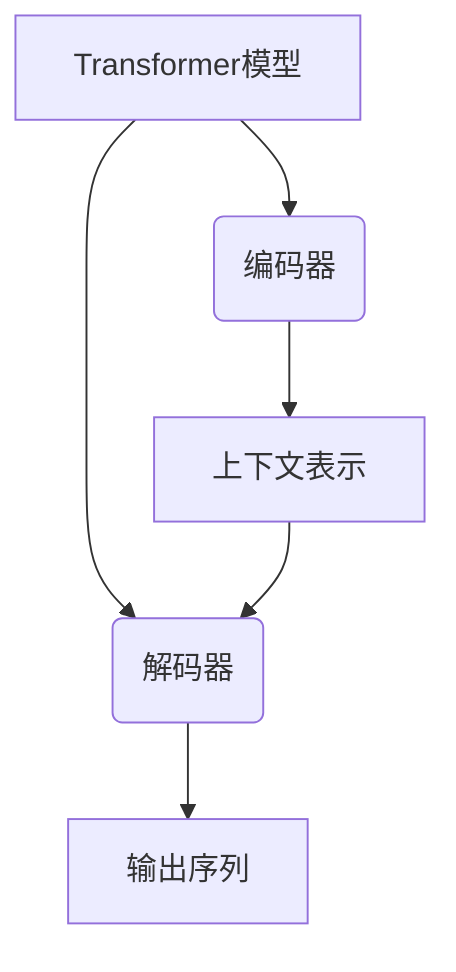

# 从零开始大模型开发与微调：解码器的实现

## 1. 背景介绍

### 1.1 问题的由来

在自然语言处理(NLP)领域,transformer模型因其强大的表现力和并行计算能力,成为了主流的模型架构。transformer的核心组件之一是解码器(decoder),它负责将编码器(encoder)输出的上下文表示,转换为目标序列。解码器的实现对于整个transformer模型的性能至关重要。

然而,解码器的实现并非一蹴而就,它涉及了诸多复杂的设计决策和技术细节,例如注意力机制、位置编码、掩码机制等。这些决策和细节的微小差异,都可能对模型的性能产生显著影响。因此,从零开始实现一个高性能的解码器,是一个具有挑战性的任务。

### 1.2 研究现状

目前,已有多种开源的transformer库(如TensorFlow、PyTorch等)提供了现成的解码器实现。但这些实现通常是黑盒操作,难以完全掌握内部细节。此外,它们也可能存在性能瓶颈或不合理的设计决策。

另一方面,学术界也在持续探索解码器的新颖架构和优化技术,以提升其性能和效率。例如,一些研究工作关注于减少解码器的计算复杂度,另一些工作则致力于改进注意力机制以提高并行能力。

### 1.3 研究意义  

从零开始实现解码器,有助于我们深入理解其内部原理,掌握关键的设计决策和技术细节。这不仅有利于提高我们对transformer模型的理解,也为未来的模型优化和创新奠定基础。

此外,自主实现解码器还能让我们根据特定任务和硬件约束,进行定制化的优化和扩展。这对于部署transformer模型到资源受限的环境(如移动端、边缘设备等)至关重要。

### 1.4 本文结构

本文将从以下几个方面,系统地介绍解码器的实现:

1. 核心概念与联系
2. 核心算法原理与具体操作步骤  
3. 数学模型和公式详细讲解与案例分析
4. 项目实践:代码实例和详细解释说明
5. 实际应用场景
6. 工具和资源推荐
7. 总结:未来发展趋势与挑战
8. 附录:常见问题与解答

## 2. 核心概念与联系

在深入探讨解码器的实现之前,我们先回顾一下transformer模型的核心概念,以及解码器在其中扮演的角色。

如上图所示,transformer模型主要由两个核心组件组成:编码器(encoder)和解码器(decoder)。

编码器的作用是将输入序列(如源语言句子)映射为上下文表示,捕获序列中的重要信息。解码器则基于编码器输出的上下文表示,生成目标序列(如翻译后的目标语言句子)。

在解码器内部,注意力机制(attention mechanism)扮演着关键角色。它允许解码器在生成每个目标词时,选择性地关注输入序列中的不同部分,从而捕获长距离依赖关系。

此外,解码器还引入了掩码机制(masking mechanism),以保证在生成每个目标词时,只关注之前的输出,而不会违反因果关系。位置编码(positional encoding)则赋予解码器位置信息,使其能够区分序列中词的相对位置。

总的来说,解码器是transformer模型的核心部件之一,其实现质量直接影响着整个模型的性能表现。接下来,我们将深入探讨解码器的核心算法原理和实现细节。

## 3. 核心算法原理与具体操作步骤

### 3.1 算法原理概述

解码器的核心算法原理可以概括为:基于编码器输出的上下文表示,通过自注意力(self-attention)和编码器-解码器注意力(encoder-decoder attention)机制,生成目标序列。

这个过程可以进一步分解为以下几个关键步骤:

1. **输入映射(Input Mapping)**: 将上一时间步的输出词嵌入(word embedding)和位置编码相加,作为当前时间步的输入。
2. **掩码多头自注意力(Masked Multi-Head Self-Attention)**: 对输入进行掩码,使其只能关注之前的输出,然后计算自注意力得分。
3. **编码器-解码器多头注意力(Multi-Head Encoder-Decoder Attention)**: 基于编码器输出的上下文表示,计算编码器-解码器注意力得分。
4. **前馈神经网络(Feed-Forward Neural Network)**: 对自注意力和编码器-解码器注意力的输出进行非线性变换。
5. **输出映射(Output Mapping)**: 将前馈神经网络的输出映射为目标词的概率分布。
6. **损失计算(Loss Computation)**: 计算预测概率分布与真实目标序列之间的损失。

上述步骤在解码器的每个时间步中重复进行,直到生成完整的目标序列。接下来,我们将详细阐述每个步骤的算法细节。

### 3.2 算法步骤详解

#### 3.2.1 输入映射(Input Mapping)

在每个时间步 $t$,解码器需要将上一时间步的输出词 $y_{t-1}$ 映射为词嵌入向量 $\boldsymbol{e}_{t-1}$。然后,我们将词嵌入向量与位置编码 $\boldsymbol{p}_t$ 相加,得到当前时间步的输入表示 $\boldsymbol{x}_t$:

$$\boldsymbol{x}_t = \boldsymbol{e}_{t-1} + \boldsymbol{p}_t$$

位置编码 $\boldsymbol{p}_t$ 是一个固定的向量,它赋予解码器位置信息,使其能够区分序列中词的相对位置。常见的位置编码方法包括正弦/余弦编码(sinusoidal encoding)和学习型编码(learned encoding)。

#### 3.2.2 掩码多头自注意力(Masked Multi-Head Self-Attention)

自注意力机制允许解码器在生成每个目标词时,关注输入序列中的不同部分。但由于解码器需要遵循因果关系(不能关注未来的输出),我们需要对自注意力进行掩码操作。

具体来说,对于长度为 $T$ 的输入序列 $\boldsymbol{X} = (\boldsymbol{x}_1, \boldsymbol{x}_2, \ldots, \boldsymbol{x}_T)$,我们计算其自注意力得分矩阵 $\boldsymbol{A} \in \mathbb{R}^{T \times T}$:

$$\boldsymbol{A} = \text{softmax}\left(\frac{\boldsymbol{Q}\boldsymbol{K}^\top}{\sqrt{d_k}}\right)\boldsymbol{V}$$

其中 $\boldsymbol{Q}$、$\boldsymbol{K}$、$\boldsymbol{V}$ 分别是查询(Query)、键(Key)和值(Value)矩阵,它们是通过线性变换从输入序列 $\boldsymbol{X}$ 得到的。$d_k$ 是缩放因子,用于防止点积的值过大或过小。

为了实现掩码,我们在计算 softmax 之前,将注意力得分矩阵 $\boldsymbol{A}$ 的上三角(对应未来的位置)设置为一个非常小的值(如 $-\infty$),从而使解码器只关注之前的输出。

此外,为了提高模型的表现力,我们通常采用多头注意力(multi-head attention)机制,将注意力分成多个子空间,分别计算注意力得分,再将结果拼接起来。

#### 3.2.3 编码器-解码器多头注意力(Multi-Head Encoder-Decoder Attention)

除了自注意力之外,解码器还需要关注编码器输出的上下文表示,以捕获输入序列的全局信息。这是通过编码器-解码器注意力机制实现的。

假设编码器的输出为 $\boldsymbol{H} = (\boldsymbol{h}_1, \boldsymbol{h}_2, \ldots, \boldsymbol{h}_M)$,其中 $M$ 是输入序列的长度。我们计算解码器在时间步 $t$ 的注意力得分矩阵 $\boldsymbol{B}_t \in \mathbb{R}^{1 \times M}$:

$$\boldsymbol{B}_t = \text{softmax}\left(\frac{\boldsymbol{q}_t\boldsymbol{H}^\top}{\sqrt{d_k}}\right)$$

其中 $\boldsymbol{q}_t$ 是解码器在时间步 $t$ 的查询向量,它是通过线性变换从解码器的输入 $\boldsymbol{x}_t$ 得到的。

然后,我们将注意力得分矩阵 $\boldsymbol{B}_t$ 与编码器输出 $\boldsymbol{H}$ 相乘,得到编码器-解码器注意力的输出 $\boldsymbol{c}_t$:

$$\boldsymbol{c}_t = \boldsymbol{B}_t\boldsymbol{H}$$

与自注意力类似,我们也可以采用多头机制,将注意力分成多个子空间,分别计算注意力得分,再将结果拼接起来。

#### 3.2.4 前馈神经网络(Feed-Forward Neural Network)

在计算完自注意力和编码器-解码器注意力之后,我们将它们的输出拼接起来,并通过一个前馈神经网络进行非线性变换。这个过程可以表示为:

$$\boldsymbol{o}_t = \text{FFN}\left(\text{Concat}\left(\text{MultiHeadSelfAttention}(\boldsymbol{x}_t), \text{MultiHeadEncoderDecoderAttention}(\boldsymbol{x}_t, \boldsymbol{H})\right)\right)$$

其中 $\text{FFN}$ 是一个双层全连接前馈神经网络,它包含两个线性变换和一个ReLU激活函数:

$$\text{FFN}(\boldsymbol{x}) = \text{ReLU}(\boldsymbol{x}\boldsymbol{W}_1 + \boldsymbol{b}_1)\boldsymbol{W}_2 + \boldsymbol{b}_2$$

前馈神经网络的作用是对注意力的输出进行非线性变换,提取更高层次的特征表示。

#### 3.2.5 输出映射(Output Mapping)

在得到前馈神经网络的输出 $\boldsymbol{o}_t$ 之后,我们需要将其映射为目标词的概率分布。这是通过一个线性变换和 softmax 函数实现的:

$$\boldsymbol{y}_t = \text{softmax}(\boldsymbol{o}_t\boldsymbol{W}_o + \boldsymbol{b}_o)$$

其中 $\boldsymbol{W}_o$ 和 $\boldsymbol{b}_o$ 是可训练的权重和偏置项。$\boldsymbol{y}_t$ 是一个概率向量,其中每个元素代表相应目标词的生成概率。

在训练过程中,我们将预测的概率分布 $\boldsymbol{y}_t$ 与真实的目标词 $y_t$ 进行比较,计算交叉熵损失:

$$\mathcal{L}_t = -\log P(y_t|\boldsymbol{x}_t, \boldsymbol{H})$$

最终的损失函数是所有时间步损失的平均值:

$$\mathcal{L} = \frac{1}{T}\sum_{t=1}^T \mathcal{L}_t$$

通过最小化这个损失函数,我们可以学习解码器的参数,使其能够生成更准确的目标序列。

#### 3.2.6 束搜索解码(Beam Search Decoding)

在推理阶段,我们需要根据解码器的输出概率分布 $\boldsymbol{y}_t$,生成最可能的目标序列。一种常见的方法是贪心解码(greedy decoding),即在每个时间步选择概率最大的词。但这种方法容易陷入局部最优,导致生成的序列质量较差。

因此,我们通常采用束搜索解码(beam search decoding)算法,它在每个时间步保留概率最高的 $k$ 个候选序列(称为束宽度 $k$),并在下一时间步基于这些候选序列进行扩展。这种方法虽然计算开销更大,但能够显著提高生成序列的质量。

具体来说,在时间步 $t$,我们维护一个候选序