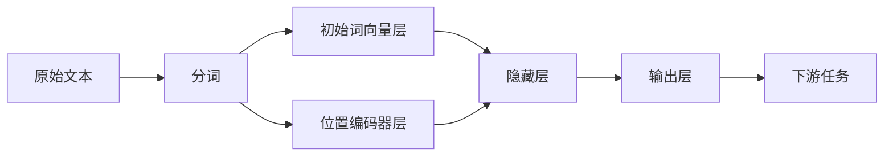

# 从零开始大模型开发与微调：输入层—初始词向量层和位置编码器层

## 1. 背景介绍

### 1.1 问题的由来
随着人工智能技术的飞速发展,自然语言处理(NLP)领域取得了突破性的进展。大规模语言模型如GPT、BERT等的出现,极大地提升了机器对自然语言的理解和生成能力。这些大模型通过在海量文本数据上进行预训练,学习到了丰富的语言知识和语义表示。然而,训练一个高质量的大模型需要大量的计算资源和时间成本。如何从零开始高效地开发和微调大模型,成为了NLP研究者和工程师面临的重要课题。

### 1.2 研究现状
目前,大模型的开发和微调主要采用迁移学习的思路,即在通用的预训练模型基础上,针对特定任务进行微调。这种方法可以显著减少训练时间和数据需求。但对于一些特殊领域或低资源语言,预训练模型的迁移效果并不理想。因此,从头开发定制化的大模型仍然具有重要意义。近年来,一些研究工作探索了模型架构、训练策略等方面的改进,以期提高从零开始训练大模型的效率和性能。

### 1.3 研究意义
深入研究大模型的开发和微调技术,对于推动NLP技术的进步具有重要意义:

1. 有助于设计出更加高效、轻量化的模型架构,降低训练成本;
2. 可以探索更有效的训练策略和优化算法,加速模型收敛;  
3. 为特定领域或任务定制专用的大模型,提升下游任务性能;
4. 推动低资源语言的NLP研究,缓解语言资源稀缺问题;
5. 加深对语言认知机制的理解,促进人工智能的理论研究。

### 1.4 本文结构
本文将重点讨论大模型开发中的一个关键环节——输入层的设计。输入层是模型的"眼睛",决定了模型如何将原始文本转化为数值化的特征表示。一个优秀的输入层设计可以帮助模型更好地学习语言知识。本文将介绍两种常用的输入层技术:初始词向量层和位置编码器层。

全文结构安排如下:第2部分介绍相关概念;第3部分详细讲解初始词向量层和位置编码器层的算法原理;第4部分给出数学模型和公式推导;第5部分提供代码实例;第6部分讨论实际应用;第7部分推荐相关工具和资源;第8部分总结全文并展望未来;第9部分附录常见问题解答。

## 2. 核心概念与联系

在深入探讨输入层的技术细节之前,我们先来了解一些相关的核心概念:

- 词向量(Word Embedding):将词语映射为实值向量的技术。通过词向量,计算机可以将人类语言转化为便于数学建模的数值形式。词向量可以刻画词语之间的语义关系。

- 词表(Vocabulary):语料库中所有唯一词语的集合。大模型通常采用大规模词表,涵盖数十万甚至上百万个词。

- 分词(Tokenization):将文本划分为最小语义单元(token)的过程。英文中token通常是单词,中文需要额外的分词处理。大模型常使用Subword分词算法如BPE、WordPiece等。

- 初始词向量层:为词表中的每个token随机初始化一个词向量,作为模型训练的起点。初始词向量层可以采用预训练的词向量如Word2Vec、GloVe等,也可以随机初始化。

- 位置编码器层:为输入序列的每个位置分配一个位置向量,帮助模型学习序列的位置信息。Transformer模型使用基于三角函数的位置编码器。

输入层的作用是将原始文本转化为模型可以处理的数值化张量。下图展示了输入层在整个模型中的位置:



可以看到,初始词向量层和位置编码器层共同构成了输入层,将文本token映射为词向量,并附加位置信息。这为后续的隐藏层处理奠定了基础。

## 3. 核心算法原理 & 具体操作步骤

### 3.1 算法原理概述

初始词向量层和位置编码器层的核心原理如下:

- 初始词向量层:为每个token分配一个D维实值向量,D为词向量维度的超参数。词向量可以随机初始化,也可以载入预训练的词向量。词向量在训练过程中与其他参数一起优化更新。

- 位置编码器层:采用三角函数的线性组合,为不同位置生成唯一的位置向量。位置编码器可以显式地引入序列的位置信息,弥补词向量无法表示词序的缺陷。Transformer使用的位置编码器函数如下:

$$
PE(pos,2i) = sin(pos/10000^{2i/D}) \\
PE(pos,2i+1) = cos(pos/10000^{2i/D})
$$

其中,pos为位置索引,i为维度索引,D为词向量维度。通过在奇偶维度上使用sin和cos函数,可以形成唯一的位置向量。

### 3.2 算法步骤详解

下面详细介绍输入层处理的步骤:

1. 分词:对原始文本进行分词,将其划分为token序列。常用的分词算法有:
   - 英文:直接按空格分割
   - 中文:Jieba、THULAC、HanLP等工具
   - Subword:BPE、WordPiece、Unigram等算法
2. 建立词表:收集语料库中所有唯一token,构建词表。一般还会添加特殊token如`[PAD]`(补零)、`[UNK]`(未登录词)、`[CLS]`(分类符)、`[SEP]`(分隔符)等。
3. 将token映射为ID:为每个token分配一个唯一的数字ID。常见的映射方式有:
   - 根据token出现频率排序,频率高的ID小
   - 随机分配ID
   - 按字母顺序分配ID
4. 初始化词向量层:根据词表大小V和词向量维度D,初始化一个形状为(V, D)的词向量矩阵。初始化方式有:
   - 随机初始化,如高斯分布、均匀分布等
   - 载入预训练词向量,如Word2Vec、GloVe等
5. 生成位置编码器:根据序列长度L和词向量维度D,生成一个形状为(L, D)的位置编码器矩阵。每一行对应一个位置的位置向量。
6. 输入层输出:将token ID序列通过初始词向量层进行Lookup,得到词向量序列。将词向量序列与位置编码器相加,即得到最终的输入层输出。输出形状为(batch_size, seq_len, D)的张量。

### 3.3 算法优缺点

初始词向量层和位置编码器层的优点如下:
- 可以将离散的文本token转化为连续的向量表示,便于神经网络处理
- 词向量可以刻画词语之间的语义关系,捕捉词语的语义信息
- 位置编码器引入了词序信息,弥补了词向量的缺陷
- 参数量较小,计算效率高

同时,这两个层也存在一些局限性:
- 词向量的维度是超参数,需要根据任务调整,维度过大会增加计算开销
- 随机初始化的词向量语义信息有限,需要在大规模语料上训练才能获得高质量词向量  
- 位置编码器对于超长序列(如上万字)的表示能力有限
- 面对未登录词(OOV),输入层难以给出合适的词向量表示

### 3.4 算法应用领域

初始词向量层和位置编码器层是NLP领域的基础算法,在各类NLP任务中都有广泛应用,如:
- 文本分类:情感分析、新闻分类、意图识别等
- 序列标注:命名实体识别、词性标注、语义角色标注等  
- 文本生成:机器翻译、对话生成、文本摘要等
- 语义匹配:相似问题检索、句子语义相似度计算等
- 阅读理解:问答系统、关系抽取等

此外,这两个层的思想也被应用到其他领域,如计算机视觉中的图像分类、目标检测等。

## 4. 数学模型和公式 & 详细讲解 & 举例说明

### 4.1 数学模型构建

我们使用数学语言来刻画输入层的处理过程。定义如下符号:
- $\mathcal{V}$:词表,$|\mathcal{V}|$为词表大小
- $\mathbf{x} = [x_1, x_2, ..., x_n]$:文本token序列,$x_i \in \mathcal{V}$
- $\mathbf{emb} \in \mathbb{R}^{|\mathcal{V}| \times D}$:初始词向量矩阵
- $\mathbf{pe} \in \mathbb{R}^{n \times D}$:位置编码器矩阵
- $\mathbf{inp} \in \mathbb{R}^{n \times D}$:输入层输出

输入层的数学模型可以表示为:

$$
\mathbf{inp} = \mathbf{emb}(\mathbf{x}) + \mathbf{pe}
$$

其中,$\mathbf{emb}(\mathbf{x})$表示对token序列$\mathbf{x}$进行词向量查表(Lookup)。

### 4.2 公式推导过程

下面我们详细推导输入层的前向计算公式。

首先,token序列$\mathbf{x}$通过词表映射得到ID序列$\mathbf{id}$:

$$
\mathbf{id} = [id_1, id_2, ..., id_n], id_i \in [0, |\mathcal{V}|-1] 
$$

然后,初始词向量层根据$\mathbf{id}$进行Lookup,得到词向量序列$\mathbf{emb}(\mathbf{x})$:

$$
\mathbf{emb}(\mathbf{x}) = [\mathbf{emb}_{id_1}, \mathbf{emb}_{id_2}, ..., \mathbf{emb}_{id_n}] \in \mathbb{R}^{n \times D}
$$

接着,位置编码器层生成位置向量序列$\mathbf{pe}$:

$$
\mathbf{pe}_{i,2j} = sin(i/10000^{2j/D}) \\
\mathbf{pe}_{i,2j+1} = cos(i/10000^{2j/D})
$$

其中,$i \in [0, n-1]$为位置索引,$j \in [0, D/2-1]$为维度索引。

最后,将词向量序列和位置向量序列相加,得到输入层输出$\mathbf{inp}$:

$$
\mathbf{inp} = \mathbf{emb}(\mathbf{x}) + \mathbf{pe} \in \mathbb{R}^{n \times D}
$$

这就是输入层前向计算的完整公式推导过程。

### 4.3 案例分析与讲解

下面我们以一个简单的例子来说明输入层的计算过程。

假设有文本"I love AI"。经过分词和词表映射,得到token ID序列$\mathbf{id}$:

```
"I"   -> 12
"love"-> 521
"AI"  -> 8
```

设词向量维度$D=4$,词表大小$|\mathcal{V}|=1000$,初始词向量矩阵$\mathbf{emb}$和位置编码器矩阵$\mathbf{pe}$分别为:

$$
\mathbf{emb} = 
\begin{bmatrix}
0.1 & 0.2 & 0.3 & 0.4 \\
... & ... & ... & ... \\  
0.5 & 0.6 & 0.7 & 0.8 \\
... & ... & ... & ... \\
0.9 & 1.0 & 1.1 & 1.2 \\
... & ... & ... & ...
\end{bmatrix} \in \mathbb{R}^{1000 \times 4} \\
\mathbf{pe} = 
\begin{bmatrix}
0.0 & 1.0 & 0.0 & 1.0 \\
0.8 & 0