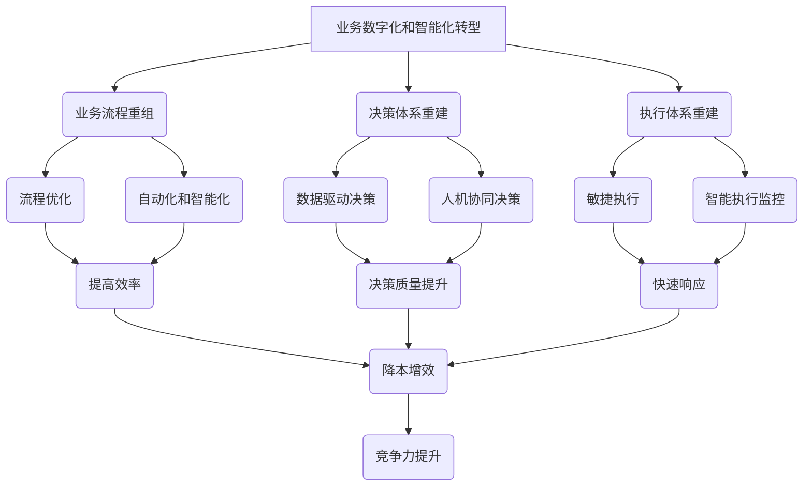

# 企业业务数字化和智能化建设方案：业务流程重组，重建公司的决策体系和执行体系

## 1. 背景介绍

### 1.1 问题的由来

在当今瞬息万变的商业环境中，企业面临着前所未有的挑战和机遇。传统的业务模式和运营方式已经无法满足日益增长的客户需求和市场竞争压力。为了保持竞争力和可持续发展，企业必须紧跟时代潮流,实现业务数字化和智能化转型。

企业的业务流程是其运营的核心,涵盖了从决策制定到执行落实的各个环节。然而,许多企业的业务流程存在着效率低下、缺乏灵活性、决策滞后等问题,这严重阻碍了企业的发展。同时,随着大数据、人工智能等新兴技术的不断涌现,企业亟需重塑其决策体系和执行体系,以充分利用这些技术的力量,提高运营效率和决策质量。

### 1.2 研究现状

近年来,越来越多的企业意识到数字化和智能化转型的重要性,并开始着手进行相关建设。然而,由于缺乏系统的方法论和整体规划,许多企业的转型进程往往遇到重重阻碍,难以取得理想的效果。

一些领先企业已经开始尝试利用大数据分析、机器学习等技术来优化业务流程,提高决策效率。但这些尝试往往局限于特定领域或部门,缺乏全面性和系统性。同时,由于技术复杂性和人员培训不足,这些尝试也面临着诸多挑战。

### 1.3 研究意义

本文旨在为企业提供一套系统的业务数字化和智能化建设方案,帮助企业重组业务流程,重建决策体系和执行体系。通过该方案的实施,企业可以:

1. 提高业务运营效率,缩短决策周期,加快响应速度。
2. 优化资源配置,降低运营成本,提高盈利能力。
3. 增强决策科学性,提高决策质量,减少决策失误。
4. 灵活适应市场变化,提升竞争力和可持续发展能力。
5. 培养数字化和智能化人才,推动企业文化转型。

### 1.4 本文结构

本文将首先介绍业务数字化和智能化转型的核心概念,阐明其与传统业务模式的关系。接下来,将详细阐述重组业务流程、重建决策体系和执行体系的核心算法原理和具体操作步骤。然后,通过数学模型和公式,对相关理论进行严格的理论支撑和量化分析。

此外,本文还将提供一个实际项目案例,展示如何将理论付诸实践,并对代码实现进行详细解释。最后,将探讨该方案在不同行业的应用场景,分享相关工具和学习资源,总结未来发展趋势和面临的挑战。

## 2. 核心概念与联系

业务数字化和智能化转型是一个系统工程,涉及多个核心概念,它们相互关联、环环相扣。下面将对这些核心概念进行阐释,并说明它们之间的内在联系。

1. **业务数字化和智能化转型**：指利用数字技术和人工智能技术,全面重塑企业的业务流程、决策体系和执行体系,实现企业运营的现代化和智能化。

2. **业务流程重组**：对传统的业务流程进行彻底的梳理和优化,消除低效环节,引入自动化和智能化技术,提高流程效率。

3. **决策体系重建**：构建基于大数据分析和人工智能技术的新型决策体系,实现数据驱动决策和人机协同决策,提高决策质量。

4. **执行体系重建**：建立敏捷高效的执行体系,引入智能化监控和反馈机制,确保决策高效执行,快速响应市场变化。

5. **流程优化**：对业务流程进行持续优化,消除冗余环节,整合资源,提高效率。

6. **自动化和智能化**：将人工智能、机器学习等技术应用于业务流程,实现流程的自动化和智能化。

7. **数据驱动决策**：基于大数据分析,构建科学的决策模型,为决策提供数据支持。

8. **人机协同决策**：人工智能技术辅助人类决策,发挥人机各自的优势,提高决策质量。

9. **敏捷执行**：建立灵活的执行机制,快速响应决策调整,缩短执行周期。

10. **智能执行监控**：利用人工智能技术对执行过程进行实时监控,发现并解决问题,确保执行质量。

上述核心概念相互关联、环环相扣,共同构成了企业业务数字化和智能化转型的完整体系。只有全面推进这些概念的落地实施,企业才能真正实现转型升级,提高运营效率、决策质量和市场竞争力。

## 3. 核心算法原理 & 具体操作步骤

### 3.1 算法原理概述

企业业务数字化和智能化建设方案的核心算法原理包括三个主要部分:

1. **业务流程挖掘算法**:通过分析企业历史数据和业务日志,自动发现和提取隐藏的业务流程模型,为后续的流程优化和重组奠定基础。

2. **决策模型构建算法**:利用机器学习和优化理论,基于企业的历史数据和专家知识,构建科学的决策模型,为数据驱动决策和人机协同决策提供支持。

3. **智能执行优化算法**:通过建立执行过程的数学模型,并结合约束规划、调度优化等技术,实现执行计划的智能生成和动态调整,确保执行效率和质量。

这三个核心算法相互配合、环环相扣,共同支撑着企业业务数字化和智能化转型的实施。下面将对它们的具体原理和操作步骤进行详细阐述。

### 3.2 算法步骤详解

#### 3.2.1 业务流程挖掘算法

业务流程挖掘算法的主要步骤如下:

1. **数据预处理**:从企业的信息系统中提取相关的事件日志数据,对其进行清洗、转换和整理,构建标准化的事件日志。

2. **流程发现**:应用流程挖掘技术,从标准化事件日志中自动发现隐藏的业务流程模型,可以使用基于启发式的 Alpha 算法、基于理论的区域划分算法等。

3. **流程评估**:对发现的业务流程模型进行评估,识别低效环节、瓶颈点等问题,为后续的流程优化提供依据。常用的评估指标包括流程复杂度、等待时间、资源利用率等。

4. **流程优化**:根据评估结果,对业务流程模型进行优化,消除冗余环节,整合资源,提高效率。可以采用启发式优化算法、模拟退火算法等方法。

5. **流程验证**:将优化后的业务流程模型与实际业务场景进行对比验证,必要时进行进一步调整和完善。

6. **流程实施**:将优化和验证后的业务流程模型应用于企业的实际运营中,并持续监控和优化。

通过上述步骤,企业可以自动发现隐藏的业务流程,并对其进行科学优化,为业务流程重组奠定基础。

#### 3.2.2 决策模型构建算法

决策模型构建算法的主要步骤如下:

1. **数据采集**:从企业的各个业务系统中采集相关的历史数据,包括过去的决策记录、决策结果、影响因素等,构建决策数据集。

2. **特征工程**:对决策数据集进行特征提取和特征选择,识别对决策结果有影响的关键特征,为模型构建做准备。

3. **模型构建**:基于特征工程的结果,利用机器学习算法(如决策树、逻辑回归等)构建决策模型。同时,也可以引入优化理论,构建基于目标规划的决策模型。

4. **模型评估**:通过留出法、交叉验证等方法,对构建的决策模型进行评估,衡量其精确度、泛化能力等指标。

5. **模型优化**:根据评估结果,对决策模型进行优化,如调整算法超参数、特征选择等,提高模型性能。

6. **模型更新**:建立决策模型的在线更新机制,随着新的决策数据的不断积累,持续优化和更新决策模型,保持其有效性。

7. **人机交互**:将构建的决策模型与人类决策专家相结合,实现人机协同决策,发挥人机各自的优势,提高决策质量。

通过上述步骤,企业可以构建科学的决策模型,为数据驱动决策和人机协同决策提供有力支持。

#### 3.2.3 智能执行优化算法

智能执行优化算法的主要步骤如下:

1. **执行过程建模**:对企业的执行过程进行数学建模,将其抽象为约束满足问题或调度优化问题。

2. **约束规划**:基于执行过程模型,应用约束规划技术,生成满足各种约束条件的可行执行计划。

3. **调度优化**:在约束规划的基础上,进一步优化执行计划,最小化执行成本、缩短执行周期等,可以使用遗传算法、蚁群算法等智能优化算法。

4. **动态调整**:在执行过程中,实时监控执行状态,一旦发现偏差或异常情况,立即触发重新规划和优化,动态调整执行计划。

5. **执行监控**:利用机器学习技术,从历史执行数据中学习异常模式,对执行过程进行智能监控,提前发现和预警潜在问题。

6. **反馈优化**:将执行过程中收集的数据反馈至决策模型和流程模型,用于模型的持续优化和更新,形成闭环。

通过上述步骤,企业可以实现执行计划的智能生成和动态优化,确保执行高效、灵活、可控,快速响应决策调整和市场变化。

### 3.3 算法优缺点

上述三个核心算法具有以下优缺点:

**优点**:

1. 能够自动发现隐藏的业务流程,为流程优化提供依据。
2. 基于数据和优化理论构建科学决策模型,提高决策质量。
3. 将人工智能技术应用于执行过程,实现智能化监控和优化。
4. 算法具有通用性,可应用于不同行业和领域。
5. 支持模型的在线更新,具有良好的适应性和扩展性。

**缺点**:

1. 对历史数据的质量和完整性有较高要求,数据缺失或噪声会影响算法性能。
2. 算法复杂度较高,需要大量计算资源,对于规模庞大的企业可能存在效率问题。
3. 涉及的理论较为深奥,对企业技术人员的专业水平要求较高。
4. 算法结果需要专家评审和人机交互,无法完全自动化。
5. 算法的有效性需要在实践中不断验证和优化。

### 3.4 算法应用领域

上述核心算法可以广泛应用于各个行业和领域,为企业的业务数字化和智能化转型提供技术支撑,包括但不限于:

1. **制造业**:优化生产流程,提高生产效率;智能化供应链管理,降低库存成本。
2. **金