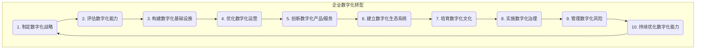

# 企业数字化项目从1-10建设方案

## 1. 背景介绍

### 1.1 问题的由来

在当今快速发展的数字时代，企业面临着前所未有的挑战和机遇。传统的商业模式和运营方式已经无法满足日益增长的客户需求和市场竞争。为了保持竞争力并实现可持续发展，企业必须紧跟数字化浪潮,通过采用先进的数字技术来转型和创新。

数字化转型不仅涉及技术层面,更需要企业从战略、流程、文化等多个维度进行深层次的变革。然而,很多企业在数字化转型的道路上面临诸多困难,例如缺乏系统的规划、技术债务积累严重、组织变革阻力等,导致数字化项目的实施效果不佳。

### 1.2 研究现状

近年来,越来越多的研究机构和咨询公司开始关注企业数字化转型的相关问题,并提出了一些理论模型和最佳实践。然而,由于企业的业务复杂性和异质性,现有的通用模型往往难以直接应用于具体的企业场景。因此,如何为特定企业量身定制数字化转型方案,成为当前研究的热点和难点。

### 1.3 研究意义

本文旨在提出一种系统化的"企业数字化项目从1-10建设方案",为企业数字化转型提供一个全面、实用的指导框架。该方案将数字化转型过程分解为10个关键步骤,并为每个步骤提供详细的实施策略和技术方案。通过遵循这个建设方案,企业可以有序地推进数字化转型,最大限度地发挥数字技术的潜力,提高运营效率,优化客户体验,并培育数字化文化。

### 1.4 本文结构

本文首先介绍企业数字化转型的背景和研究现状,阐明研究的意义和目的。接下来,详细阐述"企业数字化项目从1-10建设方案"的核心内容,包括每个步骤的目标、关键活动、技术方案等。然后,探讨该方案在实际应用场景中的案例,并分析其优缺点。最后,总结该方案的贡献,并展望未来的发展趋势和挑战。

## 2. 核心概念与联系

企业数字化转型是一个复杂的系统工程,涉及多个关键概念及其相互关系。以下是本文中的核心概念:

1. **数字化战略**:明确企业的数字化愿景、目标和路线图,确保数字化转型与企业整体战略保持一致。

2. **数字化能力**:企业在人才、技术、流程、文化等方面所具备的数字化基础,是实现数字化转型的关键支撑。

3. **数字化产品/服务**:利用数字技术创新或优化企业的产品和服务,以满足客户需求并获取新的收入来源。

4. **数字化运营**:通过数字化手段提高企业内部运营效率,优化业务流程,降低运营成本。

5. **数字化生态系统**:企业与合作伙伴、客户、供应商等利益相关方共同构建的数字化协作网络。

6. **数字化文化**:企业内部支持创新、敏捷、数据驱动等数字化理念和实践的文化氛围。

这些核心概念相互关联、相互影响。例如,数字化战略为企业数字化转型提供总体指引,而数字化能力是实施战略的基础保障。数字化产品/服务和数字化运营是数字化转型的两大主要着力点。数字化生态系统和数字化文化则为数字化转型创造了有利的外部环境和内部土壤。

## 3. 核心算法原理 & 具体操作步骤

### 3.1 算法原理概述

"企业数字化项目从1-10建设方案"的核心算法原理是将复杂的数字化转型过程分解为10个关键步骤,并为每个步骤制定详细的实施策略和技术方案。这种分步骤、模块化的方法可以有效降低数字化转型的复杂性,提高实施效率。

该算法的设计思路借鉴了软件工程中的"瀑布模型"和"敏捷开发"理念。一方面,将数字化转型过程按照逻辑顺序划分为10个阶段,每个阶段都有明确的目标和交付物,确保转型过程有条不紊。另一方面,每个阶段内部采用敏捷迭代的方式,通过快速原型设计、持续集成交付等手段,不断验证和优化转型方案。

此外,该算法还融入了系统思维和全生命周期管理的理念。它将企业视为一个有机的整体,数字化转型需要从战略、组织、技术、文化等多个层面进行系统性变革。同时,该算法不仅关注数字化转型的实施阶段,还重视转型后的运维和持续优化,确保企业的数字化能力可以不断提升。

### 3.2 算法步骤详解

"企业数字化项目从1-10建设方案"包含以下10个关键步骤:

1. **制定数字化战略**:明确企业的数字化愿景、目标和路线图,确保数字化转型与企业整体战略保持一致。

2. **评估数字化能力**:全面评估企业在人才、技术、流程、文化等方面的数字化基础,识别差距和需求。

3. **构建数字化基础设施**:根据评估结果,建设满足数字化需求的IT基础架构,包括云计算、大数据、人工智能等新兴技术。

4. **优化数字化运营**:利用数字化技术优化企业内部的业务流程,提高运营效率,降低运营成本。

5. **创新数字化产品/服务**:基于客户需求和市场趋势,创新或优化企业的数字化产品和服务,开拓新的收入来源。

6. **建立数字化生态系统**:与合作伙伴、客户、供应商等利益相关方构建数字化协作网络,实现资源共享和价值共创。

7. **培育数字化文化**:通过领导层示范、培训、激励机制等措施,在企业内部培育支持创新、敏捷、数据驱动等数字化理念和实践的文化氛围。

8. **实施数字化治理**:建立数字化治理框架,制定相关政策和流程,确保数字化转型符合法规要求,并与企业整体战略保持一致。

9. **管理数字化风险**:识别和评估数字化转型过程中可能面临的风险,制定应对策略,最大限度降低风险影响。

10. **持续优化数字化能力**:通过持续监控和反馈机制,不断评估和优化企业的数字化能力,确保数字化转型的可持续发展。

这10个步骤相互关联、环环相扣,需要在企业数字化转型的整个生命周期中持续执行和优化。

### 3.3 算法优缺点

"企业数字化项目从1-10建设方案"具有以下优点:

1. **系统性**:将数字化转型过程分解为10个关键步骤,涵盖了战略、能力、基础设施、运营、产品/服务、生态系统、文化、治理、风险管理和持续优化等多个维度,具有很强的系统性和全面性。

2. **可操作性**:每个步骤都提供了详细的实施策略和技术方案,为企业数字化转型提供了具体的操作指引。

3. **灵活性**:采用敏捷迭代的开发模式,可以根据企业的实际情况和反馈,动态调整和优化转型方案。

4. **可持续性**:注重数字化能力的持续优化,确保企业的数字化转型能够与时俱进,保持竞争优势。

然而,该算法也存在一些潜在的缺点和挑战:

1. **复杂性**:由于数字化转型涉及多个领域和维度,该算法本身也相对复杂,对企业的管理能力和资源投入要求较高。

2. **依赖性**:算法的成功实施需要企业各个部门和利益相关方的密切配合,存在一定的协调和沟通成本。

3. **不确定性**:数字技术发展日新月异,算法中的一些技术方案可能会随着时间推移而过时或失效,需要不断更新和调整。

4. **文化障碍**:培育数字化文化是一个长期的系统工程,可能会遇到来自企业内部的观念惯性和变革阻力。

### 3.4 算法应用领域

"企业数字化项目从1-10建设方案"可以广泛应用于各行各业的企业数字化转型项目,包括但不限于:

1. **制造业**:通过数字化技术优化生产流程、建立智能工厂、实现产品个性化定制等。

2. **零售业**:构建线上线下一体化的数字化销售渠道,提升客户体验,实现精准营销等。

3. **金融业**:利用大数据、人工智能等技术,开发创新的金融产品和服务,提高风险管理能力等。

4. **医疗健康**:建立数字化医疗系统,提高诊疗效率,促进远程医疗、智能辅助诊断等新模式的发展。

5. **教育培训**:开发在线教育平台和智能教学系统,实现个性化学习和教育资源共享等。

6. **政府机构**:推进电子政务建设,优化公共服务流程,提高管理透明度和决策效率等。

7. **其他行业**:无论是传统行业还是新兴产业,只要企业有数字化转型的需求,都可以借鉴和应用该算法。

## 4. 数学模型和公式 & 详细讲解 & 举例说明

在"企业数字化项目从1-10建设方案"中,数学模型和公式主要用于量化和优化数字化转型的各个环节,包括评估数字化能力、优化数字化运营、管理数字化风险等。以下是一些常见的数学模型和公式,以及相关的详细讲解和案例分析。

### 4.1 数学模型构建

#### 4.1.1 数字化能力评估模型

数字化能力是企业实现数字化转型的关键基础。为了全面评估企业的数字化能力,我们可以构建一个多维度的评估模型,包括人才、技术、流程、文化等多个维度。每个维度下又包含多个具体的评估指标。

我们可以使用层次分析法(AHP)对各个维度和指标进行赋权,得到一个综合的数字化能力评分。设有 $n$ 个维度,第 $i$ 个维度的权重为 $w_i$,满足 $\sum_{i=1}^n w_i = 1$。每个维度下有 $m_i$ 个具体指标,第 $j$ 个指标的权重为 $w_{ij}$,满足 $\sum_{j=1}^{m_i} w_{ij} = 1$。

对于第 $i$ 个维度,其评分为:

$$S_i = \sum_{j=1}^{m_i} w_{ij} \cdot s_{ij}$$

其中 $s_{ij}$ 为第 $j$ 个指标的评分。

综合数字化能力评分为:

$$S = \sum_{i=1}^n w_i \cdot S_i$$

通过对比企业的