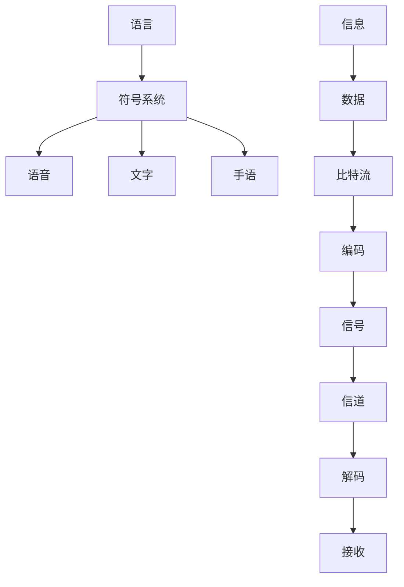
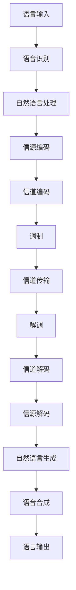

# 何为语言？信息又如何传播？

## 1. 背景介绍

### 1.1 问题的由来

语言是人类与生俱来的一种独特能力,它使我们能够表达思想、交流信息、记录历史和传承文化。从口语到文字,从手语到艺术,语言是人类社会发展的基石。然而,语言的本质是什么?信息又是如何在不同媒介中传播的?这些问题一直困扰着哲学家、语言学家和科学家们。

在信息时代,我们每天都在接收和发送大量的信息,无论是通过口语、文字、图像还是其他形式。信息的传播已经成为现代社会的命脉,影响着我们的生活、工作和决策。因此,深入理解语言和信息传播的本质,对于优化信息交流、提高信息质量和效率至关重要。

### 1.2 研究现状

语言学作为一门独立的学科,已经存在了数百年。从结构主义语言学到生成语法理论,从语用学到认知语言学,各种理论和方法不断涌现,试图解开语言的奥秘。同时,信息论、编码理论、信号处理等领域也在探索信息的本质和传播机制。

然而,尽管取得了一些进展,但对于语言和信息传播的本质,我们仍然缺乏一个统一的理论框架。不同的理论和方法往往只关注语言或信息传播的某一个方面,难以全面解释这一复杂的现象。

### 1.3 研究意义

深入理解语言和信息传播的本质,对于多个领域都具有重要意义:

1. **人工智能**:语言是人工智能系统与人类交互的关键接口,理解语言的本质有助于开发更自然、更人性化的人机交互系统。

2. **信息安全**:信息传播的安全性是当前社会的一大挑战,了解信息传播的机制有助于设计更安全可靠的信息系统。

3. **教育和交流**:优化语言和信息传播,可以提高教育质量和人际交流效率。

4. **文化传承**:语言是文化传承的载体,深入理解语言有助于保护和传播人类文明。

### 1.4 本文结构

本文将从语言和信息传播的角度,系统地探讨这一主题。我们将首先介绍语言和信息传播的核心概念,然后深入分析其算法原理和数学模型,并通过实际案例加以说明。此外,我们还将介绍相关的实践项目、应用场景、工具和资源,最后总结未来的发展趋势和挑战。

## 2. 核心概念与联系

在探讨语言和信息传播的本质之前,我们需要明确一些核心概念及其相互关系。

1. **语言**:一种由有意义的符号系统组成的结构化系统,用于表达思想和交流信息。

2. **符号系统**:语言的基本单元,包括语音、文字和手语等形式。

3. **信息**:需要传递和交换的有意义的数据。

4. **数据**:信息的载体,通常以比特流的形式存在。

5. **编码**:将数据转换为可传输的信号的过程。

6. **信号**:编码后的数据,可以通过信道进行传输。

7. **信道**:信号传输的媒介,如电缆、无线电波或光纤等。

8. **解码**:从接收到的信号中恢复出原始数据的过程。

语言和信息传播虽然是两个不同的概念,但它们之间存在着密切的联系。语言是人类交流思想和信息的主要工具,而信息传播则是实现这一过程的技术手段。在现代社会中,语言和信息传播往往是相辅相成的,它们共同构成了人类交流和知识传递的基础。

## 3. 核心算法原理 & 具体操作步骤

### 3.1 算法原理概述

语言和信息传播涉及多个核心算法,包括语音识别、自然语言处理、信源编码、信道编码等。这些算法共同构成了一个完整的系统,实现了从语言到信号,再从信号到语言的转换过程。

1. **语音识别**:将语音信号转换为文本的过程。

2. **自然语言处理**:理解和处理自然语言文本的算法。

3. **信源编码**:消除数据冗余,提高传输效率的编码算法。

4. **信道编码**:增加冗余信息,提高传输可靠性的编码算法。

5. **调制**:将编码后的数字信号转换为模拟信号,以便在信道中传输。

6. **信道传输**:通过有线或无线信道传输调制后的信号。

7. **解调**:将接收到的模拟信号转换回数字信号。

8. **信道解码**:从接收到的编码数据中检测和纠正错误。

9. **信源解码**:将解码后的数据转换为原始信息。

10. **自然语言生成**:根据解码后的信息自动生成自然语言文本。

11. **语音合成**:将文本转换为语音输出。

这些算法按照特定的顺序组合在一起,形成了一个端到端的系统,实现了语言与信号之间的双向转换。

### 3.2 算法步骤详解

接下来,我们将详细介绍上述算法的具体实现步骤。

#### 3.2.1 语音识别

语音识别算法的主要步骤包括:

1. **预处理**:对原始语音信号进行预处理,如降噪、端点检测等。

2. **特征提取**:从预处理后的语音信号中提取特征向量,如梅尔频率倒谱系数(MFCC)等。

3. **声学模型**:使用隐马尔可夫模型(HMM)或深度神经网络等方法,建立声学模型,将特征向量映射到语音单元(如音素)上。

4. **语言模型**:使用N-gram模型或神经网络语言模型等,捕获语音单元之间的统计规律。

5. **解码**:通过声学模型和语言模型,结合其他信息源(如语法、语义等),对输入语音进行解码,输出识别结果。

#### 3.2.2 自然语言处理

自然语言处理算法的主要步骤包括:

1. **分词**:将文本序列分割成单词序列。

2. **词性标注**:为每个单词赋予相应的词性标记。

3. **命名实体识别**:识别出文本中的人名、地名、组织机构名等命名实体。

4. **句法分析**:根据语法规则,分析句子的句法结构树。

5. **语义分析**:理解句子的语义含义,构建语义表示。

6. **指代消解**:将代词与其所指代的实体关联起来。

7. **话题识别**:识别文本的主题或中心话题。

8. **情感分析**:判断文本所表达的情感倾向(积极、消极或中性)。

9. **文本摘要**:自动生成文本的摘要。

10. **机器翻译**:将一种自然语言翻译成另一种自然语言。

11. **对话系统**:根据上下文,自动生成对话响应。

#### 3.2.3 信源编码

信源编码算法的主要步骤包括:

1. **模型建立**:根据信源数据的统计特性,建立概率模型。

2. **码字分配**:为每个符号(或符号序列)分配一个适当长度的码字。

3. **编码**:将原始数据映射为码字序列。

4. **解码**:将接收到的码字序列还原为原始数据。

常见的信源编码算法有:

- **熵编码**:如哈夫曼编码、算术编码等。

- **字典编码**:如LZW编码、无损压缩等。

- **变换编码**:如小波变换编码、分形编码等。

#### 3.2.4 信道编码

信道编码算法的主要步骤包括:

1. **冗余编码**:向原始数据添加一定的冗余信息,以提高可靠性。

2. **交织**:将编码后的数据进行重新排列,提高抗burst error能力。

3. **映射**:将二进制码字映射到调制符号上。

4. **解映射**:从接收到的调制符号中恢复出二进制码字。

5. **反交织**:将解映射后的码字按照一定规则重新排列。

6. **解码**:利用冗余信息检测并纠正传输错误,获得原始数据。

常见的信道编码算法有:

- **块编码**:如循环冗余校验(CRC)、BCH码、Reed-Solomon码等。

- **卷积编码**:如维特比编码、渐进编码等。

- **Turbo和LDPC编码**:迭代解码算法,具有很强的纠错能力。

#### 3.2.5 调制

调制算法的主要步骤包括:

1. **脉冲成形**:将二进制数据流转换为脉冲序列。

2. **载波调制**:根据不同的调制方式,如ASK、FSK、PSK、QAM等,将脉冲序列调制到载波信号上。

3. **带通滤波**:对调制后的信号进行带通滤波,抑制无用频带。

4. **上变频**:将基带调制信号的频率平移到所需的载波频率。

5. **功率放大**:对上变频后的信号进行功率放大,以便在信道中传输。

#### 3.2.6 信道传输

信道传输是指通过有线或无线信道将调制后的信号从发送端传输到接收端。常见的信道包括:

- **导线信道**:如双绞线、同轴电缆等。

- **无线信道**:如大气、自由空间等。

- **声学信道**:如水声信道、固体信道等。

- **光学信道**:如光纤信道、大气光信道等。

在传输过程中,信号会受到各种干扰和噪声的影响,如多径效应、掩码效应、热噪声、射频干扰等,因此需要采取相应的措施来提高传输质量。

#### 3.2.7 解调

解调算法的主要步骤包括:

1. **带通滤波**:对接收到的信号进行带通滤波,抑制无用频带。

2. **下变频**:将接收信号的频率从载波频率平移到基带。

3. **同步**:对接收信号进行时钟、载波和帧同步。

4. **解调**:根据发送端使用的调制方式,对同步后的基带信号进行解调,恢复出码元序列。

5. **判决**:根据码元序列,作出硬判决或软判决,输出二进制数据流。

#### 3.2.8 信道解码

信道解码算法的主要步骤包括:

1. **软判决**:根据接收到的软判决值,计算出每个码元的可靠性。

2. **反交织**:将解交织后的软判决值重新排列。

3. **解码算法**:根据所使用的信道编码算法,如Viterbi算法、BCJR算法、BP算法等,对软判决值进行解码,获得原始数据。

4. **误码检测**:利用循环冗余校验(CRC)等方法,检测解码后的数据是否存在误码。

5. **误码纠正**:如果检测到误码,可以采用自动重传请求(ARQ)等机制请求重传。

#### 3.2.9 信源解码

信源解码算法的主要步骤包括:

1. **熵解码**:如哈夫曼解码、算术解码等,将压缩数据解码为原始数据流。

2. **字典解码**:如LZW解码等,根据字典表将