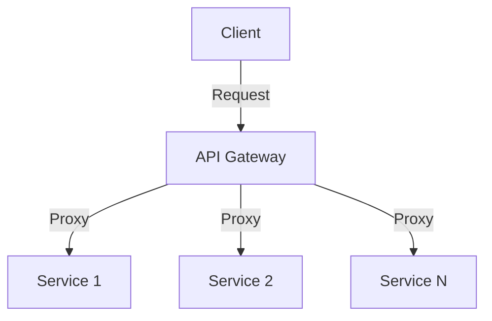

# 使用 API 网关进行集中化安全管理

## 1. 背景介绍

### 1.1 问题的由来

在现代分布式系统架构中，微服务和 API 的使用已经成为了常态。随着系统复杂性的增加和服务数量的激增,有效管理和保护这些 API 变得越来越具有挑战性。传统的点对点安全管理方式已经无法满足当前系统的需求,因为它需要在每个服务上单独配置安全策略,这不仅增加了管理开销,而且容易导致策略不一致和漏洞。

### 1.2 研究现状

为了解决这个问题,API 网关(API Gateway)作为一种集中式入口点出现了。API 网关位于客户端和服务之间,充当反向代理的角色,所有对服务的请求都必须先通过网关。这使得网关可以在一个集中的位置执行各种横切关注点,如身份验证、授权、限流、日志记录等。

### 1.3 研究意义

通过使用 API 网关进行集中化安全管理,可以带来以下好处:

1. **策略一致性**: 所有安全策略都在网关层集中配置,确保了整个系统的一致性。
2. **降低复杂性**: 开发人员无需在每个服务中重复实现安全逻辑,从而降低了复杂性。
3. **提高可维护性**: 安全策略的集中管理使得维护和更新变得更加容易。
4. **提高可观察性**: 网关作为单一入口点,可以更好地监控和分析流量。

### 1.4 本文结构

本文将首先介绍 API 网关的核心概念和与其他组件的关系。然后详细阐述网关中用于安全管理的核心算法原理和数学模型。接下来,通过实际项目实践展示如何使用代码实现这些功能。最后,探讨 API 网关在实际应用场景中的作用,并总结未来发展趋势和面临的挑战。

## 2. 核心概念与联系

API 网关通常位于客户端和后端服务之间,扮演着反向代理的角色。它是系统的单一入口点,所有对后端服务的请求都必须先经过网关。这使得网关可以对流量进行控制和转发,同时执行各种横切关注点,如身份验证、授权、限流、日志记录等。

API 网关通常与以下组件紧密协作:

1. **服务注册与发现**: 网关需要知道后端服务的位置和状态,以便正确路由请求。通常会与服务注册与发现组件(如 Consul、Zookeeper 等)集成。

2. **身份认证服务**: 网关通常会与外部身份认证服务(如 OAuth2、LDAP 等)集成,以验证请求的合法性。

3. **策略管理系统**: 网关的安全策略和配置通常由外部策略管理系统进行集中管理和分发。

4. **监控和日志系统**: 网关作为流量的入口点,可以收集和发送监控数据和日志到相应的系统中。

通过将安全策略和其他横切关注点集中在 API 网关中,可以实现整个系统的一致性和可维护性,同时降低了后端服务的复杂性。

## 3. 核心算法原理 & 具体操作步骤

### 3.1 算法原理概述

API 网关中用于安全管理的核心算法主要包括:

1. **身份认证算法**: 验证请求的合法性,确保只有经过认证的客户端才能访问后端服务。常用算法包括 OAuth2、JWT 等。

2. **授权算法**: 根据预定义的策略,确定经过身份认证的客户端是否有权访问特定的资源或执行特定的操作。常用算法包括基于角色的访问控制(RBAC)、基于属性的访问控制(ABAC)等。

3. **限流算法**: 控制对后端服务的请求流量,防止服务被过载。常用算法包括令牌桶算法、漏桶算法等。

4. **负载均衡算法**: 将请求合理分发到多个后端服务实例,提高系统的可用性和响应能力。常用算法包括加权轮询、最小连接数等。

这些算法的具体实现方式会根据不同的需求和场景而有所不同,但它们的核心思想是通过在网关层执行相应的策略和控制,来确保系统的安全性、可用性和性能。

### 3.2 算法步骤详解

以身份认证和授权算法为例,其典型的执行步骤如下:

1. **身份认证**:
   a. 客户端发送请求,携带身份认证凭据(如 JWT 令牌)。
   b. 网关验证凭据的合法性,通常会与外部身份认证服务进行交互。
   c. 如果凭据有效,则继续执行后续步骤;否则,拒绝该请求。

2. **授权**:
   a. 从请求中提取相关属性,如用户角色、请求资源、操作类型等。
   b. 根据预定义的授权策略(如 RBAC),判断该用户是否有权访问所请求的资源并执行相应操作。
   c. 如果授权通过,则将请求转发到后端服务;否则,拒绝该请求并返回适当的错误响应。

在实际实现中,这些步骤可能会更加复杂,需要考虑各种边界情况和异常处理。同时,还需要与其他组件(如服务发现、监控等)进行集成,以确保整个系统的正常运行。

### 3.3 算法优缺点

上述算法的优点包括:

1. **集中管理**: 所有安全策略都集中在网关层,便于维护和更新。
2. **可扩展性**: 算法通常是模块化和可插拔的,便于根据需求进行扩展和定制。
3. **提高性能**: 通过在网关层执行安全检查,可以减轻后端服务的负担,提高整体性能。

缺点包括:

1. **单点故障**: 网关作为系统的入口点,如果发生故障,可能会导致整个系统不可用。
2. **延迟增加**: 请求需要经过网关的额外处理,可能会增加一些延迟。
3. **复杂性**: 网关本身的配置和管理也会带来一定的复杂性。

### 3.4 算法应用领域

API 网关中的安全管理算法可以应用于各种场景,包括但不限于:

1. **微服务架构**: 在微服务架构中,API 网关通常用于统一入口和集中安全管理。
2. **移动应用**: 移动应用通常会通过 API 网关访问后端服务,网关可以提供安全保护和流量控制。
3. **物联网(IoT)**: 在 IoT 场景中,网关可以作为设备和云端服务之间的安全代理。
4. **合作伙伴集成**: 企业可以通过 API 网关向合作伙伴开放部分服务,并对其进行安全控制。

总的来说,只要是需要对分布式系统进行集中式安全管理的场景,API 网关都可以发挥重要作用。

## 4. 数学模型和公式 & 详细讲解 & 举例说明

### 4.1 数学模型构建

在 API 网关中,限流算法是一个非常重要的组成部分。它的目的是控制对后端服务的请求流量,防止服务被过载,从而保证系统的可用性和响应能力。

常用的限流算法包括令牌桶算法(Token Bucket)和漏桶算法(Leaky Bucket)。这两种算法都可以用简单的数学模型来描述和分析。

#### 令牌桶算法模型

令牌桶算法可以用以下参数来描述:

- $r$: 令牌生成速率(tokens/秒)
- $b$: 令牌桶的容量(tokens)
- $t_n$: 第 n 个请求到达的时间戳

令牌桶中的令牌数量 $tokens(t)$ 可以用以下公式来表示:

$$
tokens(t) = \min\left(b, tokens(t_n) + r \times (t - t_n)\right)
$$

当有新请求到达时,算法会检查令牌桶中是否有足够的令牌。如果有,则允许该请求通过,并从桶中移除相应数量的令牌。否则,该请求将被拒绝或延迟。

#### 漏桶算法模型

漏桶算法可以用以下参数来描述:

- $r$: 漏桶的出水速率(请求/秒)
- $b$: 漏桶的容量(请求数)
- $t_n$: 第 n 个请求到达的时间戳

漏桶中的请求数量 $requests(t)$ 可以用以下公式来表示:

$$
requests(t) = \min\left(b, requests(t_n) + \text{新到达的请求数} - r \times (t - t_n)\right)
$$

当有新请求到达时,算法会检查漏桶中是否有足够的空间。如果有,则允许该请求进入漏桶。否则,该请求将被拒绝或延迟。

### 4.2 公式推导过程

令牌桶算法的公式推导过程如下:

1. 假设在时间 $t_n$ 时,令牌桶中有 $tokens(t_n)$ 个令牌。
2. 在时间段 $(t_n, t)$ 内,令牌会以速率 $r$ 持续生成。
3. 因此,在时间 $t$ 时,新生成的令牌数量为 $r \times (t - t_n)$。
4. 令牌桶的容量为 $b$,因此令牌数不会超过 $b$。
5. 综合以上因素,令牌桶中的令牌数量 $tokens(t)$ 可以表示为:

$$
tokens(t) = \min\left(b, tokens(t_n) + r \times (t - t_n)\right)
$$

漏桶算法的公式推导过程类似:

1. 假设在时间 $t_n$ 时,漏桶中有 $requests(t_n)$ 个请求。
2. 在时间段 $(t_n, t)$ 内,新到达的请求数为 $\text{新到达的请求数}$。
3. 同时,漏桶以速率 $r$ 持续出水(处理请求)。
4. 因此,在时间 $t$ 时,漏桶中的请求数量变化为 $\text{新到达的请求数} - r \times (t - t_n)$。
5. 漏桶的容量为 $b$,因此请求数不会超过 $b$。
6. 综合以上因素,漏桶中的请求数量 $requests(t)$ 可以表示为:

$$
requests(t) = \min\left(b, requests(t_n) + \text{新到达的请求数} - r \times (t - t_n)\right)
$$

### 4.3 案例分析与讲解

现在,让我们通过一个具体的案例来分析和讲解令牌桶算法的工作原理。

假设我们有一个 API 网关,需要对某个后端服务进行限流保护。我们决定使用令牌桶算法,并设置以下参数:

- $r = 5$ tokens/秒
- $b = 10$ tokens
- 令牌桶初始状态为空

现在,我们来模拟一系列请求到达的情况:

1. 在 $t=0$ 时,有 5 个请求到达。由于令牌桶中没有令牌,所以这 5 个请求都被拒绝。
2. 在 $t=1$ 时,有 3 个请求到达。此时,令牌桶中有 5 个令牌,因此这 3 个请求都被允许通过,令牌桶中剩余 2 个令牌。
3. 在 $t=2$ 时,有 4 个请求到达。此时,令牌桶中有 7 个令牌(之前剩余的 2 个加上新生成的 5 个),因此这 4 个请求都被允许通过,令牌桶中剩余 3 个令牌。
4. 在 $t=3$ 时,有 8 个请求到达。此时,令牌桶中有 8 个令牌(之前剩余的 3 个加上新生成的 5 个),因此只有 8 个请求被允许通过,令牌桶变为空。
5. 在 $t=4$ 时,有 6 个请求到达。由于令牌