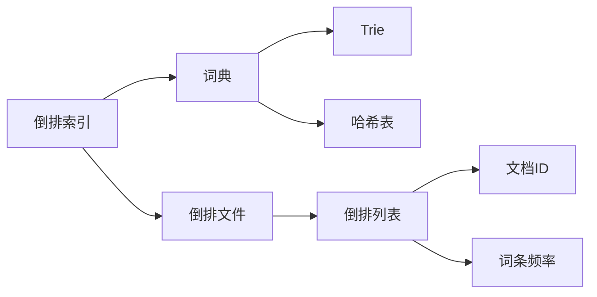

# 倒排索引 原理与代码实例讲解

## 1. 背景介绍

### 1.1 问题的由来

在现代信息时代，海量的数据被不断产生和存储。如何高效地检索和管理这些数据成为了一个关键问题。传统的顺序扫描方法在处理大规模数据时效率低下。为了解决这一问题,倒排索引(Inverted Index)应运而生。

倒排索引是一种用于全文搜索的数据结构,它通过维护一个从内容(如单词或词组)到其位置的映射,实现了快速高效的文本操作,如自动完成、记录查找和相似性查询。

### 1.2 研究现状

倒排索引广泛应用于搜索引擎、数据库系统、自然语言处理等领域。目前,主流的搜索引擎和全文搜索系统都采用了倒排索引技术。随着数据量的不断增长,如何构建高效的倒排索引并优化其性能成为了研究的重点。

### 1.3 研究意义

倒排索引的优势在于查询效率高,能够快速定位包含特定词条的文档。它的引入极大地提高了信息检索的效率,为海量数据的管理和利用提供了有力支持。研究倒排索引的原理和实现对于构建高性能的搜索系统、优化查询性能至关重要。

### 1.4 本文结构

本文首先介绍倒排索引的核心概念和与其他数据结构的联系,然后深入探讨倒排索引的算法原理和数学模型,并通过代码实例详细说明其实现细节。接下来,文章讨论倒排索引在实际应用中的场景,并推荐相关的工具和资源。最后,总结倒排索引的发展趋势和面临的挑战,并对常见问题进行解答。

## 2. 核心概念与联系

倒排索引(Inverted Index)是一种将文档中的词条与其出现位置相关联的索引数据结构。它由两个核心组件组成:词典(Lexicon)和倒排文件(Inverted File)。

词典是一个存储文档集合中所有不重复词条的数据结构,通常使用前缀树(Trie)或哈希表实现。每个词条在词典中都有一个唯一的术语ID(Term ID)。

倒排文件是一个存储着每个词条的倒排列表(Inverted List)的数据结构。倒排列表记录了包含该词条的所有文档的信息,如文档ID、词条频率等。

倒排索引与其他数据结构有着密切联系:

- 前缀树(Trie)和哈希表常用于实现高效的词典。
- 倒排列表通常使用各种压缩技术(如变长编码)来节省存储空间。
- 倒排索引可以看作是一种特殊的关联数组或映射,将词条映射到其倒排列表。
- 在分布式系统中,倒排索引可以使用诸如LSM树等数据结构进行持久化存储。

## 3. 核心算法原理 & 具体操作步骤

### 3.1 算法原理概述

倒排索引的构建过程包括两个主要步骤:

1. **建立词典**:遍历文档集合,提取所有不重复的词条,并为每个词条分配一个唯一的术语ID。
2. **构建倒排文件**:对于每个词条,遍历文档集合,记录包含该词条的文档ID及其词条频率,形成倒排列表。

在查询时,只需要查找查询词条在词典中对应的术语ID,然后在倒排文件中查找相应的倒排列表,即可快速定位包含该词条的文档。

### 3.2 算法步骤详解

1. **文档预处理**:对文档进行分词、去除停用词等预处理,得到文档中的词条序列。
2. **建立词典**:遍历所有文档的词条序列,提取不重复的词条,并为每个词条分配一个唯一的术语ID。
3. **构建倒排文件**:
   - 初始化一个空的倒排文件。
   - 遍历每个文档的词条序列。
   - 对于每个词条,查找其在词典中对应的术语ID。
   - 在倒排文件中,为该术语ID创建或更新一个倒排列表。
   - 将当前文档ID及词条频率添加到该倒排列表中。
4. **查询处理**:
   - 将查询词条映射到其在词典中的术语ID。
   - 在倒排文件中查找该术语ID对应的倒排列表。
   - 从倒排列表中获取包含该词条的文档ID列表。
   - 根据需要进一步处理和排序文档ID列表。

### 3.3 算法优缺点

**优点**:

- 查询效率高,能够快速定位包含特定词条的文档。
- 支持各种查询类型,如词条查询、短语查询、相似性查询等。
- 支持大规模数据的索引和检索。

**缺点**:

- 构建倒排索引的过程耗时且占用大量存储空间。
- 对于动态更新的文档集合,需要频繁重建倒排索引。
- 对于低频词条,倒排列表可能会很长,影响查询效率。

### 3.4 算法应用领域

倒排索引广泛应用于以下领域:

- **搜索引擎**:用于索引网页内容,支持关键词搜索和排名。
- **全文搜索系统**:用于索引文档、电子邮件、日志等文本数据。
- **自然语言处理**:用于构建语料库索引,支持文本分析和挖掘。
- **信息检索**:用于索引多媒体数据的元数据,如图像标题、视频字幕等。
- **数据库系统**:用于支持全文搜索功能。

## 4. 数学模型和公式 & 详细讲解 & 举例说明

### 4.1 数学模型构建

为了量化和优化倒排索引的性能,我们可以构建一个数学模型。假设我们有一个文档集合 $D$,包含 $N$ 个文档,词典 $V$ 中有 $M$ 个不同的词条。我们定义以下符号:

- $f_{t,d}$: 词条 $t$ 在文档 $d$ 中出现的频率。
- $\mathrm{TF}(t,d)$: 词条 $t$ 在文档 $d$ 中的词频(Term Frequency)。
- $\mathrm{DF}(t)$: 词条 $t$ 在文档集合中的文档频率(Document Frequency),即包含该词条的文档数量。
- $\mathrm{IDF}(t)$: 词条 $t$ 的逆文档频率(Inverse Document Frequency)。

则有:

$$
\mathrm{TF}(t,d) = \frac{f_{t,d}}{\sum_{t' \in d} f_{t',d}}
$$

$$
\mathrm{DF}(t) = |\{d \in D : t \in d\}|
$$

$$
\mathrm{IDF}(t) = \log \frac{N}{\mathrm{DF}(t)}
$$

$\mathrm{TF}(t,d)$ 反映了词条 $t$ 在文档 $d$ 中的重要程度。$\mathrm{IDF}(t)$ 反映了词条 $t$ 在整个文档集合中的区分能力,值越大,说明该词条越具有区分性。

在文档检索中,我们通常使用 $\mathrm{TF}$-$\mathrm{IDF}$ 权重来评估一个词条对于文档的重要性:

$$
\mathrm{TF\textrm{-}IDF}(t,d) = \mathrm{TF}(t,d) \times \mathrm{IDF}(t)
$$

### 4.2 公式推导过程

我们来推导 $\mathrm{IDF}(t)$ 公式的由来。假设我们有一个包含 $N$ 个文档的文档集合,其中有 $n_t$ 个文档包含词条 $t$。我们希望 $\mathrm{IDF}(t)$ 满足以下条件:

- 如果一个词条在所有文档中出现,则它的 $\mathrm{IDF}$ 值应该为 0,因为它不具有区分能力。
- 如果一个词条只在一个文档中出现,则它的 $\mathrm{IDF}$ 值应该最大,因为它具有很强的区分能力。
- $\mathrm{IDF}$ 值应该随着包含该词条的文档数量的增加而单调递减。

一个满足上述条件的函数形式为:

$$
\mathrm{IDF}(t) = \log \frac{N}{n_t}
$$

当 $n_t = N$ 时,即词条 $t$ 在所有文档中出现, $\mathrm{IDF}(t) = \log 1 = 0$。当 $n_t = 1$ 时,即词条 $t$ 只在一个文档中出现, $\mathrm{IDF}(t) = \log N$,取得最大值。随着 $n_t$ 的增加, $\mathrm{IDF}(t)$ 单调递减。

通过将 $n_t$ 替换为 $\mathrm{DF}(t)$,我们得到了最终的 $\mathrm{IDF}(t)$ 公式:

$$
\mathrm{IDF}(t) = \log \frac{N}{\mathrm{DF}(t)}
$$

### 4.3 案例分析与讲解

假设我们有一个包含 5 个文档的集合,词典中有 10 个不同的词条。下表显示了每个词条在每个文档中出现的频率:

| 词条 | 文档1 | 文档2 | 文档3 | 文档4 | 文档5 |
|------|-------|-------|-------|-------|-------|
| 苹果 | 2     | 0     | 1     | 3     | 0     |
| 香蕉 | 1     | 2     | 0     | 1     | 1     |
| 橘子 | 0     | 1     | 2     | 0     | 1     |
| 葡萄 | 3     | 0     | 0     | 1     | 2     |
| 柚子 | 0     | 1     | 1     | 0     | 0     |
| 梨   | 1     | 0     | 0     | 0     | 2     |
| 芒果 | 0     | 0     | 0     | 2     | 1     |
| 椰子 | 0     | 1     | 1     | 0     | 0     |
| 火龙果 | 1     | 0     | 0     | 1     | 0     |
| 木瓜 | 0     | 0     | 1     | 0     | 1     |

我们可以计算每个词条的 $\mathrm{TF}$ 和 $\mathrm{IDF}$ 值:

| 词条 | $\mathrm{DF}(t)$ | $\mathrm{IDF}(t)$ | 文档1 $\mathrm{TF}(t,1)$ | 文档2 $\mathrm{TF}(t,2)$ | ... |
|------|-------------------|-------------------|---------------------------|---------------------------|-----|
| 苹果 | 3                 | $\log \frac{5}{3}$ | $\frac{2}{8}$             | 0                        | ... |
| 香蕉 | 4                 | $\log \frac{5}{4}$ | $\frac{1}{8}$             | $\frac{2}{5}$            | ... |
| 橘子 | 3                 | $\log \frac{5}{3}$ | 0                         | $\frac{1}{5}$            | ... |
| 葡萄 | 3                 | $\log \frac{5}{3}$ | $\frac{3}{8}$             | 0                        | ... |
| 柚子 | 2                 | $\log \frac{5}{2}$ | 0                         | $\frac{1}{5}$            | ... |
| ...  | ...                | ...                | ...                       | ...                      | ... |

我们可以观察到:

- 词条"苹果"在文档1中出现了2次,在文档3和文档4中各出现了1次,因此它的 $\mathrm{DF}(t) = 3$,而 $\mathrm{IDF}(t) = \log \frac{5}{3} \approx 0.51$。
- 词条"香蕉"在4个文档中出现,因此它的 $\mathrm{DF}(t) = 4$,而 $\mathrm{IDF}(t)