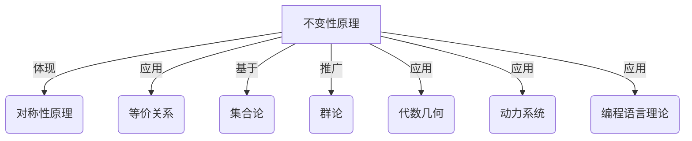

以下是根据您提供的要求和模板撰写的技术博客文章正文:

# 像数学家一样思考：不变性原理

## 1. 背景介绍

### 1.1 问题的由来

在计算机科学和数学领域,不变性原理是一个基础性而又重要的概念。它源于人类对世界规律的不断探索和揭示。我们生活在一个瞬息万变的世界中,但同时也存在着一些恒久不变的本质和规律,这就是不变性的体现。

不变性原理的核心思想是,在变化的环境和条件下,寻找并利用那些保持不变的性质、关系或结构,从而简化问题,提高分析和解决问题的效率。这种思维方式源于数学家和科学家对自然规律的洞见,并被广泛应用于计算机科学、物理学、工程学等多个领域。

### 1.2 研究现状

不变性原理在数学和计算机科学中有着广泛的应用。例如,在代数中,不变量是指在某些变换下保持不变的量;在几何学中,不变量可以是在旋转或平移变换下保持不变的长度或角度;在编程中,不变量可以是在程序执行过程中保持不变的条件或状态。

目前,不变性原理在以下几个领域得到了广泛研究和应用:

- 抽象代数:群论、环论和域论中的不变量
- 几何学:欧几里德几何和非欧几里得几何中的不变量
- 编程语言理论:程序的不变量和断言
- 密码学:加密算法中的不变量和攻击模型
- 物理学:相对论和量子力学中的不变量原理

### 1.3 研究意义

不变性原理对于数学、计算机科学和其他科学领域具有重要意义:

1. 简化问题,提高分析效率
2. 揭示事物的本质规律和内在联系
3. 建立理论模型,推导定理和公式
4. 设计算法,优化程序性能
5. 构建安全可靠的系统,抵御攻击

掌握不变性原理有助于培养抽象思维能力,提高问题解决能力,是成为优秀数学家和计算机科学家的必备素质之一。

### 1.4 本文结构  

本文将从以下几个方面深入探讨不变性原理:

1. 阐述不变性原理的核心概念及其与其他数学原理的联系
2. 详细介绍不变性原理在算法设计中的应用原理和具体步骤  
3. 构建不变性原理的数学模型,并通过公式推导和案例分析加深理解
4. 通过代码实例展示不变性原理在实际编程中的应用
5. 介绍不变性原理在密码学、物理学等领域的应用场景
6. 推荐相关学习资源、开发工具和论文
7. 总结不变性原理的研究成果,展望未来发展趋势和面临的挑战

## 2. 核心概念与联系

不变性原理是一个基础而又广泛的数学概念,它与其他数学原理和概念存在内在联系。理解这些联系有助于把握不变性原理的本质。



1. **对称性原理**:不变性原理体现了事物的对称性。对称性是指在某种变换下,事物的某些性质保持不变。例如,正方形在旋转90度后,其形状和大小保持不变。

2. **等价关系**:不变性原理应用于研究等价关系。等价关系将元素划分为若干个等价类,每个等价类中的元素在某种变换下是不可区分的。

3. **集合论**:不变性原理的数学基础来自集合论。集合论研究集合的性质、运算和关系,其中不变量是集合在某些运算下保持不变的性质。

4. **群论**:群论是研究代数运算在一个集合上的不变性的数学分支。群是一种代数结构,其中的运算满足结合律、存在单位元和逆元等性质,这些性质在群的运算下是不变的。

5. **代数几何**:代数几何研究代数方程和几何对象之间的关系。不变量在代数几何中扮演着重要角色,例如在射影几何中的不变量。

6. **动力系统**:动力系统描述了一个系统随时间演化的规律。不变量在动力系统中表现为系统在某些条件下保持不变的性质,例如能量守恒定律。

7. **编程语言理论**:在编程语言理论中,不变量是程序在执行过程中保持不变的条件或状态。不变量用于程序正确性的验证和优化。

通过上述联系可以看出,不变性原理贯穿于数学的多个分支,是一个基础而又广泛的概念。掌握不变性原理有助于理解和应用其他数学原理。

## 3. 核心算法原理 & 具体操作步骤

### 3.1 算法原理概述

不变性原理在算法设计中有着广泛的应用。利用不变性原理,我们可以简化问题,提高算法的效率和正确性。算法设计的核心思路是:

1. 识别问题中不变的性质或结构
2. 利用这些不变量简化问题
3. 设计算法,保持不变量的不变性
4. 证明算法的正确性

一个经典的例子是排序算法中的不变量。在排序过程中,数组被划分为已排序和未排序两个部分,已排序部分的元素保持有序状态不变,这是算法的不变量。基于这个不变量,我们可以设计出高效的排序算法。

### 3.2 算法步骤详解

利用不变性原理设计算法的一般步骤如下:

1. **问题分析**
    - 明确问题的输入、输出和约束条件
    - 识别问题中可能的不变量

2. **不变量确定**
    - 列出所有可能的不变量候选
    - 验证这些不变量在算法执行过程中是否保持不变
    - 选择最合适的一个或多个不变量

3. **算法设计**  
    - 基于选定的不变量,划分问题状态
    - 设计算法,保持不变量的不变性
    - 初始状态应满足不变量
    - 每一步的状态转移都应保持不变量不变

4. **正确性证明**
    - 利用数学归纳法证明算法的正确性
    - 基础步骤:证明初始状态满足不变量
    - 归纳步骤:假设当前状态满足不变量,证明下一状态也满足不变量

5. **算法分析**
    - 分析算法的时间和空间复杂度
    - 优化算法的效率(如果需要)

6. **算法实现**
    - 根据算法的逻辑实现代码
    - 测试和调试

通过这些步骤,我们可以利用不变性原理系统地设计出正确、高效的算法。下面将对经典的排序算法进行分析,展示不变性原理在算法设计中的应用。

### 3.3 算法优缺点

利用不变性原理设计算法具有以下优点:

- 简化问题,提高算法的可理解性
- 保证算法的正确性,易于证明
- 算法的执行过程更加可控
- 有利于算法的优化和改进

但同时也存在一些缺点和挑战:

- 识别合适的不变量需要经验和洞察力
- 对于复杂问题,可能难以找到简单的不变量
- 不变量可能会增加算法的空间复杂度
- 需要数学推理能力来证明算法的正确性

因此,在实际应用中,我们需要权衡不变性原理的优缺点,结合具体问题进行算法设计。

### 3.4 算法应用领域

不变性原理在算法设计的多个领域都有应用,包括但不限于:

- **排序算法**:快速排序、归并排序等
- **搜索算法**:二分查找、深度/广度优先搜索等
- **图算法**:最小生成树、最短路径等
- **动态规划算法**
- **贪心算法**
- **数论算法**
- **几何算法**
- **并行算法**

不变性原理为我们提供了一种有效的算法设计范式,可以应用于多种算法问题。掌握这种思维方式有助于提高算法设计和分析能力。

## 4. 数学模型和公式 & 详细讲解 & 举例说明

### 4.1 数学模型构建

为了形式化地描述和研究不变性原理,我们可以构建如下数学模型:

设有一个系统 $S$,其状态空间为 $\Sigma$,即系统的所有可能状态的集合。我们定义一个状态转移函数 $T: \Sigma \rightarrow \Sigma$,它描述了系统从一个状态转移到另一个状态的规则。

对于任意状态 $s \in \Sigma$,如果存在一个性质 $P(s)$,使得对于所有的 $s \in \Sigma$,都有 $P(s) \Rightarrow P(T(s))$,那么我们称 $P$ 是系统 $S$ 的一个不变量。

也就是说,如果一个性质在初始状态满足,那么在系统的任何后续状态中,这个性质都会保持不变。这种不变性是算法正确性的关键。

我们可以用一个更形式化的定义来描述不变量:

$$
\begin{align*}
\text{不变量}(P) \Leftrightarrow & \forall s_0 \in \Sigma, P(s_0) \land \\
& \forall s \in \Sigma, P(s) \Rightarrow P(T(s))
\end{align*}
$$

其中 $s_0$ 表示系统的初始状态。

这个定义说明,一个性质 $P$ 是不变量的充分必要条件是:

1. 在初始状态 $s_0$ 时,性质 $P$ 被满足
2. 对于任意状态 $s$,如果性质 $P$ 在该状态满足,那么在下一状态 $T(s)$ 中,性质 $P$ 也会被满足

利用这个数学模型,我们可以形式化地研究不变性原理,并将其应用于算法设计和正确性证明。

### 4.2 公式推导过程

我们可以利用数学归纳法来证明一个算法是正确的。具体步骤如下:

1. **基础步骤**:证明算法的初始状态满足不变量
    $$
    P(s_0)
    $$

2. **归纳步骤**:假设当前状态 $s$ 满足不变量,证明在执行算法的一个步骤后,新状态 $s' = T(s)$ 也满足不变量
    $$
    \begin{align*}
    \text{假设:} & \quad P(s) \\
    \text{证明:} & \quad P(T(s))
    \end{align*}
    $$

如果我们能够证明基础步骤和归纳步骤都成立,那么根据数学归纳法的原理,对于算法的任意执行序列,不变量 $P$ 都将被满足。这就证明了算法的正确性。

我们可以用一个简单的算法例子来说明这个过程。

**示例:求数组元素之和**

```python
def sum_array(A):
    total = 0
    for x in A:
        total += x
    return total
```

我们定义不变量为:在循环的每一次迭代之后,`total`的值是数组 `A` 中已经遍历过的元素之和。

1. **基础步骤**:
    初始状态是 `total = 0`,数组 `A` 中还没有遍历任何元素,因此不变量成立。

2. **归纳步骤**:
    假设在第 `k` 次迭代之前,不变量成立,即 `total` 是数组前 `k` 个元素的和。在第 `k` 次迭代中,`total` 加上第 `k` 个元素 `A[k]`,因此在第 `k` 次迭代之后,`total` 是数组前 `k+1` 个元素的和,不变量仍然成立。

由于基础步骤和归纳步骤都成立,根据数学归