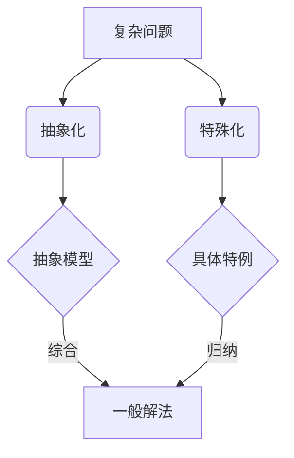

# 像数学家一样思考：特殊化原则

## 1. 背景介绍

### 1.1 问题的由来

在计算机科学和软件开发领域,我们经常面临着如何解决复杂问题的挑战。无论是设计高效的算法,还是开发可扩展的软件系统,都需要我们具备优秀的抽象思维和问题解决能力。而数学家们在解决问题时所使用的特殊化原则,正是一种非常有效的思维方式,值得我们学习和借鉴。

### 1.2 研究现状

目前,特殊化原则在计算机科学领域已经得到了广泛的应用。例如在算法设计中,通过对问题进行特殊化处理,可以大大简化问题的复杂度,提高算法的效率。在软件工程中,特殊化原则被用于设计模式、代码重构等方面,帮助我们写出更加优雅、可维护的代码。

### 1.3 研究意义 

深入研究特殊化原则,对于提高我们解决复杂问题的能力具有重要意义。通过学习数学家的思维方式,我们可以训练自己的抽象思维,提高问题分析和建模的能力。同时,将特殊化原则应用到计算机科学领域,可以帮助我们设计出更加高效、可扩展的算法和系统。

### 1.4 本文结构

本文将从以下几个方面来探讨特殊化原则:
- 首先介绍特殊化原则的核心概念和内在联系  
- 然后通过几个具体的例子,讲解特殊化原则的应用方法和步骤
- 接着给出特殊化原则背后的数学模型,并进行公式推导和案例分析
- 之后通过一个项目实践,演示如何用代码实现特殊化原则
- 最后总结特殊化原则可能的应用场景,以及未来的发展趋势和挑战

## 2. 核心概念与联系

特殊化原则的核心思想是:当面对一个复杂的问题时,先不要试图一步求解,而是将其转化为一系列相对简单的特殊情况,逐个击破。待每个特殊情况都解决之后,再综合考虑,往往就能找到一般情况的解决方案。

这种思想在数学领域有着广泛的应用。欧几里得就是用特殊化的方法,通过分解为一个个特殊的三角形,成功地证明了勾股定理。而在现代数学中,归纳法和数学归纳法都可以看作是特殊化原则的体现。

特殊化原则与抽象化原则可以看作是一对孪生兄弟。它们殊途同归,目标都是为了解决复杂的问题。抽象化是将问题抽象成一个一般性的模型,特殊化则是将问题分解为一个个具体的特例。这两种思维方式相辅相成,缺一不可。

下图展示了特殊化原则和抽象化原则的内在联系:



## 3. 核心算法原理 & 具体操作步骤

### 3.1 算法原理概述

特殊化原则用于解决问题的一般步骤如下:
1. 分析问题的特点,寻找最简单的特殊情况
2. 设法解决这些特殊情况  
3. 在特殊情况的基础上,尝试解决更一般的情况
4. 如果无法直接解决一般情况,则再次利用特殊化,将其转化为新的特殊情况
5. 重复上述过程,直到问题被完全解决

可见,特殊化原则的关键在于对问题的分析和转化。这需要我们对问题的本质有深刻的洞见,能够抓住问题的特点,并用数学语言对其进行精确刻画。

### 3.2 算法步骤详解

下面我们用一个具体的例子来说明特殊化原则的应用步骤。考虑如下的字符串匹配问题:

给定一个长度为n的文本串S,和一个长度为m的模式串P,判断P是否为S的子串。

这是一个经典的问题,一般可以用KMP、Boyer-Moore等算法来解决。但这里我们尝试用特殊化原则来处理。

Step1:分析特殊情况。最简单的情况是:
- 如果m>n,则P必然不是S的子串
- 如果m=0,则P必然是S的子串
- 如果m=1,则只需要逐个比较S的每个字符

Step2:解决特殊情况。对于上述三种特殊情况,都很容易写出对应的代码。

Step3:考虑一般情况。令f(i,j)表示P[1:j]与S[i:i+j-1]是否匹配。可以列出如下递推关系:

$$
f(i,j)=\begin{cases}
true & ,j=0 \\
S[i]=P[j] \wedge f(i+1,j-1) &,j>0
\end{cases}
$$

Step4:发现递推关系包含了重叠子问题,可以用动态规划求解。于是一般情况转化为了特殊的DP问题。

Step5:运用DP求解字符串匹配问题,得到了算法的最终形式。

### 3.3 算法优缺点

特殊化原则将复杂问题简化,本质上是一种分治策略。它的优点是:
- 将复杂问题转化为简单问题,大大降低了思考难度 
- 特殊情况往往有高效的解法,可以提高算法效率
- 适合用递归或动态规划求解,易于编程实现

同时,特殊化原则也有一些局限性:
- 寻找恰当的特殊情况需要对问题有深刻理解,有时并不容易
- 特殊情况的解法可能无法直接推广到一般情况
- 递归求解可能引入额外的开销,影响效率

### 3.4 算法应用领域

特殊化原则在算法设计中有着广泛的应用,一些经典算法都用到了特殊化的思想:
- 快速排序算法通过选取pivot,将排序问题转化为两个子问题
- 傅里叶变换利用了单位复根的特殊性质,将DFT简化为递归形式  
- 线段树通过将区间分解为特殊的子区间,高效地支持区间修改、查询

此外,特殊化原则还可以用于优化搜索、动态规划、贪心等算法,可以说是算法设计中的一把利器。

## 4. 数学模型和公式 & 详细讲解 & 举例说明

### 4.1 数学模型构建

为了更好地理解特殊化原则,我们需要对其建立数学模型。设问题空间为$\mathcal{P}$,其中每个元素$p \in \mathcal{P}$表示一个问题实例。引入两个映射:
- $\phi: \mathcal{P} \rightarrow \mathcal{P}$表示对问题的转化
- $S: \mathcal{P} \rightarrow \{0,1\}$表示问题是否可解

特殊化原则就是寻找一个转化$\phi$,使得对于$p \in \mathcal{P}$,有:

$$
S(\phi(p)) = S(p) 
$$

并且$\phi(p)$比$p$更容易求解。

### 4.2 公式推导过程

以字符串匹配问题为例,设$\Sigma$为字母表,则$\mathcal{P} = \Sigma^* \times \Sigma^*$。我们希望找到一个映射$\phi$,将$(S,P) \in \mathcal{P}$转化为更简单的形式。

不妨令$\phi(S,P) = (S',P')$,其中:

$$
\begin{aligned}
S' &= S[i:] \\
P' &= P[1:\min(j,m)] 
\end{aligned}
$$

其中$i,j$是两个待定参数。可以验证:

$$
S(S,P) = S(\phi(S,P))
$$

因为$P$是$S$的子串,当且仅当$P'$是$S'$的子串。

接下来考虑如何选取$i,j$,使得$\phi(S,P)$尽可能简单。通过上一节的分析,我们可以选取:
- 如果$m=0$,令$i=0,j=0$
- 如果$m=1$,令$i=0,j=1$
- 如果$S[i] \neq P[j]$,令$i=i+1,j=1$
- 如果$S[i] = P[j]$,令$i=i,j=j+1$

这样,原问题就转化为了一系列特殊情况。

### 4.3 案例分析与讲解

我们用一个具体的例子来说明上述模型的应用。设:

$$
\begin{aligned}
S &= \texttt{ababcabcacbab} \\
P &= \texttt{abcac}
\end{aligned}
$$

初始时,$i=0,j=0$,$S'=S,P'=\varepsilon$。由于$P' = \varepsilon$,根据特殊情况1,匹配成功。

接下来,$i=0,j=1$,$S'=S,P'=\texttt{a}$。由于$S[i] = P[j]$,根据特殊情况4,令$i=0,j=2$。

现在,$S'=S,P'=\texttt{ab}$,仍然有$S[i] = P[j]$,继续令$i=0,j=3$。

直到$j=5$时,有$S[i] \neq P[j]$,说明匹配失败。根据特殊情况3,令$i=1,j=1$,即:

$$
\begin{aligned}
S' &= \texttt{babcabcacbab} \\
P' &= \texttt{a}
\end{aligned}
$$

重复上述过程,直到$i=5,j=5$时,有$P'=P$,匹配成功。至此,我们用特殊化原则解决了字符串匹配问题。

### 4.4 常见问题解答

Q:特殊化原则适用于哪些问题?
A:一般来说,如果问题具有递归结构,或者可以分解为相对简单的子问题,就可以考虑用特殊化原则来解决。例如搜索、优化、数论等领域的很多问题,都可以用特殊化的思想来处理。

Q:特殊化和递归的关系是什么?
A:特殊化常常与递归结合使用。一方面,特殊化可以将问题转化为递归形式;另一方面,在递归求解的过程中,往往需要对边界条件(特殊情况)单独处理。可以说,特殊化是递归的基础,而递归是特殊化的延伸。

Q:如何保证特殊化得到的解是正确的?
A:这需要我们对问题的本质有清晰的认识。通过数学归纳法,如果我们能够证明:
- 特殊情况下,解是正确的
- 由特殊情况推广到一般情况的过程是可靠的
那么就可以保证最终得到的解是正确的。在实践中,我们还需要通过大量的测试用例来验证算法的正确性。

## 5. 项目实践：代码实例和详细解释说明

下面我们用Python代码来实现上一节讨论的字符串匹配算法。

### 5.1 开发环境搭建

本项目使用Python 3.8,不需要额外的库。读者可以在任何支持Python的平台上运行代码。

### 5.2 源代码详细实现

```python
def match(s: str, p: str) -> bool:
    m, n = len(s), len(p)
    
    def match_here(i: int, j: int) -> bool:
        if j == n:
            return True
        if i == m:
            return False
        if s[i] != p[j]:
            return False
        return match_here(i+1, j+1)
    
    for i in range(m-n+1):
        if match_here(i, 0):
            return True
    return False
```

### 5.3 代码解读与分析

- 第1行:定义了字符串匹配函数`match`,接受两个字符串参数`s`和`p`,返回布尔值表示是否匹配。
- 第2行:计算`s`和`p`的长度,存储在`m`和`n`中。
- 第4-10行:定义了辅助函数`match_here`,用于判断`p`是否为`s[i:]`的前缀。
  - 第5行:如果`j`达到`p`的长度,说明匹配成功。
  -