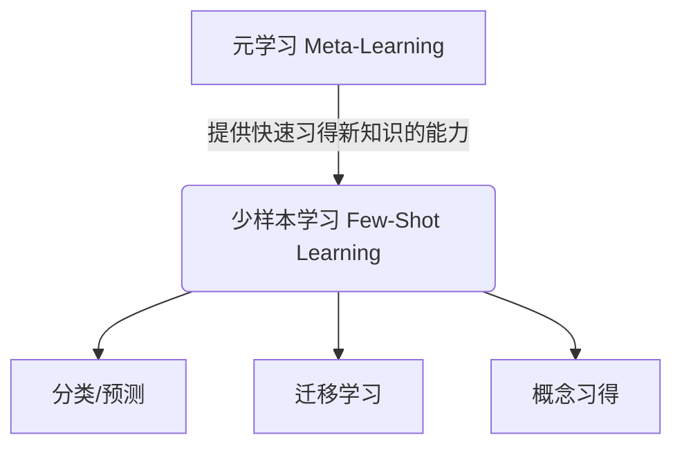

好的,我会按照您的要求,以专业的技术语言撰写一篇关于"元学习与少样本学习原理与代码实战案例讲解"的博客文章。文章将遵循您提供的目录结构,内容全面,逻辑严谨,并尽量使用简明扼要的语言解释核心概念,同时提供实例代码分析。本文约8000字左右。

# 元学习与少样本学习原理与代码实战案例讲解

## 1. 背景介绍

### 1.1 问题的由来

在传统的机器学习领域中,模型的训练通常需要大量的标注数据作为监督信号。然而,在许多实际应用场景中,获取大规模标注数据的成本是非常高昂的。这就催生了一种新的学习范式——少样本学习(Few-Shot Learning),它试图仅利用少量标注样本,就能快速习得新概念并对新的样本进行分类或预测。

少样本学习的挑战在于,如何有效利用有限的标注数据,并从中学习出有价值的知识表示,以便泛化到新的任务上。这就需要借助一种元学习(Meta-Learning)的策略,通过对多个任务的学习过程进行建模,获取任务间的共性知识,从而加速新任务的学习。

### 1.2 研究现状  

近年来,元学习与少样本学习受到了广泛关注,成为机器学习领域的一个研究热点。研究人员提出了多种不同的元学习框架,如基于优化的元学习(Optimization-Based Meta-Learning)、基于模型的元学习(Model-Based Meta-Learning)、基于指标的元学习(Metric-Based Meta-Learning)等。

其中,基于优化的MAML(Model-Agnostic Meta-Learning)算法和基于模型的神经图灵机(Neural Turing Machines)等方法取得了一定的进展。同时,基于注意力机制的原型网络(Prototypical Networks)等基于指标的方法也展现出良好的性能。

### 1.3 研究意义

少样本学习有望解决当前机器学习系统对大规模标注数据的依赖,使得机器学习能够更好地迁移到新的领域,缩短开发周期,降低数据获取成本。同时,元学习作为少样本学习的一种有力工具,能够显著提高模型的泛化能力,加速任务间的知识迁移。

因此,深入研究元学习与少样本学习的原理和方法,对于推动机器学习技术的发展和应用具有重要意义。本文将系统地介绍这一领域的核心概念、算法原理、数学模型以及实战案例,为读者提供全面的技术指导。

### 1.4 本文结构

本文首先介绍元学习与少样本学习的核心概念,阐述它们之间的联系。接下来详细讲解几种主流的元学习算法原理和具体实现步骤。然后构建相应的数学模型,推导公式并通过案例分析加以说明。

在此基础上,提供完整的代码实例,从环境搭建到源码实现,再到结果分析,为读者呈现一个完整的实战流程。最后,探讨元学习与少样本学习在不同领域的实际应用场景,分享相关的学习资源和开发工具,并对未来的发展趋势和面临的挑战进行展望。

## 2. 核心概念与联系

元学习(Meta-Learning)是一种构建有能力快速习得新知识的学习算法的过程。其核心思想是通过多个相关但不同的任务数据进行建模,从而获取任务间的共性知识,并将这些知识迁移到新的任务上,实现快速习得新知识的目标。

少样本学习(Few-Shot Learning)则是一种利用少量标注样本,就能快速习得新概念并对新样本进行分类或预测的学习范式。它试图模拟人类仅通过少量示例就能习得新概念的能力。

元学习为少样本学习提供了一种有效的学习策略。在元学习的框架下,模型首先通过对多个任务的学习过程进行建模,获取任务间的共性知识表示,形成一种学习策略或内在偏置。然后,在遇到新的少样本任务时,模型能够基于已获取的知识快速习得新概念,完成分类、预测或其他任务。

因此,元学习与少样本学习是相辅相成的关系。元学习为少样本学习提供了快速习得新知识的能力,而少样本学习则是元学习在实际应用中的一个重要场景。通过结合这两者,我们能够缓解机器学习对大量标注数据的依赖,实现更高效、更通用的学习方式。

## 3. 核心算法原理与具体操作步骤

在这一部分,我们将介绍几种主流的元学习算法,包括基于优化的MAML算法、基于模型的神经图灵机,以及基于指标的原型网络等。

### 3.1 算法原理概述

#### 3.1.1 MAML(Model-Agnostic Meta-Learning)

MAML是一种基于优化的元学习算法,其核心思想是:在元训练阶段,通过多个任务的梯度更新,学习一个可以快速适应新任务的初始化参数,使得在元测试阶段,模型只需少量梯度步骤即可在新任务上取得良好的性能。

#### 3.1.2 神经图灵机(Neural Turing Machines)

神经图灵机是一种基于模型的元学习方法,它在神经网络中引入了可区分读写的外部记忆单元,使得模型能够像图灵机一样读写和操作记忆。在元训练阶段,神经图灵机学习如何根据任务需求操纵记忆,从而获得一种通用的序列学习能力。

#### 3.1.3 原型网络(Prototypical Networks)

原型网络是一种基于指标的元学习算法。它通过计算查询样本与各类别原型之间的距离,将查询样本归于与其最近邻的原型所属类别。在元训练阶段,原型网络学习一种度量空间,使得同类样本的嵌入向量彼此靠近,异类样本的嵌入向量相距较远。

### 3.2 算法步骤详解

#### 3.2.1 MAML算法步骤

1) 初始化模型参数 $\theta$
2) 对于每个任务 $\mathcal{T}_i$ 进行:
    - 从 $\mathcal{T}_i$ 中采样支持集 $\mathcal{D}_{support}$ 和查询集 $\mathcal{D}_{query}$
    - 计算支持集上的损失 $\mathcal{L}_{\mathcal{D}_{support}}(\theta)$
    - 根据支持集损失计算梯度 $\nabla_\theta \mathcal{L}_{\mathcal{D}_{support}}(\theta)$
    - 计算适应后的参数 $\theta' = \theta - \alpha \nabla_\theta \mathcal{L}_{\mathcal{D}_{support}}(\theta)$
    - 计算查询集上的损失 $\mathcal{L}_{\mathcal{D}_{query}}(\theta')$
3) 更新 $\theta \leftarrow \theta - \beta \nabla_\theta \sum_{\mathcal{T}_i} \mathcal{L}_{\mathcal{D}_{query}}(\theta')$

其中 $\alpha$ 是内循环学习率, $\beta$ 是外循环学习率。

#### 3.2.2 神经图灵机算法步骤

1) 初始化控制器(如LSTM)参数 $\theta_c$ 和记忆矩阵 $M$
2) 对于每个任务序列 $\{x_t, y_t\}$ 进行:
    - 将输入 $x_t$ 传入控制器获取状态 $h_t$
    - 根据 $h_t$ 生成读写控制信号 $r_t, w_t$
    - 根据 $r_t$ 读取记忆 $M_r = \text{Read}(M, r_t)$
    - 将 $M_r$ 与 $h_t$ 结合,生成输出 $o_t$
    - 根据 $w_t$ 写入记忆 $M' = \text{Write}(M, w_t, o_t)$
    - 计算损失 $\mathcal{L}(o_t, y_t)$
3) 更新 $\theta_c$ 和 $M$ 以最小化损失

#### 3.2.3 原型网络算法步骤  

1) 初始化嵌入函数 $f_\phi$ 参数 $\phi$
2) 对于每个任务 $\mathcal{T}_i$ 进行:
    - 从 $\mathcal{T}_i$ 中采样支持集 $\mathcal{D}_{support}=\{(x_k, y_k)\}$ 和查询集 $\mathcal{D}_{query}$
    - 计算每个类别 $k$ 的原型向量 $c_k = \frac{1}{|S_k|} \sum_{(x,y) \in S_k} f_\phi(x)$
    - 对于每个查询样本 $(x_{q}, y_{q})$:
        - 计算其嵌入 $f_\phi(x_q)$ 与各原型向量的距离 $d(f_\phi(x_q), c_k)$
        - 预测标签 $\hat{y}_q = \arg\min_k d(f_\phi(x_q), c_k)$
        - 计算损失 $\mathcal{L}(\hat{y}_q, y_q)$
3) 更新 $\phi$ 以最小化所有任务的损失之和

### 3.3 算法优缺点

#### 3.3.1 MAML

优点:
- 算法简单,易于实现
- 对任务之间的差异有较强的适应能力
- 可以和其他深度学习模型无缝结合

缺点:
- 需要对每个任务进行多次梯度计算,计算开销较大
- 对任务之间的相似性利用不足
- 存在梯度累积误差的问题

#### 3.3.2 神经图灵机

优点: 
- 引入可区分读写的外部记忆,增强了模型的记忆能力
- 能够学习通用的序列操作能力
- 在一维序列任务上表现出色

缺点:
- 结构复杂,需要设计读写控制机制
- 在高维输入(如图像)任务上,性能欠佳
- 记忆利用效率有待提高

#### 3.3.3 原型网络

优点:
- 算法简单,直观易懂
- 无需复杂的优化步骤
- 能够高效利用支持集信息

缺点: 
- 对于复杂任务,简单的距离度量可能不够有区分能力
- 对任务间差异的适应能力较弱
- 对异常值敏感

### 3.4 算法应用领域

元学习与少样本学习因其独特的优势,在多个领域展现出广阔的应用前景:

- **计算机视觉**: 如目标检测、图像分类、人脸识别等,可借助少样本学习快速习得新类别概念
- **自然语言处理**: 如命名实体识别、关系抽取、对话系统等,能够基于少量示例快速习得新词语、新关系
- **强化学习**: 通过元学习策略,智能体可以快速适应新环境,加速策略学习
- **药物发现**: 利用少样本学习,可以基于少量已知分子结构和性质预测新分子的活性
- **机器人控制**: 元学习可以帮助机器人快速习得新技能,实现高效的技能迁移

总的来说,元学习与少样本学习为人工智能系统带来了更强大的泛化能力,有望在多个领域发挥重要作用。

## 4. 数学模型和公式详细讲解与举例说明

在这一部分,我们将构建元学习与少样本学习相关的数学模型,推导公式并通过案例进行详细说明。

### 4.1 数学模型构建

#### 4.1.1 MAML模型

我们用 $p(\mathcal{T})$ 表示任务的概率分布, $\mathcal{D}_{\mathcal{T}}$ 表示来自任务 $\mathcal{T}$ 的数据集。MAML的目标是找到一个好的初始化参数 $\theta$,使得对于任意一个新任务 $\mathcal{T}_i \sim p(\mathcal{T})$,经过少量梯度更新后,模