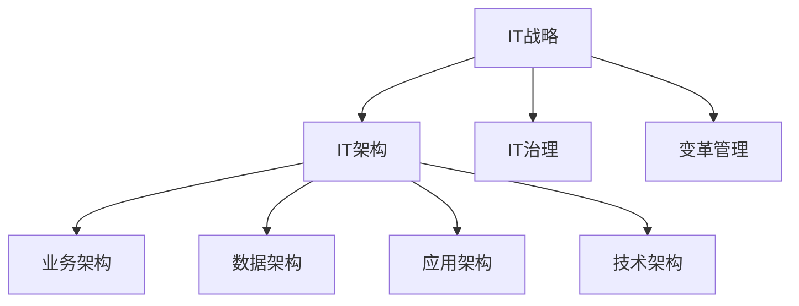

# 公司IT战略规划的制定、实施

关键词：IT战略规划、信息化建设、业务战略、IT架构、IT治理、变革管理

## 1. 背景介绍
### 1.1 问题的由来
在当今数字化转型的大背景下,企业面临着日益激烈的市场竞争和不断变化的技术环境。如何利用信息技术推动业务创新,提升企业核心竞争力,已成为企业生存和发展的关键。然而,许多企业在IT建设过程中存在盲目投资、缺乏顶层设计、IT与业务脱节等问题,导致IT投资收益低下。因此,制定和实施有效的IT战略规划,对于企业实现可持续发展至关重要。

### 1.2 研究现状
目前,国内外学者对IT战略规划的研究已取得了一定进展。国外研究主要集中在IT战略规划的理论框架、方法论和最佳实践等方面。如MIT的Peter Weill提出了IT治理框架,强调IT决策权的分配机制;Gartner提出了面向业务成果的IT战略规划方法论。国内研究主要侧重于IT战略规划的实践应用,如IT规划与业务战略的融合、IT架构设计、IT治理体系建设等。但总体而言,现有研究还存在理论与实践脱节、缺乏系统性和操作性等不足。

### 1.3 研究意义
深入研究IT战略规划的制定和实施,对于指导企业IT建设具有重要意义:

(1)明确IT建设目标和路径,避免盲目投资;

(2)统筹规划IT资源配置,提高IT投资效益;

(3)推动业务与IT融合,促进业务创新;

(4)完善IT治理体系,提升IT管理水平;

(5)应对数字化转型挑战,增强企业竞争优势。

### 1.4 本文结构
本文将从以下几个方面系统阐述IT战略规划的制定和实施:

第一,介绍IT战略规划的核心概念和内在联系;

第二,提出一套科学实用的IT战略规划方法论;

第三,剖析IT战略规划的关键要素和实施路径;

第四,总结IT战略规划的实践经验和应对挑战的策略;

第五,展望IT战略规划的未来发展趋势。

## 2. 核心概念与联系
IT战略规划是指企业根据自身业务发展需求,对信息化建设的目标、内容、路径等进行系统谋划和顶层设计的过程。它涉及IT战略、IT架构、IT治理、变革管理等多个核心概念。

**IT战略**是企业利用信息技术实现业务目标的总体方针和行动纲领,它要回答"利用IT实现什么"的问题。IT战略应与企业的业务战略保持一致,并为业务创新和转型提供驱动力。

**IT架构**是为实现IT战略而规划的IT系统蓝图,包括业务架构、数据架构、应用架构和技术架构等,它要回答"如何构建IT系统"的问题。科学合理的IT架构是IT战略落地的基础。

**IT治理**是指导和监控企业IT工作的组织架构、流程体系和关键制度,它要回答"如何管理IT"的问题。有效的IT治理可以提高IT决策的科学性,规范IT管理行为,控制IT风险。

**变革管理**是推动组织适应新的IT环境的系统工程,它要回答"如何实现变革"的问题。变革管理需要统筹考虑技术、流程、人员等因素,克服变革阻力,确保IT战略的顺利实施。

这些概念相互联系、相互作用,构成了IT战略规划的完整体系。IT战略是指引,IT架构是蓝图,IT治理是保障,变革管理是抓手。只有将它们有机结合,形成合力,才能真正发挥IT战略规划的作用。



## 3. 核心算法原理 & 具体操作步骤
### 3.1 算法原理概述
IT战略规划并非一蹴而就,而是一个循序渐进的过程。本文提出一套"6A"IT战略规划方法论,即Align(对齐)、Analyze(分析)、Architect(架构)、Act(行动)、Assess(评估)、Adjust(调整)。该方法论强调IT战略规划与业务战略的动态对齐,注重顶层设计和实施落地,坚持持续改进和动态优化。

### 3.2 算法步骤详解
(1)Align(对齐):明确企业战略目标,分析业务发展需求,识别IT应用场景,确保IT规划与业务战略对齐。

(2)Analyze(分析):全面评估企业内外部环境,分析企业的IT能力成熟度,识别IT面临的机遇和挑战,为IT规划提供决策依据。

(3)Architect(架构):基于业务需求和环境分析,规划IT总体架构,包括业务架构、数据架构、应用架构和技术架构,并明确IT发展路线图。

(4)Act(行动):制定IT实施计划,明确任务分工和进度安排,同步开展IT治理体系和变革管理,确保IT规划落地。

(5)Assess(评估):建立IT评估指标体系,定期评估IT建设成效,发现问题和不足,总结经验教训。

(6)Adjust(调整):根据评估结果和内外部环境变化,动态调整IT战略规划,优化IT架构和管理体系,实现持续改进。

### 3.3 算法优缺点
该方法论的优点在于:

(1)强调业务导向,确保IT规划与业务战略的一致性;

(2)注重顶层设计,从全局视角统筹规划IT架构;

(3)兼顾实施落地,制定切实可行的行动计划;

(4)坚持持续改进,根据反馈动态优化IT规划。

但该方法论在实践中也面临一些挑战:

(1)需要企业高层的重视和支持;

(2)需要IT与业务部门的紧密协作;

(3)需要全面准确的内外部环境信息;

(4)需要专业的IT规划和管理人才。

### 3.4 算法应用领域
IT战略规划方法论可广泛应用于各类企业和机构的信息化建设,特别是对于处于数字化转型关键期、迫切需要利用新IT赋能业务创新的企业,更应进行系统的IT战略规划。同时,IT服务供应商和咨询机构也可以借鉴该方法论,为客户提供专业的IT规划服务。

## 4. 数学模型和公式 & 详细讲解 & 举例说明
### 4.1 数学模型构建
为了定量评估IT战略规划的有效性,可以构建一个简化的数学模型。假设影响IT战略规划有效性的主要因素包括:

(1)业务战略与IT战略的一致性$A$;

(2)IT架构的合理性$R$;

(3)IT治理的有效性$G$;

(4)变革管理的到位性$C$。

其中,$A,R,G,C$的取值范围为$[0,1]$,取值越大表示该因素对IT战略规划的正向影响越大。

假设IT战略规划有效性$E$与上述4个因素呈线性关系,则可以建立如下数学模型:

$$E = \alpha A + \beta R + \gamma G + \delta C$$

其中,$\alpha,\beta,\gamma,\delta$为权重系数,反映各因素对$E$的影响程度,且$\alpha+\beta+\gamma+\delta=1$。

### 4.2 公式推导过程
为了确定权重系数的取值,可以采用层次分析法(AHP)。首先,通过专家打分确定各因素的重要性排序。假设重要性排序为:$A>R>G>C$。

然后,构建成对比较矩阵$M$:

$$M=\begin{bmatrix} 
1 & 2 & 4 & 6\\ 
1/2 & 1 & 2 & 4\\
1/4 & 1/2 & 1 & 2\\
1/6 & 1/4 & 1/2 & 1
\end{bmatrix}$$

其中,$M_{ij}$表示因素$i$相对于因素$j$的重要性。

接着,计算矩阵$M$的最大特征值$\lambda_{max}$和对应的特征向量$W$,并进行一致性检验。

假设计算结果为:$\lambda_{max}=4.0385,W=[0.5396,0.2970,0.1188,0.0446]^T,CR=0.0143<0.1$,通过一致性检验。

则权重系数$\alpha=0.5396,\beta=0.2970,\gamma=0.1188,\delta=0.0446$,代入模型得:

$$E = 0.5396A + 0.2970R + 0.1188G + 0.0446C$$

### 4.3 案例分析与讲解
以某制造企业的IT战略规划为例,通过打分评估确定:

$A=0.8$(业务战略与IT战略基本一致,但存在部分偏差);

$R=0.7$(IT架构总体合理,但在数据架构和集成方面有待加强);

$G=0.6$(初步建立了IT治理组织和制度,但执行力有待提高);

$C=0.5$(开展了变革管理,但力度不够,阻力仍然较大)。

代入模型计算得:

$$E = 0.5396 \times 0.8 + 0.2970 \times 0.7 + 0.1188 \times 0.6 + 0.0446 \times 0.5 = 0.7321$$

说明该企业IT战略规划的有效性达到73.21%,还有较大提升空间,需要在提高业务战略与IT战略一致性、优化IT架构、加强IT治理和变革管理等方面持续改进。

### 4.4 常见问题解答
(1)如何确保业务战略与IT战略的一致性?

需要建立"业务-IT"联动机制,IT部门深入了解业务需求,业务部门全面参与IT规划,形成合力。

(2)如何科学规划IT架构?

需要遵循"业务驱动、数据中心、应用支撑、技术保障"的原则,采用成熟的企业架构框架(如TOGAF),并适当借鉴行业最佳实践。

(3)如何有效开展IT治理?

需要成立IT治理委员会,建立IT治理框架,明确IT决策机制,并嵌入绩效考核体系。

(4)变革管理应该关注哪些方面?

需要统筹考虑组织结构、业务流程、应用系统、数据管理、人员能力、绩效考核等方面的变革,协同推进。

## 5. 项目实践：代码实例和详细解释说明
### 5.1 开发环境搭建
使用Python搭建一个简单的IT战略规划评估系统,主要依赖库包括:

- numpy:数值计算库
- pandas:数据分析库
- matplotlib:数据可视化库

### 5.2 源代码详细实现
```python
import numpy as np
import pandas as pd
import matplotlib.pyplot as plt

# 定义评估指标和权重
factors = ['Alignment', 'Architecture', 'Governance', 'Change']
weights = [0.5396, 0.2970, 0.1188, 0.0446]

# 输入评分数据
data = pd.DataFrame({
    'Factor': factors,
    'Weight': weights,
    'Score': [0.8, 0.7, 0.6, 0.5]
})

# 计算加权得分
data['Weighted'] = data['Weight'] * data['Score']
effectiveness = data['Weighted'].sum()

# 输出结果
print('IT战略规划有效性: {:.2%}'.format(effectiveness))

# 绘制雷达图
angles = np.linspace(0, 2*np.pi, len(factors), endpoint=False)
scores = np.concatenate((data['Score'], [data['Score'][0]]))
angles = np.concatenate((angles, [angles[0]]))

fig = plt.figure()
ax = fig.add_subplot(111, polar=True)
ax.plot(angles, scores, 'o-', linewidth=2)
ax.fill(angles, scores, alpha=0.25)
ax.set_thetagrids(angles[:-1] * 180/np.pi, factors)
ax.set_ylim(0, 1)
ax.set_title('IT战略规划评估雷达图')

plt.show()
```

### 5.3 代码解读与分析
该代码主要分为以下几个部分:

(1)定义评估指标factors和权重weights。

(2)