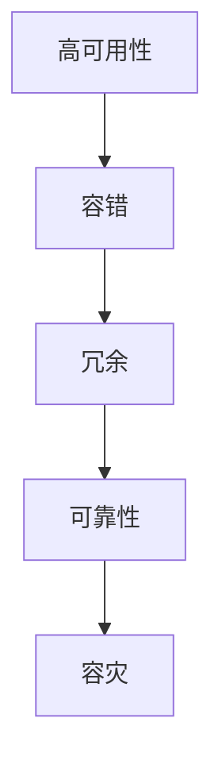

# 冗余设计在实际系统中的应用

关键词：冗余设计、容错、高可用性、可靠性、容灾、备份、故障切换

## 1. 背景介绍
### 1.1 问题的由来
在现代信息化社会中,各种信息系统已经渗透到生活的方方面面。这些系统的可靠性和可用性直接关系到企业的生存发展和社会的正常运转。然而,由于系统日益复杂,组件繁多,各种软硬件故障在所难免。如何通过冗余设计来提高系统的容错能力,确保关键业务不中断,成为了一个亟待解决的问题。
### 1.2 研究现状
目前,冗余设计已经在航空、航天、电力、金融、电信等关键领域得到了广泛应用。通过备份、多路复用、故障切换等技术手段,大幅提升了系统的可靠性。但在一些新兴行业,如互联网、物联网、人工智能等领域,海量数据、高并发、实时性等需求对传统冗余方案提出了新的挑战。学术界和工业界都在积极探索更加高效、智能、灵活的冗余机制。
### 1.3 研究意义 
深入研究冗余设计,对保障信息系统安全稳定运行、提升用户体验、促进数字经济发展具有重要意义:

1. 在关键基础设施领域,通过冗余保障业务连续性,最大限度减少事故损失,维护社会稳定。
2. 在金融、电商等行业,冗余设计可提高交易成功率,降低用户流失,为企业创造更多商业价值。
3. 在数据密集型应用中,冗余有助于防止数据丢失,确保数据完整性和一致性。
4. 在安全领域,冗余是构建纵深防御体系的关键环节,可以有效抵御各种攻击。

总之,冗余设计已经成为现代信息系统的刚需,其重要性必将随着信息化的不断深入而日益凸显。

### 1.4 本文结构
本文将围绕冗余设计在实际系统中的应用展开论述,内容安排如下:

第2部分介绍冗余的核心概念及其内在联系。  
第3部分重点阐述几种常见的冗余实现算法及其原理。  
第4部分从数学角度对冗余模型进行建模分析。  
第5部分通过代码实例演示如何实现冗余。  
第6部分列举冗余在各领域的实际应用场景。  
第7部分推荐冗余相关的学习资源和工具。  
第8部分总结全文,展望冗余技术的发展趋势和挑战。  
第9部分的附录解答了一些常见问题。

## 2. 核心概念与联系
冗余的核心理念是通过"备份"来实现容错。具体包含以下几个基本概念:

- 冗余(Redundancy):是指在系统中引入备用的信息、组件或功能,用于在故障发生时替代失效部分,从而维持系统的正常运转。冗余的对象可以是硬件、软件、数据、服务等。
- 容错(Fault Tolerance):是指系统在出现一定故障的情况下,仍能继续正确地完成既定功能的能力。容错依赖于冗余来掩盖错误。
- 高可用性(High Availability):是指系统能够持续提供服务,中断时间极少。通常用"几个9"来衡量,如99.9%的可用性。
- 可靠性(Reliability):是指系统在规定条件下和规定时间内完成规定功能的能力。可通过平均无故障时间(MTTF)等指标度量。
- 容灾(Disaster Recovery):是指系统具备在灾难发生后恢复业务的能力。需要全面的数据备份和远程容灾中心等。

这些概念相辅相成,共同构成了冗余设计的理论基础。在实践中,需要根据具体系统的可靠性、可用性、成本、性能等需求,权衡利弊,选择适当的冗余策略和机制。下图描述了它们之间的关系:

## 3. 核心算法原理 & 具体操作步骤
### 3.1 算法原理概述
冗余的实现依赖于备份和恢复。根据备份方式和颗粒度的不同,主要有以下几类冗余算法:

1. 主从复制(Master-Slave Replication):一个主节点负责处理请求,多个从节点同步主节点的状态。当主节点失效时,从节点可以接管。
2. 双机热备(Active-Standby):两个节点同时运行,但只有一个处于活跃状态。活跃节点定期将状态同步给备用节点。当活跃节点失效时,备用节点接管。
3. N+M冗余(N+M Redundancy):在N个工作节点的基础上,增加M个备用节点。当工作节点失效时,备用节点顶替。
4. 多数表决(Quorum):多个节点各自存储一份数据,当且仅当大多数节点同意时,才可修改数据。即使少数节点失效,也不影响整体。
5. RAID(Redundant Array of Independent Disks):将多个磁盘组合成一个逻辑单元,通过数据条带化、镜像等手段实现冗余和并行访问。
6. 检查点(Checkpoint):定期记录系统或程序的中间状态,发生故障时可以从最近的检查点恢复。

不同的算法适用于不同的场景,在可靠性、性能、成本之间有不同的权衡。

### 3.2 算法步骤详解
以主从复制为例,其基本步骤如下:

1. 主节点接收客户端请求,并修改自己的状态。
2. 主节点将修改操作以日志的形式发送给从节点。
3. 从节点按顺序执行收到的日志,使自身状态与主节点保持一致。
4. 主节点定期向从节点发送心跳,检查从节点的健康状况。
5. 当主节点失效时,从节点中选出一个作为新的主节点,对外提供服务。
6. 恢复后的旧主节点作为新的从节点加入集群。

该算法的关键是主从之间的状态同步机制。可以采用以下几种方式:

- 全量同步:发生在从节点初次加入时,主节点将全部数据发送给从节点。
- 增量同步:主节点只将变更部分发送给从节点,通过binlog等方式实现。
- 异步复制:主节点不等从节点响应就返回,性能好但一致性差。
- 半同步复制:主节点等待至少一个从节点响应后再返回,在性能和一致性间取得平衡。

主从复制广泛应用于数据库、消息队列、缓存等系统中,通过读写分离、负载均衡等手段提高系统的性能和可用性。

### 3.3 算法优缺点
主从复制的优点有:

1. 架构简单,易于实现和维护。
2. 可线性扩展,通过增加从节点来提高读性能。
3. 主节点负载较轻,只需处理写操作。
4. 可用性高,单点失效不影响整体。

缺点包括:

1. 主节点是写入瓶颈,难以应对大规模写请求。
2. 数据一致性无法严格保证,存在复制延迟。
3. 主从切换可能造成数据丢失,需要人工干预。
4. 没有自动的负载均衡机制。

因此,主从复制适合读多写少、数据一致性要求不高的场景。对于写密集型应用,可以考虑Paxos、Raft等分布式一致性算法。

### 3.4 算法应用领域
主从复制在以下领域得到了广泛应用:

- 关系型数据库:如MySQL、PostgreSQL等。
- NoSQL数据库:如Redis、MongoDB等。
- 消息队列:如Kafka、RabbitMQ等。
- 搜索引擎:如Elasticsearch、Solr等。
- 文件系统:如HDFS、Ceph等。

此外,主从复制的思想也被用于设计高可用的微服务架构,如Kubernetes中的Master-Slave模式。

## 4. 数学模型和公式 & 详细讲解 & 举例说明
### 4.1 数学模型构建
为了定量分析冗余对系统可靠性的影响,需要建立数学模型。最简单的模型是binomial model(二项式模型):

设系统由 $n$ 个部件组成,每个部件有 $p$ 的概率失效,且相互独立。引入 $k$ 个冗余部件后,系统的失效概率 $P$ 为:

$$
P = \sum_{i=k+1}^{n+k} \binom{n+k}{i} p^i (1-p)^{n+k-i}
$$

其中 $\binom{n+k}{i}$ 表示从 $n+k$ 个部件中选出 $i$ 个失效部件的组合数,计算公式为:

$$
\binom{n+k}{i} = \frac{(n+k)!}{i!(n+k-i)!}
$$

该模型的局限性在于假设了部件的独立性和等同性,在实际系统中往往不成立。因此,还需要考虑common cause failure(共因失效)、部件异质性等因素,建立更精细的模型,如Markov model(马尔可夫模型)。

### 4.2 公式推导过程
以 $n=3, k=1, p=0.1$ 为例,代入二项式模型:

$$
\begin{aligned}
P &= \sum_{i=2}^{4} \binom{4}{i} 0.1^i 0.9^{4-i} \\
&= \binom{4}{2} 0.1^2 0.9^2 + \binom{4}{3} 0.1^3 0.9^1 + \binom{4}{4} 0.1^4 0.9^0 \\
&= \frac{4!}{2!2!} 0.01 \times 0.81 + \frac{4!}{3!1!} 0.001 \times 0.9 + \frac{4!}{4!0!} 0.0001 \times 1 \\
&= 6 \times 0.0081 + 4 \times 0.0009 + 0.0001 \\
&\approx 0.0534
\end{aligned}
$$

可见,引入1个冗余部件后,3个部件系统的失效概率从 $C_3^3 p^3 = 0.001$ 降低到了约0.05,可靠性大幅提升。

### 4.3 案例分析与讲解
假设一个Web服务由1个前端服务器和2个后端服务器组成,每个服务器的失效概率为0.05,且相互独立。

在不引入冗余的情况下,系统的失效概率为:

$$
1 - (1-0.05)^3 \approx 0.1426
$$

即大约有14%的概率发生服务中断。

现在,我们为前端服务器增加1个副本,形成主从结构;为每个后端服务器增加1个副本,形成双机热备。引入冗余后,系统的失效概率变为:

$$
(1 - (1-0.05)^2) \times (1 - (1-0.05)^2)^2 \approx 0.0023
$$

可用性提升了2个数量级,达到了99.77%。同时,由于冗余节点可以分担读请求,系统的响应时间也会有所改善。

### 4.4 常见问题解答
Q: 引入冗余是否会带来额外的成本和开销?

A: 冗余在提高可靠性的同时,确实会带来额外的硬件、软件、能耗、管理等成本。但对于关键业务系统而言,这些成本是值得的,因为系统失效带来的损失可能更大。同时,冗余也为弹性扩容、优化性能提供了支持。应该在可靠性、性能、成本之间寻求最佳平衡点。

Q: 如何权衡不同粒度的冗余?

A: 冗余的粒度可以是进程级、主机级、机架级、数据中心级等。粒度越细,可靠性越高,但复杂性和成本也越大。粗粒度冗余虽然经济,但抵御不了大规模灾难。需要根据业务的重要程度、故障模式、容灾目标等因素,选择合适的冗余粒度。通常采用多个层次的冗余方案,如本地