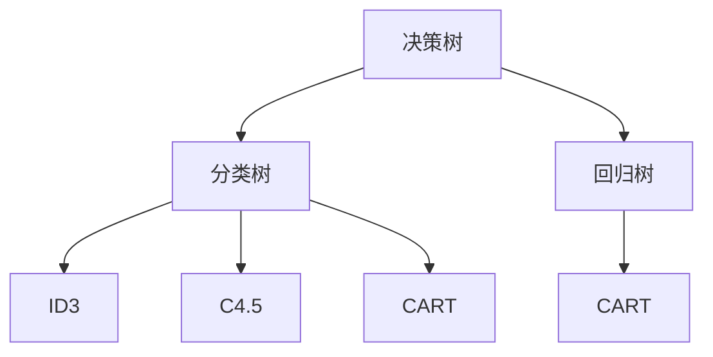
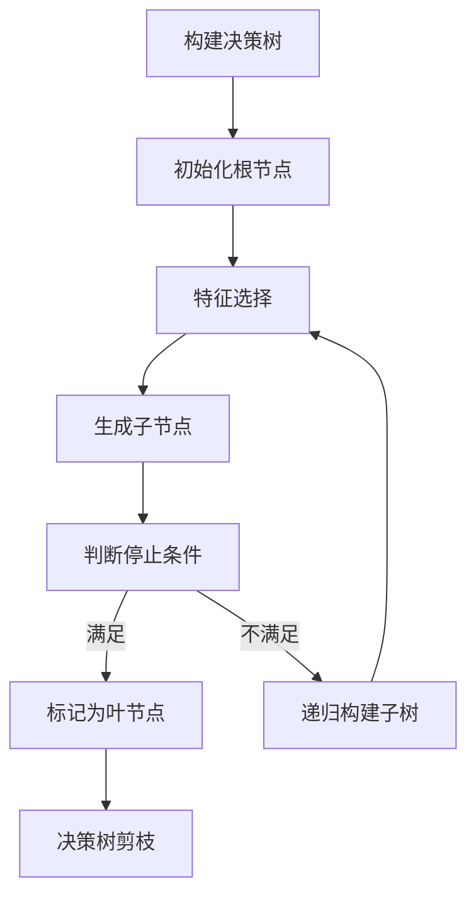

好的，我会努力按照您的要求，撰写一篇专业、深入且有见地的技术博客文章。以下是正文部分：

# 决策树(Decision Trees) - 原理与代码实例讲解

## 1. 背景介绍

### 1.1 问题的由来

在现实世界中,我们经常需要根据一些已知的条件或特征来预测或判断未知的结果。这种基于已知信息做出决策的需求,广泛存在于各个领域,如医疗诊断、贷款审批、垃圾邮件过滤等。传统的人工决策过程往往存在着主观性、低效率等缺陷。因此,我们需要一种能够自动从数据中学习决策规则的机器学习算法,以提高决策的准确性和效率。决策树(Decision Trees)便是解决此类问题的有效算法之一。

### 1.2 研究现状  

决策树作为一种监督学习算法,已被广泛应用于分类和回归任务。早期的ID3、C4.5和CART算法奠定了决策树的基础理论。近年来,随着数据量的激增和计算能力的提高,决策树及其集成算法(如随机森林、梯度提升树等)在许多领域取得了卓越的性能,如金融风险评估、图像识别、自然语言处理等。

### 1.3 研究意义

决策树具有可解释性强、可视化直观、模型简单等优点,因此受到了广泛关注。掌握决策树的原理及实现,不仅能够解决实际问题,更能深入理解机器学习的本质,为学习其他算法奠定基础。此外,决策树也是构建更复杂模型(如随机森林、梯度提升树)的基础组件,对于提高这些模型的性能至关重要。

### 1.4 本文结构

本文将全面介绍决策树算法的核心概念、原理、实现细节和应用场景。首先阐述决策树的基本概念及其与其他算法的联系;然后深入探讨决策树的核心算法原理,包括特征选择、树的生成和剪枝等;接着通过数学模型和公式,详细分析决策树的理论基础;之后给出Python代码实例,并对关键步骤进行解释;最后总结决策树的应用场景,并对未来发展趋势和挑战进行展望。

## 2. 核心概念与联系

决策树是一种监督学习算法,主要用于分类和回归任务。它通过构建一个树状模型,将特征空间划分为互不相交的区域,每个区域对应一个决策输出。决策树的核心思想是:通过一系列的if-then规则,从根节点开始,根据特征值将实例逐步分类,直至到达叶子节点得到最终的分类结果或回归值。

决策树可分为分类树和回归树两大类。分类树用于解决分类问题,其叶节点对应的是类别标签;而回归树用于解决回归问题,叶节点对应的是连续值。常见的分类树算法有ID3、C4.5和CART,回归树算法主要是CART。

决策树与其他机器学习算法有着密切的联系:

- 与k-近邻算法相比,决策树具有更好的可解释性和可视化性,但在处理高维数据时容易过拟合。
- 与逻辑回归相比,决策树能够自动处理特征之间的交互作用,但对异常值较为敏感。
- 决策树是构建随机森林、梯度提升树等集成算法的基础组件,这些集成算法通过组合多个决策树,可以显著提高模型的泛化能力。
- 决策树也可以用于特征选择和数据预处理,例如通过计算特征重要性来选择重要特征。

## 3. 核心算法原理 & 具体操作步骤

### 3.1 算法原理概述

决策树的构建过程可以概括为:从根节点开始,通过选择最优特征对节点进行分裂,生成子节点,并对子节点递归地重复上述过程,直至满足停止条件。具体来说,算法包括以下三个核心步骤:

1. **特征选择**: 在每个节点上,根据某种准则(如信息增益、基尼指数等)从可用特征中选择最优特征,用于对该节点进行分裂。
2. **决策树生成**: 根据所选特征对当前节点进行分裂,生成子节点。对于每个子节点,重复上述步骤,递归地构建决策树。
3. **决策树剪枝**: 为了防止过拟合,需要对生成的决策树进行剪枝,移除那些对提高泛化性能没有帮助的子树或节点。

### 3.2 算法步骤详解

以构建一个二元分类树为例,算法的具体步骤如下:

1. **初始化**:将所有训练实例存放在根节点。
2. **特征选择**:计算并比较每个特征的信息增益比,选择信息增益比最大的特征作为当前节点的分裂特征。
3. **生成子节点**:根据分裂特征的取值,将当前节点的训练实例分配到子节点。
4. **判断停止条件**:对于每个子节点,判断是否满足停止条件(如节点实例数小于阈值、所有实例属于同一类别、当前深度达到上限等)。如果满足,则将该子节点标记为叶节点。
5. **递归构建**:对于每个非叶节点子节点,重复步骤2-4,递归地构建决策树。
6. **决策树剪枝**:通过验证集或交叉验证等方式,对生成的决策树进行剪枝,移除过拟合的子树。

### 3.3 算法优缺点

**优点**:

- 可解释性强,模型结构直观,便于理解决策过程。
- 无需进行数据归一化,可以处理数值型和类别型特征。
- 能够自动处理特征之间的交互作用。
- 对缺失值的处理能力较强。
- 算法简单,计算高效,可并行化。

**缺点**:

- 对于有噪声的数据,决策树容易过拟合。
- 决策树的学习过程是贪婪的,每次只考虑当前最优特征,可能达不到全局最优。
- 对于数据的微小变化,决策树结构可能发生较大变化,从而导致模型不稳定。
- 在处理高维数据时,决策树的训练时间开销可能较大。
- 决策树在某些特殊情况下可能存在偏差,如数据分布不平衡或特征之间存在冗余。

### 3.4 算法应用领域

决策树由于其优秀的可解释性和高效性,在诸多领域得到了广泛应用:

- **金融风险评估**: 用于评估贷款申请人的违约风险、信用评分等。
- **医疗诊断**: 根据症状和体征数据,对疾病进行诊断和预测。
- **图像识别**: 作为特征选择器或基础分类器,用于图像分类、目标检测等任务。
- **自然语言处理**: 用于文本分类、情感分析、垃圾邮件过滤等。
- **推荐系统**: 根据用户特征和历史行为,对商品或内容进行个性化推荐。
- **网络入侵检测**: 通过分析网络流量数据,检测潜在的网络攻击行为。

## 4. 数学模型和公式 & 详细讲解 & 举例说明

决策树的核心思想是基于信息论原理,通过最大化信息增益来选择最优特征进行分裂。下面我们将详细介绍决策树的数学模型和公式。

### 4.1 数学模型构建

设训练数据集为$D$,其中第$i$个样本表示为$\boldsymbol{x}_i=(x_{i1},x_{i2},...,x_{ip})$,其类别标记为$y_i$。我们的目标是构建一个决策树模型$f(X)$,使其能够对新的样本$X$进行准确的分类或回归。

在构建决策树时,我们需要选择一个最优特征,对当前节点的样本集进行分裂。假设特征$A$的可能取值为$\{a_1,a_2,...,a_v\}$,则根据特征$A$的不同取值,数据集$D$可以被分割为$v$个子集$\{D_1,D_2,...,D_v\}$,其中$D_j$表示在$A$取值为$a_j$时对应的样本子集。

为了选择最优特征,我们需要定义一个指标来衡量分裂后信息的有序程度。常用的指标包括**信息增益**和**基尼指数**。

### 4.2 公式推导过程

**1. 信息熵(Entropy)**

信息熵描述了数据集$D$的纯度,定义为:

$$
\begin{aligned}
H(D)&=-\sum_{k=1}^{K}p_k\log_2p_k\\
p_k&=\frac{|C_k|}{|D|}
\end{aligned}
$$

其中,$K$是类别的个数,$p_k$是数据集$D$中属于第$k$类的比例,$C_k$表示属于第$k$类的样本集合,$|C_k|$和$|D|$分别表示$C_k$和$D$的样本数量。当$p_k=0$时,定义$0\log_00=0$。

信息熵的取值范围为$[0,\log_2K]$,当数据集$D$中所有样本属于同一类别时,信息熵为0;当各类别的比例均等时,信息熵取最大值。

**2. 信息增益(Information Gain)**

信息增益表示由于特征$A$的Introduction而使得数据集的无序程度减少的程度,定义为:

$$
\begin{aligned}
G(D,A)&=H(D)-H_A(D)\\
H_A(D)&=\sum_{j=1}^{v}\frac{|D_j|}{|D|}H(D_j)
\end{aligned}
$$

其中,$H_A(D)$称为特征$A$对数据集$D$的条件熵,$|D_j|$和$|D|$分别表示$D_j$和$D$的样本数量,$v$是特征$A$的可取值个数。

信息增益的取值范围为$[0,\log_2K]$,值越大,说明使用特征$A$分裂后,数据集的无序程度减少得越多。

**3. 基尼指数(Gini Index)**

基尼指数描述了数据集$D$的不纯度,定义为:

$$
\begin{aligned}
\text{Gini}(D)&=1-\sum_{k=1}^{K}p_k^2\\
p_k&=\frac{|C_k|}{|D|}
\end{aligned}
$$

其中,$K$是类别的个数,$p_k$是数据集$D$中属于第$k$类的比例,$C_k$表示属于第$k$类的样本集合,$|C_k|$和$|D|$分别表示$C_k$和$D$的样本数量。

基尼指数的取值范围为$[0,1-\frac{1}{K}]$,当数据集$D$中所有样本属于同一类别时,基尼指数为0;当各类别的比例均等时,基尼指数取最大值。

对于特征$A$,其基尼指数定义为:

$$
\text{Gini}_A(D)=\sum_{j=1}^{v}\frac{|D_j|}{|D|}\text{Gini}(D_j)
$$

其中,$v$是特征$A$的可取值个数,$|D_j|$和$|D|$分别表示$D_j$和$D$的样本数量。

我们选择使得$\text{Gini}(D)-\text{Gini}_A(D)$最大的特征$A$作为分裂特征。

### 4.3 案例分析与讲解

为了更好地理解上述公式,我们来分析一个简单的案例。假设我们有一个二分类数据集$D$,包含6个样本,其中3个样本