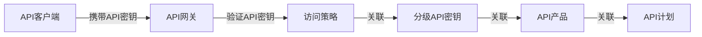
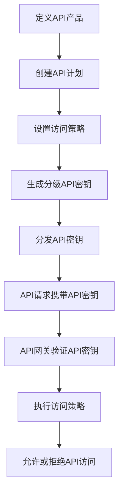

# 分级 API Key 的设置方法

## 1. 背景介绍

### 1.1 问题的由来

在现代软件开发中,API(应用程序编程接口)扮演着至关重要的角色。API允许不同的软件系统、应用程序和服务之间进行互操作和数据交换。随着云计算、微服务架构和第三方集成的兴起,API的使用变得越来越普遍。然而,随之而来的是对API访问控制和安全性的需求也日益增长。

传统上,API密钥(API Key)被广泛用于认证和授权API的访问。API密钥是一个唯一的字符串,用于识别API客户端并验证其对API资源的访问权限。但是,单一的API密钥存在一些固有的局限性和安全隐患,例如:

1. **粒度问题**: 单一的API密钥通常授予对所有API资源的完全访问权限,缺乏细粒度的访问控制。
2. **安全风险**: 如果API密钥被泄露或滥用,整个API系统可能面临严重的安全风险。
3. **审计困难**: 使用单一的API密钥难以追踪和审计不同客户端对API资源的访问情况。
4. **管理复杂**: 随着API客户端数量的增加,使用单一的API密钥进行管理和维护变得越来越复杂。

为了解决这些问题,分级API密钥(Tiered API Keys)的概念应运而生。

### 1.2 研究现状

分级API密钥是一种更加灵活和安全的API访问控制机制。它允许为不同的客户端、用户或用例分配不同级别的API密钥,每个级别都具有特定的访问权限和限制。这种方法提供了更细粒度的访问控制,增强了API系统的安全性,并简化了API密钥的管理。

目前,一些主流的API管理平台和云服务提供商已经支持分级API密钥的功能,例如:

- **AWS API Gateway**: Amazon Web Services (AWS) API Gateway支持为每个API密钥设置不同的访问权限和限制。
- **Google Cloud Endpoints**: Google Cloud Endpoints允许创建具有不同访问范围的API密钥。
- **Azure API Management**: Microsoft Azure API Management提供了分级API密钥的功能,可以为不同的订阅计划分配不同的API密钥。

然而,在实际应用中,分级API密钥的设置和管理仍然存在一些挑战,例如如何确定合适的访问级别、如何有效管理大量的API密钥以及如何平衡安全性和便利性等。因此,探索分级API密钥的最佳实践和设计模式具有重要的实际意义。

### 1.3 研究意义

采用分级API密钥的方法可以带来以下主要好处:

1. **提高安全性**: 通过为不同的客户端或用例分配不同级别的API密钥,可以最小化潜在的安全风险。即使某个API密钥被泄露,也只会影响相应的访问范围,而不会危及整个API系统。

2. **细粒度访问控制**: 分级API密钥允许对API资源进行细粒度的访问控制,确保每个客户端只能访问所需的资源和操作。这有助于遵守最小特权原则,提高API系统的安全性和可靠性。

3. **简化管理**: 通过将API密钥与特定的访问级别相关联,可以更容易地管理和维护大量的API密钥。这有助于减轻管理负担,提高效率。

4. **改善监控和审计**: 由于每个API密钥对应特定的访问级别,因此可以更容易地跟踪和审计不同客户端对API资源的访问情况,从而提高透明度和问责制。

5. **支持不同的定价和计费模式**: 分级API密钥可以与不同的定价和计费模式相关联,为API提供商提供更多的商业机会和灵活性。

综上所述,研究和实现分级API密钥的设置方法对于提高API系统的安全性、可管理性和灵活性具有重要意义。

### 1.4 本文结构

本文将详细探讨分级API密钥的设置方法,内容安排如下:

1. 背景介绍
2. 核心概念与联系
3. 核心算法原理与具体操作步骤
4. 数学模型和公式详细讲解与举例说明
5. 项目实践:代码实例和详细解释说明
6. 实际应用场景
7. 工具和资源推荐
8. 总结:未来发展趋势与挑战
9. 附录:常见问题与解答

## 2. 核心概念与联系

在探讨分级API密钥的设置方法之前,我们需要了解一些核心概念及其之间的关系。

1. **API密钥(API Key)**: API密钥是一个唯一的字符串,用于识别API客户端并验证其对API资源的访问权限。它通常包含在API请求的标头或查询参数中,以便API服务器可以验证请求的合法性。

2. **API网关(API Gateway)**: API网关是一种基础设施层,位于API客户端和后端服务之间。它充当反向代理,处理API请求的路由、身份验证、限流、监控等功能。API网关通常负责验证API密钥的有效性并执行相应的访问控制策略。

3. **访问策略(Access Policy)**: 访问策略定义了API资源的访问权限和限制。它可以包括允许或拒绝对特定API端点、HTTP方法、资源路径等的访问,以及对请求速率、并发连接数等的限制。

4. **分级API密钥(Tiered API Keys)**: 分级API密钥是一种将不同级别的访问策略与不同的API密钥相关联的机制。每个级别的API密钥都对应一组特定的访问权限和限制,从而实现细粒度的访问控制。

5. **API产品(API Product)**: API产品是一组相关的API资源的集合,通常对应于特定的功能或服务。在分级API密钥的设置中,API产品可以与不同级别的API密钥相关联,从而控制对不同API资源集合的访问。

6. **API计划(API Plan)**: API计划定义了API产品的定价、配额限制、访问策略等。在分级API密钥的设置中,API计划可以与不同级别的API密钥相关联,从而实现不同的商业模式和访问控制策略。

这些核心概念之间的关系如下所示:

API客户端在发送API请求时携带相应级别的API密钥。API网关负责验证API密钥的有效性,并根据与该API密钥关联的访问策略决定是否允许访问特定的API资源。访问策略通常与API产品和API计划相关联,从而实现对不同API资源集合和商业模式的访问控制。

通过将这些核心概念有机结合,分级API密钥提供了一种灵活、安全和可管理的API访问控制机制。

## 3. 核心算法原理与具体操作步骤

### 3.1 算法原理概述

分级API密钥的设置过程可以概括为以下几个核心步骤:

1. **定义API产品**: 首先,需要确定API系统中的不同API资源集合,并将它们组织成不同的API产品。每个API产品代表一组相关的API端点和功能。

2. **创建API计划**: 接下来,为每个API产品创建一个或多个API计划。API计划定义了对应API产品的定价、配额限制、访问策略等。

3. **设置访问策略**: 为每个API计划制定合适的访问策略,包括允许访问的API端点、HTTP方法、资源路径、请求速率限制等。访问策略决定了与该API计划关联的API密钥的访问权限和限制。

4. **生成分级API密钥**: 根据不同的API计划,生成对应级别的API密钥。每个API密钥都与特定的访问策略相关联,从而实现细粒度的访问控制。

5. **分发API密钥**: 将生成的API密钥分发给相应的API客户端或用户。API客户端需要在发送API请求时携带相应级别的API密钥。

6. **验证和执行访问策略**: 当API网关接收到API请求时,它会验证请求中携带的API密钥的有效性。如果API密钥有效,API网关将根据与该API密钥关联的访问策略决定是否允许访问特定的API资源,并执行相应的限制和策略。

这个过程可以通过以下Mermaid流程图进行可视化:

通过这一系列步骤,分级API密钥的设置方法可以实现对API资源的细粒度访问控制,提高API系统的安全性和可管理性。

### 3.2 算法步骤详解

接下来,我们将详细解释分级API密钥设置过程中的每个步骤。

#### 3.2.1 定义API产品

API产品是API资源的逻辑分组,代表一组相关的API端点和功能。定义API产品是分级API密钥设置的第一步,它为后续的访问控制奠定基础。

在定义API产品时,需要考虑以下几个方面:

1. **功能划分**: 根据API系统提供的不同功能和服务,将相关的API端点归类为不同的API产品。例如,可以将与用户管理相关的API端点划分为"用户API产品",将与订单处理相关的API端点划分为"订单API产品"。

2. **客户群体**: 不同的API客户端或用户群体可能对API资源有不同的需求。因此,可以根据目标客户群体来定义API产品。例如,可以为内部开发人员和外部合作伙伴创建不同的API产品。

3. **安全级别**: 根据API资源的敏感性和安全要求,可以将具有不同安全级别的API端点划分为不同的API产品。例如,可以将涉及敏感数据的API端点划分为"高安全级别API产品"。

4. **资源组织**: 考虑API资源的逻辑组织结构,将相关的API端点归类为同一个API产品。这有助于简化API产品的管理和维护。

定义API产品时,应该明确每个API产品包含的API端点、功能描述、预期客户群体等信息。这将为后续的API计划创建和访问策略设置提供依据。

#### 3.2.2 创建API计划

API计划定义了对应API产品的定价、配额限制、访问策略等。在分级API密钥的设置中,API计划扮演着关键角色,因为它决定了与之关联的API密钥的访问权限和限制。

创建API计划时,需要考虑以下几个方面:

1. **定价模式**: 确定API计划的定价模式,例如免费、固定费用、按使用量计费等。不同的定价模式可能对应不同级别的API密钥和访问权限。

2. **配额限制**: 设置API计划的配额限制,例如每秒请求数、每天总请求数、并发连接数等。这些限制将应用于与该API计划关联的API密钥。

3. **访问策略**: 为每个API计划制定合适的访问策略,包括允许访问的API端点、HTTP方法、资源路径等。访问策略决定了与该API计划关联的API密钥的具体访问权限。

4. **其他策略**: 根据需求,可以为API计划设置其他策略,例如IP白名单、速率限制、缓存策略等。这些策略将应用于与该API计划关联的API密钥。

5. **API产品关联**: 将API计划与相应的API产品关联。一个API计划可以关联一个或多个API产品,从而控制对这些API产品的访问。

创建API计划时,应该明确每个计划的定价模式、配额限制、访问策略等信息。这将为后续的API密钥生成和分发提供依据。

#### 3.2.3 设置访问策略

访问策略定义了API资源的访问