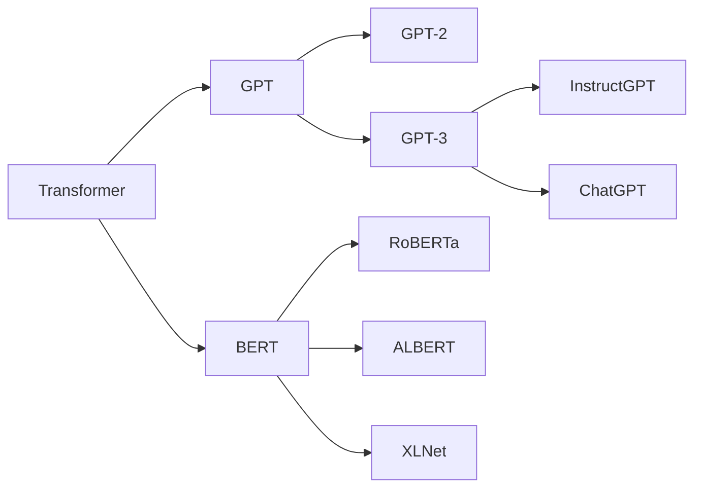

# 初探大模型：起源与发展

关键词：大模型、人工智能、自然语言处理、深度学习、Transformer、GPT、BERT、ChatGPT

## 1. 背景介绍
### 1.1  问题的由来
近年来，随着人工智能技术的飞速发展，大模型(Large Language Models, LLMs)逐渐成为自然语言处理(NLP)领域的研究热点。大模型是指在海量文本数据上训练的具有数十亿甚至上万亿参数的语言模型，它们能够从大规模语料库中学习到丰富的语言知识和世界知识，在许多NLP任务上取得了令人瞩目的成果。
### 1.2  研究现状
目前，业界已经涌现出一批优秀的大模型，如OpenAI的GPT系列模型、Google的BERT、T5等。这些大模型在机器翻译、问答系统、文本摘要、对话生成等任务上展现出了强大的性能，甚至在某些场景下已经接近甚至超越人类的水平。
### 1.3  研究意义 
大模型的出现标志着NLP技术的一次重大突破，它为构建更加智能化的语言应用系统提供了新的思路和方法。深入研究大模型的原理和应用，对于推动人工智能技术的进步具有重要意义。
### 1.4  本文结构
本文将从以下几个方面对大模型进行探讨：首先介绍大模型的核心概念和发展脉络；然后重点阐述大模型的核心算法原理和数学模型；接着通过代码实例和应用场景分析大模型的实际应用；最后总结大模型的发展趋势和面临的挑战，并对未来的研究方向进行展望。

## 2. 核心概念与联系
大模型本质上是一种基于深度学习的语言模型，其核心思想是利用海量文本数据训练多层神经网络，从而学习到语言的内在规律和表示。与传统的语言模型不同，大模型通常采用Transformer等更加先进的神经网络架构，具有更强的建模能力和泛化性能。

大模型的训练过程通常分为两个阶段：预训练(Pre-training)和微调(Fine-tuning)。在预训练阶段，模型在大规模无标注语料上进行自监督学习，通过掩码语言建模(Masked Language Modeling, MLM)等任务学习通用的语言表示。在微调阶段，再将预训练模型应用到下游的具体NLP任务中，通过少量标注数据进行监督学习，使模型适应特定任务。

大模型的发展可以追溯到2017年Google提出的Transformer模型，它引入了自注意力机制(Self-Attention)，克服了传统RNN模型的长程依赖问题，极大地提升了模型的并行计算效率。此后，各种基于Transformer的大模型不断涌现，如GPT、BERT、XLNet等，它们在模型规模、训练技巧等方面不断创新，推动了NLP技术的进步。

下图展示了几种典型大模型的发展脉络和关键创新点：



## 3. 核心算法原理 & 具体操作步骤
### 3.1  算法原理概述
大模型的核心算法是基于Transformer的自注意力机制和前馈神经网络。Transformer通过引入多头自注意力层和位置编码，能够捕捉文本序列中的长程依赖关系，同时具有较强的并行计算能力。
### 3.2  算法步骤详解
Transformer的编码器由多个相同的层堆叠而成，每一层包含两个子层：多头自注意力层(Multi-head Self-attention)和前馈神经网络层(Feed-forward Network)。

- 多头自注意力层：
1) 将输入序列X通过三个线性变换得到Q、K、V矩阵
2) 将Q、K、V划分为多个头(head)，每个头分别计算注意力权重
3) 对每个头的注意力输出进行拼接(Concat)和线性变换得到多头注意力输出
4) 将多头注意力输出与输入X相加并做Layer Normalization

- 前馈神经网络层：
1) 将多头自注意力层的输出通过两层全连接网络(第一层激活函数为ReLU)
2) 将前馈网络输出与多头注意力输出相加并做Layer Normalization

Transformer的解码器与编码器结构类似，但在每个多头自注意力层后还加入了一个Encoder-Decoder Attention层，用于捕捉编码器和解码器之间的交互信息。

### 3.3  算法优缺点
Transformer相比传统RNN/CNN等模型的优点在于：
- 通过自注意力机制实现了高效的全局建模，克服了RNN等模型的长程依赖问题
- 采用多头注意力提高了模型的表达能力
- 去除了循环结构，具有更好的并行计算性能

但Transformer也存在一定局限性，如：
- 计算复杂度随着序列长度呈平方增长，难以处理超长文本
- 缺乏显式的位置信息建模，需要引入位置编码
- 模型参数量大，对算力和数据规模要求较高

### 3.4  算法应用领域
基于Transformer的大模型已在多个NLP任务上取得了突破性进展，主要应用包括：
- 机器翻译：如Google的BERT、GPT预训练模型
- 文本分类：如BERT在GLUE基准测试中取得SOTA
- 问答系统：如GPT-3在开放域问答上的优异表现
- 对话生成：如DialoGPT、ChatGPT等对话模型
- 文本摘要：如BART、T5等生成式预训练模型

## 4. 数学模型和公式 & 详细讲解 & 举例说明
### 4.1  数学模型构建
Transformer的核心是自注意力机制，其数学模型可以表示为：

给定输入序列$X=(x_1,\cdots,x_n)$，自注意力层的输出为$Z=(z_1,\cdots,z_n)$，其中$z_i$的计算公式为：

$$
z_i = \sum_{j=1}^n \alpha_{ij} (x_jW^V)
$$

$\alpha_{ij}$是注意力权重，表示$x_i$对$x_j$的注意力分配，计算公式为：

$$
\alpha_{ij} = \frac{\exp(e_{ij})}{\sum_{k=1}^n \exp(e_{ik})}
$$

其中$e_{ij}$是$x_i$和$x_j$的注意力得分，计算公式为：

$$
e_{ij} = \frac{(x_iW^Q)(x_jW^K)^T}{\sqrt{d_k}}
$$

$W^Q, W^K, W^V$是三个可学习的线性变换矩阵，$d_k$是$K$矩阵的维度。

多头注意力是将$Q,K,V$矩阵划分为$h$个头，每个头独立计算注意力输出，最后拼接并做线性变换：

$$
\text{MultiHead}(Q,K,V) = \text{Concat}(\text{head}_1,\cdots,\text{head}_h)W^O
$$

其中每个头的计算公式为：

$$
\text{head}_i = \text{Attention}(QW_i^Q, KW_i^K, VW_i^V)
$$

$W_i^Q \in \mathbb{R}^{d_{model} \times d_k}, W_i^K \in \mathbb{R}^{d_{model} \times d_k}, W_i^V \in \mathbb{R}^{d_{model} \times d_v}, W^O \in \mathbb{R}^{hd_v \times d_{model}}$

### 4.2  公式推导过程
自注意力层的前向计算过程如下：
1. 输入$X$通过三个线性变换得到$Q,K,V$矩阵：
$$
Q = XW^Q, K = XW^K, V = XW^V
$$
2. 计算$Q,K$的点积注意力得分矩阵$E$：
$$
E = \frac{QK^T}{\sqrt{d_k}}
$$
3. 对$E$进行Softmax归一化得到注意力权重矩阵$A$：
$$
A = \text{Softmax}(E)
$$
4. 将$A$与$V$相乘得到注意力输出$Z$：
$$
Z = AV
$$
5. 多头注意力则是将$Q,K,V$划分为$h$个头，每个头重复步骤2-4，最后拼接并线性变换：
$$
\text{MultiHead}(Q,K,V) = \text{Concat}(Z_1,\cdots,Z_h)W^O
$$

### 4.3  案例分析与讲解
下面以一个简单的例子来说明自注意力的计算过程。

假设输入序列$X$为：
$$
X = \begin{bmatrix}
1 & 2 & 3 \\
4 & 5 & 6 \\
7 & 8 & 9
\end{bmatrix}
$$

$Q,K,V$的线性变换矩阵分别为：
$$
W^Q = W^K = W^V = \begin{bmatrix}
1 & 0 \\
0 & 1 \\
-1 & 1
\end{bmatrix}
$$

则$Q,K,V$矩阵为：
$$
Q = K = V = \begin{bmatrix}
1 & 2 \\
4 & 5 \\
4 & 11
\end{bmatrix}
$$

假设$h=2, d_k=1$，则注意力得分矩阵$E$为：
$$
E = QK^T = \begin{bmatrix}
5 & 14 & 23 \\
14 & 41 & 68 \\
23 & 68 & 113
\end{bmatrix}
$$

Softmax归一化后得到注意力权重矩阵$A$：
$$
A = \begin{bmatrix}
0.09 & 0.24 & 0.67 \\
0.08 & 0.23 & 0.69 \\
0.08 & 0.23 & 0.69
\end{bmatrix}
$$

最终的注意力输出$Z$为：
$$
Z = AV = \begin{bmatrix}
5.49 & 7.53 \\
5.62 & 7.77 \\
5.62 & 7.77
\end{bmatrix}
$$

可以看到，自注意力机制通过计算序列内每个位置之间的关联度，动态地聚合上下文信息，从而得到包含全局信息的表示。

### 4.4  常见问题解答
1. 自注意力机制为什么能够捕捉长程依赖？
   
   传统RNN模型通过循环连接来建模序列依赖，但梯度在反向传播过程中容易出现衰减或爆炸问题，导致难以捕捉长程信息。而自注意力机制通过计算任意两个位置之间的注意力权重，直接建模长程依赖，避免了梯度消失问题。

2. 为什么要引入多头注意力？
   
   多头注意力允许模型在不同的子空间中学习到不同的注意力表示，提高了模型的表达能力。直观地说，多头机制就像让模型从不同的角度去理解输入序列，捕捉更加丰富的语义信息。

3. Transformer能否处理变长序列？
   
   Transformer在设计时假设输入序列是固定长度的，但实际应用中序列长度可能是变化的。处理变长序列的常见方法是将序列按照最大长度补齐(padding)，或者按照批次内最长序列截断(truncation)。此外，还可以引入位置编码(positional encoding)来显式地为模型提供序列位置信息。

## 5. 项目实践：代码实例和详细解释说明
### 5.1  开发环境搭建
本项目使用PyTorch框架实现Transformer模型，需要安装以下依赖库：
- Python 3.6+
- PyTorch 1.8+
- NumPy
- Matplotlib

可以使用pip命令进行安装：
```bash
pip install torch numpy matplotlib
```

### 5.2  源代码详细实现
下面给出Transformer编码器的PyTorch实现代码：

```python
import torch
import torch.nn as nn
import numpy as np
import matplotlib.pyplot as plt

class PositionalEncoding(nn.Module):
    def __init__(self, d_model, max_len=5000):
        super().__init__()
        pe = torch.zeros(max_len, d_model)
        position = torch.arange(0, max_len, dtype=torch.float).uns