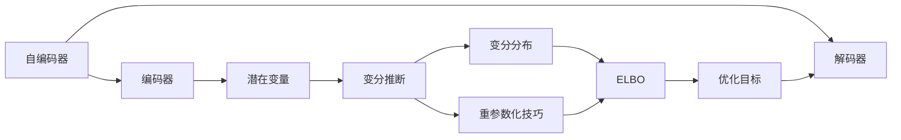

# 变分自编码器VAE原理与代码实例讲解

关键词：变分自编码器、VAE、无监督学习、生成模型、变分推断、潜在变量

## 1. 背景介绍
### 1.1  问题的由来
随着深度学习的快速发展,无监督学习作为一个重要的研究方向受到越来越多的关注。在无监督学习中,如何从大量无标签数据中学习到有效的特征表示是一个关键问题。变分自编码器(Variational Autoencoder, VAE)作为一种强大的生成模型,为解决这一问题提供了新的思路和方法。

### 1.2  研究现状 
VAE由Kingma等人于2013年首次提出,是一种基于变分推断的生成模型。与传统的自编码器相比,VAE引入了潜在变量的概念,通过对潜在变量的约束和重构,实现了更加灵活和有效的特征学习。目前VAE已经在图像生成、语音合成、异常检测等多个领域取得了广泛应用。

### 1.3  研究意义
VAE的研究对于推动无监督学习的发展具有重要意义。一方面,VAE为无监督特征学习提供了新的框架,有助于从海量无标签数据中挖掘有价值的信息;另一方面,VAE所蕴含的变分推断思想为其他生成模型的设计提供了有益启示。深入理解VAE的原理,对于探索更加先进的无监督学习算法具有重要参考价值。

### 1.4  本文结构
本文将全面介绍变分自编码器VAE的原理与代码实现。第2节介绍VAE涉及的核心概念;第3节详细讲解VAE的算法原理;第4节给出VAE的数学模型推导;第5节通过代码实例演示VAE的具体实现;第6节讨论VAE的应用场景;第7节推荐VAE相关的工具和资源;第8节对全文进行总结并展望VAE的未来发展。

## 2. 核心概念与联系

变分自编码器涉及以下几个核心概念:

- 自编码器:一种无监督学习模型,由编码器和解码器组成,目标是学习数据的压缩表示。
- 潜在变量:用来刻画数据内在结构的隐藏变量,通常服从某种先验分布。  
- 变分推断:一种近似推断方法,通过引入变分分布来逼近真实后验分布。
- 重参数化技巧:一种参数估计技巧,将随机采样转化为参数化函数,便于梯度反向传播。

这些概念之间的联系可以用下图表示:



## 3. 核心算法原理 & 具体操作步骤

### 3.1  算法原理概述
VAE的核心思想是通过引入潜在变量来刻画数据的生成过程,并使用变分推断来近似潜在变量的后验分布。具体来说,VAE由一个编码器和一个解码器组成:编码器将输入数据映射到潜在空间,得到潜在变量的变分分布;解码器根据潜在变量重构出输入数据。VAE的目标是最大化边际对数似然,等价于最大化ELBO(Evidence Lower Bound)。

### 3.2  算法步骤详解
VAE的训练过程可分为以下步骤:

1. 编码器将输入数据 $x$ 映射为潜在变量 $z$ 的均值 $\mu$ 和方差 $\sigma$,得到变分分布 $q_{\phi}(z|x)$。

2. 从变分分布中采样得到潜在变量 $z$,采样过程使用重参数化技巧: $z=\mu+\sigma\odot\epsilon, \epsilon \sim N(0,I)$。

3. 解码器根据潜在变量 $z$ 重构出输入数据 $\hat{x}$,得到条件概率 $p_{\theta}(x|z)$。 

4. 计算重构误差 $\log p_{\theta}(x|z)$ 和KL散度 $D_{KL}(q_{\phi}(z|x)||p(z))$,二者相加得到ELBO。

5. 最大化ELBO,等价于最小化重构误差和KL散度,对应编码器和解码器参数 $\phi$ 和 $\theta$ 的优化。

以上步骤不断迭代,直到ELBO收敛。

### 3.3  算法优缺点
VAE的主要优点包括:
- 可以学习到连续的潜在表示,具有更强的生成能力。
- 变分推断使后验估计更加稳定,不易过拟合。  
- 重参数化技巧使梯度反向传播更加高效。

VAE的缺点包括:
- 假设潜在变量服从各向同性的高斯分布,限制了表示能力。
- 解码器输出的是概率分布,适用于连续型数据,对离散型数据建模有困难。
- 训练过程需要平衡重构误差和KL散度,超参数选择有一定难度。

### 3.4  算法应用领域
VAE在多个领域得到了成功应用,例如:
- 图像生成:通过控制潜在变量,生成多样的图像。
- 语音合成:学习语音信号的潜在表示,用于语音转换、说话人识别等。
- 异常检测:学习正常数据的潜在表示,异常数据在潜在空间映射的概率较低。
- 半监督学习:利用VAE学习无标签数据的特征,辅助分类任务。

## 4. 数学模型和公式 & 详细讲解 & 举例说明

### 4.1  数学模型构建
记输入数据为 $x$,潜在变量为 $z$。VAE的数学模型可表示为:

$$p(x,z)=p(x|z)p(z)$$

其中 $p(z)$ 为潜在变量的先验分布,通常取标准正态分布 $N(0,I)$。$p(x|z)$ 为解码器的输出分布,与数据类型相关,例如高斯分布、伯努利分布等。

VAE的目标是最大化边际对数似然 $\log p(x)$,由于边际概率难以直接计算,因此引入变分分布 $q(z|x)$ 来近似真实后验分布 $p(z|x)$。根据Jensen不等式,可以推导出边际对数似然的下界(ELBO):

$$\log p(x) \geq \mathbb{E}_{q(z|x)}[\log p(x|z)] - D_{KL}(q(z|x)||p(z)) \triangleq \mathcal{L}(x)$$

最大化ELBO等价于最小化重构误差 $\mathbb{E}_{q(z|x)}[\log p(x|z)]$ 和KL散度 $D_{KL}(q(z|x)||p(z))$。

### 4.2  公式推导过程
为了推导ELBO,我们首先引入变分分布 $q(z|x)$,利用Jensen不等式得到:

$$
\begin{aligned}
\log p(x) &= \log \int p(x,z)dz \\
&= \log \int q(z|x) \frac{p(x,z)}{q(z|x)} dz \\
&\geq \int q(z|x) \log \frac{p(x,z)}{q(z|x)} dz \\
&= \int q(z|x) \log p(x|z) dz - \int q(z|x) \log \frac{q(z|x)}{p(z)} dz \\
&= \mathbb{E}_{q(z|x)}[\log p(x|z)] - D_{KL}(q(z|x)||p(z)) \\
&\triangleq \mathcal{L}(x)
\end{aligned}
$$

可以看出,ELBO是边际对数似然 $\log p(x)$ 的一个下界,最大化ELBO即最小化重构误差和KL散度。

### 4.3  案例分析与讲解
下面我们以图像生成任务为例,介绍VAE的建模过程。假设输入图像 $x$ 为 $28\times28$ 的灰度图,潜在变量 $z$ 的维度为20。

- 编码器:设计一个卷积神经网络,将图像 $x$ 映射为潜在变量 $z$ 的均值 $\mu$ 和对数方差 $\log \sigma^2$。变分分布 $q(z|x)$ 取各向同性的高斯分布: $N(\mu, diag(\sigma^2))$。

- 重参数化:从标准正态分布 $\epsilon \sim N(0,I)$ 中采样,通过变换 $z=\mu+\sigma\odot\epsilon$ 得到潜在变量 $z$。

- 解码器:设计一个反卷积神经网络,将潜在变量 $z$ 解码为图像 $\hat{x}$。解码器输出伯努利分布的参数 $p_{\theta}(x|z)$。

- 损失函数:重构误差为伯努利分布的负对数似然 $-\log p_{\theta}(x|z)$,KL散度为两个高斯分布的KL散度解析式。

在训练过程中,最小化重构误差和KL散度,优化编码器和解码器的参数。训练完成后,可以通过随机采样潜在变量 $z$,经过解码器生成图像样本。

### 4.4  常见问题解答
Q: VAE和传统自编码器有什么区别?
A: 传统自编码器学习数据的确定性编码,而VAE学习数据的概率编码,引入了随机性。VAE在潜在空间中加入了先验约束,使得潜在表示更加规则和平滑。

Q: VAE的潜在变量维度如何选取?
A: 潜在变量维度是一个超参数,需要根据任务和数据特点进行调节。维度过低会限制模型的表示能力,维度过高会增加训练难度。通常可以尝试不同的维度,根据重构质量和生成样本的多样性来选择。

Q: VAE能否应用于离散型数据?
A: VAE假设潜在变量服从连续型分布,因此在建模离散型数据时存在一定困难。对于离散型数据,可以考虑使用Gumbel-Softmax等技巧来重参数化离散型随机变量,或者使用变分推断的其他变种如变分信息瓶颈(VIB)等。

## 5. 项目实践：代码实例和详细解释说明

下面我们通过PyTorch实现一个简单的VAE模型,用于图像生成任务。

### 5.1  开发环境搭建
- Python 3.6+
- PyTorch 1.8+
- torchvision 0.9+
- Matplotlib 3.3+

可以通过以下命令安装所需库:
```
pip install torch torchvision matplotlib
```

### 5.2  源代码详细实现
```python
import torch
import torch.nn as nn
import torch.optim as optim
import torchvision.transforms as transforms
import torchvision.datasets as datasets
import matplotlib.pyplot as plt

# 定义编码器
class Encoder(nn.Module):
    def __init__(self, latent_dim):
        super(Encoder, self).__init__()
        self.conv1 = nn.Conv2d(1, 32, 3, stride=2, padding=1)  
        self.conv2 = nn.Conv2d(32, 64, 3, stride=2, padding=1)
        self.fc1 = nn.Linear(64 * 7 * 7, 128)
        self.fc2_mean = nn.Linear(128, latent_dim)
        self.fc2_logvar = nn.Linear(128, latent_dim)
        
    def forward(self, x):
        x = torch.relu(self.conv1(x))
        x = torch.relu(self.conv2(x))
        x = x.view(x.size(0), -1)
        x = torch.relu(self.fc1(x))
        mean = self.fc2_mean(x)
        logvar = self.fc2_logvar(x)
        return mean, logvar

# 定义解码器
class Decoder(nn.Module):
    def __init__(self, latent_dim):
        super(Decoder, self).__init__()
        self.fc1 = nn.Linear(latent_dim, 128)
        self.fc2 = nn.Linear(128, 64 * 7 * 7)
        self.deconv1 = nn.ConvTranspose2d(64, 32, 3, stride=2, padding=1, output_padding=1)
        self.deconv2 = nn.ConvTranspose2d(32, 1, 3, stride=2, padding=1, output_padding=1)
        
    def forward(self, z):
        z = torch.relu(self.fc1(z))
        z = torch