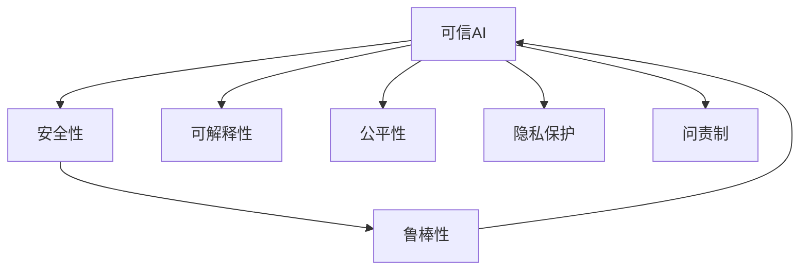

# 可信AI与模型鲁棒性原理与代码实战案例讲解

## 1. 背景介绍
### 1.1 问题的由来
随着人工智能技术的飞速发展,AI系统在各行各业得到了广泛应用。然而,人们逐渐意识到AI系统存在着安全性、可解释性、公平性等诸多问题,这严重影响了用户对AI的信任。为了让AI真正服务于人类社会,打造可信、鲁棒、安全的AI系统已成为当前亟需解决的关键问题。

### 1.2 研究现状
目前,学术界和工业界都在积极探索可信AI的理论基础和实践方法。微软、谷歌等科技巨头纷纷成立了专门的可信AI研究中心。一些新兴的可信AI框架如TensorFlow Privacy、Adversarial Robustness Toolbox等也应运而生。但总的来说,可信AI仍处于起步阶段,许多基础理论和关键技术有待突破。

### 1.3 研究意义 
可信AI事关人工智能的未来发展。只有解决了AI系统的可信和鲁棒性问题,才能真正实现人机协同、用AI造福人类。可信AI研究对保障国家安全、促进经济发展、维护社会公平正义都具有重要意义。因此,深入研究可信AI,攻克AI系统面临的信任危机,对推动人工智能健康可持续发展至关重要。

### 1.4 本文结构
本文将重点探讨可信AI的核心概念、关键技术,并结合代码实战案例进行讲解。内容安排如下:

- 第2部分介绍可信AI的核心概念及其内在联系 
- 第3部分重点阐述可信AI的核心算法原理和具体操作步骤
- 第4部分从数学角度对相关模型和公式进行推导讲解
- 第5部分通过代码实例演示可信AI系统的开发实践
- 第6部分分析可信AI在现实场景中的应用情况
- 第7部分推荐可信AI领域的学习资源和开发工具
- 第8部分总结全文,展望可信AI的未来发展趋势和挑战
- 第9部分为常见问题解答

## 2. 核心概念与联系

可信AI是一个涵盖面很广的概念,它强调AI系统应该具备安全性(Security)、可解释性(Explainability)、公平性(Fairness)、隐私保护(Privacy)、问责制(Accountability)等多方面特性。这些特性相辅相成,共同构成了可信AI的内涵。

其中,安全性强调AI系统应该能抵御各种恶意攻击,保证inference结果的正确性。可解释性要求AI系统能够对其决策过程进行合理的解释,增强透明度。公平性旨在消除AI系统可能存在的偏见和歧视。隐私保护强调在使用用户数据时,要尊重个人隐私,防止信息泄露。问责制则要求对AI系统的行为后果有明确的追责对象。

除了上述特性,模型鲁棒性(Robustness)也是构建可信AI不可或缺的要素。鲁棒性是指模型面对各种扰动(如对抗样本、噪声干扰等)时,都能保持稳定的性能表现。提高AI模型的鲁棒性,是实现可信AI的重要途径。

总的来说,可信、鲁棒与安全,是现代AI系统的三大支柱。三者相辅相成,缺一不可。只有在这三个方面都取得突破,才能真正实现AI系统的可信和普适应用。下图展示了可信AI、鲁棒性、安全性三者之间的关系:



## 3. 核心算法原理 & 具体操作步骤
### 3.1 算法原理概述
常见的可信AI算法主要包括模型蒸馏(Model Distillation)、差分隐私(Differential Privacy)、对抗训练(Adversarial Training)等。

其中,模型蒸馏通过训练一个小模型来模仿大模型的行为,在保证性能的同时提高了模型的可解释性。差分隐私则通过在数据中注入噪声,来保护用户隐私不被侵犯。对抗训练通过生成对抗样本并用于训练,提高了模型抵御恶意攻击的鲁棒性。

### 3.2 算法步骤详解
以对抗训练为例,其主要步骤如下:

1. 在原始训练集上训练出初始模型 
2. 利用现有模型生成对抗样本
3. 将对抗样本加入到原始训练集中
4. 使用扩充后的训练集重新训练模型
5. 重复步骤2~4,直到模型性能稳定

可以看出,对抗训练的核心是通过不断生成对抗样本并用于训练,来提高模型的鲁棒性。生成对抗样本的常用方法有FGSM、PGD等,核心思想都是在样本上添加难以察觉的微小扰动,使其能够欺骗模型。

### 3.3 算法优缺点
对抗训练的优点是可以有效提高模型抵御对抗攻击的能力,但缺点是训练时间较长,计算开销大。此外,对抗训练得到的模型有时会降低在干净样本上的性能。

### 3.4 算法应用领域
对抗训练已在图像分类、语音识别、自然语言处理等领域得到广泛应用。许多顶会论文都证实了对抗训练对于提升AI系统鲁棒性的有效性。

## 4. 数学模型和公式 & 详细讲解 & 举例说明
### 4.1 数学模型构建
对抗训练的数学模型可以表示为一个min-max优化问题:

$$
\min_{\theta} \mathbb{E}_{(x,y)\sim D} \left[ \max_{\delta \in S} L(\theta,x+\delta,y) \right]
$$

其中, $\theta$ 表示模型参数, $x$ 和 $y$ 分别表示输入样本和标签, $D$ 为数据分布, $L$ 为损失函数, $S$ 为对抗样本的扰动空间。

直观地说,对抗训练就是要找到一组模型参数 $\theta$,使得模型在对抗样本 $x+\delta$ 上的损失最小化。

### 4.2 公式推导过程
为了求解min-max问题,通常采用交替优化的方式:固定 $\theta$ 求 $\delta$,再固定 $\delta$ 求 $\theta$,交替进行直到收敛。

求解内部的 $\max_{\delta \in S} L(\theta,x+\delta,y)$ 可以使用投影梯度上升法(Projected Gradient Ascent):

$$
\delta^{t+1} = \Pi_S \left( \delta^t + \alpha \nabla_{\delta} L(\theta,x+\delta^t,y) \right)
$$

其中 $\alpha$ 为步长, $\Pi_S$ 为投影操作,用于将 $\delta$ 限制在 $S$ 范围内。通常取 $S$ 为 $l_{\infty}$ 球,即 $S=\{\delta:\|\delta\|_{\infty} \leq \epsilon\}$。

求解外部的 $\min_{\theta}$ 则可以使用常见的梯度下降优化器,如Adam、SGD等。

### 4.3 案例分析与讲解
下面以图像分类任务为例,演示如何使用对抗训练提高模型鲁棒性。

假设我们已有一个训练好的CNN图像分类器 $f_{\theta}$,对于给定的输入图片 $x$,模型的预测结果为 $f_{\theta}(x)$。

现在,我们想要生成一张对抗样本 $\tilde{x}$,使其能够欺骗分类器,即 $f_{\theta}(\tilde{x}) \neq y$,但 $\tilde{x}$ 与 $x$ 在视觉上几乎一致。

根据FGSM方法,对抗样本可以生成为:

$$
\tilde{x} = x + \epsilon \cdot \text{sign}(\nabla_x J(\theta,x,y))
$$

其中 $J$ 为损失函数, $\epsilon$ 为扰动强度。

得到对抗样本后,将其与原始样本一起加入训练集,重新训练模型,就可以提高模型的鲁棒性。

### 4.4 常见问题解答
**Q:** 对抗训练会显著增加模型训练时间吗?

**A:** 会。对抗训练需要在每个训练step都生成对抗样本,因此会显著增加训练时间。不过也有一些方法如免费对抗训练(Free Adversarial Training)可以缓解这个问题。

**Q:** 模型的鲁棒性和准确性是否存在trade-off?

**A:** 一般来说,鲁棒性和标准准确性之间确实存在trade-off。过于追求鲁棒性可能会损害模型在干净样本上的性能。因此需要在二者之间权衡。

## 5. 项目实践：代码实例和详细解释说明
### 5.1 开发环境搭建
实验基于PyTorch 1.8, CUDA 11.1环境。相关依赖可以通过以下命令安装:

```bash
pip install torch torchvision tensorboard
```

### 5.2 源代码详细实现
下面给出基于MNIST数据集和LeNet模型的对抗训练PyTorch代码实现:

```python
import torch
import torch.nn as nn
import torch.optim as optim
from torchvision import datasets, transforms

# LeNet模型定义
class LeNet(nn.Module):
    def __init__(self):
        super(LeNet, self).__init__()
        self.conv1 = nn.Conv2d(1, 10, kernel_size=5)
        self.conv2 = nn.Conv2d(10, 20, kernel_size=5)
        self.fc1 = nn.Linear(320, 50)
        self.fc2 = nn.Linear(50, 10)

    def forward(self, x):
        x = nn.functional.relu(nn.functional.max_pool2d(self.conv1(x), 2))
        x = nn.functional.relu(nn.functional.max_pool2d(self.conv2(x), 2))
        x = x.view(-1, 320)
        x = nn.functional.relu(self.fc1(x))
        x = self.fc2(x)
        return nn.functional.log_softmax(x, dim=1)

# FGSM攻击
def fgsm_attack(model, x, y, epsilon):
    x_adv = x.detach().clone()
    x_adv.requires_grad = True
    
    output = model(x_adv)
    loss = nn.functional.nll_loss(output, y)
    model.zero_grad()
    loss.backward()

    x_adv = x_adv + epsilon * x_adv.grad.sign()
    x_adv = torch.clamp(x_adv, 0, 1)

    return x_adv

# 对抗训练
def train(model, train_loader, optimizer, epoch, epsilon):
    model.train()
    for batch_idx, (data, target) in enumerate(train_loader):
        data, target = data.cuda(), target.cuda()

        # 生成对抗样本
        data_adv = fgsm_attack(model, data, target, epsilon)

        optimizer.zero_grad()
        output = model(data_adv)
        loss = nn.functional.nll_loss(output, target)
        loss.backward()
        optimizer.step()

        if batch_idx % 100 == 0:
            print('Train Epoch: {} [{}/{} ({:.0f}%)]\tLoss: {:.6f}'.format(
                epoch, batch_idx * len(data), len(train_loader.dataset),
                100. * batch_idx / len(train_loader), loss.item()))

# 测试函数                
def test(model, test_loader, epsilon):
    model.eval()
    test_loss = 0
    correct = 0
    for data, target in test_loader:
        data, target = data.cuda(), target.cuda()
        
        # 对测试集也进行对抗攻击
        data_adv = fgsm_attack(model, data, target, epsilon)
        
        output = model(data_adv)
        test_loss += nn.functional.nll_loss(output, target, reduction='sum').item()
        pred = output.max(1, keepdim=True)[1]
        correct += pred.eq(target.view_as(pred)).sum().item()

    test_loss /= len(test_loader.dataset)
    print('\nTest set: Average loss: {:.4f}, Accuracy: {}/{} ({:.0f}%)\n'.format(
        test_loss, correct, len(test_loader.dataset),
        100. * correct / len(test_loader.dataset)))
        
# 训练参数设置        
batch_size = 128
epochs = 20
lr = 0.01
epsilon = 0.3

train_loader = torch