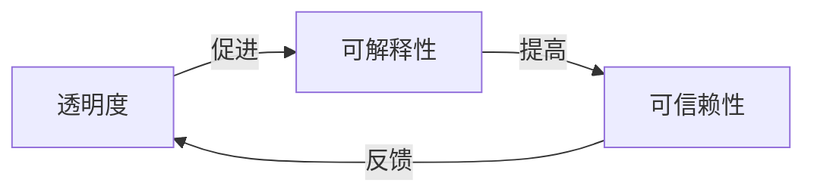

# 可解释的人工智能 (Explainable AI) 原理与代码实例讲解

## 1. 背景介绍

### 1.1 问题的由来

在过去几年中,人工智能(AI)系统已经在各个领域取得了令人瞩目的成就,展现出强大的问题解决能力。然而,这些系统通常被视为"黑盒",其内部工作机制对最终用户来说是不透明的。这种缺乏透明度和可解释性给人工智能系统的应用带来了诸多挑战和隐患,例如:

- **信任缺失**: 用户难以完全信任一个不可解释的系统,尤其是在涉及重大决策的领域。
- **问责性**: 当人工智能系统出现错误或存在偏差时,很难追溯到具体的原因和责任人。
- **合规性**: 一些高风险领域(如金融、医疗等)对系统决策的可解释性有严格的法规要求。
- **调试和改进**: 难以诊断系统错误的根源,从而阻碍了系统的优化和改进。

为了解决这些问题,可解释的人工智能(Explainable AI,XAI)应运而生。XAI旨在赋予人工智能系统可解释性,使其决策过程和结果对人类用户更加透明和可理解。

### 1.2 研究现状

可解释的人工智能是一个跨学科的研究领域,涉及机器学习、人工智能、可视化、人机交互等多个领域。目前,XAI的研究主要集中在以下几个方面:

1. **模型可解释性**: 开发内在可解释的机器学习模型,如决策树、规则集合等,使模型的决策过程更加透明。
2. **模型解释**: 为现有的黑盒模型(如深度神经网络)开发后续的解释方法,从而解释模型的预测结果。
3. **人机交互**: 研究如何以人类可理解的方式(如自然语言、可视化等)呈现模型的解释。
4. **评估指标**: 制定可解释性的定量评估指标,客观评价不同解释方法的有效性。

虽然取得了一些进展,但XAI仍然面临诸多挑战,如解释的可理解性、一致性、可扩展性等,距离在实际应用中大规模部署还有很长的路要走。

### 1.3 研究意义

可解释的人工智能对于推动人工智能系统的可信赖性和可控性至关重要。具体来说,XAI的意义主要体现在以下几个方面:

1. **提高透明度**: 通过解释,用户可以更好地理解人工智能系统的内部工作原理,从而建立对系统的信任。
2. **增强可控性**: 可解释性有助于发现系统中的错误、偏差或不当行为,为调试和改进提供依据。
3. **促进人机协作**: 通过有效的解释,人类和人工智能系统可以更好地协作,发挥各自的优势。
4. **满足法规要求**: 在一些高风险领域,可解释性是人工智能系统获得认证和应用的前提条件。
5. **推动公平性**: 通过解释,可以发现并纠正人工智能系统中潜在的偏见和不公平性。

总的来说,可解释的人工智能是实现人工智能系统可信赖性和可控性的关键,对于人工智能技术的健康发展和广泛应用具有重要意义。

### 1.4 本文结构

本文将全面介绍可解释的人工智能(XAI)的原理和实践。具体来说,本文将包括以下主要内容:

1. **核心概念与联系**: 阐述XAI的核心概念,如可解释性、透明度、可信赖性等,并探讨它们之间的关系。
2. **核心算法原理与操作步骤**: 详细介绍XAI中常用的解释算法,如SHAP、LIME等,并给出具体的操作步骤。
3. **数学模型和公式**: 深入解析XAI算法背后的数学原理,包括公式推导和案例分析。
4. **代码实例和解释**: 提供XAI算法的Python代码实现,并对关键部分进行详细解释。
5. **实际应用场景**: 介绍XAI在不同领域(如金融、医疗等)的实际应用案例。
6. **工具和资源推荐**: 推荐XAI相关的学习资源、开发工具和论文等。
7. **未来发展趋势与挑战**: 展望XAI的发展方向,并分析其面临的主要挑战。
8. **常见问题解答**: 针对XAI的常见疑问进行解答和讨论。

通过本文的学习,读者将全面掌握可解释的人工智能的理论基础和实践技能,为将来在相关领域的工作和研究打下坚实的基础。

## 2. 核心概念与联系

可解释的人工智能(XAI)涉及多个相关的核心概念,这些概念之间存在着密切的联系。本节将对这些核心概念进行阐述,并探讨它们之间的关系。

### 2.1 可解释性 (Explainability)

可解释性是指人工智能系统能够以人类可理解的方式解释其决策过程和结果的能力。一个高度可解释的系统应当能够回答以下几个问题:

- 系统是如何做出特定决策或预测的?
- 系统所依赖的关键因素或原理是什么?
- 系统的决策或预测在何种程度上是合理和可信的?

可解释性通常被视为一种非功能性需求,它与系统的准确性、效率等功能性需求相辅相成,共同构建了一个可信赖的人工智能系统。

### 2.2 透明度 (Transparency)

透明度指的是人工智能系统内部机制和流程对外部观察者的可见性。一个高度透明的系统应当能够向用户展示其内部的数据流、模型结构、参数等信息,使得系统的工作原理不被视为黑盒。

透明度是实现可解释性的前提条件。只有当系统的内部机制对外部可见时,才有可能对其进行解释和理解。因此,提高系统的透明度是实现可解释性的重要一步。

### 2.3 可信赖性 (Trustworthiness)

可信赖性指的是人工智能系统能够被人类用户所信任和依赖的程度。一个可信赖的系统应当具备以下几个特征:

- 安全性 (Safety): 系统在运行过程中不会对用户或环境造成危害。
- 鲁棒性 (Robustness): 系统能够处理异常输入,并对噪声和攻击具有一定的抗干扰能力。
- 公平性 (Fairness): 系统的决策过程不存在对特定群体的不当歧视或偏见。
- 可解释性 (Explainability): 系统的决策过程和结果对用户是透明和可理解的。

可见,可解释性是构建可信赖的人工智能系统的关键因素之一。通过提供解释,系统能够赢得用户的信任,从而提高其在实际应用中的可信赖性。

### 2.4 核心概念之间的关系

上述三个核心概念之间存在着密切的关联,它们共同构成了可解释的人工智能(XAI)的理论基础。具体来说,它们之间的关系可以概括为:



1. **透明度促进可解释性**: 只有当系统内部机制对外部可见时,才有可能对其进行解释和理解,因此透明度是实现可解释性的前提条件。

2. **可解释性提高可信赖性**: 通过对系统决策过程和结果的解释,用户能够更好地理解和信任系统,从而提高系统的可信赖性。

3. **可信赖性反馈促进透明度**: 当用户对系统具有较高的信任度时,他们往往更愿意接受系统的透明度,这反过来又促进了系统透明度的提高。

因此,这三个概念相互影响、相辅相成,共同推动了可解释的人工智能(XAI)的发展。在实践中,我们需要同时关注这三个方面,才能构建出真正可信赖的人工智能系统。

## 3. 核心算法原理与具体操作步骤

在可解释的人工智能(XAI)领域,已经提出了多种算法来解释黑盒模型的预测结果。本节将重点介绍两种广为人知的XAI算法:SHAP和LIME,并详细阐述它们的原理和具体操作步骤。

### 3.1 SHAP 算法

#### 3.1.1 算法原理概述

SHAP(SHapley Additive exPlanations)是一种基于联合游戏理论中的夏普利值(Shapley value)的解释算法。它旨在计算每个特征对模型预测结果的贡献程度,从而解释模型的决策过程。

SHAP算法的核心思想是将一个复杂模型的预测结果视为一个联合游戏,每个特征就是一个"玩家"。通过计算每个特征的夏普利值,我们可以量化它们对最终预测结果的贡献程度。具体来说,SHAP值被定义为:

$$\phi_i = \sum_{S\subseteq N\backslash\{i\}}\frac{|S|!(|N|-|S|-1)!}{|N|!}[f_{x}(S\cup\{i\})-f_{x}(S)]$$

其中:
- $N$是特征集合
- $S$是特征子集
- $f_{x}(S)$是在特征子集$S$上的模型预测值
- $\phi_i$是第$i$个特征的SHAP值,反映了它对模型预测结果的贡献程度

通过计算每个特征的SHAP值,我们可以解释模型的预测结果,并识别出哪些特征对预测结果起到了关键作用。

#### 3.1.2 算法步骤详解

计算SHAP值的具体步骤如下:

1. **获取训练数据和模型**: 首先,我们需要获取用于训练模型的数据集,以及已经训练好的机器学习模型。

2. **初始化SHAP解释器**: 使用SHAP库,根据模型的类型(如树模型、深度学习模型等)初始化相应的解释器。

3. **计算SHAP值矩阵**: 对于每个样本,使用解释器计算其每个特征的SHAP值,得到一个SHAP值矩阵。

4. **可视化SHAP值**: 使用SHAP库提供的可视化工具,将SHAP值以直观的形式展示出来,例如使用力导向布局图(Force Plot)或SHAP值汇总图(Summary Plot)。

5. **分析和解释**: 根据可视化结果,分析每个特征对模型预测结果的影响程度,并解释模型的决策过程。

下面是一个使用SHAP解释随机森林模型的Python代码示例:

```python
import shap
import pandas as pd
from sklearn.ensemble import RandomForestRegressor

# 加载数据和训练模型
X_train, X_test, y_train, y_test = ... # 数据预处理
model = RandomForestRegressor().fit(X_train, y_train)

# 初始化SHAP解释器
explainer = shap.TreeExplainer(model)

# 计算SHAP值矩阵
shap_values = explainer.shap_values(X_test)

# 可视化SHAP值
shap.summary_plot(shap_values, X_test, plot_type="bar")

# 分析和解释
for i, feat in enumerate(X_test.columns):
    print(f"Feature '{feat}' importance: {shap_values[:,i].mean():.3f}")
```

在上述示例中,我们首先加载数据并训练一个随机森林回归模型。然后,使用`shap.TreeExplainer`初始化SHAP解释器,并计算测试集上每个样本的SHAP值矩阵。接下来,我们使用`shap.summary_plot`函数可视化SHAP值,并分析每个特征对模型预测结果的平均贡献程度。

#### 3.1.3 算法优缺点

SHAP算法的主要优点包括:

- **模型无关性**: SHAP可以解释任何类型的机器学习模型,包括树模型、深度学习模型等。
- **高可解释性**: SHAP值直观地量化了每个特征对预测结果的贡献程度,易于理解。
- **一致性**: SHAP值满足了一些