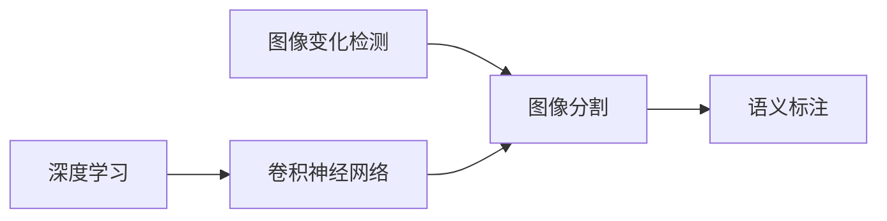

# 图像变化检测标注系统详细设计与具体代码实现

关键词：图像变化检测、标注系统、计算机视觉、深度学习、图像分割

## 1. 背景介绍
### 1.1  问题的由来
随着计算机视觉技术的快速发展，图像变化检测在许多领域得到了广泛应用，如遥感图像分析、视频监控、医学影像诊断等。图像变化检测旨在通过比较同一场景在不同时间点拍摄的图像，识别出图像中发生变化的区域。然而，要实现高精度的图像变化检测，需要大量高质量的标注数据来训练模型。传统的人工标注方式费时费力，难以满足实际需求。因此，开发一个高效、智能的图像变化检测标注系统具有重要意义。

### 1.2  研究现状
目前，针对图像变化检测标注的研究主要集中在半自动和全自动标注方法上。半自动标注方法通过人机交互的方式，利用计算机视觉算法辅助人工标注，提高标注效率。代表性工作如Grab Cut、Random Walker等。全自动标注方法则利用深度学习技术，通过训练端到端的语义分割模型来自动生成标注结果。如FCN、U-Net、DeepLab等。但现有方法仍存在标注精度不高、泛化能力差等问题，亟需进一步研究。

### 1.3  研究意义
开发一个高效、智能的图像变化检测标注系统具有重要的理论和实践意义：

1. 提高标注效率：传统人工标注耗时耗力，智能标注系统可大幅提升标注效率，节省人力成本。

2. 改善标注质量：引入先进的计算机视觉和机器学习技术，可提高标注的准确性和一致性。

3. 促进相关领域发展：高质量的标注数据是图像变化检测等研究的基础，标注系统的进步将推动相关领域的发展。

4. 拓展应用场景：智能标注系统可应用于遥感、安防、医疗等诸多领域，为行业应用提供有力支撑。

### 1.4  本文结构
本文将详细介绍一个图像变化检测标注系统的设计与实现。第2节介绍系统涉及的核心概念；第3节重点阐述标注算法原理；第4节建立标注的数学模型；第5节给出核心代码实现；第6节讨论系统的应用场景；第7节推荐相关工具和资源；第8节总结全文并展望未来；第9节附录常见问题解答。

## 2. 核心概念与联系

图像变化检测标注系统涉及以下核心概念：

- 图像变化检测：识别同一场景不同时相图像之间的变化区域。
- 图像分割：将图像像素划分为若干语义区域的任务。
- 语义标注：为图像中的像素或区域分配预定义的类别标签。  
- 深度学习：一类强大的机器学习方法，尤其适用于图像理解任务。
- 卷积神经网络：一种专门用于处理网格拓扑数据（如图像）的神经网络。

这些概念之间的联系可用下图表示：

图像变化检测依赖于图像分割技术,对变化前后图像进行分割。图像分割的结果可用于生成语义标注。深度学习,尤其是卷积神经网络,为图像分割任务提供了有力的工具。

## 3. 核心算法原理 & 具体操作步骤
### 3.1  算法原理概述
本系统采用基于深度学习的图像分割算法进行自动标注。具体而言,使用U-Net语义分割网络。该网络由编码器和解码器两部分组成,可以端到端地将输入图像映射为像素级别的分割结果。编码器逐步提取图像的高级特征,解码器利用特征图生成分割Mask。此外,还在编码器和解码器之间引入跳跃连接,以融合不同尺度的特征信息。

### 3.2  算法步骤详解
U-Net的训练和推理过程可分为以下步骤:

1. 数据准备:收集变化前后的成对图像,并进行人工标注以获得Ground Truth。将数据划分为训练集和测试集。

2. 图像预处理:对输入图像进行尺寸归一化、像素值归一化等预处理操作。

3. 搭建网络:构建U-Net网络结构,包括若干下采样(编码)和上采样(解码)层。

4. 模型训练:使用训练集数据对U-Net进行端到端训练,优化其参数以拟合Ground Truth。通常采用交叉熵损失函数和Adam优化器。

5. 模型评估:用测试集评估训练好的模型性能,计算其精度、召回率等指标。

6. 模型推理:使用训练好的U-Net模型对新的变化图像对进行预测,生成变化区域的分割结果。

7. 人工校验:对自动标注结果进行人工检查和必要的修正,以确保标注质量。

### 3.3  算法优缺点
U-Net图像分割算法的优点包括:

- 端到端的训练方式,无需复杂的后处理步骤。
- 引入跳跃连接,能有效融合局部和全局特征。
- 在小样本数据集上也能取得不错的性能。

但U-Net也存在一些局限性:

- 对大尺寸图像的内存消耗较大。  
- 推理速度有待进一步优化。
- 对弱小目标和复杂场景的分割效果有待提高。

### 3.4  算法应用领域
基于U-Net的图像分割算法已在多个领域得到应用,如:

- 遥感图像变化检测:识别城市建设、耕地变化等。
- 医学影像分析:肿瘤区域勾画、器官分割等。  
- 工业视觉检测:瑕疵区域标注、零件识别等。
- 自动驾驶感知:道路分割、车辆检测等。

## 4. 数学模型和公式 & 详细讲解 & 举例说明 
### 4.1  数学模型构建
图像分割可以表述为像素级别的多类别分类问题。给定输入图像$\boldsymbol{X} \in \mathbb{R}^{H \times W \times C}$,其中$H$、$W$、$C$分别为图像的高度、宽度和通道数,分割模型$f$的目标是预测每个像素的类别概率向量$\boldsymbol{\hat{Y}} \in [0,1]^{H \times W \times N}$:

$$
\boldsymbol{\hat{Y}} = f(\boldsymbol{X}; \boldsymbol{\theta})
$$

其中$\boldsymbol{\theta}$为模型参数,$N$为类别总数。$\hat{y}_{hwn}$表示位于$(h,w)$的像素属于第$n$类的概率。

分割模型的训练目标是最小化预测概率分布$\boldsymbol{\hat{Y}}$与真实分布$\boldsymbol{Y}$之间的差异。通常使用交叉熵损失函数:

$$
\mathcal{L}(\boldsymbol{\theta}) = -\frac{1}{HW} \sum_{h=1}^H \sum_{w=1}^W \sum_{n=1}^N y_{hwn} \log \hat{y}_{hwn}
$$

其中$y_{hwn} \in \{0,1\}$为真实类别标签的one-hot编码。

### 4.2  公式推导过程
模型训练时,通过最小化损失函数$\mathcal{L}$来学习最优参数$\boldsymbol{\theta}^*$:

$$
\boldsymbol{\theta}^* = \arg\min_{\boldsymbol{\theta}} \mathcal{L}(\boldsymbol{\theta})
$$

假设采用梯度下降优化算法,每次迭代的参数更新公式为:

$$
\boldsymbol{\theta} \leftarrow \boldsymbol{\theta} - \eta \nabla_{\boldsymbol{\theta}} \mathcal{L}(\boldsymbol{\theta})
$$

其中$\eta$为学习率。重复迭代直至模型收敛。

对于U-Net等卷积网络,可通过链式法则求损失函数$\mathcal{L}$对每层参数的梯度:

$$
\frac{\partial \mathcal{L}}{\partial \boldsymbol{W}^{(l)}} = \frac{\partial \mathcal{L}}{\partial \boldsymbol{Z}^{(l)}} \frac{\partial \boldsymbol{Z}^{(l)}}{\partial \boldsymbol{W}^{(l)}}
$$

$$
\frac{\partial \mathcal{L}}{\partial \boldsymbol{b}^{(l)}} = \frac{\partial \mathcal{L}}{\partial \boldsymbol{Z}^{(l)}} \frac{\partial \boldsymbol{Z}^{(l)}}{\partial \boldsymbol{b}^{(l)}}
$$

其中$\boldsymbol{W}^{(l)}$和$\boldsymbol{b}^{(l)}$分别为第$l$层的权重和偏置,$\boldsymbol{Z}^{(l)}$为第$l$层的输出特征图。

### 4.3  案例分析与讲解
下面以一个简单的二类别分割任务为例,说明U-Net的训练和推理过程。

假设输入图像尺寸为$256 \times 256$,类别数为2(前景和背景)。U-Net的编码器部分包含4个卷积块,每个卷积块由两个$3 \times 3$卷积层和一个$2 \times 2$最大池化层组成。解码器部分与编码器对称,使用$2 \times 2$转置卷积进行上采样。跳跃连接将编码器的特征图与解码器的上采样结果拼接。

前向传播时,输入图像首先经过编码器提取特征,特征图尺寸逐层缩小。然后解码器逐层上采样恢复空间分辨率,并与编码器的特征图融合。最后一层使用$1 \times 1$卷积将特征图映射为$256 \times 256 \times 2$的概率图。

假设Ground Truth标注为$\boldsymbol{Y} \in \{0,1\}^{256 \times 256}$,其中$y_{hw}=1$表示像素$(h,w)$属于前景。将$\boldsymbol{Y}$转换为one-hot形式,记为$\boldsymbol{\tilde{Y}} \in \{0,1\}^{256 \times 256 \times 2}$。则交叉熵损失可表示为:

$$
\mathcal{L} = -\frac{1}{256^2} \sum_{h=1}^{256} \sum_{w=1}^{256} \sum_{n=1}^{2} \tilde{y}_{hwn} \log \hat{y}_{hwn}
$$

使用反向传播算法计算损失对每层参数的梯度,并用梯度下降法更新参数。重复迭代直至模型收敛。

推理时,对测试图像$\boldsymbol{X}_{test}$前向传播计算概率图:

$$
\boldsymbol{\hat{Y}}_{test} = f(\boldsymbol{X}_{test}; \boldsymbol{\theta}^*)
$$

将概率图$\boldsymbol{\hat{Y}}_{test}$转换为类别标签图$\boldsymbol{M}_{test} \in \{0,1\}^{256 \times 256}$:

$$
m_{hw} = 
\begin{cases}
1 & \text{if } \hat{y}_{hw1} > \hat{y}_{hw0} \\
0 & \text{otherwise}
\end{cases}
$$

即对每个像素选择概率最大的类别作为预测结果。最终得到二值分割Mask $\boldsymbol{M}_{test}$。

### 4.4  常见问题解答
问:U-Net能处理任意尺寸的图像吗?
答:虽然U-Net在训练时需要固定尺寸的图像,但在推理时可以接受任意尺寸的输入。这是因为U-Net中的卷积、池化、上采样等操作对输入尺寸没有限制。只是最终的输出尺寸会与输入成比例。

问:U-Net可以扩展到多类别分割吗?
答:可以。只需调整网络的最后一层,使其输出$N$个通道的特征图即可,其中$N$为类别总数。相应地,训练时的标签也要转换为$N$维one-hot编码。推理时,对每个像素选择概率最大的类别作